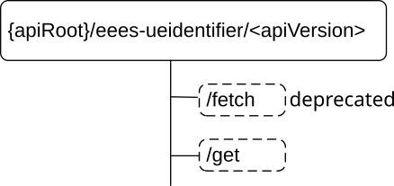

# 8.3 Eees_UEIdentifier API

## 8.3.1 Introduction

The Eees_UEIdentifier service shall use the Eees_UEIdentifier API.

The API URI of the Eees_UEIdentifier API shall be:

**{apiRoot}/\<apiName\>/\<apiVersion\>**

The request URIs used in HTTP requests shall have the Resource URI structure as defined in clause 7.5, i.e.:

**{apiRoot}/\<apiName\>/\<apiVersion\>/\<apiSpecificResourceUriPart\>**

with the following components:

\- The {apiRoot} shall be set as described in clause 7.5.

\- The \<apiName\> shall be "eees-ueidentifier".

\- The \<apiVersion\> shall be "v1".

\- The \<apiSpecificResourceUriPart\> shall be set as described in clause 8.3.2.

## 8.3.2 Resources

There are no resources defined for this API in this release of the specification.

## 8.3.3 Custom Operations without associated resources

### 8.3.3.1 Overview

The structure of the custom operation URIs of the Eees_UEIdentifier API is shown in Figure 8.3.3.1-1.

Figure 8.3.3.1-1: Custom operation URI structure of the Eees_UEIdentifier API

Table 8.3.3.1-1 provides an overview of the custom operations and applicable HTTP methods defined for the Eees_UEIdentifier API.

Table 8.3.3.1-1: Custom operations without associated resources

<table>
<colgroup>
<col style="width: 16%" />
<col style="width: 22%" />
<col style="width: 22%" />
<col style="width: 39%" />
</colgroup>
<thead>
<tr class="header">
<th>Operation name</th>
<th>Custom operation URI</th>
<th>Mapped HTTP method</th>
<th>Description</th>
</tr>
</thead>
<tbody>
<tr class="odd">
<td>Fetch</td>
<td>/fetch</td>
<td>POST</td>
<td>
Fetch the identifier of a UE.

This custom operation is deprecated. The "Get" operation should be used instead.
</td>
</tr>
<tr class="even">
<td>Get</td>
<td>/get</td>
<td>POST</td>
<td>EAS fetch the UE Identifier information.</td>
</tr>
</tbody>
</table>

NOTE 1: Based on SA3 specified security mechanisms for EDGE-1 and EDGE-3 interfaces, the EES can identify the initiator of the API (EEC or EAS) and apply the appropriate security procedures as specified in 3GPP TS 33.558 \[20\].

NOTE 2: The same service API can be implemented on two different interfaces, i.e. EDGE-1 and EDGE-3, which are for separate endpoints, i.e. the EEC and the EAS.

### 8.3.3.2 Operation: Fetch

This operation is deprecated. The operation defined in clause 8.3.3.3 should be used instead.

#### 8.3.3.2.1 Description

This custom operation allows the EAS to fetch a UE's identifier, which is UE ID as specified in 3GPP TS 23.558 \[2\], from the EES for a given UE information.

#### 8.3.3.2.2 Operation Definition

This operation shall support the request data structures and the response data structure and response codes specified in the tables 8.3.3.2.2-1 and 8.3.3.2.2-2.

Table 8.3.3.2.2-1: Data structures supported by the POST Request Body on this resource

|                 |     |             |                                                             |
|-----------------|-----|-------------|-------------------------------------------------------------|
| Data type       | P   | Cardinality | Description                                                 |
| UserInformation | M   | 1           | Information about the User or the UE, available at the EAS. |

Table 8.3.3.2.2-2: Data structures supported by the POST Response Body on this resource

<table>
<colgroup>
<col style="width: 16%" />
<col style="width: 4%" />
<col style="width: 12%" />
<col style="width: 11%" />
<col style="width: 54%" />
</colgroup>
<tbody>
<tr class="odd">
<td>Data type</td>
<td>P</td>
<td>Cardinality</td>
<td>
Response

codes
</td>
<td>Description</td>
</tr>
<tr class="even">
<td>Gpsi</td>
<td>M</td>
<td>1</td>
<td>200 OK</td>
<td>The UE Identifier (UE ID), returned by the Edge Enabler Server.</td>
</tr>
<tr class="odd">
<td>n/a</td>
<td></td>
<td></td>
<td>307 Temporary Redirect</td>
<td>
Temporary redirection. The response shall include a Location header field containing an alternative target URI located in an alternative EES.

Redirection handling is described in clause 5.2.10 of 3GPP TS 29.122 [6].
</td>
</tr>
<tr class="even">
<td>n/a</td>
<td></td>
<td></td>
<td>308 Permanent Redirect</td>
<td>
Permanent redirection. The response shall include a Location header field containing an alternative target URI located in an alternative EES.

Redirection handling is described in clause 5.2.10 of 3GPP TS 29.122 [6]
</td>
</tr>
<tr class="odd">
<td colspan="5">NOTE: The manadatory HTTP error status code for the POST method listed in Table 5.2.6-1 of 3GPP TS 29.122 [6] also apply.</td>
</tr>
</tbody>
</table>

Table 8.3.3.2.2-3: Headers supported by the 307 Response Code on this resource

|          |           |     |             |                                                          |
|----------|-----------|-----|-------------|----------------------------------------------------------|
| Name     | Data type | P   | Cardinality | Description                                              |
| Location | string    | M   | 1           | An alternative target URI located in an alternative EES. |

Table 8.3.3.2.2-4: Headers supported by the 308 Response Code on this resource

|          |           |     |             |                                                          |
|----------|-----------|-----|-------------|----------------------------------------------------------|
| Name     | Data type | P   | Cardinality | Description                                              |
| Location | string    | M   | 1           | An alternative target URI located in an alternative EES. |

### 8.3.3.3 Operation: Get

#### 8.3.3.3.1 Description

This custom operation allows the service consumer to retrieve UE Identifier information from the EES for a given User information as specified in 3GPP TS 23.558 \[2\].

#### 8.3.3.3.2 Operation Definition

This operation shall support the request data structures and the response data structure and response codes specified in the tables 8.3.3.3.2-1 and 8.3.3.3.2-2.

Table 8.3.3.3.2-1: Data structures supported by the POST Request Body on this resource

|           |     |             |                                                                         |
|-----------|-----|-------------|-------------------------------------------------------------------------|
| Data type | P   | Cardinality | Description                                                             |
| UserInfo  | M   | 1           | Information about the User or the UE, provided by the service consumer. |

Table 8.3.3.3.2-2: Data structures supported by the POST Response Body on this resource

<table>
<colgroup>
<col style="width: 16%" />
<col style="width: 4%" />
<col style="width: 12%" />
<col style="width: 11%" />
<col style="width: 54%" />
</colgroup>
<tbody>
<tr class="odd">
<td>Data type</td>
<td>P</td>
<td>Cardinality</td>
<td>
Response

codes
</td>
<td>Description</td>
</tr>
<tr class="even">
<td>UeIdInfo</td>
<td>M</td>
<td>1</td>
<td>200 OK</td>
<td>The operation is successful and the corresponding UE Identifier information, returned by the Edge Enabler Server is included in the response body.</td>
</tr>
<tr class="odd">
<td>n/a</td>
<td></td>
<td></td>
<td>307 Temporary Redirect</td>
<td>
Temporary redirection. The response shall include a Location header field containing an alternative target URI located in an alternative EES.

Redirection handling is described in clause 5.2.10 of 3GPP TS 29.122 [6].
</td>
</tr>
<tr class="even">
<td>n/a</td>
<td></td>
<td></td>
<td>308 Permanent Redirect</td>
<td>
Permanent redirection. The response shall include a Location header field containing an alternative target URI located in an alternative EES.

Redirection handling is described in clause 5.2.10 of 3GPP TS 29.122 [6]
</td>
</tr>
<tr class="odd">
<td colspan="5">NOTE: The mandatory HTTP error status code for the POST method listed in Table 5.2.6-1 of 3GPP TS 29.122 [6] also apply.</td>
</tr>
</tbody>
</table>

Table 8.3.3.3.2-3: Headers supported by the 307 Response Code on this resource

|          |           |     |             |                                                          |
|----------|-----------|-----|-------------|----------------------------------------------------------|
| Name     | Data type | P   | Cardinality | Description                                              |
| Location | string    | M   | 1           | An alternative target URI located in an alternative EES. |

Table 8.3.3.3.2-4: Headers supported by the 308 Response Code on this resource

|          |           |     |             |                                                          |
|----------|-----------|-----|-------------|----------------------------------------------------------|
| Name     | Data type | P   | Cardinality | Description                                              |
| Location | string    | M   | 1           | An alternative target URI located in an alternative EES. |

## 8.3.4 Notifications

None.

## 8.3.5 Data Model

### 8.3.5.1 General

This clause specifies the application data model supported by the API. Data types listed in clause 7.2 apply to this API

Table 8.3.5.1-1 specifies the data types defined specifically for the Eees_UEIdentifier API service.

Table 8.3.5.1-1: Eees_UEIdentifier API specific Data Types

<table>
<colgroup>
<col style="width: 27%" />
<col style="width: 15%" />
<col style="width: 32%" />
<col style="width: 24%" />
</colgroup>
<thead>
<tr class="header">
<th>Data type</th>
<th>Section defined</th>
<th>Description</th>
<th>Applicability</th>
</tr>
</thead>
<tbody>
<tr class="odd">
<td>UserInformation</td>
<td>8.3.5.2.2</td>
<td>
Information about the User or the UE, that used by EES to use 3GPP CN capability to retrieve the EAS specific UE identifier.

Deprecated.
</td>
<td></td>
</tr>
<tr class="even">
<td>UserInfo</td>
<td>8.3.5.2.3</td>
<td>Information about the User or the UE, that used by EES to retrieve the UE identifier Information.</td>
<td></td>
</tr>
<tr class="odd">
<td>UeIdInfo</td>
<td>8.3.5.2.4</td>
<td>UE Identifier Information, including list of UE Identifier related information.</td>
<td></td>
</tr>
<tr class="even">
<td>UeId</td>
<td>8.3.5.2.5</td>
<td>UE identifier.</td>
<td></td>
</tr>
<tr class="odd">
<td>UeIdType</td>
<td>8.3.5.3.3</td>
<td>Identifies the UE Identifier type.</td>
<td></td>
</tr>
</tbody>
</table>

Table 8.3.5.1-2 specifies data types re-used by the Eees_UEIdentifier API service.

Table 8.3.5.1-2: Re-used Data Types

| Data type         | Reference            | Comments                                                                           | Applicability |
|-------------------|----------------------|------------------------------------------------------------------------------------|---------------|
| Gpsi              | 3GPP TS 29.571 \[8\] | Used to identify the UE with GPSI.                                                 |               |
| IpAddr            | 3GPP TS 29.571 \[8\] | IP address of the UE.                                                              |               |
| Port              | 3GPP TS 29.122 \[6\] | Identifies a port, unsigned integer with valid values between 0 and 65535.         |               |
| SupportedFeatures | 3GPP TS 29.571 \[8\] | Used to negotiate the applicability of optional features defined in Table 8.3.7-1. |               |

### 8.3.5.2 Structured data types

#### 8.3.5.2.1 Introduction

#### 8.3.5.2.2 Type: UserInformation

This data type is deprecated.

Table 8.3.5.2.2-1: Definition of type UserInformation

<table>
<colgroup>
<col style="width: 14%" />
<col style="width: 10%" />
<col style="width: 4%" />
<col style="width: 14%" />
<col style="width: 35%" />
<col style="width: 20%" />
</colgroup>
<thead>
<tr class="header">
<th>Attribute name</th>
<th>Data type</th>
<th>P</th>
<th>Cardinality</th>
<th>Description</th>
<th>Applicability</th>
</tr>
</thead>
<tbody>
<tr class="odd">
<td>easId</td>
<td>string</td>
<td>M</td>
<td>1</td>
<td>The application identifier of the EAS (e.g. URI, FQDN) requesting the UE Identifier information.</td>
<td></td>
</tr>
<tr class="even">
<td>easProviderId</td>
<td>string</td>
<td>O</td>
<td>0..1</td>
<td>Identifier of the ASP that provides the EAS.</td>
<td></td>
</tr>
<tr class="odd">
<td>ipAddr</td>
<td>IpAddr</td>
<td>M</td>
<td>1</td>
<td>IP address of the UE.</td>
<td></td>
</tr>
<tr class="even">
<td>suppFeat</td>
<td>SupportedFeatures</td>
<td>C</td>
<td>0..1</td>
<td>
Used to negotiate the supported optional features of the API as described in clause 7.8.

This attribute shall be provided in the HTTP POST request and success response.
</td>
<td></td>
</tr>
</tbody>
</table>

#### 8.3.5.2.3 Type: UserInfo

Table 8.3.5.2.3-1: Definition of type UserInfo

<table>
<colgroup>
<col style="width: 14%" />
<col style="width: 12%" />
<col style="width: 4%" />
<col style="width: 11%" />
<col style="width: 38%" />
<col style="width: 17%" />
</colgroup>
<thead>
<tr class="header">
<th>Attribute name</th>
<th>Data type</th>
<th>P</th>
<th>Cardinality</th>
<th>Description</th>
<th>Applicability</th>
</tr>
</thead>
<tbody>
<tr class="odd">
<td>requestorId</td>
<td>string</td>
<td>C</td>
<td>0..1</td>
<td>
Contains the identifier of the service consumer that is sending the request.

(NOTE 7)
</td>
<td>EdgeApp_3</td>
</tr>
<tr class="even">
<td>easIds</td>
<td>array(string)</td>
<td>C</td>
<td>1..N</td>
<td>
The list of EAS Identifiers for which the UE IDs are requested by the service consumer for the given user information (e.g. IP address).

(NOTE 1)
</td>
<td></td>
</tr>
<tr class="odd">
<td>easProviderId</td>
<td>string</td>
<td>O</td>
<td>0..1</td>
<td>Identifier of the ASP that provides the EAS.</td>
<td></td>
</tr>
<tr class="even">
<td>ueId</td>
<td>Gpsi</td>
<td>C</td>
<td>0..1</td>
<td>
Identify the UE with GPSI.

(NOTE 2, NOTE 4)
</td>
<td></td>
</tr>
<tr class="odd">
<td>ipAddr</td>
<td>IpAddr</td>
<td>C</td>
<td>0..1</td>
<td>
IP address of the UE.

(NOTE 3, NOTE 4)
</td>
<td></td>
</tr>
<tr class="even">
<td>portNumber</td>
<td>Port</td>
<td>C</td>
<td>0..1</td>
<td>
Indicates the UDP or TCP port number associated with the UE IP address as provided in the "ipAddr" attribute.

(NOTE 5)
</td>
<td></td>
</tr>
<tr class="odd">
<td>appPortId</td>
<td>Port</td>
<td>O</td>
<td>0..1</td>
<td>
Identifier of the Application Port ID associated with the EAS.

(NOTE 6)
</td>
<td></td>
</tr>
<tr class="even">
<td>suppFeat</td>
<td>SupportedFeatures</td>
<td>C</td>
<td>0..1</td>
<td>
Contains the list of supported feature(s) among the ones defined in clause 8.3.7.

This attribute shall be present only when feature negotiation needs to take place.
</td>
<td></td>
</tr>
<tr class="odd">
<td colspan="6">
NOTE 1: This attribute shall be present when the service consumer is an EAS. If this attribute is not present, it shall be interpreted by the EES that it is an EEC that is requesting the UE ID.

NOTE 2: This attribute may be present only if the service consumer is an EEC.

NOTE 3: This attribute shall be present when the service consumer is an EAS. When the service consumer is an EEC, this attribute, if provided, may contain both UE's private IPv6 address and UE's private IPv4 address.

NOTE 4: At least one of these attributes shall be present.

NOTE 5: This attribute shall be present only when the service consumer is an EAS and the EAS recognizes the UE IP address is a public IP address different from the actual UE IP address (private IP address).

NOTE 6: This attribute may be present only if the service consumer is an EAS.

NOTE 7: This attribute shall be present when the service consumer is an EAS.
</td>
</tr>
</tbody>
</table>

#### 8.3.5.2.4 Type: UeIdInfo

Table 8.3.5.2.4-1: Definition of type UeIdInfo

<table>
<colgroup>
<col style="width: 14%" />
<col style="width: 12%" />
<col style="width: 4%" />
<col style="width: 13%" />
<col style="width: 37%" />
<col style="width: 17%" />
</colgroup>
<thead>
<tr class="header">
<th>Attribute name</th>
<th>Data type</th>
<th>P</th>
<th>Cardinality</th>
<th>Description</th>
<th>Applicability</th>
</tr>
</thead>
<tbody>
<tr class="odd">
<td>ueIds</td>
<td>array(UeId)</td>
<td>M</td>
<td>1..N</td>
<td>Represents the UE Identifier(s).</td>
<td></td>
</tr>
<tr class="even">
<td>suppFeat</td>
<td>SupportedFeatures</td>
<td>C</td>
<td>0..1</td>
<td>
Contains the list of supported feature(s) among the ones defined in clause 8.3.7.

This attribute shall be present only when feature negotiation needs to take place.
</td>
<td></td>
</tr>
</tbody>
</table>

#### 8.3.5.2.5 Type: UeId

Table 8.3.5.2.5-1: Definition of type UeId

<table>
<colgroup>
<col style="width: 14%" />
<col style="width: 10%" />
<col style="width: 4%" />
<col style="width: 14%" />
<col style="width: 35%" />
<col style="width: 20%" />
</colgroup>
<thead>
<tr class="header">
<th>Attribute name</th>
<th>Data type</th>
<th>P</th>
<th>Cardinality</th>
<th>Description</th>
<th>Applicability</th>
</tr>
</thead>
<tbody>
<tr class="odd">
<td>edgeUeId</td>
<td>string</td>
<td>C</td>
<td>0..1</td>
<td>
Represents the EES generated EDGE UE Identifier of the UE.

This attribute shall be provided only if it is the Edge UE ID that needs to be returned.

(NOTE)
</td>
<td></td>
</tr>
<tr class="even">
<td>afSpecUeId</td>
<td>Gpsi</td>
<td>C</td>
<td>0..1</td>
<td>
Identifier of the AF specific UE Identifier in the GPSI fomat of External ID.

This attribute shall be provided only if it is the AF-specific UE ID that needs to be returned.

(NOTE)
</td>
<td></td>
</tr>
<tr class="odd">
<td>easId</td>
<td>string</td>
<td>C</td>
<td>0..1</td>
<td>
Represents the identifier of the EAS for which the provided UE ID is related.

This attribute shall be present only if the "easIds" attribute was provided in the corresponding request.
</td>
<td></td>
</tr>
<tr class="even">
<td colspan="6">NOTE: These attributes are mutually exclusive. Either one of them shall be present.</td>
</tr>
</tbody>
</table>

### 8.3.5.3 Simple data types and enumerations

#### 8.3.5.3.1 Introduction

This clause defines simple data types and enumerations that can be referenced from data structures defined in the previous clauses.

#### 8.3.5.3.2 Simple data types

The simple data types defined in table 8.3.5.3.2-1 shall be supported.

Table 8.3.5.3.2-1: Simple data types

| Type Name | Type Definition | Description | Applicability |
|-----------|-----------------|-------------|---------------|
|           |                 |             |               |

## 8.3.6 Error Handling

### 8.3.6.1 General

For the Eees_UEIdentifier API, HTTP error handling shall be supported as specified in clause 7.7. In addition, the requirements in the following clauses are applicable for the Eees_UEIdentifier API.

### 8.3.6.2 Protocol Errors

No specific protocol errors for the Eees_UEIdentifier API are specified.

### 8.3.6.3 Application Errors

The application errors defined for the Eees_UEidentifier API are listed in Table 8.3.6.3-1.

Table 8.3.6.3-1: Application errors

| Application Error | HTTP status code | Description | Applicability |
|-------------------|------------------|-------------|---------------|
|                   |                  |             |               |

## 8.3.7 Feature negotiation

General feature negotiation procedures are defined in clause 7.8. Table 8.3.7-1 lists the supported features for Eees_UEIdentifier API.

Table 8.3.7-1: Supported Features

<table>
<colgroup>
<col style="width: 16%" />
<col style="width: 23%" />
<col style="width: 60%" />
</colgroup>
<thead>
<tr class="header">
<th>Feature number</th>
<th>Feature Name</th>
<th>Description</th>
</tr>
</thead>
<tbody>
<tr class="odd">
<td>1</td>
<td>EdgeApp_3</td>
<td>
This feature indicates the support of the second set of enhancements to the Edge Applications Enabler Layer.

Within this feature, the following enhancements are covered:

- Support of providing the requestor's identifier within the UE Identifier retrieval request.
</td>
</tr>
</tbody>
</table>
