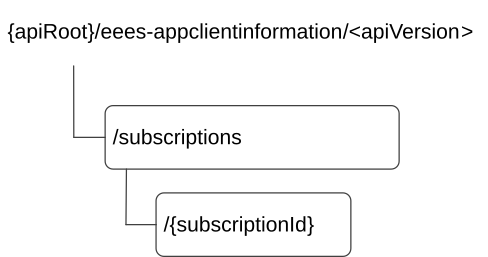

# 8.4.2 Resources

## 8.4.2.1 Overview

This clause describes the structure for the Resource URIs and the resources and methods used for the service.

Figure 8.4.2.1-1 depicts the resource URIs structure for the Eees_AppClientInformation API.

Figure 8.4.2.1-1: Resource URI structure of the Eees_AppClientInformation API

Table 8.4.2.1-1 provides an overview of the resources and applicable HTTP methods.

Table 8.4.2.1-1: Resources and methods overview

| Resource name                                          | Resource URI                    | HTTP method or custom operation | Description                                                                                    |
|--------------------------------------------------------|---------------------------------|---------------------------------|------------------------------------------------------------------------------------------------|
| Application Client Information Subscriptions           | /subscriptions                  | POST                            | Creates a subscription for reporting of AC information to the EAS.                             |
| Individual Application Client Information Subscription | /subscriptions/{subscriptionId} | GET                             | Retrieves the Individual AC information subscription information identified by subscriptionId. |
|                                                        |                                 | PATCH                           | Partially updates the Individual AC information subscription identified by subscriptionId.     |
|                                                        |                                 | PUT                             | Fully replaces the Individual AC information subscription identified by subscriptionId.        |
|                                                        |                                 | DELETE                          | Removes the Individual AC information subscription identified by subscriptionId.               |

## 8.4.2.2 Resource: Application Client Information Subscriptions

### 8.4.2.2.1 Description

This resource represents all AC information subscriptions at a given EES.

### 8.4.2.2.2 Resource Definition

Resource URI: **{apiRoot}/eees-appclientinformation/\<apiVersion\>/subscriptions**

This resource shall support the resource URI variables defined in the table 8.4.2.2.2-1.

Table 8.4.2.2.2-1: Resource URI variables for this resource

| Name    | Data Type | Definition     |
|---------|-----------|----------------|
| apiRoot | string    | See clause 7.5 |

### 8.4.2.2.3 Resource Standard Methods

#### 8.4.2.2.3.1 POST

This method creates the AC information subscription at the EES for reporting of the AC capabilities. This method shall support the URI query parameters specified in the table 8.4.2.2.3.1-1.

Table 8.4.2.2.3.1-1: URI query parameters supported by the POST method on this resource

|      |           |     |             |             |
|------|-----------|-----|-------------|-------------|
| Name | Data type | P   | Cardinality | Description |
| n/a  |           |     |             |             |

This method shall support the request data structures specified in table 8.4.2.2.3.1-2 and the response data structures and response codes specified in table 8.4.2.2.3.1-3.

Table 8.4.2.2.3.1-2: Data structures supported by the POST Request Body on this resource

|                    |     |             |                                           |
|--------------------|-----|-------------|-------------------------------------------|
| Data type          | P   | Cardinality | Description                               |
| ACInfoSubscription | M   | 1           | Create a new AC information subscription. |

Table 8.4.2.2.3.1-3: Data structures supported by the POST Response Body on this resource

<table>
<colgroup>
<col style="width: 16%" />
<col style="width: 9%" />
<col style="width: 14%" />
<col style="width: 19%" />
<col style="width: 39%" />
</colgroup>
<tbody>
<tr class="odd">
<td>Data type</td>
<td>P</td>
<td>Cardinality</td>
<td>
Response

codes
</td>
<td>Description</td>
</tr>
<tr class="even">
<td>ACInfoSubscription</td>
<td>M</td>
<td>1</td>
<td>201 Created</td>
<td>
The individual AC information subscription resource created successfully. The information about the confirmed subscription at the EES is provided in the response body.

The URI of the created resource shall be returned in the "Location" HTTP header.
</td>
</tr>
<tr class="odd">
<td>ProblemDetails</td>
<td>O</td>
<td>0..1</td>
<td>403 Forbidden</td>
<td>(NOTE 2)</td>
</tr>
<tr class="even">
<td colspan="5">
NOTE 1: The mandatory HTTP error status code for the POST method listed in Table 5.2.6-1 of 3GPP TS 29.122 [6] also apply.

NOTE 2: Failure cases are described in clause 8.4.6.3.
</td>
</tr>
</tbody>
</table>

Table 8.4.2.2.3.1-4: Headers supported by the 201 response code on this resource

|          |           |     |             |                                                                                                                                                               |
|----------|-----------|-----|-------------|---------------------------------------------------------------------------------------------------------------------------------------------------------------|
| Name     | Data type | P   | Cardinality | Description                                                                                                                                                   |
| Location | string    | M   | 1           | Contains the URI of the newly created resource, according to the structure: {apiRoot}/eees-appclientinformation/\<apiVersion\>/subscriptions/{subscriptionId} |

### 8.4.2.2.4 Resource Custom Operations

None.

## 8.4.2.3 Resource: Individual Application Client Information Subscription

### 8.4.2.3.1 Description

This resource represents the individual application client information subscription of an EAS at a given EES.

### 8.4.2.3.2 Resource Definition

Resource URI: **{apiRoot}/eees-appclientinformation/\<apiVersion\>/subscriptions/{subscriptionId}**

This resource shall support the resource URI variables defined in the table 8.4.2.3.2-1.

Table 8.4.2.3.2-1: Resource URI variables for this resource

| Name           | Data Type | Definition                                            |
|----------------|-----------|-------------------------------------------------------|
| apiRoot        | string    | See clause 7.5                                        |
| subscriptionId | string    | Identifies an individual AC information subscription. |

### 8.4.2.3.3 Resource Standard Methods

#### 8.4.2.3.3.1 GET

This method retrieves the AC information subscription information at EES. This method shall support the URI query parameters specified in the table 8.4.2.3.3.1-1.

Table 8.4.2.3.3.1-1: URI query parameters supported by the GET method on this resource

|      |           |     |             |             |
|------|-----------|-----|-------------|-------------|
| Name | Data type | P   | Cardinality | Description |
| n/a  |           |     |             |             |

This method shall support the request data structures specified in table 8.4.2.3.3.1-2 and the response data structures and response codes specified in table 8.4.2.3.3.1-3.

Table 8.4.2.3.3.1-2: Data structures supported by the GET Request Body on this resource

|           |     |             |             |
|-----------|-----|-------------|-------------|
| Data type | P   | Cardinality | Description |
| n/a       |     |             |             |

Table 8.4.2.3.3.1-3: Data structures supported by the GET Response Body on this resource

<table>
<colgroup>
<col style="width: 16%" />
<col style="width: 9%" />
<col style="width: 14%" />
<col style="width: 19%" />
<col style="width: 39%" />
</colgroup>
<tbody>
<tr class="odd">
<td>Data type</td>
<td>P</td>
<td>Cardinality</td>
<td>
Response

codes
</td>
<td>Description</td>
</tr>
<tr class="even">
<td>ACInfoSubscription</td>
<td>M</td>
<td>1</td>
<td>200 OK</td>
<td>The AC information subscription information is returned by the EES.</td>
</tr>
<tr class="odd">
<td>n/a</td>
<td></td>
<td></td>
<td>307 Temporary Redirect</td>
<td>
Temporary redirection. The response shall include a Location header field containing an alternative URI of the resource located in an alternative EES.

Redirection handling is described in clause 5.2.10 of TS 29.122 [6].
</td>
</tr>
<tr class="even">
<td>n/a</td>
<td></td>
<td></td>
<td>308 Permanent Redirect</td>
<td>
Permanent redirection. The response shall include a Location header field containing an alternative URI of the resource located in an alternative EES.

Redirection handling is described in clause 5.2.10 of TS 29.122 [6].
</td>
</tr>
<tr class="odd">
<td colspan="5">NOTE: The manadatory HTTP error status code for the GET method listed in Table 5.2.6-1 of 3GPP TS 29.122 [6] also apply.</td>
</tr>
</tbody>
</table>

Table 8.4.2.3.3.1-4: Headers supported by the 307 Response Code on this resource

|          |           |     |             |                                                                   |
|----------|-----------|-----|-------------|-------------------------------------------------------------------|
| Name     | Data type | P   | Cardinality | Description                                                       |
| Location | string    | M   | 1           | An alternative URI of the resource located in an alternative EES. |

Table 8.4.2.3.3.1-5: Headers supported by the 308 Response Code on this resource

|          |           |     |             |                                                                   |
|----------|-----------|-----|-------------|-------------------------------------------------------------------|
| Name     | Data type | P   | Cardinality | Description                                                       |
| Location | string    | M   | 1           | An alternative URI of the resource located in an alternative EES. |

#### 8.4.2.3.3.2 PATCH

This method partially updates the individual AC information subscription information at the EES. This method shall support the URI query parameters specified in the table 8.4.2.3.3.2-1.

Table 8.4.2.3.3.2-1: URI query parameters supported by the PATCH method on this resource

|      |           |     |             |             |
|------|-----------|-----|-------------|-------------|
| Name | Data type | P   | Cardinality | Description |
| n/a  |           |     |             |             |

This method shall support the request data structures specified in table 8.4.2.3.3.2-2 and the response data structures and response codes specified in table 8.4.2.3.3.2-3.

Table 8.4.2.3.3.2-2: Data structures supported by the PATCH Request Body on this resource

|                         |     |             |                                                                                                                |
|-------------------------|-----|-------------|----------------------------------------------------------------------------------------------------------------|
| Data type               | P   | Cardinality | Description                                                                                                    |
| ACInfoSubscriptionPatch | M   | 1           | Request to partially update the individual AC information subscription matching the subscriptionId at the EES. |

Table 8.4.2.3.3.2-3: Data structures supported by the PATCH Response Body on this resource

<table>
<colgroup>
<col style="width: 16%" />
<col style="width: 9%" />
<col style="width: 14%" />
<col style="width: 19%" />
<col style="width: 39%" />
</colgroup>
<tbody>
<tr class="odd">
<td>Data type</td>
<td>P</td>
<td>Cardinality</td>
<td>
Response

codes
</td>
<td>Description</td>
</tr>
<tr class="even">
<td>ACInfoSubscription</td>
<td>M</td>
<td>1</td>
<td>200 OK</td>
<td>The individual AC information subscription matching the subscriptionId was modified successfully and the updated AC information subscription information is returned in the response.</td>
</tr>
<tr class="odd">
<td>n/a</td>
<td></td>
<td></td>
<td>204 No Content</td>
<td>The individual AC information subscription matching the subscriptionId was modified successfully.</td>
</tr>
<tr class="even">
<td>n/a</td>
<td></td>
<td></td>
<td>307 Temporary Redirect</td>
<td>
Temporary redirection. The response shall include a Location header field containing an alternative URI of the resource located in an alternative EES.

Redirection handling is described in clause 5.2.10 of TS 29.122 [6].
</td>
</tr>
<tr class="odd">
<td>n/a</td>
<td></td>
<td></td>
<td>308 Permanent Redirect</td>
<td>
Permanent redirection. The response shall include a Location header field containing an alternative URI of the resource located in an alternative EES.

Redirection handling is described in clause 5.2.10 of TS 29.122 [6].
</td>
</tr>
<tr class="even">
<td>ProblemDetails</td>
<td>O</td>
<td>0..1</td>
<td>403 Forbidden</td>
<td>(NOTE 2)</td>
</tr>
<tr class="odd">
<td colspan="5">
NOTE 1: The manadatory HTTP error status code for the PATCH method listed in Table 5.2.6-1 of 3GPP TS 29.122 [6] also apply.

NOTE 2: Failure cases are described in clause 8.4.6.3.
</td>
</tr>
</tbody>
</table>

Table 8.4.2.3.3.2-4: Headers supported by the 307 Response Code on this resource

|          |           |     |             |                                                                   |
|----------|-----------|-----|-------------|-------------------------------------------------------------------|
| Name     | Data type | P   | Cardinality | Description                                                       |
| Location | string    | M   | 1           | An alternative URI of the resource located in an alternative EES. |

Table 8.4.2.3.3.2-5: Headers supported by the 308 Response Code on this resource

|          |           |     |             |                                                                   |
|----------|-----------|-----|-------------|-------------------------------------------------------------------|
| Name     | Data type | P   | Cardinality | Description                                                       |
| Location | string    | M   | 1           | An alternative URI of the resource located in an alternative EES. |

#### 8.4.2.3.3.3 PUT

This method updates the AC information subscription information at the EES by completely replacing the existing subscription data (except easId). This method shall support the URI query parameters specified in the table 8.4.2.3.3.3-1.

Table 8.4.2.3.3.3-1: URI query parameters supported by the PUT method on this resource

|      |           |     |             |             |
|------|-----------|-----|-------------|-------------|
| Name | Data type | P   | Cardinality | Description |
| n/a  |           |     |             |             |

This method shall support the request data structures specified in table 8.4.2.3.3.3-2 and the response data structures and response codes specified in table 8.4.2.3.3.3-3.

Table 8.4.2.3.3.3-2: Data structures supported by the PUT Request Body on this resource

|                    |     |             |                                                                                                         |
|--------------------|-----|-------------|---------------------------------------------------------------------------------------------------------|
| Data type          | P   | Cardinality | Description                                                                                             |
| ACInfoSubscription | M   | 1           | Details of individual AC information subscription matching the subscriptionId to be updated at the EES. |

Table 8.4.2.3.3.3-3: Data structures supported by the PUT Response Body on this resource

<table>
<colgroup>
<col style="width: 16%" />
<col style="width: 9%" />
<col style="width: 14%" />
<col style="width: 19%" />
<col style="width: 39%" />
</colgroup>
<tbody>
<tr class="odd">
<td>Data type</td>
<td>P</td>
<td>Cardinality</td>
<td>
Response

codes
</td>
<td>Description</td>
</tr>
<tr class="even">
<td>ACInfoSubscription</td>
<td>M</td>
<td>1</td>
<td>200 OK</td>
<td>The individual AC information subscription matching the subscriptionId was modified successfully and the updated AC subscription information is returned in the response.</td>
</tr>
<tr class="odd">
<td>n/a</td>
<td></td>
<td></td>
<td>204 No Content</td>
<td>The individual AC information subscription matching the subscriptionId was modified successfully.</td>
</tr>
<tr class="even">
<td>n/a</td>
<td></td>
<td></td>
<td>307 Temporary Redirect</td>
<td>
Temporary redirection. The response shall include a Location header field containing an alternative URI of the resource located in an alternative EES.

Redirection handling is described in clause 5.2.10 of TS 29.122 [6].
</td>
</tr>
<tr class="odd">
<td>n/a</td>
<td></td>
<td></td>
<td>308 Permanent Redirect</td>
<td>
Permanent redirection. The response shall include a Location header field containing an alternative URI of the resource located in an alternative EES.

Redirection handling is described in clause 5.2.10 of TS 29.122 [6].
</td>
</tr>
<tr class="even">
<td>ProblemDetails</td>
<td>O</td>
<td>0..1</td>
<td>403 Forbidden</td>
<td>(NOTE 2)</td>
</tr>
<tr class="odd">
<td colspan="5">
NOTE 1: The mandatory HTTP error status code for the PUT method listed in Table 5.2.6-1 of 3GPP TS 29.122 [6] also apply.

NOTE 2: Failure cases are described in clause 8.4.6.3.
</td>
</tr>
</tbody>
</table>

Table 8.4.2.3.3.3-4: Headers supported by the 307 Response Code on this resource

|          |           |     |             |                                                                   |
|----------|-----------|-----|-------------|-------------------------------------------------------------------|
| Name     | Data type | P   | Cardinality | Description                                                       |
| Location | string    | M   | 1           | An alternative URI of the resource located in an alternative EES. |

Table 8.4.2.3.3.3-5: Headers supported by the 308 Response Code on this resource

|          |           |     |             |                                                                   |
|----------|-----------|-----|-------------|-------------------------------------------------------------------|
| Name     | Data type | P   | Cardinality | Description                                                       |
| Location | string    | M   | 1           | An alternative URI of the resource located in an alternative EES. |

#### 8.4.2.3.3.4 DELETE

This method removes the AC information subscription information from the EES. This method shall support the URI query parameters specified in the table 8.4.2.3.3.4-1.

Table 8.4.2.3.3.4-1: URI query parameters supported by the DELETE method on this resource

|      |           |     |             |             |
|------|-----------|-----|-------------|-------------|
| Name | Data type | P   | Cardinality | Description |
| n/a  |           |     |             |             |

This method shall support the request data structures specified in table 8.4.2.3.3.4-2 and the response data structures and response codes specified in table 8.4.2.3.3.4-3.

Table 8.4.2.3.3.4-2: Data structures supported by the DELETE Request Body on this resource

|           |     |             |             |
|-----------|-----|-------------|-------------|
| Data type | P   | Cardinality | Description |
| n/a       |     |             |             |

Table 8.4.2.3.3.4-3: Data structures supported by the DELETE Response Body on this resource

<table>
<colgroup>
<col style="width: 16%" />
<col style="width: 9%" />
<col style="width: 14%" />
<col style="width: 19%" />
<col style="width: 39%" />
</colgroup>
<tbody>
<tr class="odd">
<td>Data type</td>
<td>P</td>
<td>Cardinality</td>
<td>
Response

codes
</td>
<td>Description</td>
</tr>
<tr class="even">
<td>n/a</td>
<td></td>
<td></td>
<td>204 No Content</td>
<td>The individual AC information subscription matching the subscriptionId is deleted.</td>
</tr>
<tr class="odd">
<td>n/a</td>
<td></td>
<td></td>
<td>307 Temporary Redirect</td>
<td>
Temporary redirection. The response shall include a Location header field containing an alternative URI of the resource located in an alternative EES.

Redirection handling is described in clause 5.2.10 of TS 29.122 [6].
</td>
</tr>
<tr class="even">
<td>n/a</td>
<td></td>
<td></td>
<td>308 Permanent Redirect</td>
<td>
Permanent redirection. The response shall include a Location header field containing an alternative URI of the resource located in an alternative EES.

Redirection handling is described in clause 5.2.10 of TS 29.122 [6].
</td>
</tr>
<tr class="odd">
<td>ProblemDetails</td>
<td>O</td>
<td>0..1</td>
<td>403 Forbidden</td>
<td>(NOTE 2)</td>
</tr>
<tr class="even">
<td colspan="5">
NOTE 1: The mandatory HTTP error status code for the DELETE method listed in Table 5.2.6-1 of 3GPP TS 29.122 [6] also apply.

NOTE 2: Failure cases are described in clause 8.4.6.3.
</td>
</tr>
</tbody>
</table>

Table 8.4.2.3.3.4-4: Headers supported by the 307 Response Code on this resource

|          |           |     |             |                                                                   |
|----------|-----------|-----|-------------|-------------------------------------------------------------------|
| Name     | Data type | P   | Cardinality | Description                                                       |
| Location | string    | M   | 1           | An alternative URI of the resource located in an alternative EES. |

Table 8.4.2.3.3.4-5: Headers supported by the 308 Response Code on this resource

|          |           |     |             |                                                                   |
|----------|-----------|-----|-------------|-------------------------------------------------------------------|
| Name     | Data type | P   | Cardinality | Description                                                       |
| Location | string    | M   | 1           | An alternative URI of the resource located in an alternative EES. |

### 8.4.2.3.4 Resource Custom Operations

None.
