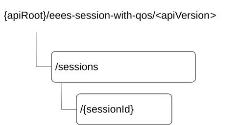

# 8.5.2 Resources

## 8.5.2.1 Overview

This clause describes the structure for the Resource URIs and the resources and methods used for the service.

Figure 8.5.2.1-1 depicts the resource URIs structure for the Eees_SessionWithQoS API.

Figure 8.5.2.1-1: Resource URI structure of the Eees_SessionWithQoS API

Table 8.5.2.1-1 provides an overview of the resources and applicable HTTP methods.

Table 8.5.2.1-1: Resources and methods overview

| Resource name               | Resource URI          | HTTP method or custom operation | Description                                                                                 |
|-----------------------------|-----------------------|---------------------------------|---------------------------------------------------------------------------------------------|
| Sessions with QoS           | /sessions             | POST                            | Create a new individual Session with QoS                                                    |
|                             |                       | GET                             | Read all subscription resources for given EAS.                                              |
| Individual Session with QoS | /sessions/{sessionId} | PUT                             | Fully replace an existing Individual Session with QoS resource identified by a sessionId.   |
|                             |                       | PATCH                           | Partially update an existing Individual Session with QoS resource identified by a sessionId |
|                             |                       | DELETE                          | Remove an Individual Session with QoS resource identified by a sessionId.                   |
|                             |                       | GET                             | Read a subscription resource for a sessionId.                                               |

## 8.5.2.2 Resource: Sessions with QoS

### 8.5.2.2.1 Description

This resource represents session information of all the data sessions with a specific QoS setting at a given Edge Enabler Server.

### 8.5.2.2.2 Resource Definition

Resource URI: **{apiRoot}/eees-session-with-qos/\<apiVersion\>/sessions**

This resource shall support the resource URI variables defined in the table 8.5.2.2.2-1.

Table 8.5.2.2.2-1: Resource URI variables for this resource

| Name    | Data Type | Definition     |
|---------|-----------|----------------|
| apiRoot | string    | See clause 7.5 |

### 8.5.2.2.3 Resource Standard Methods

#### 8.5.2.2.3.1 POST

This method requests resources for a data session between AC and EAS with a specific QoS and may create the session information subscription at the Edge Enabler Server for receiving the user plane event notification of the session information. This method shall support the URI query parameters specified in table 8.5.2.2.3.1-1.

Table 8.5.2.2.3.1-1: URI query parameters supported by the POST method on this resource

|      |           |     |             |             |
|------|-----------|-----|-------------|-------------|
| Name | Data type | P   | Cardinality | Description |
| n/a  |           |     |             |             |

This method shall support the request data structures specified in table 8.5.2.2.3.1-2 and the response data structures and response codes specified in table 8.5.2.2.3.1-3.

Table 8.5.2.2.3.1-2: Data structures supported by the POST Request Body on this resource

|                |     |             |                                                                                                  |
|----------------|-----|-------------|--------------------------------------------------------------------------------------------------|
| Data type      | P   | Cardinality | Description                                                                                      |
| SessionWithQoS | M   | 1           | Parameters to create a subscription for a session with required QoS for the service requirement. |

Table 8.5.2.2.3.1-3: Data structures supported by the POST Response Body on this resource

<table>
<colgroup>
<col style="width: 14%" />
<col style="width: 8%" />
<col style="width: 12%" />
<col style="width: 16%" />
<col style="width: 47%" />
</colgroup>
<tbody>
<tr class="odd">
<td>Data type</td>
<td>P</td>
<td>Cardinality</td>
<td>
Response

codes
</td>
<td>Description</td>
</tr>
<tr class="even">
<td>SessionWithQoS</td>
<td>M</td>
<td>1</td>
<td>201 Created</td>
<td>
The session is successfully set up with requested QoS, and the session information is provided in the response body.

The URI of the created resource shall be returned in the "Location" HTTP header.
</td>
</tr>
<tr class="odd">
<td>ProblemDetails</td>
<td>O</td>
<td>0..1</td>
<td>403 Forbidden</td>
<td>(NOTE 2)</td>
</tr>
<tr class="even">
<td colspan="5">
NOTE 1: The mandatory HTTP error status code for the POST method listed in Table 5.2.6-1 of 3GPP TS 29.122 [6] also apply.

NOTE 2: Failure cases are described in clause 8.5.6.3.
</td>
</tr>
</tbody>
</table>

Table 8.5.2.2.3.1-4: Headers supported by the 201 response code on this resource

|          |           |     |             |                                                                                                                                                 |
|----------|-----------|-----|-------------|-------------------------------------------------------------------------------------------------------------------------------------------------|
| Name     | Data type | P   | Cardinality | Description                                                                                                                                     |
| Location | string    | M   | 1           | Contains the URI of the newly created resource, according to the structure: {apiRoot}/eees-session-with-qos/\<apiVersion\>/sessions/{sessionId} |

#### 8.5.2.2.3.2 GET

The GET method allows to read all active subscriptions for a given EAS. The EAS shall initiate the HTTP GET request message and the EES shall respond to the message. This method shall support the URI query parameters specified in table 8.5.2.2.3.2-1.

Table 8.5.2.2.3.2-1: URI query parameters supported by the GET method on this resource

|        |           |     |             |                                                                                                                  |
|--------|-----------|-----|-------------|------------------------------------------------------------------------------------------------------------------|
| Name   | Data type | P   | Cardinality | Description                                                                                                      |
| eas-id | string    | M   | 1           | Represents the application identifier of the EAS , e.g. URI, FQDN, that is querying the status of subscriptions. |

This method shall support the request data structures specified in table 8.5.2.2.3.2-2 and the response data structures and response codes specified in table 8.5.2.2.3.2-3.

Table 8.5.2.2.3.2-2: Data structures supported by the GET Request Body on this resource

|           |     |             |             |
|-----------|-----|-------------|-------------|
| Data type | P   | Cardinality | Description |
| n/a       |     |             |             |

Table 8.5.2.2.3.2-3: Data structures supported by the GET Response Body on this resource

<table>
<colgroup>
<col style="width: 16%" />
<col style="width: 10%" />
<col style="width: 14%" />
<col style="width: 19%" />
<col style="width: 39%" />
</colgroup>
<tbody>
<tr class="odd">
<td>Data type</td>
<td>P</td>
<td>Cardinality</td>
<td>
Response

codes
</td>
<td>Description</td>
</tr>
<tr class="even">
<td>array(SessionWithQoS)</td>
<td>M</td>
<td>1..N</td>
<td>200 OK</td>
<td>The subscription information related to the request URI is returned.</td>
</tr>
<tr class="odd">
<td>n/a</td>
<td></td>
<td></td>
<td>307 Temporary Redirect</td>
<td>
Temporary redirection. The response shall include a Location header field containing an alternative URI of the resource located in an alternative EES.

Redirection handling is described in clause 5.2.10 of TS 29.122 [6].
</td>
</tr>
<tr class="even">
<td>n/a</td>
<td></td>
<td></td>
<td>308 Permanent Redirect</td>
<td>
Permanent redirection. The response shall include a Location header field containing an alternative URI of the resource located in an alternative EES.

Redirection handling is described in clause 5.2.10 of TS 29.122 [6].
</td>
</tr>
<tr class="odd">
<td colspan="5">NOTE: The mandatory HTTP error status code for the GET method listed in Table 5.2.6-1 of 3GPP TS 29.122 [6] also apply.</td>
</tr>
</tbody>
</table>

Table 8.5.2.2.3.2-4: Headers supported by the 307 Response Code on this resource

|          |           |     |             |                                                                   |
|----------|-----------|-----|-------------|-------------------------------------------------------------------|
| Name     | Data type | P   | Cardinality | Description                                                       |
| Location | string    | M   | 1           | An alternative URI of the resource located in an alternative EES. |

Table 8.5.2.2.3.2-5: Headers supported by the 308 Response Code on this resource

|          |           |     |             |                                                                   |
|----------|-----------|-----|-------------|-------------------------------------------------------------------|
| Name     | Data type | P   | Cardinality | Description                                                       |
| Location | string    | M   | 1           | An alternative URI of the resource located in an alternative EES. |

### 8.5.2.2.4 Resource Custom Operations

None.

## 8.5.2.3 Resource: Individual Session with QoS

### 8.5.2.3.1 Description

This resource represents an individual session information of the data session with a specific QoS setting at a given Edge Enabler Server.

### 8.5.2.3.2 Resource Definition

Resource URI: **{apiRoot}/eees-session-with-qos/\<apiVersion\>/sessions/{sessionId}**

This resource shall support the resource URI variables defined in the table 8.5.2.3.2-1.

Table 8.5.2.3.2-1: Resource URI variables for this resource

| Name      | Data Type | Definition                                     |
|-----------|-----------|------------------------------------------------|
| apiRoot   | string    | See clause 7.5.                                |
| sessionId | string    | Contains the identifier of a Session with QoS. |

### 8.5.2.3.3 Resource Standard Methods

#### 8.5.2.3.3.1 PATCH

This method partially updates the QoS of the data session between AC and EAS. This method shall support the URI query parameters specified in the table 8.5.2.3.3.1-1.

Table 8.5.2.3.3.1-1: URI query parameters supported by the PATCH method on this resource

|      |           |     |             |             |
|------|-----------|-----|-------------|-------------|
| Name | Data type | P   | Cardinality | Description |
| n/a  |           |     |             |             |

This method shall support the request data structures specified in table 8.5.2.3.3.1-2 and the response data structures and response codes specified in table 8.5.2.3.3.1-3.

Table 8.5.2.3.3.1-2: Data structures supported by the PATCH Request Body on this resource

|                     |     |             |                                                                                     |
|---------------------|-----|-------------|-------------------------------------------------------------------------------------|
| Data type           | P   | Cardinality | Description                                                                         |
| SessionWithQoSPatch | M   | 1           | Request to partially update the data session between AC and EAS with a specific QoS |

Table 8.5.2.3.3.1-3: Data structures supported by the PATCH Response Body on this resource

<table>
<colgroup>
<col style="width: 16%" />
<col style="width: 9%" />
<col style="width: 14%" />
<col style="width: 19%" />
<col style="width: 39%" />
</colgroup>
<tbody>
<tr class="odd">
<td>Data type</td>
<td>P</td>
<td>Cardinality</td>
<td>
Response

codes
</td>
<td>Description</td>
</tr>
<tr class="even">
<td>SessionWithQoS</td>
<td>M</td>
<td>1</td>
<td>200 OK</td>
<td>The individual Session with QoS is successfully modified and the updated session with QoS context information is returned in the response</td>
</tr>
<tr class="odd">
<td>n/a</td>
<td></td>
<td></td>
<td>204 No Content</td>
<td>The individual Session with QoS is successfully modified.</td>
</tr>
<tr class="even">
<td>n/a</td>
<td></td>
<td></td>
<td>307 Temporary Redirect</td>
<td>
Temporary redirection. The response shall include a Location header field containing an alternative URI of the resource located in an alternative EES.

Redirection handling is described in clause 5.2.10 of TS 29.122 [6].
</td>
</tr>
<tr class="odd">
<td>n/a</td>
<td></td>
<td></td>
<td>308 Permanent Redirect</td>
<td>
Permanent redirection. The response shall include a Location header field containing an alternative URI of the resource located in an alternative EES.

Redirection handling is described in clause 5.2.10 of TS 29.122 [6].
</td>
</tr>
<tr class="even">
<td>ProblemDetails</td>
<td>O</td>
<td>0..1</td>
<td>403 Forbidden</td>
<td>(NOTE 2)</td>
</tr>
<tr class="odd">
<td colspan="5">
NOTE 1: The manadatory HTTP error status code for the PATCH method listed in Table 5.2.6-1 of 3GPP TS 29.122 [6] also apply.

NOTE 2: Failure cases are described in clause 8.5.6.3.
</td>
</tr>
</tbody>
</table>

Table 8.5.2.3.3.1-4: Headers supported by the 307 Response Code on this resource

|          |           |     |             |                                                                   |
|----------|-----------|-----|-------------|-------------------------------------------------------------------|
| Name     | Data type | P   | Cardinality | Description                                                       |
| Location | string    | M   | 1           | An alternative URI of the resource located in an alternative EES. |

Table 8.5.2.3.3.1-5: Headers supported by the 308 Response Code on this resource

|          |           |     |             |                                                                   |
|----------|-----------|-----|-------------|-------------------------------------------------------------------|
| Name     | Data type | P   | Cardinality | Description                                                       |
| Location | string    | M   | 1           | An alternative URI of the resource located in an alternative EES. |

#### 8.5.2.3.3.2 PUT

This method requests modification of QoS of the data session between AC and EAS and may modify the subscription of the event monitoring by subscribing to new events or removing subscriptions to existing events at the Edge Enabler Server for receiving the user plane event notification of the session information. This method shall support the URI query parameters specified in the table 8.5.2.3.3.2-1.

Table 8.5.2.3.3.2-1: URI query parameters supported by the PUT method on this resource

|      |           |     |             |             |
|------|-----------|-----|-------------|-------------|
| Name | Data type | P   | Cardinality | Description |
| n/a  |           |     |             |             |

This method shall support the request data structures specified in table 8.5.2.3.3.2-2 and the response data structures and response codes specified in table 8.5.2.3.3.2-3.

Table 8.5.2.3.3.2-2: Data structures supported by the PUT Request Body on this resource

|                |     |             |                                                                                                  |
|----------------|-----|-------------|--------------------------------------------------------------------------------------------------|
| Data type      | P   | Cardinality | Description                                                                                      |
| SessionWithQoS | M   | 1           | Parameters to create a subscription for a session with required QoS for the service requirement. |

Table 8.5.2.3.3.2-3: Data structures supported by the PUT Response Body on this resource

<table>
<colgroup>
<col style="width: 16%" />
<col style="width: 9%" />
<col style="width: 14%" />
<col style="width: 19%" />
<col style="width: 39%" />
</colgroup>
<tbody>
<tr class="odd">
<td>Data type</td>
<td>P</td>
<td>Cardinality</td>
<td>
Response

codes
</td>
<td>Description</td>
</tr>
<tr class="even">
<td>SessionWithQoS</td>
<td>M</td>
<td>1</td>
<td>200 OK</td>
<td>The individual Session with QoS is successfully modified and the updated session with QoS context information is returned in the response.</td>
</tr>
<tr class="odd">
<td>n/a</td>
<td></td>
<td></td>
<td>204 No Content</td>
<td>The individual Session with QoS is successfully modified.</td>
</tr>
<tr class="even">
<td>n/a</td>
<td></td>
<td></td>
<td>307 Temporary Redirect</td>
<td>
Temporary redirection. The response shall include a Location header field containing an alternative URI of the resource located in an alternative EES.

Redirection handling is described in clause 5.2.10 of TS 29.122 [6].
</td>
</tr>
<tr class="odd">
<td>n/a</td>
<td></td>
<td></td>
<td>308 Permanent Redirect</td>
<td>
Permanent redirection. The response shall include a Location header field containing an alternative URI of the resource located in an alternative EES.

Redirection handling is described in clause 5.2.10 of TS 29.122 [6].
</td>
</tr>
<tr class="even">
<td>ProblemDetails</td>
<td>O</td>
<td>0..1</td>
<td>403 Forbidden</td>
<td>(NOTE 2)</td>
</tr>
<tr class="odd">
<td colspan="5">
NOTE 1: The manadatory HTTP error status code for the PUT method listed in Table 5.2.6-1 of 3GPP TS 29.122 [6] also apply.

NOTE 2: Failure cases are described in clause 8.5.6.3.
</td>
</tr>
</tbody>
</table>

Table 8.5.2.3.3.2-4: Headers supported by the 307 Response Code on this resource

|          |           |     |             |                                                                   |
|----------|-----------|-----|-------------|-------------------------------------------------------------------|
| Name     | Data type | P   | Cardinality | Description                                                       |
| Location | string    | M   | 1           | An alternative URI of the resource located in an alternative EES. |

Table 8.5.2.3.3.2-5: Headers supported by the 308 Response Code on this resource

|          |           |     |             |                                                                   |
|----------|-----------|-----|-------------|-------------------------------------------------------------------|
| Name     | Data type | P   | Cardinality | Description                                                       |
| Location | string    | M   | 1           | An alternative URI of the resource located in an alternative EES. |

#### 8.5.2.3.3.3 DELETE

This method revokes the data session between AC and EAS with a specific QoS and unsubscribes to the related session with user plane event notification. This method shall support the URI query parameters specified in table 8.5.2.3.3.3-1.

Table 8.5.2.3.3.3-1: URI query parameters supported by the DELETE method on this resource

|      |           |     |             |             |
|------|-----------|-----|-------------|-------------|
| Name | Data type | P   | Cardinality | Description |
| n/a  |           |     |             |             |

This method shall support the request data structures specified in table 8.5.2.3.3.3-2 and the response data structures and response codes specified in table 8.5.2.3.3.3-3.

Table 8.5.2.3.3.3-2: Data structures supported by the DELETE Request Body on this resource

|           |     |             |             |
|-----------|-----|-------------|-------------|
| Data type | P   | Cardinality | Description |
| n/a       |     |             |             |

Table 8.5.2.3.3.3-3: Data structures supported by the DELETE Response Body on this resource

<table>
<colgroup>
<col style="width: 16%" />
<col style="width: 9%" />
<col style="width: 14%" />
<col style="width: 19%" />
<col style="width: 39%" />
</colgroup>
<tbody>
<tr class="odd">
<td>Data type</td>
<td>P</td>
<td>Cardinality</td>
<td>
Response

codes
</td>
<td>Description</td>
</tr>
<tr class="even">
<td>n/a</td>
<td></td>
<td></td>
<td>204 No Content</td>
<td>The individual Session with QoS resource matching the sessionId is successfully deleted.</td>
</tr>
<tr class="odd">
<td>n/a</td>
<td></td>
<td></td>
<td>307 Temporary Redirect</td>
<td>
Temporary redirection. The response shall include a Location header field containing an alternative URI of the resource located in an alternative EES.

Redirection handling is described in clause 5.2.10 of TS 29.122 [6].
</td>
</tr>
<tr class="even">
<td>n/a</td>
<td></td>
<td></td>
<td>308 Permanent Redirect</td>
<td>
Permanent redirection. The response shall include a Location header field containing an alternative URI of the resource located in an alternative EES.

Redirection handling is described in clause 5.2.10 of TS 29.122 [6].
</td>
</tr>
<tr class="odd">
<td colspan="5">NOTE: The manadatory HTTP error status code for the DELETE method listed in Table 5.2.6-1 of 3GPP TS 29.122 [6] also apply.</td>
</tr>
</tbody>
</table>

Table 8.5.2.3.3.3-4: Headers supported by the 307 Response Code on this resource

|          |           |     |             |                                                                   |
|----------|-----------|-----|-------------|-------------------------------------------------------------------|
| Name     | Data type | P   | Cardinality | Description                                                       |
| Location | string    | M   | 1           | An alternative URI of the resource located in an alternative EES. |

Table 8.5.2.3.3.3-5: Headers supported by the 308 Response Code on this resource

|          |           |     |             |                                                                   |
|----------|-----------|-----|-------------|-------------------------------------------------------------------|
| Name     | Data type | P   | Cardinality | Description                                                       |
| Location | string    | M   | 1           | An alternative URI of the resource located in an alternative EES. |

#### 8.5.2.3.3.4 GET

The GET method allows to read a subscription. The EAS shall initiate the HTTP GET request message and the EES shall respond to the message. This method shall support the URI query parameters specified in table 8.5.2.3.3.4-1.

Table 8.5.2.3.3.4-1: URI query parameters supported by the GET method on this resource

|      |           |     |             |             |
|------|-----------|-----|-------------|-------------|
| Name | Data type | P   | Cardinality | Description |
| n/a  |           |     |             |             |

This method shall support the request data structures specified in table 8.5.2.3.3.4-2 and the response data structures and response codes specified in table 8.5.2.3.3.4-3.

Table 8.5.2.3.3.4-2: Data structures supported by the GET Request Body on this resource

|           |     |             |             |
|-----------|-----|-------------|-------------|
| Data type | P   | Cardinality | Description |
| n/a       |     |             |             |

Table 8.5.2.3.3.4-3: Data structures supported by the GET Response Body on this resource

<table>
<colgroup>
<col style="width: 16%" />
<col style="width: 10%" />
<col style="width: 14%" />
<col style="width: 19%" />
<col style="width: 39%" />
</colgroup>
<tbody>
<tr class="odd">
<td>Data type</td>
<td>P</td>
<td>Cardinality</td>
<td>
Response

codes
</td>
<td>Description</td>
</tr>
<tr class="even">
<td>SessionWithQoS</td>
<td>M</td>
<td>1</td>
<td>200 OK</td>
<td>The subscription information related to the request URI is returned.</td>
</tr>
<tr class="odd">
<td>n/a</td>
<td></td>
<td></td>
<td>307 Temporary Redirect</td>
<td>
Temporary redirection. The response shall include a Location header field containing an alternative URI of the resource located in an alternative EES.

Redirection handling is described in clause 5.2.10 of TS 29.122 [6].
</td>
</tr>
<tr class="even">
<td>n/a</td>
<td></td>
<td></td>
<td>308 Permanent Redirect</td>
<td>
Permanent redirection. The response shall include a Location header field containing an alternative URI of the resource located in an alternative EES.

Redirection handling is described in clause 5.2.10 of TS 29.122 [6].
</td>
</tr>
<tr class="odd">
<td colspan="5">NOTE: The manadatory HTTP error status code for the GET method listed in Table 5.2.6-1 of 3GPP TS 29.122 [6] also apply.</td>
</tr>
</tbody>
</table>

Table 8.5.2.3.3.4-4: Headers supported by the 307 Response Code on this resource

|          |           |     |             |                                                                   |
|----------|-----------|-----|-------------|-------------------------------------------------------------------|
| Name     | Data type | P   | Cardinality | Description                                                       |
| Location | string    | M   | 1           | An alternative URI of the resource located in an alternative EES. |

Table 8.5.2.3.3.4-5: Headers supported by the 308 Response Code on this resource

|          |           |     |             |                                                                   |
|----------|-----------|-----|-------------|-------------------------------------------------------------------|
| Name     | Data type | P   | Cardinality | Description                                                       |
| Location | string    | M   | 1           | An alternative URI of the resource located in an alternative EES. |

### 8.5.2.3.4 Resource Custom Operations

None.
