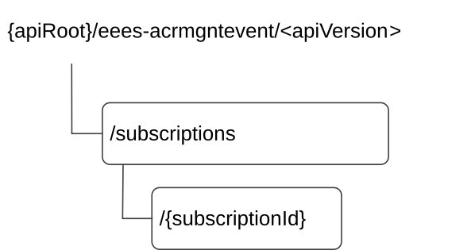

# 8.6.2 Resources

## 8.6.2.1 Overview

This clause describes the structure for the Resource URIs and the resources and methods used for the service.

Figure 8.6.2.1-1 depicts the resource URIs structure for the Eees_ACRManagementEvent API.

Figure 8.6.2.1-1: Resource URI structure of the Eees_ACRManagementEvent API

Table 8.6.2.1-1 provides an overview of the resources and applicable HTTP methods.

Table 8.6.2.1-1: Resources and methods overview

| Resource name                                 | Resource URI                    | HTTP method or custom operation | Description                                                                                                         |
|-----------------------------------------------|---------------------------------|---------------------------------|---------------------------------------------------------------------------------------------------------------------|
| ACR Management Events Subscriptions           | /subscriptions                  | GET                             | Query all the subscriptions.                                                                                        |
|                                               |                                 | POST                            | Create a new Individual ACR Management Events Subscription resource.                                                |
| Individual ACR Management Events Subscription | /subscriptions/{subscriptionId} | GET                             | Query an existing Individual ACR Management Events Subscription resource identified by a subscriptionId.            |
|                                               |                                 | PUT                             | Fully replace an existing Individual ACR Management Events Subscription resource identified by a subscriptionId.    |
|                                               |                                 | PATCH                           | Partially update an existing Individual ACR Management Events Subscription resource identified by a subscriptionId. |
|                                               |                                 | DELETE                          | Remove an Individual ACR Management Events Subscription resource identified by a subscriptionId.                    |

## 8.6.2.2 Resource: ACR Management Events Subscriptions

### 8.6.2.2.1 Description

This resource represents ACR Management Events Subscriptions at a given Edge Enabler Server.

### 8.6.2.2.2 Resource Definition

Resource URI: **{apiRoot}/eees-acrmgntevent/\<apiVersion\>/subscriptions**

This resource shall support the resource URI variables defined in the table 8.6.2.2.2-1.

Table 8.6.2.2.2-1: Resource URI variables for this resource

| Name    | Data Type | Definition     |
|---------|-----------|----------------|
| apiRoot | string    | See clause 7.5 |

### 8.6.2.2.3 Resource Standard Methods

#### 8.6.2.2.3.1 POST

This method requests to create an Individual ACR Management Event Subscription resource at the EES for receiving the notifications of ACR management events. This method shall support the URI query parameters specified in table 8.6.2.2.3.1-1.

Table 8.6.2.2.3.1-1: URI query parameters supported by the POST method on this resource

|      |           |     |             |             |
|------|-----------|-----|-------------|-------------|
| Name | Data type | P   | Cardinality | Description |
| n/a  |           |     |             |             |

This method shall support the request data structures specified in table 8.6.2.2.3.1-2 and the response data structures and response codes specified in table 8.6.2.2.3.1-3.

Table 8.6.2.2.3.1-2: Data structures supported by the POST Request Body on this resource

|                           |     |             |                                                                                 |
|---------------------------|-----|-------------|---------------------------------------------------------------------------------|
| Data type                 | P   | Cardinality | Description                                                                     |
| AcrMgntEventsSubscription | M   | 1           | Parameters to create a subscription for notifications of ACR management events. |

Table 8.6.2.2.3.1-3: Data structures supported by the POST Response Body on this resource

<table>
<colgroup>
<col style="width: 22%" />
<col style="width: 8%" />
<col style="width: 12%" />
<col style="width: 16%" />
<col style="width: 40%" />
</colgroup>
<tbody>
<tr class="odd">
<td>Data type</td>
<td>P</td>
<td>Cardinality</td>
<td>
Response

codes
</td>
<td>Description</td>
</tr>
<tr class="even">
<td>AcrMgntEventsSubscription</td>
<td>M</td>
<td>1</td>
<td>201 Created</td>
<td>
An Individual ACR Management Events Subscription resource is successfully created, and the subscription information is provided in the response body.

The URI of the created resource shall be returned in the "Location" HTTP header.
</td>
</tr>
<tr class="odd">
<td>ProblemDetails</td>
<td>O</td>
<td>0..1</td>
<td>403 Forbidden</td>
<td>(NOTE 2)</td>
</tr>
<tr class="even">
<td colspan="5">
NOTE 1: The mandatory HTTP error status code for the POST method listed in Table 5.2.6-1 of 3GPP TS 29.122 [6] also apply.

NOTE 2: Failure cases are described in clause 8.6.6.3.
</td>
</tr>
</tbody>
</table>

Table 8.6.2.2.3.1-4: Headers supported by the 201 response code on this resource

|          |           |     |             |                                                                                                                                                       |
|----------|-----------|-----|-------------|-------------------------------------------------------------------------------------------------------------------------------------------------------|
| Name     | Data type | P   | Cardinality | Description                                                                                                                                           |
| Location | string    | M   | 1           | Contains the URI of the newly created resource, according to the structure: {apiRoot}/eees-acrmgntevent/\<apiVersion\>/subscriptions/{subscriptionId} |

#### 8.6.2.2.3.2 GET

This method retrieves all the ACR Management Events Subscriptions information at EES. This method shall support the URI query parameters specified in the table 8.6.2.2.3.2-1.

Table 8.6.2.2.3.2-1: URI query parameters supported by the GET method on this resource

<table>
<colgroup>
<col style="width: 16%" />
<col style="width: 18%" />
<col style="width: 4%" />
<col style="width: 12%" />
<col style="width: 47%" />
</colgroup>
<tbody>
<tr class="odd">
<td>Name</td>
<td>Data type</td>
<td>P</td>
<td>Cardinality</td>
<td>Description</td>
</tr>
<tr class="even">
<td>supp-feat</td>
<td>SupportedFeatures</td>
<td>O</td>
<td>0..1</td>
<td>
Contains the list of supported feature(s) among the ones defined in in clause 8.6.7.

This query parameter shall be present only when feature negotiation needs to take place.
</td>
</tr>
</tbody>
</table>

This method shall support the request data structures specified in table 8.6.2.2.3.2-2 and the response data structures and response codes specified in table 8.6.2.2.3.2-3.

Table 8.6.2.2.3.2-2: Data structures supported by the GET Request Body on this resource

|           |     |             |             |
|-----------|-----|-------------|-------------|
| Data type | P   | Cardinality | Description |
| n/a       |     |             |             |

Table 8.6.2.2.3.2-3: Data structures supported by the GET Response Body on this resource

<table>
<colgroup>
<col style="width: 16%" />
<col style="width: 9%" />
<col style="width: 14%" />
<col style="width: 19%" />
<col style="width: 39%" />
</colgroup>
<tbody>
<tr class="odd">
<td>Data type</td>
<td>P</td>
<td>Cardinality</td>
<td>
Response

codes
</td>
<td>Description</td>
</tr>
<tr class="even">
<td>array(AcrMgntEventsSubscription)</td>
<td>M</td>
<td>1..N</td>
<td>200 OK</td>
<td>All the ACR Management Events Subscriptions information is returned by the EES.</td>
</tr>
<tr class="odd">
<td>n/a</td>
<td></td>
<td></td>
<td>307 Temporary Redirect</td>
<td>
Temporary redirection, during subscription retrieval. The response shall include a Location header field containing an alternative URI of the resource located in an alternative EES.

Redirection handling is described in clause 5.2.10 of 3GPP TS 29.122 [6].
</td>
</tr>
<tr class="even">
<td>n/a</td>
<td></td>
<td></td>
<td>308 Permanent Redirect</td>
<td>
Permanent redirection, during subscription retrieval. The response shall include a Location header field containing an alternative URI of the resource located in an alternative EES.

Redirection handling is described in clause 5.2.10 of 3GPP TS 29.122 [6].
</td>
</tr>
<tr class="odd">
<td colspan="5">NOTE: The manadatory HTTP error status code for the GET method listed in Table 5.2.6-1 of 3GPP TS 29.122 [6] also apply.</td>
</tr>
</tbody>
</table>

Table 8.6.2.2.3.2-4: Headers supported by the 307 Response Code on this resource

|          |           |     |             |                                                                   |
|----------|-----------|-----|-------------|-------------------------------------------------------------------|
| Name     | Data type | P   | Cardinality | Description                                                       |
| Location | string    | M   | 1           | An alternative URI of the resource located in an alternative EES. |

Table 8.6.2.2.3.2-5: Headers supported by the 308 Response Code on this resource

|          |           |     |             |                                                                   |
|----------|-----------|-----|-------------|-------------------------------------------------------------------|
| Name     | Data type | P   | Cardinality | Description                                                       |
| Location | string    | M   | 1           | An alternative URI of the resource located in an alternative EES. |

### 8.6.2.2.4 Resource Custom Operations

None.

## 8.6.2.3 Resource: Individual ACR Management Events Subscription

### 8.6.2.3.1 Description

This resource represents an existing Individual ACR Management Events Subscription at a given EES.

### 8.6.2.3.2 Resource Definition

Resource URI: **{apiRoot}/eees-acrmgntevent/\<apiVersion\>/subscriptions/{subscriptionId}**

This resource shall support the resource URI variables defined in the table 8.6.2.3.2-1.

Table 8.6.2.3.2-1: Resource URI variables for this resource

| Name           | Data Type | Definition                                                        |
|----------------|-----------|-------------------------------------------------------------------|
| apiRoot        | string    | See clause 7.5.                                                   |
| subscriptionId | string    | Contains the identifier of an ACR Management Events Subscription. |

### 8.6.2.3.3 Resource Standard Methods

#### 8.6.2.3.3.1 PATCH

This method partially updates an existing Individual ACR Management Events Subscription. This method shall support the URI query parameters specified in the table 8.6.2.3.3.1-1.

Table 8.6.2.3.3.1-1: URI query parameters supported by the PATCH method on this resource

|      |           |     |             |             |
|------|-----------|-----|-------------|-------------|
| Name | Data type | P   | Cardinality | Description |
| n/a  |           |     |             |             |

This method shall support the request data structures specified in table 8.6.2.3.3.1-2 and the response data structures and response codes specified in table 8.6.2.3.3.1-3.

Table 8.6.2.3.3.1-2: Data structures supported by the PATCH Request Body on this resource

|                                |     |             |                                                                                        |
|--------------------------------|-----|-------------|----------------------------------------------------------------------------------------|
| Data type                      | P   | Cardinality | Description                                                                            |
| AcrMgntEventsSubscriptionPatch | M   | 1           | Request to partially update an existing Individual ACR Management Events Subscription. |

Table 8.6.2.3.3.1-3: Data structures supported by the PATCH Response Body on this resource

<table>
<colgroup>
<col style="width: 16%" />
<col style="width: 9%" />
<col style="width: 14%" />
<col style="width: 19%" />
<col style="width: 39%" />
</colgroup>
<tbody>
<tr class="odd">
<td>Data type</td>
<td>P</td>
<td>Cardinality</td>
<td>
Response

codes
</td>
<td>Description</td>
</tr>
<tr class="even">
<td>AcrMgntEventsSubscription</td>
<td>M</td>
<td>1</td>
<td>200 OK</td>
<td>The Individual ACR Management Events Subscription is successfully modified and the updated subscription information is returned in the response.</td>
</tr>
<tr class="odd">
<td>n/a</td>
<td></td>
<td></td>
<td>204 No Content</td>
<td>The Individual ACR Management Events Subscription is successfully modified.</td>
</tr>
<tr class="even">
<td>n/a</td>
<td></td>
<td></td>
<td>307 Temporary Redirect</td>
<td>
Temporary redirection, during subscription modification. The response shall include a Location header field containing an alternative URI of the resource located in an alternative EES.

Redirection handling is described in clause 5.2.10 of 3GPP TS 29.122 [6].
</td>
</tr>
<tr class="odd">
<td>n/a</td>
<td></td>
<td></td>
<td>308 Permanent Redirect</td>
<td>
Permanent redirection, during subscription modification. The response shall include a Location header field containing an alternative URI of the resource located in an alternative EES.

Redirection handling is described in clause 5.2.10 of 3GPP TS 29.122 [6].
</td>
</tr>
<tr class="even">
<td>ProblemDetails</td>
<td>O</td>
<td>0..1</td>
<td>403 Forbidden</td>
<td>(NOTE 2)</td>
</tr>
<tr class="odd">
<td colspan="5">
NOTE 1: The mandatory HTTP error status code for the PATCH method listed in Table 5.2.6-1 of 3GPP TS 29.122 [6] also apply.

NOTE 2: Failure cases are described in clause 8.6.6.3.
</td>
</tr>
</tbody>
</table>

Table 8.6.2.3.3.1-4: Headers supported by the 307 Response Code on this resource

|          |           |     |             |                                                                   |
|----------|-----------|-----|-------------|-------------------------------------------------------------------|
| Name     | Data type | P   | Cardinality | Description                                                       |
| Location | string    | M   | 1           | An alternative URI of the resource located in an alternative EES. |

Table 8.6.2.3.3.1-5: Headers supported by the 308 Response Code on this resource

|          |           |     |             |                                                                   |
|----------|-----------|-----|-------------|-------------------------------------------------------------------|
| Name     | Data type | P   | Cardinality | Description                                                       |
| Location | string    | M   | 1           | An alternative URI of the resource located in an alternative EES. |

#### 8.6.2.3.3.2 PUT

This method requests fully replacement of an existing Individual ACR Management Events Subscription at the EES. The request shall not change the values of the "easId", "tgtUeId", "requestTestNotification", "websockNotifConfig" and/or "suppFeat" attributes within the AcrMgntEventsSubscription data type. This method shall support the URI query parameters specified in the table 8.6.2.3.3.2-1.

Table 8.6.2.3.3.2-1: URI query parameters supported by the PUT method on this resource

|      |           |     |             |             |
|------|-----------|-----|-------------|-------------|
| Name | Data type | P   | Cardinality | Description |
| n/a  |           |     |             |             |

This method shall support the request data structures specified in table 8.6.2.3.3.2-2 and the response data structures and response codes specified in table 8.6.2.3.3.2-3.

Table 8.6.2.3.3.2-2: Data structures supported by the PUT Request Body on this resource

|                           |     |             |                                                                                  |
|---------------------------|-----|-------------|----------------------------------------------------------------------------------|
| Data type                 | P   | Cardinality | Description                                                                      |
| AcrMgntEventsSubscription | M   | 1           | Parameters to replace an existing Individual ACR Management Events Subscription. |

Table 8.6.2.3.3.2-3: Data structures supported by the PUT Response Body on this resource

<table>
<colgroup>
<col style="width: 16%" />
<col style="width: 9%" />
<col style="width: 14%" />
<col style="width: 19%" />
<col style="width: 39%" />
</colgroup>
<tbody>
<tr class="odd">
<td>Data type</td>
<td>P</td>
<td>Cardinality</td>
<td>
Response

codes
</td>
<td>Description</td>
</tr>
<tr class="even">
<td>AcrMgntEventsSubscription</td>
<td>M</td>
<td>1</td>
<td>200 OK</td>
<td>The existing Individual ACR Management Events Subscription is successfully replaced and the updated subscription information is returned in the response.</td>
</tr>
<tr class="odd">
<td>n/a</td>
<td></td>
<td></td>
<td>204 No Content</td>
<td>The existing Individual ACR Management Events Subscription is successfully modified.</td>
</tr>
<tr class="even">
<td>n/a</td>
<td></td>
<td></td>
<td>307 Temporary Redirect</td>
<td>
Temporary redirection, during subscription modification. The response shall include a Location header field containing an alternative URI of the resource located in an alternative EES.

Redirection handling is described in clause 5.2.10 of 3GPP TS 29.122 [6].
</td>
</tr>
<tr class="odd">
<td>n/a</td>
<td></td>
<td></td>
<td>308 Permanent Redirect</td>
<td>
Permanent redirection, during subscription modification. The response shall include a Location header field containing an alternative URI of the resource located in an alternative EES.

Redirection handling is described in clause 5.2.10 of 3GPP TS 29.122 [6].
</td>
</tr>
<tr class="even">
<td>ProblemDetails</td>
<td>O</td>
<td>0..1</td>
<td>403 Forbidden</td>
<td>(NOTE 2)</td>
</tr>
<tr class="odd">
<td colspan="5">
NOTE 1: The mandatory HTTP error status code for the PUT method listed in Table 5.2.6-1 of 3GPP TS 29.122 [6] also apply.

NOTE 2: Failure cases are described in clause 8.6.6.3
</td>
</tr>
</tbody>
</table>

Table 8.6.2.3.3.2-4: Headers supported by the 307 Response Code on this resource

|          |           |     |             |                                                                   |
|----------|-----------|-----|-------------|-------------------------------------------------------------------|
| Name     | Data type | P   | Cardinality | Description                                                       |
| Location | string    | M   | 1           | An alternative URI of the resource located in an alternative EES. |

Table 8.6.2.3.3.2-5: Headers supported by the 308 Response Code on this resource

|          |           |     |             |                                                                   |
|----------|-----------|-----|-------------|-------------------------------------------------------------------|
| Name     | Data type | P   | Cardinality | Description                                                       |
| Location | string    | M   | 1           | An alternative URI of the resource located in an alternative EES. |

#### 8.6.2.3.3.3 DELETE

This method deletes an existing Individual ACR Management Events Subscription. This method shall support the URI query parameters specified in table 8.6.2.3.3.3-1.

Table 8.6.2.3.3.3-1: URI query parameters supported by the DELETE method on this resource

|      |           |     |             |             |
|------|-----------|-----|-------------|-------------|
| Name | Data type | P   | Cardinality | Description |
| n/a  |           |     |             |             |

This method shall support the request data structures specified in table 8.6.2.3.3.3-2 and the response data structures and response codes specified in table 8.6.2.3.3.3-3.

Table 8.6.2.3.3.3-2: Data structures supported by the DELETE Request Body on this resource

|           |     |             |             |
|-----------|-----|-------------|-------------|
| Data type | P   | Cardinality | Description |
| n/a       |     |             |             |

Table 8.6.2.3.3.3-3: Data structures supported by the DELETE Response Body on this resource

<table>
<colgroup>
<col style="width: 16%" />
<col style="width: 9%" />
<col style="width: 14%" />
<col style="width: 19%" />
<col style="width: 39%" />
</colgroup>
<tbody>
<tr class="odd">
<td>Data type</td>
<td>P</td>
<td>Cardinality</td>
<td>
Response

codes
</td>
<td>Description</td>
</tr>
<tr class="even">
<td>n/a</td>
<td></td>
<td></td>
<td>204 No Content</td>
<td>The existing Individual ACR Management Events Subscription is successfully deleted.</td>
</tr>
<tr class="odd">
<td>n/a</td>
<td></td>
<td></td>
<td>307 Temporary Redirect</td>
<td>
Temporary redirection, during subscription termination. The response shall include a Location header field containing an alternative URI of the resource located in an alternative EES.

Redirection handling is described in clause 5.2.10 of 3GPP TS 29.122 [6].
</td>
</tr>
<tr class="even">
<td>n/a</td>
<td></td>
<td></td>
<td>308 Permanent Redirect</td>
<td>
Permanent redirection, during subscription termination. The response shall include a Location header field containing an alternative URI of the resource located in an alternative EES.

Redirection handling is described in clause 5.2.10 of 3GPP TS 29.122 [6].
</td>
</tr>
<tr class="odd">
<td colspan="5">NOTE: The manadatory HTTP error status code for the DELETE method listed in Table 5.2.6-1 of 3GPP TS 29.122 [6] also apply.</td>
</tr>
</tbody>
</table>

Table 8.6.2.3.3.3-4: Headers supported by the 307 Response Code on this resource

|          |           |     |             |                                                                   |
|----------|-----------|-----|-------------|-------------------------------------------------------------------|
| Name     | Data type | P   | Cardinality | Description                                                       |
| Location | string    | M   | 1           | An alternative URI of the resource located in an alternative EES. |

Table 8.6.2.3.3.3-5: Headers supported by the 308 Response Code on this resource

|          |           |     |             |                                                                   |
|----------|-----------|-----|-------------|-------------------------------------------------------------------|
| Name     | Data type | P   | Cardinality | Description                                                       |
| Location | string    | M   | 1           | An alternative URI of the resource located in an alternative EES. |

#### 8.6.2.3.3.4 GET

This method retrieves the location information subscription information at EES. This method shall support the URI query parameters specified in the table 8.6.2.3.3.4-1.

Table 8.6.2.3.3.4-1: URI query parameters supported by the GET method on this resource

|           |                   |     |             |                                                 |
|-----------|-------------------|-----|-------------|-------------------------------------------------|
| Name      | Data type         | P   | Cardinality | Description                                     |
| supp-feat | SupportedFeatures | O   | 0..1        | The features supported by the service consumer. |

This method shall support the request data structures specified in table 8.6.2.3.3.4-2 and the response data structures and response codes specified in table 8.6.2.3.3.4-3.

Table 8.6.2.3.3.4-2: Data structures supported by the GET Request Body on this resource

|           |     |             |             |
|-----------|-----|-------------|-------------|
| Data type | P   | Cardinality | Description |
| n/a       |     |             |             |

Table 8.6.2.3.3.4-3: Data structures supported by the GET Response Body on this resource

<table>
<colgroup>
<col style="width: 16%" />
<col style="width: 9%" />
<col style="width: 14%" />
<col style="width: 19%" />
<col style="width: 39%" />
</colgroup>
<tbody>
<tr class="odd">
<td>Data type</td>
<td>P</td>
<td>Cardinality</td>
<td>
Response

codes
</td>
<td>Description</td>
</tr>
<tr class="even">
<td>AcrMgntEventsSubscription</td>
<td>M</td>
<td>1</td>
<td>200 OK</td>
<td>The Individual ACR Management Events Subscription is returned by the EES.</td>
</tr>
<tr class="odd">
<td>n/a</td>
<td></td>
<td></td>
<td>307 Temporary Redirect</td>
<td>
Temporary redirection, during subscription retrieval. The response shall include a Location header field containing an alternative URI of the resource located in an alternative EES.

Redirection handling is described in clause 5.2.10 of 3GPP TS 29.122 [6].
</td>
</tr>
<tr class="even">
<td>n/a</td>
<td></td>
<td></td>
<td>308 Permanent Redirect</td>
<td>
Permanent redirection, during subscription retrieval. The response shall include a Location header field containing an alternative URI of the resource located in an alternative EES.

Redirection handling is described in clause 5.2.10 of 3GPP TS 29.122 [6].
</td>
</tr>
<tr class="odd">
<td colspan="5">NOTE: The manadatory HTTP error status code for the GET method listed in Table 5.2.6-1 of 3GPP TS 29.122 [6] also apply.</td>
</tr>
</tbody>
</table>

Table 8.6.2.3.3.4-4: Headers supported by the 307 Response Code on this resource

|          |           |     |             |                                                                   |
|----------|-----------|-----|-------------|-------------------------------------------------------------------|
| Name     | Data type | P   | Cardinality | Description                                                       |
| Location | string    | M   | 1           | An alternative URI of the resource located in an alternative EES. |

Table 8.6.2.3.3.4-5: Headers supported by the 308 Response Code on this resource

|          |           |     |             |                                                                   |
|----------|-----------|-----|-------------|-------------------------------------------------------------------|
| Name     | Data type | P   | Cardinality | Description                                                       |
| Location | string    | M   | 1           | An alternative URI of the resource located in an alternative EES. |

### 8.6.2.3.4 Resource Custom Operations

None.
