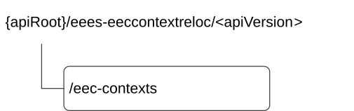

# 8.7 Eees_EECContextRelocation API

## 8.7.1 API URI

The Eees_EECContextRelocation service shall use the Eees_EECContextRelocation API.

The request URIs used in HTTP requests shall have the Resource URI structure as defined in clause 7.5 with the following clarifications:

\- The \<apiName\> shall be "eees-eeccontextreloc".

\- The \<apiVersion\> shall be "v1".

\- The \<apiSpecificResourceUriPart\> shall be set as described in clause 8.7.2.

## 8.7.1A Usage of HTTP

The provisions of clause 5.2.2 of 3GPP TS 29.122 \[6\] shall apply for the Eees_EECContextRelocation API.

## 8.7.2 Resources

### 8.7.2.1 Overview

This clause describes the structure for the Resource URIs and the resources and methods used for the service.

Figure 8.7.2.1-1 depicts the resource URIs structure for the Eees_EECContextRelocation API.

Figure 8.7.2.1-1: Resource URI structure of the Eees_EECContextRelocation API

Table 8.7.2.1-1 provides an overview of the resources and applicable HTTP methods.

Table 8.7.2.1-1: Resources and methods overview

| Resource name | Resource URI  | HTTP method or custom operation | Description                       |
|---------------|---------------|---------------------------------|-----------------------------------|
| EEC Contexts  | /eec-contexts | GET                             | Pull the EEC Context information. |
|               |               | POST                            | Push the EEC Context information. |

### 8.7.2.2 Resource: EEC Contexts

#### 8.7.2.2.1 Description

This resource represents the collection of EEC Contexts managed by the EES.

#### 8.7.2.2.2 Resource Definition

Resource URI: **{apiRoot}/eees-eeccontextreloc/\<apiVersion\>/eec-contexts**

This resource shall support the resource URI variables defined in the table 8.7.2.2.2-1.

Table 8.7.2.2.2-1: Resource URI variables for this resource

| Name    | Data Type | Definition     |
|---------|-----------|----------------|
| apiRoot | string    | See clause 7.5 |

#### 8.7.2.2.3 Resource Standard Methods

##### 8.7.2.2.3.1 GET

This method allows a service consumer to pull the EEC Context information from the EES.

This method shall support the URI query parameters specified in table 8.7.2.2.3.1-1.

Table 8.7.2.2.3.1-1: URI query parameters supported by the GET method on this resource

<table>
<colgroup>
<col style="width: 14%" />
<col style="width: 21%" />
<col style="width: 4%" />
<col style="width: 12%" />
<col style="width: 47%" />
</colgroup>
<tbody>
<tr class="odd">
<td>Name</td>
<td>Data type</td>
<td>P</td>
<td>Cardinality</td>
<td>Description</td>
</tr>
<tr class="even">
<td>ees-id</td>
<td>string</td>
<td>M</td>
<td>1</td>
<td>The identifier of the requesting entity (e.g., T-EES, CES).</td>
</tr>
<tr class="odd">
<td>eec-cntx-id</td>
<td>string</td>
<td>M</td>
<td>1</td>
<td>Unique identifier of the EEC Context to authorize the transfer.</td>
</tr>
<tr class="even">
<td>sess-cntxs</td>
<td>SessionContexts</td>
<td>O</td>
<td>0..1</td>
<td>
List of service session context information being requested.

(NOTE)
</td>
</tr>
<tr class="odd">
<td colspan="5">NOTE: Within each array element of the "sessCntxs" attribute (encoded using the IndividualSessionContext data structure) provided within this query parameter, the "acId" and "acrList" attributes shall not be applicable.</td>
</tr>
</tbody>
</table>

This method shall support the request data structures specified in table 8.7.2.2.3.1-2 and the response data structures and response codes specified in table 8.7.2.2.3.1-3.

Table 8.7.2.2.3.1-2: Data structures supported by the GET Request Body on this resource

|           |     |             |             |
|-----------|-----|-------------|-------------|
| Data type | P   | Cardinality | Description |
| n/a       |     |             |             |

Table 8.7.2.2.3.1-3: Data structures supported by the GET Response Body on this resource

<table>
<colgroup>
<col style="width: 16%" />
<col style="width: 9%" />
<col style="width: 14%" />
<col style="width: 19%" />
<col style="width: 39%" />
</colgroup>
<tbody>
<tr class="odd">
<td>Data type</td>
<td>P</td>
<td>Cardinality</td>
<td>
Response

codes
</td>
<td>Description</td>
</tr>
<tr class="even">
<td>EECContext</td>
<td>M</td>
<td>1</td>
<td>200 OK</td>
<td>Successful case. The EEC context information matching the query parameters in the request is returned.</td>
</tr>
<tr class="odd">
<td colspan="5">NOTE: The mandatory HTTP error status codes for the HTTP GET method listed in Table 5.2.6-1 of 3GPP TS 29.122 [6] shall also apply.</td>
</tr>
</tbody>
</table>

##### 8.7.2.2.3.2 POST

This method allows a service consumer to push the EEC Context to the EES.

This method shall support the URI query parameters specified in table 8.7.2.2.3.2-1.

Table 8.7.2.2.3.2-1: URI query parameters supported by the POST method on this resource

|      |           |     |             |             |
|------|-----------|-----|-------------|-------------|
| Name | Data type | P   | Cardinality | Description |
| n/a  |           |     |             |             |

This method shall support the request data structures specified in table 8.7.2.2.3.2-2 and the response data structures and response codes specified in table 8.7.2.2.3.2-3.

Table 8.7.2.2.3.2-2: Data structures supported by the POST Request Body on this resource

|                |     |             |                                                      |
|----------------|-----|-------------|------------------------------------------------------|
| Data type      | P   | Cardinality | Description                                          |
| EECContextPush | M   | 1           | Represents the EEC Context information to be pushed. |

Table 8.7.2.2.3.2-3: Data structures supported by the POST Response Body on this resource

<table>
<colgroup>
<col style="width: 16%" />
<col style="width: 9%" />
<col style="width: 14%" />
<col style="width: 19%" />
<col style="width: 39%" />
</colgroup>
<tbody>
<tr class="odd">
<td>Data type</td>
<td>P</td>
<td>Cardinality</td>
<td>
Response

codes
</td>
<td>Description</td>
</tr>
<tr class="even">
<td>n/a</td>
<td></td>
<td></td>
<td>204 No Content</td>
<td>Successful case. The EEC context information is successfully pushed to the EES, and no content is returned in the response body.</td>
</tr>
<tr class="odd">
<td>EECContextPushRes</td>
<td>M</td>
<td>1</td>
<td>200 OK</td>
<td>Successful case. The EEC context information is successfully pushed to the EES and related information is returned in the response body.</td>
</tr>
<tr class="even">
<td colspan="5">NOTE: The mandatory HTTP error status codes for the HTTP POST method listed in Table 5.2.6-1 of 3GPP TS 29.122 [6] shall also apply.</td>
</tr>
</tbody>
</table>

#### 8.7.2.2.4 Resource Custom Operations

There are no resource custom operations defined for this API in this release of the specification.

## 8.7.3 Custom Operations without associated resources

There are no custom Operations without associated resources defined for this API in this release of the specification.

## 8.7.4 Notifications

There are no notifications defined for this API in this release of the specification.

## 8.7.5 Data Model

### 8.7.5.1 General

This clause specifies the application data model supported by the API. Data types listed in clause 7.2 apply to this API

Table 8.7.5.1-1 specifies the data types defined specifically for the Eees_EECContextRelocation API service.

Table 8.7.5.1-1: Eees_EECContextRelocation API specific Data Types

| Data type                | Section defined | Description                                                                            | Applicability |
|--------------------------|-----------------|----------------------------------------------------------------------------------------|---------------|
| EECContext               | 8.7.5.2.5       | To represent the EEC context information to be relocated.                              |               |
| EECContextPush           | 8.7.5.2.4       | To represent the EEC context information to be pushed.                                 |               |
| EECContextPushRes        | 8.7.5.2.6       | Represents the EEC context push relocation response.                                   |               |
| EECSrvContinuitySupport  | 8.7.5.2.8       | Represents the EEC service continuity support and the supported ACR scenarios.         |               |
| ImplicitRegDetails       | 8.7.5.2.7       | Represents the EEC implicit registration information.                                  |               |
| IndividualSessionContext | 8.7.5.2.3       | To represent single Service session context information.                               |               |
| SessionContexts          | 8.7.5.2.2       | To represent the Service session contexts information in the EEC context pull request. |               |

Table 8.7.5.1-2 specifies data types re-used by the Eees_EECContextRelocation API from other specifications, including a reference to their respective specifications and when needed, a short description of their use within the Eees_EECContextRelocation API.

Table 8.7.5.1-2: Eees_EECContextRelocation API re-used Data Types

| Data type      | Reference             | Comments                                                          | Applicability |
|----------------|-----------------------|-------------------------------------------------------------------|---------------|
| EndPoint       | 8.1.5.2.5             | To represent the end point information of an entity.              |               |
| ACProfile      | 3GPP TS 24.558 \[14\] | Represents the application clients profiles in EEC context.       |               |
| ACRScenario    | 9.1.5.3.3             | Represents the ACR scenarios.                                     | EdgeApp_2     |
| Gpsi           | 3GPP TS 29.571 \[8\]  | Represents the identifier of a UE in GPSI format.                 |               |
| LocationArea5G | 3GPP TS 29.122 \[6\]  | Represents the location information of the UE in the EEC context. |               |
| DateTime       | 3GPP TS 29.122 \[6\]  | Represents a date and a time.                                     |               |

### 8.7.5.2 Structured data types

#### 8.7.5.2.1 Introduction

The data type for the Eees_EECContextRelocation API are defined in the clauses below.

#### 8.7.5.2.2 Type: SessionContexts

Table 8.7.5.2.2-1: Definition of type SessionContexts

| Attribute name | Data type                       | P   | Cardinality | Description                                               | Applicability |
|----------------|---------------------------------|-----|-------------|-----------------------------------------------------------|---------------|
| sessCntxs      | array(IndividualSessionContext) | M   | 1..N        | Contains the list of service session context information. |               |

#### 8.7.5.2.3 Type: IndividualSessionContext

Table 8.7.5.2.3-1: Definition of type IndividualSessionContext

| Attribute name | Data type          | P   | Cardinality | Description                                                                                                                          | Applicability |
|----------------|--------------------|-----|-------------|--------------------------------------------------------------------------------------------------------------------------------------|---------------|
| easId          | string             | M   | 1           | Contains the application identifier (e.g., URI, FQDN) of the Application Server (e.g., EAS, CAS) providing the application services. |               |
| endPt          | EndPoint           | M   | 1           | Contains the end point information of the Application Server provided within the "easId" attribute.                                  |               |
| acId           | string             | O   | 0..1        | Contains the identifier of the AC for which the service session information is provided.                                             |               |
| acrList        | array(ACRScenario) | O   | 1..N        | Contains the list of the selected ACR scenario(s).                                                                                   | EdgeApp_2     |
| eecId          | string             | O   | 0..1        | Contains the identifier of the EEC.                                                                                                  | enNB1         |
| appGrpId       | string             | O   | 0..1        | Contains the application group identifier.                                                                                           | EdgeApp_3     |

#### 8.7.5.2.4 Type: EECContextPush

Table 8.7.5.2.4-1: Definition of type EECContextPush

<table>
<colgroup>
<col style="width: 13%" />
<col style="width: 12%" />
<col style="width: 4%" />
<col style="width: 14%" />
<col style="width: 35%" />
<col style="width: 20%" />
</colgroup>
<thead>
<tr class="header">
<th>Attribute name</th>
<th>Data type</th>
<th>P</th>
<th>Cardinality</th>
<th>Description</th>
<th>Applicability</th>
</tr>
</thead>
<tbody>
<tr class="odd">
<td>eesId</td>
<td>string</td>
<td>M</td>
<td>1</td>
<td>Contains the identifier of the requesting entity (e.g., S-EES, CES) pushing the EEC context.</td>
<td></td>
</tr>
<tr class="even">
<td>eecCntx</td>
<td>EECContext</td>
<td>M</td>
<td>1</td>
<td>Contains the EEC Context to be relocated.</td>
<td></td>
</tr>
<tr class="odd">
<td>tgtEas</td>
<td>EndPoint</td>
<td>O</td>
<td>0..1</td>
<td>Contains the endpoint information of the selected Application Server (e.g., T-EAS, CAS).</td>
<td>EdgeApp_2</td>
</tr>
<tr class="even">
<td>acrScenariosSelReq</td>
<td>boolean</td>
<td>O</td>
<td>0..1</td>
<td>
Contains the ACR scenarios selection request.

- When set to "true", this attribute indicates to the EES to select the ACR scenarios list.

- When set to "false", this attribute indicates to the EES not to select the ACR scenarios list.

- The default value when this attribute is omitted is "false".
</td>
<td>EdgeApp_2</td>
</tr>
<tr class="odd">
<td>eecCntxs</td>
<td>array(EECContext)</td>
<td>C</td>
<td>1..N</td>
<td>Contains the list of the additional EEC Context(s) to be relocated.</td>
<td>EdgeApp_3</td>
</tr>
</tbody>
</table>

#### 8.7.5.2.5 Type: EECContext

Table 8.7.5.2.5-1: Definition of type EECContext

<table>
<colgroup>
<col style="width: 13%" />
<col style="width: 12%" />
<col style="width: 4%" />
<col style="width: 14%" />
<col style="width: 35%" />
<col style="width: 20%" />
</colgroup>
<thead>
<tr class="header">
<th>Attribute name</th>
<th>Data type</th>
<th>P</th>
<th>Cardinality</th>
<th>Description</th>
<th>Applicability</th>
</tr>
</thead>
<tbody>
<tr class="odd">
<td>eecId</td>
<td>string</td>
<td>M</td>
<td>1</td>
<td>Contains the unique identifier of the EEC</td>
<td></td>
</tr>
<tr class="even">
<td>cntxId</td>
<td>string</td>
<td>M</td>
<td>1</td>
<td>Contains the unique identifier assigned to the EEC Context</td>
<td></td>
</tr>
<tr class="odd">
<td>ueId</td>
<td>Gpsi</td>
<td>O</td>
<td>0..1</td>
<td>Contains the identifier of the UE hosting the EEC.</td>
<td></td>
</tr>
<tr class="even">
<td>e1Subs</td>
<td>array(string)</td>
<td>O</td>
<td>1..N</td>
<td>Contains the list of subscription IDs for the capability exposure for the EEC ID.</td>
<td></td>
</tr>
<tr class="odd">
<td>ueLoc</td>
<td>LocationArea5G</td>
<td>O</td>
<td>0..1</td>
<td>Contains the latest available location information of the UE hosting the EEC.</td>
<td></td>
</tr>
<tr class="even">
<td>acProfs</td>
<td>array(ACProfile)</td>
<td>O</td>
<td>1..N</td>
<td>Contains the list of ACs profiles.</td>
<td></td>
</tr>
<tr class="odd">
<td>sessCntxs</td>
<td>SessionContexts</td>
<td>O</td>
<td>0..1</td>
<td>
Contains the list of associated Service Session Contexts.

(NOTE)
</td>
<td></td>
</tr>
<tr class="even">
<td>eecSrvContSupp</td>
<td>EECSrvContinuitySupport</td>
<td>O</td>
<td>0..1</td>
<td>Represents the service continuity support related information.</td>
<td>EdgeApp_2</td>
</tr>
<tr class="odd">
<td>ueMobSuppInd</td>
<td>boolean</td>
<td>O</td>
<td>0..1</td>
<td>
Contains the UE Mobility Support indication.

- When set to "true", this attribute indicates that UE Mobility Support is required.

- When set to "false" or omitted, this attribute indicates that UE Mobility Support is not required.

- The default value when this attribute is omitted is "false".
</td>
<td>EdgeApp_2</td>
</tr>
<tr class="even">
<td colspan="6">NOTE: Within each array element of the "sessCntxs" attribute (encoded using the IndividualSessionContext data structure) provided within this attribute, the "eecId" attribute shall not be applicable.</td>
</tr>
</tbody>
</table>

#### 8.7.5.2.6 Type: EECContextPushRes

Table 8.7.5.2.6-1: Definition of type EECContextPushRes

<table>
<colgroup>
<col style="width: 13%" />
<col style="width: 12%" />
<col style="width: 4%" />
<col style="width: 14%" />
<col style="width: 35%" />
<col style="width: 20%" />
</colgroup>
<thead>
<tr class="header">
<th>Attribute name</th>
<th>Data type</th>
<th>P</th>
<th>Cardinality</th>
<th>Description</th>
<th>Applicability</th>
</tr>
</thead>
<tbody>
<tr class="odd">
<td>implReg</td>
<td>ImplicitRegDetails</td>
<td>C</td>
<td>0..1</td>
<td>
Contains implicit registration details.

(NOTE)
</td>
<td></td>
</tr>
<tr class="even">
<td>selAcrScenariosList</td>
<td>array(ACRScenario)</td>
<td>O</td>
<td>1..N</td>
<td>Contains the list of ACR scenarios selected by the EES.</td>
<td>EdgeApp_2</td>
</tr>
<tr class="odd">
<td colspan="6">NOTE: This attribute shall be included if the EES has performed implicit registration of the EEC.</td>
</tr>
</tbody>
</table>

#### 8.7.5.2.7 Type: ImplicitRegDetails

Table 8.7.5.2.7-1: Definition of type ImplicitRegDetails

| Attribute name | Data type | P   | Cardinality | Description                                                                                                                      | Applicability |
|----------------|-----------|-----|-------------|----------------------------------------------------------------------------------------------------------------------------------|---------------|
| regId          | string    | M   | 1           | Represents the registration ID of the EEC whose EEC context is pushed                                                            |               |
| expTime        | DateTime  | O   | 0..1        | Represents the expiration time of the registration. If absent, then it indicates that the registration of the EEC never expires. |               |

#### 8.7.5.2.8 Type: EECSrvContinuitySupport

Table 8.7.5.2.8-1: Definition of type EECSrvContinuitySupport

<table>
<colgroup>
<col style="width: 13%" />
<col style="width: 12%" />
<col style="width: 4%" />
<col style="width: 14%" />
<col style="width: 35%" />
<col style="width: 20%" />
</colgroup>
<thead>
<tr class="header">
<th>Attribute name</th>
<th>Data type</th>
<th>P</th>
<th>Cardinality</th>
<th>Description</th>
<th>Applicability</th>
</tr>
</thead>
<tbody>
<tr class="odd">
<td>srvContSupp</td>
<td>boolean</td>
<td>M</td>
<td>1</td>
<td>
This attribute is to indicate EEC service continuity support.

When set to "true", this attribute indicates

EEC supports service continuity.

When set to "false", this attribute indicates EEC does not support service continuity.
</td>
<td></td>
</tr>
<tr class="even">
<td>acrScenarios</td>
<td>array(ACRScenario)</td>
<td>C</td>
<td>1..N</td>
<td>
This attribute indicates the list of ACR scenarios supported by the EEC.

This attribute shall be present only when the "srvContSupp" attribute is set to "true".
</td>
<td></td>
</tr>
</tbody>
</table>

### 8.7.5.3 Simple data types and enumerations

#### 8.7.5.3.1 Introduction

This clause defines simple data types and enumerations that can be referenced from data structures defined in the previous clauses.

#### 8.7.5.3.2 Simple data types

The simple data types defined in table 8.7.5.3.2-1 shall be supported.

Table 8.7.5.3.2-1: Simple data types

|           |                 |             |               |
|-----------|-----------------|-------------|---------------|
| Type Name | Type Definition | Description | Applicability |
|           |                 |             |               |

### 8.7.5.4 Data types describing alternative data types or combinations of data types

There are no data types describing alternative data types or combinations of data types defined for this API in this release of the specification.

### 8.7.5.5 Binary data

#### 8.7.5.5.1 Binary Data Types

Table 8.7.5.5.1-1: Binary Data Types

| Name | Clause defined | Content type |
|------|----------------|--------------|
|      |                |              |

## 8.7.6 Error Handling

### 8.7.6.1 General

For the Eees_EECContextRelocation API, HTTP error responses shall be supported as specified in clause 5.2.6 of 3GPP TS 29.122 \[6\]. Protocol errors and application errors specified in clause 5.2.6 of 3GPP TS 29.122 \[6\] shall be supported for the HTTP status codes specified in table 5.2.6-1 of 3GPP TS 29.122 \[6\].

In addition, the requirements in the following clauses are applicable for the Eees_EECContextRelocation API.

### 8.7.6.2 Protocol Errors

No specific protocol errors for the Eees_EECContextRelocation API are specified.

### 8.7.6.3 Application Errors

The application errors defined for the Eees_EECContextRelocation API are listed in Table 8.7.6.3-1.

Table 8.7.6.3-1: Application errors

| Application Error | HTTP status code | Description | Applicability |
|-------------------|------------------|-------------|---------------|
|                   |                  |             |               |

## 8.7.7 Feature negotiation

General feature negotiation procedures are defined in clause 7.8. Table 8.7.7-1 lists the supported features for Eees_EECContextRelocation API.

Table 8.7.7-1: Supported Features

<table>
<colgroup>
<col style="width: 16%" />
<col style="width: 23%" />
<col style="width: 60%" />
</colgroup>
<thead>
<tr class="header">
<th>Feature number</th>
<th>Feature Name</th>
<th>Description</th>
</tr>
</thead>
<tbody>
<tr class="odd">
<td>1</td>
<td>EdgeApp_2</td>
<td>
This feature indicates the support of the phase 2 of the definition of EDGE applications support.

Within this feature, the following enhancements are covered:

- Support the "ACR Selection" event subscription and reporting.
</td>
</tr>
<tr class="even">
<td>2</td>
<td>enNB1</td>
<td>
This feature indicates the support of the enhancements of this application layer API.

Within this feature, the following enhancements are covered:

- Support the the EEC ID within the IndividualSessionContext data type.
</td>
</tr>
<tr class="odd">
<td>3</td>
<td>EdgeApp_3</td>
<td>
This feature indicates the support of the second set of enhancements to the Edge Applications Enabler Layer.

Within this feature, the following enhancements are covered:

- Support the application group identifier within the IndividualSessionContext data type.

- Support more than one element of the EEC Context(s) to be relocated within EECContextPush data type.
</td>
</tr>
</tbody>
</table>
