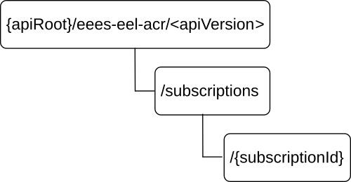

# 8.8.3 Resources

## 8.8.3.1 Overview

This clause describes the structure for the Resource URIs and the resources and methods used for the service.

Figure 8.8.3.1-1 depicts the resource URIs structure for the Eees_EELManagedACR API.

Figure 8.8.3.1-1: Resource URIs structure of the Eees_EELManagedACR API

Table 8.8.3.1-1 provides an overview of the resources and applicable HTTP methods for the Eees_EELManagedACR API.

Table 8.8.3.1-1: Resources and methods overview

| Resource name                      | Resource URI                    | HTTP method or custom operation | Description                                                                                                 |
|------------------------------------|---------------------------------|---------------------------------|-------------------------------------------------------------------------------------------------------------|
| ACT Status Subscriptions           | /subscriptions                  | GET                             | Retrieve all the active ACT Status Subscription resources managed by the EES.                               |
|                                    |                                 | POST                            | Request the creation of a subscription to ACT status reporting during an EEL Managed ACR.                   |
| Individual ACT Status Subscription | /subscriptions/{subscriptionId} | GET                             | Retrieve an Individual ACT Status Subscription resource identified by the provided subscription identifier. |

## 8.8.3.2 Resource: ACT Status Subscriptions

### 8.8.3.2.1 Description

This resource represents the collection of ACT Status Subscriptions managed by the EES.

### 8.8.3.2.2 Resource Definition

Resource URI: **{apiRoot}/eees-eel-acr/\<apiVersion\>/subscriptions**

This resource shall support the resource URI variables defined in table 8.8.3.2.2-1.

Table 8.8.3.2.2-1: Resource URI variables for this resource

| Name    | Data type | Definition                                |
|---------|-----------|-------------------------------------------|
| apiRoot | string    | See clause 5.2.4 of 3GPP TS 29.122 \[6\]. |

### 8.8.3.2.3 Resource Standard Methods

The following clauses specify the standard methods supported by the resource.

#### 8.8.3.2.3.1 GET

The GET method allows a service consumer to retrieve all the active ACT Status Subscriptions managed by the EES.This method shall support the URI query parameters specified in table 8.8.3.2.3.1-1.

Table 8.8.3.2.3.1-1: URI query parameters supported by the GET method on this resource

|      |           |     |             |             |               |
|------|-----------|-----|-------------|-------------|---------------|
| Name | Data type | P   | Cardinality | Description | Applicability |
| n/a  |           |     |             |             |               |

This method shall support the request data structures specified in table 8.8.3.2.3.1-2 and the response data structures and response codes specified in table 8.8.3.2.3.1-3.

Table 8.8.3.2.3.1-2: Data structures supported by the GET Request Body on this resource

|           |     |             |             |
|-----------|-----|-------------|-------------|
| Data type | P   | Cardinality | Description |
| n/a       |     |             |             |

Table 8.8.3.2.3.1-3: Data structures supported by the GET Response Body on this resource

<table>
<colgroup>
<col style="width: 20%" />
<col style="width: 4%" />
<col style="width: 11%" />
<col style="width: 11%" />
<col style="width: 51%" />
</colgroup>
<tbody>
<tr class="odd">
<td>Data type</td>
<td>P</td>
<td>Cardinality</td>
<td>
Response

codes
</td>
<td>Description</td>
</tr>
<tr class="even">
<td>array(ACTStatusSubsc)</td>
<td>M</td>
<td>0..N</td>
<td>200 OK</td>
<td>Successful case. All the active ACT Status Subscriptions managed by the EES are returned.</td>
</tr>
<tr class="odd">
<td>n/a</td>
<td></td>
<td></td>
<td>307 Temporary Redirect</td>
<td>
Temporary redirection. The response shall include a Location header field containing an alternative URI of the resource located in an alternative EES.

Redirection handling is described in clause 5.2.10 of 3GPP TS 29.122 [6].
</td>
</tr>
<tr class="even">
<td>n/a</td>
<td></td>
<td></td>
<td>308 Permanent Redirect</td>
<td>
Permanent redirection. The response shall include a Location header field containing an alternative URI of the resource located in an alternative EES.

Redirection handling is described in clause 5.2.10 of 3GPP TS 29.122 [6].
</td>
</tr>
<tr class="odd">
<td colspan="5">NOTE: The mandatory HTTP error status code for the HTTP GET method listed in table 5.2.6-1 of 3GPP TS 29.122 [6] also apply.</td>
</tr>
</tbody>
</table>

Table 8.8.3.2.3.1-4: Headers supported by the 307 Response Code on this resource

|          |           |     |             |                                                                   |
|----------|-----------|-----|-------------|-------------------------------------------------------------------|
| Name     | Data type | P   | Cardinality | Description                                                       |
| Location | string    | M   | 1           | An alternative URI of the resource located in an alternative EES. |

Table 8.8.3.2.3.1-5: Headers supported by the 308 Response Code on this resource

|          |           |     |             |                                                                   |
|----------|-----------|-----|-------------|-------------------------------------------------------------------|
| Name     | Data type | P   | Cardinality | Description                                                       |
| Location | string    | M   | 1           | An alternative URI of the resource located in an alternative EES. |

#### 8.8.3.2.3.2 POST

The POST method allows a service consumer to request the creation of a subscription to ACT status reporting at the EES. This method shall support the URI query parameters specified in table 8.8.3.2.3.2-1.

Table 8.8.3.2.3.2-1: URI query parameters supported by the POST method on this resource

|      |           |     |             |             |               |
|------|-----------|-----|-------------|-------------|---------------|
| Name | Data type | P   | Cardinality | Description | Applicability |
| n/a  |           |     |             |             |               |

This method shall support the request data structures specified in table 8.8.3.2.3.2-2 and the response data structures and response codes specified in table 8.8.3.2.3.2-3.

Table 8.8.3.2.3.2-2: Data structures supported by the POST Request Body on this resource

|                |     |             |                                                                                              |
|----------------|-----|-------------|----------------------------------------------------------------------------------------------|
| Data type      | P   | Cardinality | Description                                                                                  |
| ACTStatusSubsc | M   | 1           | Represents the parameters to request the creation of a subscription to ACT status reporting. |

Table 8.8.3.2.3.2-3: Data structures supported by the POST Response Body on this resource

<table>
<colgroup>
<col style="width: 19%" />
<col style="width: 4%" />
<col style="width: 11%" />
<col style="width: 13%" />
<col style="width: 51%" />
</colgroup>
<tbody>
<tr class="odd">
<td>Data type</td>
<td>P</td>
<td>Cardinality</td>
<td>
Response

codes
</td>
<td>Description</td>
</tr>
<tr class="even">
<td>ACTStatusSubsc</td>
<td>M</td>
<td>1</td>
<td>201 Created</td>
<td>
Successful case. The subscription is successfully created and a representation of the created Individual ACT Status Subscription resource is returned.

An HTTP "Location" header that contains the resource URI of the created Individual ACT Status Subscription resource shall also be included.
</td>
</tr>
<tr class="odd">
<td colspan="5">NOTE: The mandatory HTTP error status code for the HTTP POST method listed in table 5.2.6-1 of 3GPP TS 29.122 [6] also apply.</td>
</tr>
</tbody>
</table>

Table 8.8.3.2.3.2-4: Headers supported by the 201 Response Code on this resource

|          |           |     |             |                                                                                                                                                  |
|----------|-----------|-----|-------------|--------------------------------------------------------------------------------------------------------------------------------------------------|
| Name     | Data type | P   | Cardinality | Description                                                                                                                                      |
| Location | string    | M   | 1           | Contains the URI of the newly created resource, according to the structure: {apiRoot}/eees-eel-act/\<apiVersion\>/subscriptions/{subscriptionId} |

### 8.8.3.2.4 Resource Custom Operations

There are no resource custom operations defined for this resource in this release of the specification.

## 8.8.3.3 Resource: Individual ACT Status Subscription

### 8.8.3.3.1 Description

This resource represents an Individual ACT Status subscription managed by the EES.

### 8.8.3.3.2 Resource Definition

Resource URI: **{apiRoot}/eees-eel-acr/\<apiVersion\>/subscriptions/{subscriptionId}**

This resource shall support the resource URI variables defined in table 8.8.3.3.2-1.

Table 8.8.3.3.2-1: Resource URI variables for this resource

| Name           | Data type | Definition                                |
|----------------|-----------|-------------------------------------------|
| apiRoot        | string    | See clause 5.2.4 of 3GPP TS 29.122 \[6\]. |
| subscriptionId | string    | Represents the subscription identifier.   |

### 8.8.3.3.3 Resource Standard Methods

The following clauses specify the standard methods supported by the resource.

#### 8.8.3.3.3.1 GET

The GET method allows a service consumer to retrieve an ACT status subscription identified by the subscription identifier included in the request URI (i.e. within the "/{subscriptionId}" path segment).This method shall support the URI query parameters specified in table 8.8.3.3.3.1-1.

Table 8.8.3.3.3.1-1: URI query parameters supported by the GET method on this resource

|      |           |     |             |             |               |
|------|-----------|-----|-------------|-------------|---------------|
| Name | Data type | P   | Cardinality | Description | Applicability |
| n/a  |           |     |             |             |               |

This method shall support the request data structures specified in table 8.8.3.3.3.1-2 and the response data structures and response codes specified in table 8.8.3.3.3.1-3.

Table 8.8.3.3.3.1-2: Data structures supported by the GET Request Body on this resource

|           |     |             |             |
|-----------|-----|-------------|-------------|
| Data type | P   | Cardinality | Description |
| n/a       |     |             |             |

Table 8.8.3.3.3.1-3: Data structures supported by the GET Response Body on this resource

<table>
<colgroup>
<col style="width: 19%" />
<col style="width: 4%" />
<col style="width: 11%" />
<col style="width: 11%" />
<col style="width: 52%" />
</colgroup>
<tbody>
<tr class="odd">
<td>Data type</td>
<td>P</td>
<td>Cardinality</td>
<td>
Response

codes
</td>
<td>Description</td>
</tr>
<tr class="even">
<td>ACTStatusSubsc</td>
<td>M</td>
<td>1</td>
<td>200 OK</td>
<td>Successful case. The requested Individual ACT Status Subscription resource is returned.</td>
</tr>
<tr class="odd">
<td>n/a</td>
<td></td>
<td></td>
<td>307 Temporary Redirect</td>
<td>
Temporary redirection. The response shall include a Location header field containing an alternative URI of the resource located in an alternative EES.

Redirection handling is described in clause 5.2.10 of 3GPP TS 29.122 [6].
</td>
</tr>
<tr class="even">
<td>n/a</td>
<td></td>
<td></td>
<td>308 Permanent Redirect</td>
<td>
Permanent redirection. The response shall include a Location header field containing an alternative URI of the resource located in an alternative EES.

Redirection handling is described in clause 5.2.10 of 3GPP TS 29.122 [6].
</td>
</tr>
<tr class="odd">
<td colspan="5">NOTE: The manadatory HTTP error status code for the HTTP GET method listed in table 5.2.6-1 of 3GPP TS 29.122 [6] also apply.</td>
</tr>
</tbody>
</table>

Table 8.8.3.3.3.1-4: Headers supported by the 307 Response Code on this resource

|          |           |     |             |                                                                   |
|----------|-----------|-----|-------------|-------------------------------------------------------------------|
| Name     | Data type | P   | Cardinality | Description                                                       |
| Location | string    | M   | 1           | An alternative URI of the resource located in an alternative EES. |

Table 8.8.3.3.3.1-5: Headers supported by the 308 Response Code on this resource

|          |           |     |             |                                                                   |
|----------|-----------|-----|-------------|-------------------------------------------------------------------|
| Name     | Data type | P   | Cardinality | Description                                                       |
| Location | string    | M   | 1           | An alternative URI of the resource located in an alternative EES. |

### 8.8.3.3.4 Resource Custom Operations

There are no resource custom operations defined for this resource in this release of the specification.
