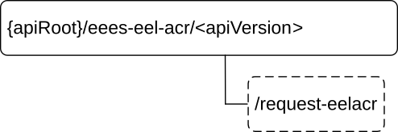

# 8.8.4 Custom Operations without associated resources

## 8.8.4.1 Overview

The structure of the custom operation URIs of the Eees_EELManagedACR API is shown in Figure 8.8.4.1-1.

Figure 8.8.4.1-1: Custom operation URI structure of the Eees_EELManagedACR API

Table 8.8.4.1-1 provides an overview of the custom operations and applicable HTTP methods defined for the Eees_EELManagedACR API.

Table 8.8.4.1-1: Custom operations without associated resources

| Operation name       | Custom operation URI | Mapped HTTP method | Description                                                                           |
|----------------------|----------------------|--------------------|---------------------------------------------------------------------------------------|
| RequestEELManagedACR | /request-eelacr      | POST               | Enables a service consumer to request the EES to handle all the operations of an ACR. |

## 8.8.4.2 Operation: RequestEELManagedACR

### 8.8.4.2.1 Description

The custom operation enables a service consumer to request the EES to handle all the operations of an ACR.

### 8.8.4.2.2 Operation Definition

This operation shall support the request data structures and the response data structures and response codes specified in tables 8.8.4.2.2-1 and 8.8.4.2.2-2.

Table 8.8.4.2.2-1: Data structures supported by the POST Request Body on this resource

|           |     |             |                                                                                    |
|-----------|-----|-------------|------------------------------------------------------------------------------------|
| Data type | P   | Cardinality | Description                                                                        |
| EELACRReq | M   | 1           | Parameters to request the EES (i.e. S-EES) to handle all the operations of an ACR. |

Table 8.8.4.2.2-2: Data structures supported by the POST Response Body on this resource

<table>
<colgroup>
<col style="width: 16%" />
<col style="width: 4%" />
<col style="width: 12%" />
<col style="width: 11%" />
<col style="width: 54%" />
</colgroup>
<tbody>
<tr class="odd">
<td>Data type</td>
<td>P</td>
<td>Cardinality</td>
<td>
Response

codes
</td>
<td>Description</td>
</tr>
<tr class="even">
<td>EELACRResp</td>
<td>M</td>
<td>1</td>
<td>200 OK</td>
<td>
The requested EEL Managed ACR initiation was successfully received and processed.

The response body contains the feedback of the EES.
</td>
</tr>
<tr class="odd">
<td>n/a</td>
<td></td>
<td></td>
<td>307 Temporary Redirect</td>
<td>
Temporary redirection. The response shall include a Location header field containing an alternative target URI located in an alternative EES.

Redirection handling is described in clause 5.2.10 of 3GPP TS 29.122 [6].
</td>
</tr>
<tr class="even">
<td>n/a</td>
<td></td>
<td></td>
<td>308 Permanent Redirect</td>
<td>
Permanent redirection. The response shall include a Location header field containing an alternative target URI located in an alternative EES.

Redirection handling is described in clause 5.2.10 of 3GPP TS 29.122 [6]
</td>
</tr>
<tr class="odd">
<td colspan="5">NOTE: The manadatory HTTP error status code for the HTTP POST method listed in Table 5.2.6-1 of 3GPP TS 29.122 [6] also apply.</td>
</tr>
</tbody>
</table>

Table 8.8.4.2.2-3: Headers supported by the 307 Response Code on this resource

|          |           |     |             |                                                          |
|----------|-----------|-----|-------------|----------------------------------------------------------|
| Name     | Data type | P   | Cardinality | Description                                              |
| Location | string    | M   | 1           | An alternative target URI located in an alternative EES. |

Table 8.8.4.2.2-4: Headers supported by the 308 Response Code on this resource

|          |           |     |             |                                                          |
|----------|-----------|-----|-------------|----------------------------------------------------------|
| Name     | Data type | P   | Cardinality | Description                                              |
| Location | string    | M   | 1           | An alternative target URI located in an alternative EES. |
