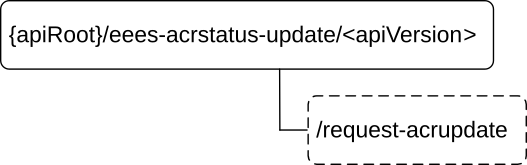

# 8.9 Eees_ACRStatusUpdate API

## 8.9.1 Introduction

The Eees_ACRStatusUpdate service shall use the Eees_ACRStatusUpdate API.

The API URI of the Eees_ACRStatusUpdate API shall be:

**{apiRoot}/\<apiName\>/\<apiVersion\>**

The request URIs used in HTTP requests shall have the Resource URI structure defined in clause 5.2.4 of 3GPP TS 29.122 \[6\], i.e.:

**{apiRoot}/\<apiName\>/\<apiVersion\>/\<apiSpecificSuffixes\>**

with the following components:

\- The {apiRoot} shall be set as described in clause 5.2.4 of 3GPP TS 29.122 \[6\].

\- The \<apiName\> shall be "eees-acrstatus-update".

\- The \<apiVersion\> shall be "v1".

\- The \<apiSpecificSuffixes\> shall be set as described in clause 5.2.4 of 3GPP TS 29.122 \[6\].

## 8.9.2 Usage of HTTP

The provisions of clause 5.2.2 of 3GPP TS 29.122 \[6\] shall apply for the Eees_ACRStatusUpdate API.

## 8.9.3 Resources

There are no resources defined for this API in this release of the specification.

## 8.9.4 Custom Operations without associated resources

### 8.9.4.1 Overview

The structure of the custom operation URIs of the Eees_ACRStatusUpdate API is shown in Figure 8.9.4.1-1.

Figure 8.9.4.1-1: Custom operation URI structure of the Eees_ACRStatusUpdate API

Table 8.9.4.1-1 provides an overview of the custom operations and applicable HTTP methods defined for the Eees_ACRStatusUpdate API.

Table 8.9.4.1-1: Custom operations without associated resources

| Operation name   | Custom operation URI | Mapped HTTP method | Description                                                                                                                                               |
|------------------|----------------------|--------------------|-----------------------------------------------------------------------------------------------------------------------------------------------------------|
| RequestACRUpdate | /request-acrupdate   | POST               | Enables a service consumer to update the information related to ACR (e.g. indicate the status of ACT, update the notification target address) at the EES. |

### 8.9.4.2 Operation: RequestACRUpdate

#### 8.9.4.2.1 Description

The custom operation enables a service consumer to update the information related to ACR (e.g. indicate the status of ACT, update the notification target address) at the EES.

#### 8.9.4.2.2 Operation Definition

This operation shall support the request data structures and the response data structures and response codes specified in tables 8.9.4.2.2-1 and 8.9.4.2.2-2.

Table 8.9.4.2.2-1: Data structures supported by the POST Request Body on this resource

|               |     |             |                                                                                                                                |
|---------------|-----|-------------|--------------------------------------------------------------------------------------------------------------------------------|
| Data type     | P   | Cardinality | Description                                                                                                                    |
| ACRUpdateData | M   | 1           | Parameters to update the information related to ACR (e.g. indicate the status of ACT, update the notification target address). |

Table 8.9.4.2.2-2: Data structures supported by the POST Response Body on this resource

<table>
<colgroup>
<col style="width: 16%" />
<col style="width: 4%" />
<col style="width: 11%" />
<col style="width: 14%" />
<col style="width: 52%" />
</colgroup>
<tbody>
<tr class="odd">
<td>Data type</td>
<td>P</td>
<td>Cardinality</td>
<td>
Response

codes
</td>
<td>Description</td>
</tr>
<tr class="even">
<td>ACRDataStatus</td>
<td>M</td>
<td>1</td>
<td>200 OK</td>
<td>
The communicated ACR update information was successfully received.

The response body contains the feedback of the EES.
</td>
</tr>
<tr class="odd">
<td>n/a</td>
<td></td>
<td></td>
<td>204 No Content</td>
<td>The communicated ACR update information was successfully received.</td>
</tr>
<tr class="even">
<td>n/a</td>
<td></td>
<td></td>
<td>307 Temporary Redirect</td>
<td>
Temporary redirection. The response shall include a Location header field containing an alternative target URI located in an alternative EES.

Redirection handling is described in clause 5.2.10 of 3GPP TS 29.122 [6].
</td>
</tr>
<tr class="odd">
<td>n/a</td>
<td></td>
<td></td>
<td>308 Permanent Redirect</td>
<td>
Permanent redirection. The response shall include a Location header field containing an alternative target URI located in an alternative EES.

Redirection handling is described in clause 5.2.10 of 3GPP TS 29.122 [6]
</td>
</tr>
<tr class="even">
<td colspan="5">NOTE: The manadatory HTTP error status code for the HTTP POST method listed in Table 5.2.6-1 of 3GPP TS 29.122 [6] also apply.</td>
</tr>
</tbody>
</table>

Table 8.9.4.2.2-3: Headers supported by the 307 Response Code on this resource

|          |           |     |             |                                                          |
|----------|-----------|-----|-------------|----------------------------------------------------------|
| Name     | Data type | P   | Cardinality | Description                                              |
| Location | string    | M   | 1           | An alternative target URI located in an alternative EES. |

Table 8.9.4.2.2-4: Headers supported by the 308 Response Code on this resource

|          |           |     |             |                                                          |
|----------|-----------|-----|-------------|----------------------------------------------------------|
| Name     | Data type | P   | Cardinality | Description                                              |
| Location | string    | M   | 1           | An alternative target URI located in an alternative EES. |

## 8.9.5 Notifications

There are no notifications defined for this API in this release of the specification.

## 8.9.6 Data Model

### 8.9.6.1 General

This clause specifies the application data model supported by the API.

Table 8.9.6.1-1 specifies the data types defined for the Eees_ACRStatusUpdate API.

Table 8.9.6.1-1: Eees_ACRStatusUpdate API specific Data Types

| Data type       | Clause defined | Description                                                                                                                                   | Applicability |
|-----------------|----------------|-----------------------------------------------------------------------------------------------------------------------------------------------|---------------|
| ACRUpdateData   | 8.9.6.2.2      | Represents the parameters to update the information related to ACR (e.g. indicate the status of ACT, update the notification target address). |               |
| ACRDataStatus   | 8.9.6.2.3      | Represents the ACR status information.                                                                                                        |               |
| ACTFailureCause | 8.9.6.3.5      | Represents the cause of ACT failure.                                                                                                          |               |
| ACTResult       | 8.9.6.3.3      | Represents the result of ACT.                                                                                                                 |               |
| ACTResultInfo   | 8.9.6.2.4      | Represents the result of ACT and the related information.                                                                                     |               |
| AppGroupInfo    | 8.9.6.2.5      | Represents the application group information.                                                                                                 | EdgeApp_3     |
| E3SubscsStatus  | 8.9.6.3.4      | Represents the status of the initialization of EDGE-3 subscriptions.                                                                          |               |

Table 8.9.6.1-2 specifies data types re-used by the Eees_ACRStatusUpdate API from other specifications, including a reference to their respective specifications and when needed, a short description of their use within the Eees_ACRStatusUpdate API.

Table 8.9.6.1-2: Eees_ACRStatusUpdate API re-used Data Types

| Data type | Reference            | Comments                             | Applicability |
|-----------|----------------------|--------------------------------------|---------------|
| EndPoint  | Clause 8.1.5.2.5     | Represents the endpoint information. |               |
| Gpsi      | 3GPP TS 29.571 \[8\] | Represents the identifier of a UE.   |               |
| Uri       | 3GPP TS 29.122 \[6\] | Represents a URI.                    |               |

### 8.9.6.2 Structured data types

#### 8.9.6.2.1 Introduction

This clause defines the structures to be used in resource representations.

#### 8.9.6.2.2 Type: ACRUpdateData

Table 8.9.6.2.2-1: Definition of type ACRUpdateData

<table>
<colgroup>
<col style="width: 16%" />
<col style="width: 14%" />
<col style="width: 4%" />
<col style="width: 11%" />
<col style="width: 38%" />
<col style="width: 13%" />
</colgroup>
<thead>
<tr class="header">
<th>Attribute name</th>
<th>Data type</th>
<th>P</th>
<th>Cardinality</th>
<th>Description</th>
<th>Applicability</th>
</tr>
</thead>
<tbody>
<tr class="odd">
<td>easId</td>
<td>string</td>
<td>M</td>
<td>1</td>
<td>Contains the application identifier of the service consumer (e.g. URI, FQDN) that is sending the ACR status update request.</td>
<td></td>
</tr>
<tr class="even">
<td>acId</td>
<td>string</td>
<td>O</td>
<td>0..1</td>
<td>Contains the identifier of the concerned AC.</td>
<td></td>
</tr>
<tr class="odd">
<td>actResultInfo</td>
<td>ACTResultInfo</td>
<td>C</td>
<td>0..1</td>
<td>
Contains the status of ACT, i.e. whether it was successful or failed, and the related information.

This attribute may be included if the service consumer is the S-EAS, CAS or the T-EAS. In the case of an EEL Managed ACR, this attribute shall not be included by a T-EAS acting as the service consumer.

(NOTE)
</td>
<td></td>
</tr>
<tr class="even">
<td>e3SubscIds</td>
<td>array(string)</td>
<td>C</td>
<td>1..N</td>
<td>
Contains a list of EDGE-3 subscription identifiers.

This attribute may be included only if the service consumer sending the request is the T-EAS.

(NOTE)
</td>
<td></td>
</tr>
<tr class="odd">
<td>e3NotificationUri</td>
<td>Uri</td>
<td>C</td>
<td>0..1</td>
<td>
Contains the updated notification URI via which the service consumer desires to receive notifications (related to EDGE-3 subscriptions) from the EES.

This attribute may be included only if the service consumer sending the request is the T-EAS.

(NOTE)
</td>
<td></td>
</tr>
<tr class="even">
<td colspan="6">NOTE: At least one of the "actResultInfo", "e3SubscIds" or "e3NotificationUri" attributes shall be present.</td>
</tr>
</tbody>
</table>

#### 8.9.6.2.3 Type: ACRDataStatus

Table 8.9.6.2.3-1: Definition of type ACRDataStatus

<table>
<colgroup>
<col style="width: 14%" />
<col style="width: 14%" />
<col style="width: 4%" />
<col style="width: 11%" />
<col style="width: 38%" />
<col style="width: 15%" />
</colgroup>
<thead>
<tr class="header">
<th>Attribute name</th>
<th>Data type</th>
<th>P</th>
<th>Cardinality</th>
<th>Description</th>
<th>Applicability</th>
</tr>
</thead>
<tbody>
<tr class="odd">
<td>e3SubscsStatus</td>
<td>E3SubscsStatus</td>
<td>M</td>
<td>1</td>
<td>Contains the status of the initialization of EDGE-3 subscriptions, i.e. whether it was successful or failed.</td>
<td></td>
</tr>
<tr class="even">
<td>e3SubscIds</td>
<td>array(string)</td>
<td>O</td>
<td>1..N</td>
<td>
Contains an updated list of EDGE-3 subscription identifiers. The absence of a subscription identifier implies no change for this subscription identifier.

This attribute may be provided if the "e3SubscsStatus" attribute is set to "SUCCESSFUL".
</td>
<td></td>
</tr>
</tbody>
</table>

#### 8.9.6.2.4 Type: ACTResultInfo

Table 8.9.6.2.4-1: Definition of type ACTResultInfo

<table>
<colgroup>
<col style="width: 14%" />
<col style="width: 14%" />
<col style="width: 4%" />
<col style="width: 11%" />
<col style="width: 38%" />
<col style="width: 15%" />
</colgroup>
<thead>
<tr class="header">
<th>Attribute name</th>
<th>Data type</th>
<th>P</th>
<th>Cardinality</th>
<th>Description</th>
<th>Applicability</th>
</tr>
</thead>
<tbody>
<tr class="odd">
<td>actResult</td>
<td>ACTResult</td>
<td>M</td>
<td>1</td>
<td>Contains the status of ACT, i.e. whether it was successful or failed.</td>
<td></td>
</tr>
<tr class="even">
<td>actFailureCause</td>
<td>ACTFailureCause</td>
<td>C</td>
<td>0..1</td>
<td>
Contains the cause of ACT failure.

This attribute shall be provided only if the "actResult" attribute is set to "FAILED".
</td>
<td></td>
</tr>
<tr class="odd">
<td>appGrpInfo</td>
<td>AppGroupInfo</td>
<td>O</td>
<td>0..1</td>
<td>Contains the Application Group information.</td>
<td>EdgeApp_3</td>
</tr>
<tr class="even">
<td>ueId</td>
<td>Gpsi</td>
<td>M</td>
<td>1</td>
<td>Contains the identifier of the concerned UE.</td>
<td></td>
</tr>
<tr class="odd">
<td>easEndPoint</td>
<td>EndPoint</td>
<td>M</td>
<td>1</td>
<td>Contains the endpoint of the other EAS to or from which the ACT was performed.</td>
<td></td>
</tr>
</tbody>
</table>

#### 8.9.6.2.5 Type: AppGroupInfo

Table 8.9.6.2.5-1: Definition of type AppGroupInfo

| Attribute name | Data type   | P   | Cardinality | Description                                           | Applicability |
|----------------|-------------|-----|-------------|-------------------------------------------------------|---------------|
| appGroupId     | string      | M   | 1           | Contains the application group identifier.            |               |
| ueIds          | array(Gpsi) | M   | 1..N        | Contains a list of UE ID(s) in the Application Group. |               |

### 8.9.6.3 Simple data types and enumerations

#### 8.9.6.3.1 Introduction

This clause defines simple data types and enumerations that can be referenced from data structures defined in the previous clauses.

#### 8.9.6.3.2 Simple data types

The simple data types defined in table 8.9.6.3.2-1 shall be supported.

Table 8.9.6.3.2-1: Simple data types

|           |                 |             |               |
|-----------|-----------------|-------------|---------------|
| Type Name | Type Definition | Description | Applicability |
|           |                 |             |               |

#### 8.9.6.3.3 Enumeration: ACTResult

The enumeration ACTResult represents the result of ACT. It shall comply with the provisions defined in table 8.9.6.3.3-1.

Table 8.9.6.3.3-1: Enumeration ACTResult

| Enumeration value | Description                            | Applicability |
|-------------------|----------------------------------------|---------------|
| SUCCESSFUL        | Indicates that the ACT was successful. |               |
| FAILED            | Indicates that the ACT failed.         |               |

#### 8.9.6.3.4 Enumeration: E3SubscsStatus

The enumeration E3SubscsStatus represents the status of the initialization of EDGE-3 subscriptions. It shall comply with the provisions defined in table 8.9.6.3.4-1.

Table 8.9.6.3.4-1: Enumeration E3SubscsStatus

| Enumeration value | Description                                                               | Applicability |
|-------------------|---------------------------------------------------------------------------|---------------|
| SUCCESSFUL        | Indicates that the initialization of EDGE-3 subscriptions was successful. |               |
| FAILED            | Indicates that the initialization of EDGE-3 subscriptions failed.         |               |

#### 8.9.6.3.5 Enumeration: ACTFailureCause

The enumeration ACTFailureCause represents the cause of ACT failure. It shall comply with the provisions defined in table 8.9.6.3.5-1.

Table 8.9.6.3.5-1: Enumeration ACTFailureCause

| Enumeration value | Description                                                       | Applicability |
|-------------------|-------------------------------------------------------------------|---------------|
| ACR_CANCELLATION  | Indicates that the ACT failed due to the cancellation of the ACR. |               |
| OTHER             | Indicates that the ACT failed for other reasons.                  |               |

### 8.9.6.4 Data types describing alternative data types or combinations of data types

There are no data types describing alternative data types or combinations of data types defined for this API in this release of the specification.

### 8.9.6.5 Binary data

#### 8.9.6.5.1 Binary Data Types

Table 8.9.6.5.1-1: Binary Data Types

| Name | Clause defined | Content type |
|------|----------------|--------------|
|      |                |              |

## 8.9.7 Error Handling

### 8.9.7.1 General

For the Eees_ACRStatusUpdate API, HTTP error responses shall be supported as specified in clause 5.2.6 of 3GPP TS 29.122 \[6\]. Protocol errors and application errors specified in clause 5.2.6 of 3GPP TS 29.122 \[6\] shall be supported for the HTTP status codes specified in table 5.2.6-1 of 3GPP TS 29.122 \[6\].

In addition, the requirements in the following clauses are applicable for the Eees_ACRStatusUpdate API.

### 8.9.7.2 Protocol Errors

No specific protocol errors for the Eees_ACRStatusUpdate API are specified.

### 8.9.7.3 Application Errors

The application errors defined for the Eees_ACRStatusUpdate API are listed in Table 8.9.7.3-1.

Table 8.9.7.3-1: Application errors

| Application Error | HTTP status code | Description |
|-------------------|------------------|-------------|
|                   |                  |             |

## 8.9.8 Feature negotiation

The optional features in table 8.9.8-1 are defined for the Eees_ACRStatusUpdate API. They shall be negotiated using the extensibility mechanism defined in clause 5.2.7 of 3GPP TS 29.122 \[6\].

Table 8.9.8-1: Supported Features

<table>
<colgroup>
<col style="width: 16%" />
<col style="width: 23%" />
<col style="width: 60%" />
</colgroup>
<thead>
<tr class="header">
<th>Feature number</th>
<th>Feature Name</th>
<th>Description</th>
</tr>
</thead>
<tbody>
<tr class="odd">
<td>1</td>
<td>EdgeApp_3</td>
<td>
This feature indicates the support of the second set of enhancements to the Edge Applications Enabler Layer.

Within this feature, the following enhancements are covered:

- support of common EAS relocation.
</td>
</tr>
</tbody>
</table>
