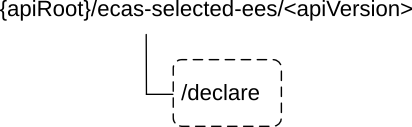

# 8A CAS API Definitions

## 8A.1 Ecas_SelectedEES API

### 8A.1.1 Introduction

The Ecas_SelectedEES service shall use the Ecas_SelectedEES API.

The API URI of the Ecas_SelectedEES API shall be:

**{apiRoot}/\<apiName\>/\<apiVersion\>**

The request URIs used in HTTP requests shall have the Resource URI structure defined in clause 5.2.4 of 3GPP TS 29.122 \[6\], i.e.:

**{apiRoot}/\<apiName\>/\<apiVersion\>/\<apiSpecificSuffixes\>**

with the following components:

\- The {apiRoot} shall be set as described in clause 5.2.4 of 3GPP TS 29.122 \[6\].

\- The \<apiName\> shall be "ecas-selected-ees".

\- The \<apiVersion\> shall be "v1".

\- The \<apiSpecificSuffixes\> shall be set as described in clause 5.2.4 of 3GPP TS 29.122 \[6\].

NOTE: When 3GPP TS 29.122 \[2\] is referenced for the common protocol and interface aspects for API definition in the clauses under clause 5, the CAS takes the role of the SCEF and the service consumer takes the role of the SCS/AS.

### 8A.1.2 Usage of HTTP

The provisions of clause 5.2.2 of 3GPP TS 29.122 \[6\] shall apply for the Ecas_SelectedEES API.

### 8A.1.3 Resources

There are no resources defined for this API in this release of the specification.

### 8A.1.4 Custom Operations without associated resources

#### 8A.1.4.1 Overview

The structure of the custom operation URIs of the Ecas_SelectedEES API is shown in Figure 8A.1.4.1-1.

Figure 8A.1.4.1-1: Custom operation URI structure of the Ecas_SelectedEES API

Table 8A.1.4.1-1 provides an overview of the custom operations and applicable HTTP methods defined for the Ecas_SelectedEES API.

Table 8A.1.4.1-1: Custom operations without associated resources

| Operation name | Custom operation URI | Mapped HTTP method | Description                                                                        |
|----------------|----------------------|--------------------|------------------------------------------------------------------------------------|
| Declare        | /declare             | POST               | Enables a service consumer to declare the selected target EES related information. |

#### 8A.1.4.2 Operation: Declare

##### 8A.1.4.2.1 Description

The custom operation enables a service consumer to inform the CAS about the selected target EES related information during an ACR procedure from EAS to CAS.

##### 8A.1.4.2.2 Operation Definition

This operation shall support the request data structures and the response data structures and response codes specified in tables 8A.1.4.2.2-1 and 8A.1.4.2.2-2.

Table 8A.1.4.2.2-1: Data structures supported by the POST Request Body on this resource

|               |     |             |                                                                                 |
|---------------|-----|-------------|---------------------------------------------------------------------------------|
| Data type     | P   | Cardinality | Description                                                                     |
| SelEESDecInfo | M   | 1           | Contains the parameters to declare the selected target EES related information. |

Table 8A.1.4.2.2-2: Data structures supported by the POST Response Body on this resource

<table>
<colgroup>
<col style="width: 16%" />
<col style="width: 4%" />
<col style="width: 11%" />
<col style="width: 14%" />
<col style="width: 52%" />
</colgroup>
<tbody>
<tr class="odd">
<td>Data type</td>
<td>P</td>
<td>Cardinality</td>
<td>
Response

codes
</td>
<td>Description</td>
</tr>
<tr class="even">
<td>n/a</td>
<td></td>
<td></td>
<td>204 No Content</td>
<td>The selected EES declaration request is successfully received and processed.</td>
</tr>
<tr class="odd">
<td>n/a</td>
<td></td>
<td></td>
<td>307 Temporary Redirect</td>
<td>
Temporary redirection.

The response shall include a Location header field containing an alternative target URI located in an alternative CAS.

Redirection handling is described in clause 5.2.10 of TS 29.122 [6].
</td>
</tr>
<tr class="even">
<td>n/a</td>
<td></td>
<td></td>
<td>308 Permanent Redirect</td>
<td>
Permanent redirection.

The response shall include a Location header field containing an alternative target URI located in an alternative CAS.

Redirection handling is described in clause 5.2.10 of TS 29.122 [6].
</td>
</tr>
<tr class="odd">
<td colspan="5">NOTE: The mandatory HTTP error status codes for the HTTP POST method listed in Table 5.2.6-1 of 3GPP TS 29.122 [6] shall also apply.</td>
</tr>
</tbody>
</table>

Table 8A.1.4.2.2-3: Headers supported by the 307 Response Code on this resource

|          |           |     |             |                                                                   |
|----------|-----------|-----|-------------|-------------------------------------------------------------------|
| Name     | Data type | P   | Cardinality | Description                                                       |
| Location | string    | M   | 1           | Contains an alternative target URI located in an alternative CAS. |

Table 8A.1.4.2.2-4: Headers supported by the 308 Response Code on this resource

|          |           |     |             |                                                                   |
|----------|-----------|-----|-------------|-------------------------------------------------------------------|
| Name     | Data type | P   | Cardinality | Description                                                       |
| Location | string    | M   | 1           | Contains an alternative target URI located in an alternative CAS. |

### 8A.1.5 Notifications

There are no notifications defined for this API in this release of the specification.

### 8A.1.6 Data Model

#### 8A.1.6.1 General

This clause specifies the application data model supported by the API.

Table 8A.1.6.1-1 specifies the data types defined for the Ecas_SelectedEES API.

Table 8A.1.6.1-1: Ecas_SelectedEES API specific Data Types

| Data type     | Clause defined | Description                                            | Applicability |
|---------------|----------------|--------------------------------------------------------|---------------|
| SelEESDecInfo | 8A.1.6.2.2     | Represent the selected target EES related information. |               |

Table 8A.1.6.1-2 specifies data types re-used by the Ecas_SelectedEES API from other specifications, including a reference to their respective specifications and when needed, a short description of their use within the Ecas_SelectedEES API.

Table 8A.1.6.1-2: Ecas_SelectedEES API re-used Data Types

| Data type         | Reference            | Comments                                                                                                      | Applicability |
|-------------------|----------------------|---------------------------------------------------------------------------------------------------------------|---------------|
| EndPoint          | Clause 8.1.5.2.5     | Represents the endpoint information.                                                                          |               |
| Gpsi              | 3GPP TS 29.571 \[8\] | Used to identify the UE with GPSI.                                                                            |               |
| SupportedFeatures | 3GPP TS 29.571 \[8\] | Represents the list of supported feature(s) and used to negotiate the applicability of the optional features. |               |

#### 8A.1.6.2 Structured data types

##### 8A.1.6.2.1 Introduction

This clause defines the structures to be used in resource representations.

##### 8A.1.6.2.2 Type: SelEESDecInfo

Table 8A.1.6.2.2-1: Definition of type SelEESDecInfo

<table>
<colgroup>
<col style="width: 16%" />
<col style="width: 14%" />
<col style="width: 4%" />
<col style="width: 11%" />
<col style="width: 38%" />
<col style="width: 13%" />
</colgroup>
<thead>
<tr class="header">
<th>Attribute name</th>
<th>Data type</th>
<th>P</th>
<th>Cardinality</th>
<th>Description</th>
<th>Applicability</th>
</tr>
</thead>
<tbody>
<tr class="odd">
<td>ueId</td>
<td>Gpsi</td>
<td>M</td>
<td>1</td>
<td>Contains the identifier of the UE.</td>
<td></td>
</tr>
<tr class="even">
<td>seleEesId</td>
<td>string</td>
<td>M</td>
<td>1</td>
<td>Contains the identifier of the selected EES.</td>
<td></td>
</tr>
<tr class="odd">
<td>seleEndpoint</td>
<td>EndPoint</td>
<td>M</td>
<td>1</td>
<td>Contains Endpoint information (e.g. URI, FQDN, IP address) used to communicate with the selected EES.</td>
<td></td>
</tr>
<tr class="even">
<td>easId</td>
<td>string</td>
<td>M</td>
<td>1</td>
<td>Contains the identifier of the concerned EAS.</td>
<td></td>
</tr>
<tr class="odd">
<td>acId</td>
<td>string</td>
<td>O</td>
<td>0..1</td>
<td>Contains the identifier of the concerned AC.</td>
<td></td>
</tr>
<tr class="even">
<td>suppFeat</td>
<td>SupportedFeatures</td>
<td>C</td>
<td>0..1</td>
<td>
Contains the list of supported features among the ones defined in clause 8A.1.8.

This attribute shall be present only when feature negotiation needs to take place.
</td>
<td></td>
</tr>
</tbody>
</table>

#### 8A.1.6.3 Simple data types and enumerations

##### 8A.1.6.3.1 Introduction

This clause defines simple data types and enumerations that can be referenced from data structures defined in the previous clauses.

##### 8A.1.6.3.2 Simple data types

The simple data types defined in table 8A.1.6.3.2-1 shall be supported.

Table 8A.1.6.3.2-1: Simple data types

|           |                 |             |               |
|-----------|-----------------|-------------|---------------|
| Type Name | Type Definition | Description | Applicability |
|           |                 |             |               |

#### 8A.1.6.4 Data types describing alternative data types or combinations of data types

There are no data types describing alternative data types or combinations of data types defined for this API in this release of the specification.

#### 8A.1.6.5 Binary data

##### 8A.1.6.5.1 Binary Data Types

Table 8A.1.6.5.1-1: Binary Data Types

| Name | Clause defined | Content type |
|------|----------------|--------------|
|      |                |              |

### 8A.1.7 Error Handling

#### 8A.1.7.1 General

For the Ecas_SelectedEES API, HTTP error responses shall be supported as specified in clause 5.2.6 of 3GPP TS 29.122 \[6\]. Protocol errors and application errors specified in clause 5.2.6 of 3GPP TS 29.122 \[6\] shall be supported for the HTTP status codes specified in table 5.2.6-1 of 3GPP TS 29.122 \[6\].

In addition, the requirements in the following clauses are applicable for the Ecas_SelectedEES API.

#### 8A.1.7.2 Protocol Errors

No specific protocol errors for the Ecas_SelectedEES API are specified.

#### 8A.1.7.3 Application Errors

The application errors defined for the Ecas_SelectedEES API are listed in Table 8A.1.7.3-1.

Table 8A.1.7.3-1: Application errors

| Application Error | HTTP status code | Description | Applicability |
|-------------------|------------------|-------------|---------------|
|                   |                  |             |               |

### 8A.1.8 Feature negotiation

The optional features in table 8A.1.8-1 are defined for the Ecas_SelectedEES API. They shall be negotiated using the extensibility mechanism defined in clause 5.2.7 of 3GPP TS 29.122 \[6\].

Table 8A.1.8-1: Supported Features

| Feature number | Feature Name | Description |
|----------------|--------------|-------------|
|                |              |             |
