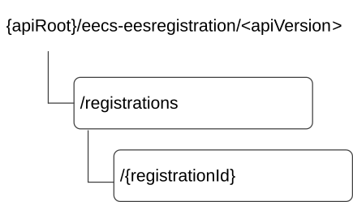

# 9.1.2 Resources

## 9.1.2.1 Overview

This clause describes the structure for the Resource URIs and the resources and methods used for the service.

Figure 9.1.2.1-1 depicts the resource URIs structure for the Eecs_EESRegistration API.

Figure 9.1.2.1-1: Resource URI structure of the Eecs_EESRegistration API

Table 9.1.2.1-1 provides an overview of the resources and applicable HTTP methods.

Table 9.1.2.1-1: Resources and methods overview

| Resource name               | Resource URI                    | HTTP method or custom operation | Description                                               |
|-----------------------------|---------------------------------|---------------------------------|-----------------------------------------------------------|
| EES Registrations           | /registrations                  | POST                            | Registers a new EES at the Edge Configuration Server.     |
| Individual EES Registration | /registrations/{registrationId} | GET                             | Fetch an individual EES registration resource.            |
|                             |                                 | PUT                             | Fully replace an individual EES registration resource.    |
|                             |                                 | DELETE                          | Remove an individual EES registration resource.           |
|                             |                                 | PATCH                           | Partially update an individual EES registration resource. |

## 9.1.2.2 Resource: EES Registrations

### 9.1.2.2.1 Description

This resource represents all the Edge Enabler Servers that are registered at a given Edge Configuration Server.

### 9.1.2.2.2 Resource Definition

Resource URI: **{apiRoot}/eecs-eesregistration/\<apiVersion\>/registrations**

This resource shall support the resource URI variables defined in the table 9.1.2.2.2-1.

Table 9.1.2.2.2-1: Resource URI variables for this resource

| Name    | Data Type | Definition     |
|---------|-----------|----------------|
| apiRoot | string    | See clause 7.5 |

### 9.1.2.2.3 Resource Standard Methods

#### 9.1.2.2.3.1 POST

This method shall support the URI query parameters specified in table 9.1.2.2.3.1-1.

Table 9.1.2.2.3.1-1: URI query parameters supported by the POST method on this resource

|      |           |     |             |             |
|------|-----------|-----|-------------|-------------|
| Name | Data type | P   | Cardinality | Description |
| n/a  |           |     |             |             |

This method shall support the request data structures specified in table 9.1.2.2.3.1-2 and the response data structures and response codes specified in table 9.1.2.2.3.1-3.

Table 9.1.2.2.3.1-2: Data structures supported by the POST Request Body on this resource

|                 |     |             |                                       |
|-----------------|-----|-------------|---------------------------------------|
| Data type       | P   | Cardinality | Description                           |
| EESRegistration | M   | 1           | EES registration request information. |

Table 9.1.2.2.3.1-3: Data structures supported by the POST Response Body on this resource

<table>
<colgroup>
<col style="width: 16%" />
<col style="width: 9%" />
<col style="width: 14%" />
<col style="width: 19%" />
<col style="width: 39%" />
</colgroup>
<tbody>
<tr class="odd">
<td>Data type</td>
<td>P</td>
<td>Cardinality</td>
<td>
Response

codes
</td>
<td>Description</td>
</tr>
<tr class="even">
<td>EESRegistration</td>
<td>M</td>
<td>1</td>
<td>201 Created</td>
<td>
EES information is registered successfully at ECS. EES information registered with ECS is provided in the response body.

The URI of the created resource shall be returned in the "Location" HTTP header.
</td>
</tr>
<tr class="odd">
<td colspan="5">NOTE: The mandatory HTTP error status code for the POST method listed in Table 5.2.6-1 of 3GPP TS 29.122 [6] also apply.</td>
</tr>
</tbody>
</table>

Table 9.1.2.2.3.1-4: Headers supported by the 201 response code on this resource

|          |           |     |             |                                                                                                                                                          |
|----------|-----------|-----|-------------|----------------------------------------------------------------------------------------------------------------------------------------------------------|
| Name     | Data type | P   | Cardinality | Description                                                                                                                                              |
| Location | string    | M   | 1           | Contains the URI of the newly created resource, according to the structure: {apiRoot}/eecs-eesregistration/\<apiVersion\>/registrations/{registrationId} |

### 9.1.2.2.4 Resource Custom Operations

None.

## 9.1.2.3 Resource: Individual EES Registration

### 9.1.2.3.1 Description

This Individual EES Registration resource represents an individual EES registered at a given Edge Configuration Server.

### 9.1.2.3.2 Resource Definition

Resource URI: **{apiRoot}/eecs-eesregistration/\<apiVersion\>/registrations/{registrationId}**

This resource shall support the resource URI variables defined in the table 9.1.2.3.2-1.

Table 9.1.2.3.2-1: Resource URI variables for this resource

| Name           | Data Type | Definition                       |
|----------------|-----------|----------------------------------|
| apiRoot        | string    | See clause 7.5                   |
| registrationId | string    | The EES registration identifier. |

### 9.1.2.3.3 Resource Standard Methods

#### 9.1.2.3.3.1 GET

This method retrieves the EES information registered at Edge Configuration Server. This method shall support the URI query parameters specified in table 9.1.2.3.3.1-1.

Table 9.1.2.3.3.1-1: URI query parameters supported by the GET method on this resource

|      |           |     |             |             |
|------|-----------|-----|-------------|-------------|
| Name | Data type | P   | Cardinality | Description |
| n/a  |           |     |             |             |

This method shall support the request data structures specified in table 9.1.2.3.3.1-2 and the response data structures and response codes specified in table 9.1.2.3.3.1-3.

Table 9.1.2.3.3.1-2: Data structures supported by the GET Request Body on this resource

|           |     |             |             |
|-----------|-----|-------------|-------------|
| Data type | P   | Cardinality | Description |
| n/a       |     |             |             |

Table 9.1.2.3.3.1-3: Data structures supported by the GET Response Body on this resource

<table>
<colgroup>
<col style="width: 16%" />
<col style="width: 9%" />
<col style="width: 14%" />
<col style="width: 19%" />
<col style="width: 39%" />
</colgroup>
<tbody>
<tr class="odd">
<td>Data type</td>
<td>P</td>
<td>Cardinality</td>
<td>
Response

codes
</td>
<td>Description</td>
</tr>
<tr class="even">
<td>EESRegistration</td>
<td>M</td>
<td>1</td>
<td>200 OK</td>
<td>The EES registration information at the Edge Configuration Server.</td>
</tr>
<tr class="odd">
<td>n/a</td>
<td></td>
<td></td>
<td>307 Temporary Redirect</td>
<td>
Temporary redirection. The response shall include a Location header field containing an alternative URI of the resource located in an alternative ECS.

Redirection handling is described in clause 5.2.10 of TS 29.122 [6].
</td>
</tr>
<tr class="even">
<td>n/a</td>
<td></td>
<td></td>
<td>308 Permanent Redirect</td>
<td>
Permanent redirection. The response shall include a Location header field containing an alternative URI of the resource located in an alternative ECS.

Redirection handling is described in clause 5.2.10 of TS 29.122 [6].
</td>
</tr>
<tr class="odd">
<td colspan="5">NOTE: The manadatory HTTP error status code for the GET method listed in Table 5.2.6-1 of 3GPP TS 29.122 [6] also apply.</td>
</tr>
</tbody>
</table>

Table 9.1.2.3.3.1-4: Headers supported by the 307 Response Code on this resource

|          |           |     |             |                                                                   |
|----------|-----------|-----|-------------|-------------------------------------------------------------------|
| Name     | Data type | P   | Cardinality | Description                                                       |
| Location | string    | M   | 1           | An alternative URI of the resource located in an alternative ECS. |

Table 9.1.2.3.3.1-5: Headers supported by the 308 Response Code on this resource

|          |           |     |             |                                                                   |
|----------|-----------|-----|-------------|-------------------------------------------------------------------|
| Name     | Data type | P   | Cardinality | Description                                                       |
| Location | string    | M   | 1           | An alternative URI of the resource located in an alternative ECS. |

#### 9.1.2.3.3.2 PUT

This method updates the EES registration information at Edge Configuration Server by completely replacing the existing registration data (except the value of "eesId" within EESProfile data type and the value of "suppFeat" attribute within the EESRegistration data type). This method shall support the URI query parameters specified in the table 9.1.2.3.3.2-1.

Table 9.1.2.3.3.2-1: URI query parameters supported by the PUT method on this resource

|      |           |     |             |             |
|------|-----------|-----|-------------|-------------|
| Name | Data type | P   | Cardinality | Description |
| n/a  |           |     |             |             |

This method shall support the request data structures specified in table 9.1.2.3.3.2-2 and the response data structures and response codes specified in table 9.1.2.3.3.2-3.

Table 9.1.2.3.3.2-2: Data structures supported by the PUT Request Body on this resource

|                 |     |             |                                                           |
|-----------------|-----|-------------|-----------------------------------------------------------|
| Data type       | P   | Cardinality | Description                                               |
| EESRegistration | M   | 1           | Details of the EES registration information to be updated |

Table 9.1.2.3.3.2-3: Data structures supported by the PUT Response Body on this resource

<table>
<colgroup>
<col style="width: 16%" />
<col style="width: 9%" />
<col style="width: 14%" />
<col style="width: 19%" />
<col style="width: 39%" />
</colgroup>
<tbody>
<tr class="odd">
<td>Data type</td>
<td>P</td>
<td>Cardinality</td>
<td>
Response

codes
</td>
<td>Description</td>
</tr>
<tr class="even">
<td>EESRegistration</td>
<td>M</td>
<td>1</td>
<td>200 OK</td>
<td>The EES registration information updated successfully and the updated EES registration information is returned in the response.</td>
</tr>
<tr class="odd">
<td>n/a</td>
<td></td>
<td></td>
<td>204 No Content</td>
<td>The EES registration information was updated successfully.</td>
</tr>
<tr class="even">
<td>n/a</td>
<td></td>
<td></td>
<td>307 Temporary Redirect</td>
<td>
Temporary redirection. The response shall include a Location header field containing an alternative URI of the resource located in an alternative ECS.

Redirection handling is described in clause 5.2.10 of TS 29.122 [6].
</td>
</tr>
<tr class="odd">
<td>n/a</td>
<td></td>
<td></td>
<td>308 Permanent Redirect</td>
<td>
Permanent redirection. The response shall include a Location header field containing an alternative URI of the resource located in an alternative ECS.

Redirection handling is described in clause 5.2.10 of TS 29.122 [6].
</td>
</tr>
<tr class="even">
<td colspan="5">NOTE: The manadatory HTTP error status code for the PUT method listed in Table 5.2.6-1 of 3GPP TS 29.122 [6] also apply.</td>
</tr>
</tbody>
</table>

Table 9.1.2.3.3.2-4: Headers supported by the 307 Response Code on this resource

|          |           |     |             |                                                                   |
|----------|-----------|-----|-------------|-------------------------------------------------------------------|
| Name     | Data type | P   | Cardinality | Description                                                       |
| Location | string    | M   | 1           | An alternative URI of the resource located in an alternative ECS. |

Table 9.1.2.3.3.2-5: Headers supported by the 308 Response Code on this resource

|          |           |     |             |                                                                   |
|----------|-----------|-----|-------------|-------------------------------------------------------------------|
| Name     | Data type | P   | Cardinality | Description                                                       |
| Location | string    | M   | 1           | An alternative URI of the resource located in an alternative ECS. |

#### 9.1.2.3.3.3 DELETE

This method deregisters an EES registration from the ECS. This method shall support the URI query parameters specified in the table 9.1.2.3.3.3-1.

Table 9.1.2.3.3.3-1: URI query parameters supported by the DELETE method on this resource

|      |           |     |             |             |
|------|-----------|-----|-------------|-------------|
| Name | Data type | P   | Cardinality | Description |
| n/a  |           |     |             |             |

This method shall support the request data structures specified in table 9.1.2.3.3.3-2 and the response data structures and response codes specified in table 9.1.2.3.3.3-3.

Table 9.1.2.3.3.3-2: Data structures supported by the DELETE Request Body on this resource

|           |     |             |             |
|-----------|-----|-------------|-------------|
| Data type | P   | Cardinality | Description |
| n/a       |     |             |             |

Table 9.1.2.3.3.3-3: Data structures supported by the DELETE Response Body on this resource

<table>
<colgroup>
<col style="width: 16%" />
<col style="width: 9%" />
<col style="width: 14%" />
<col style="width: 19%" />
<col style="width: 39%" />
</colgroup>
<tbody>
<tr class="odd">
<td>Data type</td>
<td>P</td>
<td>Cardinality</td>
<td>
Response

codes
</td>
<td>Description</td>
</tr>
<tr class="even">
<td>n/a</td>
<td></td>
<td></td>
<td>204 No Content</td>
<td>The individual EES registration information matching the registrationId is deleted.</td>
</tr>
<tr class="odd">
<td>n/a</td>
<td></td>
<td></td>
<td>307 Temporary Redirect</td>
<td>
Temporary redirection. The response shall include a Location header field containing an alternative URI of the resource located in an alternative ECS.

Redirection handling is described in clause 5.2.10 of TS 29.122 [6].
</td>
</tr>
<tr class="even">
<td>n/a</td>
<td></td>
<td></td>
<td>308 Permanent Redirect</td>
<td>
Permanent redirection. The response shall include a Location header field containing an alternative URI of the resource located in an alternative ECS.

Redirection handling is described in clause 5.2.10 of TS 29.122 [6].
</td>
</tr>
<tr class="odd">
<td colspan="5">NOTE: The manadatory HTTP error status code for the DELETE method listed in Table 5.2.6-1 of 3GPP TS 29.122 [6] also apply.</td>
</tr>
</tbody>
</table>

Table 9.1.2.3.3.3-4: Headers supported by the 307 Response Code on this resource

|          |           |     |             |                                                                   |
|----------|-----------|-----|-------------|-------------------------------------------------------------------|
| Name     | Data type | P   | Cardinality | Description                                                       |
| Location | string    | M   | 1           | An alternative URI of the resource located in an alternative ECS. |

Table 9.1.2.3.3.3-5: Headers supported by the 308 Response Code on this resource

|          |           |     |             |                                                                   |
|----------|-----------|-----|-------------|-------------------------------------------------------------------|
| Name     | Data type | P   | Cardinality | Description                                                       |
| Location | string    | M   | 1           | An alternative URI of the resource located in an alternative ECS. |

#### 9.1.2.3.3.4 PATCH

This method partially updates the EES registration information at Edge Configuration Server. This method shall support the URI query parameters specified in the table 9.1.2.3.3.4-1.

Table 9.1.2.3.3.4-1: URI query parameters supported by the PATCH method on this resource

|      |           |     |             |             |
|------|-----------|-----|-------------|-------------|
| Name | Data type | P   | Cardinality | Description |
| n/a  |           |     |             |             |

This method shall support the request data structures specified in table 9.1.2.3.3.4-2 and the response data structures and response codes specified in table 9.1.2.3.3.4-3.

Table 9.1.2.3.3.4-2: Data structures supported by the PATCH Request Body on this resource

|                      |     |             |                                                           |
|----------------------|-----|-------------|-----------------------------------------------------------|
| Data type            | P   | Cardinality | Description                                               |
| EESRegistrationPatch | M   | 1           | Details of the EES registration information to be updated |

Table 9.1.2.3.3.4-3: Data structures supported by the PATCH Response Body on this resource

<table>
<colgroup>
<col style="width: 16%" />
<col style="width: 9%" />
<col style="width: 14%" />
<col style="width: 19%" />
<col style="width: 39%" />
</colgroup>
<tbody>
<tr class="odd">
<td>Data type</td>
<td>P</td>
<td>Cardinality</td>
<td>
Response

codes
</td>
<td>Description</td>
</tr>
<tr class="even">
<td>EESRegistration</td>
<td>M</td>
<td>1</td>
<td>200 OK</td>
<td>The Individual EES registration information was updated successfully and the updated EES registration information is returned in the response.</td>
</tr>
<tr class="odd">
<td>n/a</td>
<td></td>
<td></td>
<td>204 No Content</td>
<td>The Individual EES registration information was updated successfully.</td>
</tr>
<tr class="even">
<td>n/a</td>
<td></td>
<td></td>
<td>307 Temporary Redirect</td>
<td>
Temporary redirection. The response shall include a Location header field containing an alternative URI of the resource located in an alternative ECS.

Redirection handling is described in clause 5.2.10 of TS 29.122 [6].
</td>
</tr>
<tr class="odd">
<td>n/a</td>
<td></td>
<td></td>
<td>308 Permanent Redirect</td>
<td>
Permanent redirection. The response shall include a Location header field containing an alternative URI of the resource located in an alternative ECS.

Redirection handling is described in clause 5.2.10 of TS 29.122 [6].
</td>
</tr>
<tr class="even">
<td colspan="5">NOTE: The mandatory HTTP error status code for the PUT method listed in Table 5.2.6-1 of 3GPP TS 29.122 [6] also apply.</td>
</tr>
</tbody>
</table>

Table 9.1.2.3.3.4-4: Headers supported by the 307 Response Code on this resource

|          |           |     |             |                                                                   |
|----------|-----------|-----|-------------|-------------------------------------------------------------------|
| Name     | Data type | P   | Cardinality | Description                                                       |
| Location | string    | M   | 1           | An alternative URI of the resource located in an alternative ECS. |

Table 9.1.2.3.3.4-5: Headers supported by the 308 Response Code on this resource

|          |           |     |             |                                                                   |
|----------|-----------|-----|-------------|-------------------------------------------------------------------|
| Name     | Data type | P   | Cardinality | Description                                                       |
| Location | string    | M   | 1           | An alternative URI of the resource located in an alternative ECS. |

### 9.1.2.3.4 Resource Custom Operations

None.
