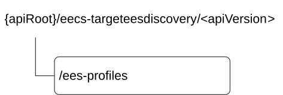

# 9.2 Eecs_TargetEESDiscovery API

## 9.2.1 Introduction

The Eecs_TargetEESDiscovery service shall use the Eecs_TargetEESDiscovery API.

The API URI of the Eecs_TargetEESDiscovery API shall be:

**{apiRoot}/\<apiName\>/\<apiVersion\>**

The request URIs used in HTTP requests shall have the Resource URI structure as defined in clause 7.5, i.e.:

**{apiRoot}/\<apiName\>/\<apiVersion\>/\<apiSpecificResourceUriPart\>**

with the following components:

\- The {apiRoot} shall be set as described in clause 7.5.

\- The \<apiName\> shall be "eecs-targeteesdiscovery".

\- The \<apiVersion\> shall be "v1".

\- The \<apiSpecificResourceUriPart\> shall be set as described in clause 9.2.2.

## 9.2.2 Resources

### 9.2.2.1 Overview

This clause describes the structure for the Resource URIs and the resources and methods used for the service.

Figure 9.2.2.1-1 depicts the resource URIs structure for the Eecs_TargetEESDiscovery API.

Figure 9.2.2.1-1: Resource URI structure of the Eecs_TargetEESDiscovery API

Table 9.2.2.1-1 provides an overview of the resources and applicable HTTP methods.

Table 9.2.2.1-1: Resources and methods overview

<table>
<colgroup>
<col style="width: 25%" />
<col style="width: 31%" />
<col style="width: 12%" />
<col style="width: 30%" />
</colgroup>
<thead>
<tr class="header">
<th>Resource name</th>
<th>Resource URI</th>
<th>HTTP method or custom operation</th>
<th>Description</th>
</tr>
</thead>
<tbody>
<tr class="odd">
<td>
EES Profiles

(NOTE)
</td>
<td>/ees-profiles</td>
<td>GET</td>
<td>Retrieve the target Enabler Server information.</td>
</tr>
<tr class="even">
<td colspan="4">NOTE: In this release of the specification, this resource is extended to manage also the CES profiles, not only the EES profiles, in order to support cloud enabler services.</td>
</tr>
</tbody>
</table>

### 9.2.2.2 Resource: EES Profiles

#### 9.2.2.2.1 Description

This resource allows a service consumer to retrieve the target Enabler Server information from the ECS.

#### 9.2.2.2.2 Resource Definition

Resource URI: **{apiRoot}/eecs-targeteesdiscovery/\<apiVersion\>/ees-profiles**

This resource shall support the resource URI variables defined in the table 9.2.2.2.2-1.

Table 9.2.2.2.2-1: Resource URI variables for this resource

| Name    | Data Type | Definition     |
|---------|-----------|----------------|
| apiRoot | string    | See clause 7.5 |

#### 9.2.2.2.3 Resource Standard Methods

##### 9.2.2.2.3.1 GET

This method allows the service consumer to fetch the target Enabler Server information as specified in 3GPP TS 23.558 \[2\], from the ECS with a given discovery filters.

This method shall support the URI query parameters specified in table 9.2.2.2.3.1-1.

Table 9.2.2.2.3.1-1: URI query parameters supported by the GET method on this resource

<table>
<colgroup>
<col style="width: 13%" />
<col style="width: 14%" />
<col style="width: 4%" />
<col style="width: 11%" />
<col style="width: 42%" />
<col style="width: 13%" />
</colgroup>
<tbody>
<tr class="odd">
<td>Name</td>
<td>Data type</td>
<td>P</td>
<td>Cardinality</td>
<td>Description</td>
<td>Applicability</td>
</tr>
<tr class="even">
<td>ees-id</td>
<td>string</td>
<td>M</td>
<td>1</td>
<td>Unique identifier of the target Enabler Server.</td>
<td></td>
</tr>
<tr class="odd">
<td>eas-id</td>
<td>string</td>
<td>M</td>
<td>1</td>
<td>Represents the application identifier of the source Application Server (e.g., S-EAS or CAS), e.g. URI, FQDN.</td>
<td></td>
</tr>
<tr class="even">
<td>target-dnai</td>
<td>Dnai</td>
<td>O</td>
<td>0..1</td>
<td>
The DNAI information associated with the potential target Enabler Server(s) and/or target Application Server(s).

(NOTE)
</td>
<td></td>
</tr>
<tr class="odd">
<td>cand-dnais-info</td>
<td>CandidateDnaisInfo</td>
<td>O</td>
<td>0..1</td>
<td>
Contains the candidate DNAI(s) related information.

This query parameter is applicable only for the common EAS case.

(NOTE)
</td>
<td>EdgeApp_3</td>
</tr>
<tr class="even">
<td>ue-id</td>
<td>Gpsi</td>
<td>O</td>
<td>0..1</td>
<td>Identifier of the UE.</td>
<td></td>
</tr>
<tr class="odd">
<td>ue-location</td>
<td>LocationArea5G</td>
<td>O</td>
<td>0..1</td>
<td>The location information of the UE.</td>
<td></td>
</tr>
<tr class="even">
<td>eec-srv-cont-supp</td>
<td>EECSrvContinuitySupport</td>
<td>O</td>
<td>0..1</td>
<td>Indicates whether the EEC supports service continuity or not and the related service continuity support information.</td>
<td>EdgeApp_2</td>
</tr>
<tr class="odd">
<td>ac-svc-cont-supp</td>
<td>array(ACRScenario)</td>
<td>O</td>
<td>1..N</td>
<td>Indicates that the AC supports service continuity and contains the related service continuity support information (i.e., supported ACR scenarios).</td>
<td>EdgeApp_2</td>
</tr>
<tr class="even">
<td>bdl-id</td>
<td>string</td>
<td>O</td>
<td>0..1</td>
<td>
Contains the identifier of the EAS bundle.

This query parameter may be present only when the "bdl-type" query parameter is also present and set to "PROXY".
</td>
<td>EdgeApp_2</td>
</tr>
<tr class="odd">
<td>bdl-type</td>
<td>BdlType</td>
<td>O</td>
<td>0..1</td>
<td>Contains the EAS bundle type.</td>
<td>EdgeApp_2</td>
</tr>
<tr class="even">
<td>eas-ids-list</td>
<td>array(string)</td>
<td>O</td>
<td>1..N</td>
<td>Contains the list of the identifier(s) of the EAS(s) associated with the EAS bundle.</td>
<td>EdgeApp_3</td>
</tr>
<tr class="odd">
<td>ens-ind</td>
<td>boolean</td>
<td>O</td>
<td>0..1</td>
<td>
Indicates whether edge node sharing is requested.

- When set to "true", it indicates that edge node sharing is requested.

- When set to "false" (default if omitted), it indicates that node sharing is not requested.
</td>
<td>EdgeApp_2</td>
</tr>
<tr class="even">
<td>app-grp-id</td>
<td>string</td>
<td>O</td>
<td>0..1</td>
<td>
Contains the application group identifier.

When this query parameter is provided, then it indicates that the request is for the retrieval of an EES list for the announcement of common EAS.
</td>
<td>EdgeApp_2</td>
</tr>
<tr class="odd">
<td>supp-feats</td>
<td>SupportedFeatures</td>
<td>C</td>
<td>0..1</td>
<td>
Contains the list of supported feature(s) among the ones defined in clause 9.2.7.

This query parameter shall be present only when feature negotiation needs to take place.
</td>
<td></td>
</tr>
<tr class="even">
<td>serving-mno-info</td>
<td>PlmnIdNid</td>
<td>O</td>
<td>0..1</td>
<td>Contains the serving MNO information, i.e., the MNO that is serving the subscriber.</td>
<td>EdgeApp_3</td>
</tr>
<tr class="odd">
<td>pred-exp-time</td>
<td>DateTime</td>
<td>O</td>
<td>0..1</td>
<td>Contains the prediction expiration time, i.e., the estimated time at which the UE should reach the predicted/expected location or EAS service area at the latest.</td>
<td>EdgeApp_3</td>
</tr>
<tr class="even">
<td>tunnel-info</td>
<td>TunnelInfo</td>
<td>O</td>
<td>0..1</td>
<td>Contains the target tunnel information.</td>
<td>EdgeApp_2_Ext1</td>
</tr>
<tr class="odd">
<td colspan="6">NOTE: When the "EdgeApp_3" feature is supported, these query parameters are mutually exclusive.</td>
</tr>
</tbody>
</table>

This method shall support the request data structures specified in table 9.2.2.2.3.1-2 and the response data structures and response codes specified in table 9.2.2.2.3.1-3.

Table 9.2.2.2.3.1-2: Data structures supported by the GET Request Body on this resource

|           |     |             |             |
|-----------|-----|-------------|-------------|
| Data type | P   | Cardinality | Description |
| n/a       |     |             |             |

Table 9.2.2.2.3.1-3: Data structures supported by the GET Response Body on this resource

<table>
<colgroup>
<col style="width: 16%" />
<col style="width: 9%" />
<col style="width: 14%" />
<col style="width: 19%" />
<col style="width: 39%" />
</colgroup>
<tbody>
<tr class="odd">
<td>Data type</td>
<td>P</td>
<td>Cardinality</td>
<td>
Response

codes
</td>
<td>Description</td>
</tr>
<tr class="even">
<td>ECSServProvResp</td>
<td>M</td>
<td>1</td>
<td>200 OK</td>
<td>The EDN configuration and the target Enabler Server information determined by the ECS based on the query parameters.</td>
</tr>
<tr class="odd">
<td colspan="5">NOTE: The mandatory HTTP error status code for the HTTP GET method listed in Table 5.2.6-1 of 3GPP TS 29.122 [6] shall also apply.</td>
</tr>
</tbody>
</table>

#### 9.2.2.2.4 Resource Custom Operations

None.

## 9.2.3 Custom Operations without associated resources

None.

## 9.2.4 Notifications

None.

## 9.2.5 Data Model

### 9.2.5.1 General

This clause specifies the application data model supported by the API. Data types listed in clause 7.2 apply to this API.

Table 9.2.5.1-1 specifies the data types defined specifically for the Eecs_TargetEESDiscovery API.

Table 9.2.5.1-1: Eecs_TargetEESDiscovery API specific Data Types

| Data type          | Section defined | Description                                           | Applicability  |
|--------------------|-----------------|-------------------------------------------------------|----------------|
| CandidateDnaisInfo | 9.5.5.2.3       | Represents the candidate DNAI(s) related information. | EdgeApp_3      |
| TunnelInfo         | 9.2.5.2.2       | Contains the tunnel information.                      | EdgeApp_2_Ext1 |

Table 9.2.5.1-2 specifies data types re-used by the Eecs_TargetEESDiscovery API service.

Table 9.2.5.1-2: Re-used Data Types

| Data type               | Reference             | Comments                                                                                                                      | Applicability  |
|-------------------------|-----------------------|-------------------------------------------------------------------------------------------------------------------------------|----------------|
| ACRScenario             | Clause 9.1.5.3.3      | Represents ACR scenarios.                                                                                                     | EdgeApp_2      |
| BdlType                 | Clause 8.1.5.3.6      | Represent EAS Bundle type.                                                                                                    | EdgeApp_2      |
| DateTime                | 3GPP TS 29.122 \[6\]  | Represents a date and a time.                                                                                                 | EdgeApp_3      |
| Dnai                    | 3GPP TS 29.571 \[8\]  | Used to indicate the target DNAI information.                                                                                 |                |
| ECSServProvResp         | 3GPP TS 24.558 \[14\] | The response to the target EES discovery request, which includes the EDN configuration along with list of EES(s) information. |                |
| EECSrvContinuitySupport | Clause 8.7.5.2.8      | Represent service continuity support related information for an EEC.                                                          | EdgeApp_2      |
| Gpsi                    | 3GPP TS 29.571 \[8\]  | Used to identify the UE in the query parameter.                                                                               |                |
| LocationArea5G          | 3GPP TS 29.122 \[6\]  | Used to indicate the location information of the UE in the query parameter.                                                   |                |
| PlmnIdNid               | 3GPP TS 29.571 \[8\]  | Represents the identifier of the network, i.e., PLMN or SNPN.                                                                 | EdgeApp_3      |
| SupportedFeatures       | 3GPP TS 29.571 \[8\]  | Represents the list of supported feature(s) and is used to negotiate the applicability of optional features.                  |                |
| TunnelAddress           | 3GPP TS 29.571 \[8\]  | Represents the tunnel address information.                                                                                    | EdgeApp_2_Ext1 |

### 9.2.5.2 Structured data types

#### 9.2.5.2.1 Introduction

This clause defines the structures to be used in resource representations.

#### 9.2.5.2.2 Type: TunnelInfo

Table 9.2.5.2.2-1: Definition of type TunnelInfo

| Attribute name | Data type     | P   | Cardinality | Description                                         | Applicability |
|----------------|---------------|-----|-------------|-----------------------------------------------------|---------------|
| servProvId     | string        | M   | 1           | Contains the identifier of the service provider.    |               |
| endPoint       | TunnelAddress | M   | 1           | Contains the endpoint address of the tunnel server. |               |

#### 9.2.5.2.3 Type: CandidateDnaisInfo

Table 9.2.5.2.3-1: Definition of type CandidateDnaisInfo

<table>
<colgroup>
<col style="width: 17%" />
<col style="width: 13%" />
<col style="width: 4%" />
<col style="width: 11%" />
<col style="width: 38%" />
<col style="width: 13%" />
</colgroup>
<thead>
<tr class="header">
<th>Attribute name</th>
<th>Data type</th>
<th>P</th>
<th>Cardinality</th>
<th>Description</th>
<th>Applicability</th>
</tr>
</thead>
<tbody>
<tr class="odd">
<td>candidateDnais</td>
<td>array(Dnai)</td>
<td>M</td>
<td>1..N</td>
<td>Contains the candidate DNAI(s).</td>
<td></td>
</tr>
<tr class="even">
<td>candDnaisPrioInd</td>
<td>boolean</td>
<td>O</td>
<td>0..1</td>
<td>
Indicates whether the candidate DNAI(s) provided within the "candidateDnais" attribute are in descending priority order, i.e., the lower the array index of the "candidateDnais" attribute the higher the priority of the respective DNAI.

- "true" indicates that the candidate DNAI(s) provided within the "candidateDnais" attribute are in descending priority order.

- "false" indicates that the candidate DNAI(s) provided within the "candidateDnais" attribute are not in descending priority order.

- The default value is "false" if this attribute is omitted.
</td>
<td></td>
</tr>
</tbody>
</table>

### 9.2.5.3 Simple data types and enumerations

None.

## 9.2.6 Error Handling

General error responses are defined in clause 7.7.

## 9.2.7 Feature negotiation

General feature negotiation procedures are defined in clause 7.8. Table 9.2.7-1 lists the supported features for Eecs_TargetEESDiscovery API.

Table 9.2.7-1: Supported Features

<table>
<colgroup>
<col style="width: 16%" />
<col style="width: 23%" />
<col style="width: 60%" />
</colgroup>
<thead>
<tr class="header">
<th>Feature number</th>
<th>Feature Name</th>
<th>Description</th>
</tr>
</thead>
<tbody>
<tr class="odd">
<td>1</td>
<td>EdgeApp_2</td>
<td>
This feature indicates the support of the enhancements to the Edge Applications. Within this feature, the following enhancements are covered:

- Support T-EAS discovery based on EEC service continuity information and/or AC service continuity information.

- Support EAS bundle information management.

- Support of requesting edge node sharing.

- Support of T-EES discovery based on application group identifier.
</td>
</tr>
<tr class="even">
<td>2</td>
<td>EdgeApp_3</td>
<td>
This feature indicates the support of the second set of enhancements to the Edge Applications Enabler Layer.

Within this feature, the following enhancements are covered:

- Support of the allowed MNO information in the T-EES discovery request.

- Support of the prediction expiration time in the T-EES discovery request.

- Support of the list of the identifier(s) of the EAS(s) associated with the EAS bundle in the T-EES discovery request.

- Support target EES discovery based on the candidate DNAI(s) information to support the common EAS case.
</td>
</tr>
<tr class="odd">
<td>3</td>
<td>EdgeApp_2_Ext1</td>
<td>
This feature indicates the support of the enhancements to the Edge Applications.

Within this feature, the following enhancements are covered:

- Support of the tunnel information in the T-EES discovery request.
</td>
</tr>
</tbody>
</table>
