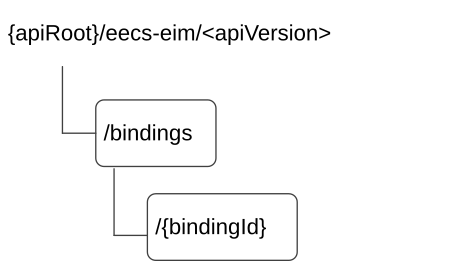

# 9.3.3 Resources

## 9.3.3.1 Overview

This clause describes the structure for the Resource URIs and the resources and methods used for the service.

Figure 9.3.3.1-1 depicts the resource URIs structure for the Eecs_EASInfoManagement API.

Figure 9.3.3.1-1: Resource URI structure of the Eecs_EASInfoManagement API

Table 9.3.3.1-1 provides an overview of the resources and applicable HTTP methods.

Table 9.3.3.1-1: Resources and methods overview

| Resource name                 | Resource URI          | HTTP method or custom operation | Description                                                    |
|-------------------------------|-----------------------|---------------------------------|----------------------------------------------------------------|
| Common EAS Bindings           | /bindings             | GET                             | Retrieve common EAS binding information.                       |
|                               |                       | POST                            | Store a new common EAS binding information.                    |
| Individual Common EAS Binding | /bindings/{bindingId} | GET                             | Retrieve an existing "Individual Common EAS Binding" resource. |
|                               |                       | PUT                             | Update an existing "Individual Common EAS Binding" resource.   |
|                               |                       | DELETE                          | Delete an existing "Individual Common EAS Binding" resource.   |

## 9.3.3.2 Resource: Common EAS Bindings

### 9.3.3.2.1 Description

This resource represents the Common EAS Bindings managed by the ECS.

### 9.3.3.2.2 Resource Definition

Resource URI: **{apiRoot}/eecs-eim/\<apiVersion\>/bindings**

This resource shall support the resource URI variables defined in the table 9.3.3.2.2-1.

Table 9.3.3.2.2-1: Resource URI variables for this resource

| Name    | Data Type | Definition        |
|---------|-----------|-------------------|
| apiRoot | string    | See clause 9.3.1. |

### 9.3.3.2.3 Resource Standard Methods

#### 9.3.3.2.3.1 GET

The HTTP GET method allows a service consumer to retrieve common EAS binding information.

This method shall support the URI query parameters specified in table 9.3.3.2.3.1-1.

Table 9.3.3.2.3.1-1: URI query parameters supported by the GET method on this resource

<table>
<colgroup>
<col style="width: 16%" />
<col style="width: 14%" />
<col style="width: 4%" />
<col style="width: 11%" />
<col style="width: 37%" />
<col style="width: 15%" />
</colgroup>
<tbody>
<tr class="odd">
<td>Name</td>
<td>Data type</td>
<td>P</td>
<td>Cardinality</td>
<td>Description</td>
<td>Applicability</td>
</tr>
<tr class="even">
<td>requestor-id</td>
<td>string</td>
<td>M</td>
<td>1</td>
<td>Represents the identifier of the service consumer.</td>
<td></td>
</tr>
<tr class="odd">
<td>app-group-id</td>
<td>string</td>
<td>M</td>
<td>1</td>
<td>Contains the application group associated with the EAS ID.</td>
<td></td>
</tr>
<tr class="even">
<td>eas-id</td>
<td>string</td>
<td>M</td>
<td>1</td>
<td>Represents the identifier of the EAS, e.g., URI, FQDN.</td>
<td></td>
</tr>
<tr class="odd">
<td>eas-bdl-Id-list</td>
<td>array(string)</td>
<td>O</td>
<td>1..N</td>
<td>Contains a list of associated EAS IDs in an EAS bundle.</td>
<td>EdgeApp_3</td>
</tr>
<tr class="even">
<td>eas-bdl-id</td>
<td>string</td>
<td>O</td>
<td>0..1</td>
<td>
Represents the EAS bundle ID.

(NOTE)
</td>
<td>EdgeApp_3</td>
</tr>
<tr class="odd">
<td>main-eas-id</td>
<td>string</td>
<td>O</td>
<td>0..1</td>
<td>
Represents the identifier of the main EAS in an EAS bundle.

(NOTE)
</td>
<td>EdgeApp_3</td>
</tr>
<tr class="even">
<td>supp-feats</td>
<td>SupportedFeatures</td>
<td>C</td>
<td>0..1</td>
<td>
Contains the list of supported feature(s) among the ones defined in clause 9.3.8.

This query parameter shall be present only when feature negotiation needs to take place.
</td>
<td></td>
</tr>
<tr class="odd">
<td colspan="6">NOTE: These query parameters are mutually exclusive. Only one of them may be present.</td>
</tr>
</tbody>
</table>

This method shall support the request data structures specified in table 9.3.3.2.3.1-2 and the response data structures and response codes specified in table 9.3.3.2.3.1-3.

Table 9.3.3.2.3.1-2: Data structures supported by the GET Request Body on this resource

|           |     |             |             |
|-----------|-----|-------------|-------------|
| Data type | P   | Cardinality | Description |
| n/a       |     |             |             |

Table 9.3.3.2.3.1-3: Data structures supported by the GET Response Body on this resource

<table>
<colgroup>
<col style="width: 16%" />
<col style="width: 4%" />
<col style="width: 11%" />
<col style="width: 14%" />
<col style="width: 52%" />
</colgroup>
<tbody>
<tr class="odd">
<td>Data type</td>
<td>P</td>
<td>Cardinality</td>
<td>
Response

codes
</td>
<td>Description</td>
</tr>
<tr class="even">
<td>CommonEASBindResp</td>
<td>M</td>
<td>1</td>
<td>200 OK</td>
<td>Successful case. The requested Common EAS Binding Information stored in the ECS is returned.</td>
</tr>
<tr class="odd">
<td>n/a</td>
<td></td>
<td></td>
<td>204 No Content</td>
<td>Successful case. There is no Common EAS Binding Information corresponding to the received query parameters.</td>
</tr>
<tr class="even">
<td>n/a</td>
<td></td>
<td></td>
<td>307 Temporary Redirect</td>
<td>
Temporary redirection.

The response shall include a Location header field containing an alternative URI of the resource located in an alternative ECS.

Redirection handling is described in clause 5.2.10 of TS 29.122 [6].
</td>
</tr>
<tr class="odd">
<td>n/a</td>
<td></td>
<td></td>
<td>308 Permanent Redirect</td>
<td>
Permanent redirection.

The response shall include a Location header field containing an alternative URI of the resource located in an alternative ECS.

Redirection handling is described in clause 5.2.10 of TS 29.122 [6].
</td>
</tr>
<tr class="even">
<td colspan="5">NOTE: The mandatory HTTP error status codes for the HTTP GET method listed in table 5.2.6-1 of 3GPP TS 29.122 [6] shall also apply.</td>
</tr>
</tbody>
</table>

Table 9.3.3.2.3.1-4: Headers supported by the 307 Response Code on this resource

|          |           |     |             |                                                                            |
|----------|-----------|-----|-------------|----------------------------------------------------------------------------|
| Name     | Data type | P   | Cardinality | Description                                                                |
| Location | string    | M   | 1           | Contains an alternative URI of the resource located in an alternative ECS. |

Table 9.3.3.2.3.1-5: Headers supported by the 308 Response Code on this resource

|          |           |     |             |                                                                            |
|----------|-----------|-----|-------------|----------------------------------------------------------------------------|
| Name     | Data type | P   | Cardinality | Description                                                                |
| Location | string    | M   | 1           | Contains an alternative URI of the resource located in an alternative ECS. |

#### 9.3.3.2.3.2 POST

The HTTP POST method allows a service consumer to register the common EAS binding information.

This method shall support the URI query parameters specified in table 9.3.3.2.3.2-1.

Table 9.3.3.2.3.2-1: URI query parameters supported by the POST method on this resource

|      |           |     |             |             |
|------|-----------|-----|-------------|-------------|
| Name | Data type | P   | Cardinality | Description |
| n/a  |           |     |             |             |

This method shall support the request data structures specified in table 9.3.3.2.3.2-2 and the response data structures and response codes specified in table 9.3.3.2.3.2-3.

Table 9.3.3.2.3.2-2: Data structures supported by the POST Request Body on this resource

|                  |     |             |                                                |
|------------------|-----|-------------|------------------------------------------------|
| Data type        | P   | Cardinality | Description                                    |
| CommonEASBindReq | M   | 1           | Represents the Common EAS Binding Information. |

Table 9.3.3.2.3.2-3: Data structures supported by the POST Response Body on this resource

<table>
<colgroup>
<col style="width: 16%" />
<col style="width: 9%" />
<col style="width: 14%" />
<col style="width: 19%" />
<col style="width: 39%" />
</colgroup>
<tbody>
<tr class="odd">
<td>Data type</td>
<td>P</td>
<td>Cardinality</td>
<td>
Response

codes
</td>
<td>Description</td>
</tr>
<tr class="even">
<td>CommonEASBindResp</td>
<td>M</td>
<td>1</td>
<td>201 Created</td>
<td>Successful case. The Common EAS Binding information is successfully stored.</td>
</tr>
<tr class="odd">
<td>ProblemDetailsEIMExt</td>
<td>O</td>
<td>0..1</td>
<td>403 Forbidden</td>
<td>
The request is rejected because there is an existing Common EAS Binding information stored in the ECS for the application group.

(NOTE 2)
</td>
</tr>
<tr class="even">
<td colspan="5">
NOTE 1: The mandatory HTTP error status codes for the HTTP POST method listed in Table 5.2.6-1 of 3GPP TS 29.122 [6] shall also apply.

NOTE 2: Failure cases are described in clause 9.3.7.3.
</td>
</tr>
</tbody>
</table>

### 9.3.3.2.4 Resource Custom Operations

There are no resource custom operations defined for this resource in this release of the specification.

## 9.3.3.3 Resource: Individual Common EAS Binding

### 9.3.3.3.1 Description

This resource represents a Common EAS Binding managed by the ECS.

### 9.3.3.3.2 Resource Definition

Resource URI: **{apiRoot}/eecs-eim/\<apiVersion\>/bindings/{bindingId}**

This resource shall support the resource URI variables defined in the table 9.3.3.3.2-1.

Table 9.3.3.3.2-1: Resource URI variables for this resource

| Name      | Data Type | Definition                                                                 |
|-----------|-----------|----------------------------------------------------------------------------|
| apiRoot   | string    | See clause 7.5                                                             |
| bindingId | string    | Represents the identifier of the "Individual Common EAS Binding" resource. |

### 9.3.3.3.3 Resource Standard Methods

#### 9.3.3.3.3.1 GET

The HTTP GET method allows a service consumer to retrieve an existing "Individual Common EAS Binding" resource at the ECS.

This method shall support the URI query parameters specified in table 9.3.3.3.3.1-1.

Table 9.3.3.3.3.1-1: URI query parameters supported by the GET method on this resource

| Name | Data type | P   | Cardinality | Description |
|------|-----------|-----|-------------|-------------|
| n/a  |           |     |             |             |

This method shall support the request data structures specified in table 9.3.3.3.3.1-2 and the response data structures and response codes specified in table 9.3.3.3.3.1-3.

Table 9.3.3.3.3.1-2: Data structures supported by the GET Request Body on this resource

| Data type | P   | Cardinality | Description |
|-----------|-----|-------------|-------------|
| n/a       |     |             |             |

Table 9.3.3.3.3.1-3: Data structures supported by the GET Response Body on this resource

<table>
<colgroup>
<col style="width: 23%" />
<col style="width: 8%" />
<col style="width: 12%" />
<col style="width: 17%" />
<col style="width: 37%" />
</colgroup>
<thead>
<tr class="header">
<th>Data type</th>
<th>P</th>
<th>Cardinality</th>
<th>
Response

codes
</th>
<th>Description</th>
</tr>
</thead>
<tbody>
<tr class="odd">
<td>CommonEASBindingResp</td>
<td>M</td>
<td>1</td>
<td>200 OK</td>
<td>Successful case. The requested "Individual Common EAS Binding" resource is returned.</td>
</tr>
<tr class="even">
<td>n/a</td>
<td></td>
<td></td>
<td>307 Temporary Redirect</td>
<td>
Temporary redirection.

The response shall include a Location header field containing an alternative URI of the resource located in an alternative ECS.

Redirection handling is described in clause 5.2.10 of TS 29.122 [6].
</td>
</tr>
<tr class="odd">
<td>n/a</td>
<td></td>
<td></td>
<td>308 Permanent Redirect</td>
<td>
Permanent redirection.

The response shall include a Location header field containing an alternative URI of the resource located in an alternative ECS.

Redirection handling is described in clause 5.2.10 of TS 29.122 [6].
</td>
</tr>
<tr class="even">
<td colspan="5">NOTE: The mandatory HTTP error status code for the HTTP GET method listed in Table 5.2.6-1 of 3GPP TS 29.122 [6] shall also apply.</td>
</tr>
</tbody>
</table>

Table 9.3.3.3.3.1-4: Headers supported by the 307 Response Code on this resource

| Name     | Data type | P   | Cardinality | Description                                                                |
|----------|-----------|-----|-------------|----------------------------------------------------------------------------|
| Location | string    | M   | 1           | Contains an alternative URI of the resource located in an alternative ECS. |

Table 9.3.3.3.3.1-5: Headers supported by the 308 Response Code on this resource

| Name     | Data type | P   | Cardinality | Description                                                                |
|----------|-----------|-----|-------------|----------------------------------------------------------------------------|
| Location | string    | M   | 1           | Contains an alternative URI of the resource located in an alternative ECS. |

#### 9.3.3.3.3.2 PUT

The HTTP PUT method enables a service consumer to update an existing "Individual Common EAS Binding" resource at the ECS.

This method shall support the URI query parameters specified in the table 9.3.3.3.3.2-1.

Table 9.3.3.3.3.2-1: URI query parameters supported by the PUT method on this resource

| Name | Data type | P   | Cardinality | Description |
|------|-----------|-----|-------------|-------------|
| n/a  |           |     |             |             |

This method shall support the request data structures specified in table 9.3.3.3.3.2-2 and the response data structures and response codes specified in table 9.3.3.3.3.2-3.

Table 9.3.3.3.3.2-2: Data structures supported by the PUT Request Body on this resource

| Data type        | P   | Cardinality | Description                                                                          |
|------------------|-----|-------------|--------------------------------------------------------------------------------------|
| CommonEASBinding | M   | 1           | Contains the updated representation of the "Individual Common EAS Binding" resource. |

Table 9.3.3.3.3.2-3: Data structures supported by the PUT Response Body on this resource

<table>
<colgroup>
<col style="width: 19%" />
<col style="width: 9%" />
<col style="width: 14%" />
<col style="width: 18%" />
<col style="width: 38%" />
</colgroup>
<thead>
<tr class="header">
<th>Data type</th>
<th>P</th>
<th>Cardinality</th>
<th>
Response

codes
</th>
<th>Description</th>
</tr>
</thead>
<tbody>
<tr class="odd">
<td>CommonEASBinding</td>
<td>M</td>
<td>1</td>
<td>200 OK</td>
<td>Successful case. The "Individual Common EAS Binding" resource is successfully updated and a representation of the updated resource is returned in the response body.</td>
</tr>
<tr class="even">
<td>n/a</td>
<td></td>
<td></td>
<td>204 No Content</td>
<td>Successful case. The "Individual Common EAS Binding" resource is successfully updated and no content is returned in the response body.</td>
</tr>
<tr class="odd">
<td>n/a</td>
<td></td>
<td></td>
<td>307 Temporary Redirect</td>
<td>
Temporary redirection.

The response shall include a Location header field containing an alternative URI of the resource located in an alternative ECS.

Redirection handling is described in clause 5.2.10 of TS 29.122 [6].
</td>
</tr>
<tr class="even">
<td>n/a</td>
<td></td>
<td></td>
<td>308 Permanent Redirect</td>
<td>
Permanent redirection.

The response shall include a Location header field containing an alternative URI of the resource located in an alternative ECS.

Redirection handling is described in clause 5.2.10 of TS 29.122 [6].
</td>
</tr>
<tr class="odd">
<td colspan="5">NOTE: The mandatory HTTP error status code for the HTTP PUT method listed in Table 5.2.6-1 of 3GPP TS 29.122 [6] shall also apply.</td>
</tr>
</tbody>
</table>

Table 9.3.3.3.3.2-4: Headers supported by the 307 Response Code on this resource

| Name     | Data type | P   | Cardinality | Description                                                                |
|----------|-----------|-----|-------------|----------------------------------------------------------------------------|
| Location | string    | M   | 1           | Contains an alternative URI of the resource located in an alternative ECS. |

Table 9.3.3.3.3.2-5: Headers supported by the 308 Response Code on this resource

| Name     | Data type | P   | Cardinality | Description                                                                |
|----------|-----------|-----|-------------|----------------------------------------------------------------------------|
| Location | string    | M   | 1           | Contains an alternative URI of the resource located in an alternative ECS. |

#### 9.3.3.3.3.3 PATCH

The HTTP PATCH method allows a service consumer to request the modification of an existing "Individual Common EAS Binding" resource at the ECS.

This method shall support the URI query parameters specified in table 9.3.3.3.3.3-1.

Table 9.3.3.3.3.3-1: URI query parameters supported by the PATCH method on this resource

|      |           |     |             |             |               |
|------|-----------|-----|-------------|-------------|---------------|
| Name | Data type | P   | Cardinality | Description | Applicability |
| n/a  |           |     |             |             |               |

This method shall support the request data structures specified in table 9.3.3.3.3.3-2 and the response data structures and response codes specified in table 9.3.3.3.3.3-3.

Table 9.3.3.3.3.3-2: Data structures supported by the PATCH Request Body on this resource

|                       |     |             |                                                                                                        |
|-----------------------|-----|-------------|--------------------------------------------------------------------------------------------------------|
| Data type             | P   | Cardinality | Description                                                                                            |
| CommonEASBindingPatch | M   | 1           | Represents the parameters to request the modification of the "Individual Common EAS Binding" resource. |

Table 9.3.3.3.3.3-3: Data structures supported by the PATCH Response Body on this resource

<table>
<colgroup>
<col style="width: 22%" />
<col style="width: 4%" />
<col style="width: 11%" />
<col style="width: 14%" />
<col style="width: 47%" />
</colgroup>
<tbody>
<tr class="odd">
<td>Data type</td>
<td>P</td>
<td>Cardinality</td>
<td>
Response

codes
</td>
<td>Description</td>
</tr>
<tr class="even">
<td>CommonEASBinding</td>
<td>M</td>
<td>1</td>
<td>200 OK</td>
<td>Successful case. The "Individual Common EAS Binding" resource is successfully modified and a representation of the updated resource shall be returned in the response body.</td>
</tr>
<tr class="odd">
<td>n/a</td>
<td></td>
<td></td>
<td>204 No Content</td>
<td>Successful case. The "Individual Common EAS Binding" resource is successfully modified and no content is returned in the response body.</td>
</tr>
<tr class="even">
<td>n/a</td>
<td></td>
<td></td>
<td>307 Temporary Redirect</td>
<td>
Temporary redirection.

The response shall include a Location header field containing an alternative URI of the resource located in an alternative ECS.

Redirection handling is described in clause 5.2.10 of 3GPP TS 29.122 [6].
</td>
</tr>
<tr class="odd">
<td>n/a</td>
<td></td>
<td></td>
<td>308 Permanent Redirect</td>
<td>
Permanent redirection.

The response shall include a Location header field containing an alternative URI of the resource located in an alternative ECS.

Redirection handling is described in clause 5.2.10 of 3GPP TS 29.122 [6].
</td>
</tr>
<tr class="even">
<td colspan="5">NOTE: The mandatory HTTP error status codes for the HTTP PATCH method listed in table 5.2.6-1 of 3GPP TS 29.122 [6] shall also apply.</td>
</tr>
</tbody>
</table>

Table 9.3.3.3.3.3-4: Headers supported by the 307 Response Code on this resource

|          |           |     |             |                                                                            |
|----------|-----------|-----|-------------|----------------------------------------------------------------------------|
| Name     | Data type | P   | Cardinality | Description                                                                |
| Location | string    | M   | 1           | Contains an alternative URI of the resource located in an alternative ECS. |

Table 9.3.3.3.3.3-5: Headers supported by the 308 Response Code on this resource

|          |           |     |             |                                                                            |
|----------|-----------|-----|-------------|----------------------------------------------------------------------------|
| Name     | Data type | P   | Cardinality | Description                                                                |
| Location | string    | M   | 1           | Contains an alternative URI of the resource located in an alternative ECS. |

#### 9.3.3.3.3.4 DELETE

The HTTP DELETE method enables a service consumer to delete an existing "Individual Common EAS Binding" resource at the ECS.

This method shall support the URI query parameters specified in the table 9.3.3.3.3.4-1.Table 9.3.3.3.3.4-1: URI query parameters supported by the DELETE method on this resource

| Name | Data type | P   | Cardinality | Description |
|------|-----------|-----|-------------|-------------|
| n/a  |           |     |             |             |

This method shall support the request data structures specified in table 9.3.3.3.3.3-2 and the response data structures and response codes specified in table 9.3.3.3.3.3-3.

Table 9.3.3.3.3.3-2: Data structures supported by the DELETE Request Body on this resource

| Data type | P   | Cardinality | Description |
|-----------|-----|-------------|-------------|
| n/a       |     |             |             |

Table 9.3.3.3.3.3-3: Data structures supported by the DELETE Response Body on this resource

<table>
<colgroup>
<col style="width: 16%" />
<col style="width: 9%" />
<col style="width: 14%" />
<col style="width: 19%" />
<col style="width: 39%" />
</colgroup>
<thead>
<tr class="header">
<th>Data type</th>
<th>P</th>
<th>Cardinality</th>
<th>
Response

codes
</th>
<th>Description</th>
</tr>
</thead>
<tbody>
<tr class="odd">
<td>n/a</td>
<td></td>
<td></td>
<td>204 No Content</td>
<td>Successful case. The "Individual Common EAS Binding" resource is successfully deleted.</td>
</tr>
<tr class="even">
<td>n/a</td>
<td></td>
<td></td>
<td>307 Temporary Redirect</td>
<td>
Temporary redirection.

The response shall include a Location header field containing an alternative URI of the resource located in an alternative ECS.

Redirection handling is described in clause 5.2.10 of TS 29.122 [6].
</td>
</tr>
<tr class="odd">
<td>n/a</td>
<td></td>
<td></td>
<td>308 Permanent Redirect</td>
<td>
Permanent redirection.

The response shall include a Location header field containing an alternative URI of the resource located in an alternative ECS.

Redirection handling is described in clause 5.2.10 of TS 29.122 [6].
</td>
</tr>
<tr class="even">
<td colspan="5">NOTE: The mandatory HTTP error status code for the HTTP DELETE method listed in Table 5.2.6-1 of 3GPP TS 29.122 [6] shall also apply.</td>
</tr>
</tbody>
</table>

Table 9.3.3.3.3.3-4: Headers supported by the 307 Response Code on this resource

| Name     | Data type | P   | Cardinality | Description                                                                |
|----------|-----------|-----|-------------|----------------------------------------------------------------------------|
| Location | string    | M   | 1           | Contains an alternative URI of the resource located in an alternative ECS. |

Table 9.3.3.3.3.3-5: Headers supported by the 308 Response Code on this resource

| Name     | Data type | P   | Cardinality | Description                                                                |
|----------|-----------|-----|-------------|----------------------------------------------------------------------------|
| Location | string    | M   | 1           | Contains an alternative URI of the resource located in an alternative ECS. |
