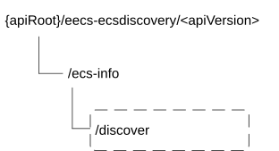

# 9.5 Eecs_ECSDiscovery API

## 9.5.1 Introduction

The Eecs_ECSDiscovery service shall use the Eecs_ECSDiscovery API.

The API URI of the Eecs_ECSDiscovery API shall be:

**{apiRoot}/\<apiName\>/\<apiVersion\>**

The request URIs used in HTTP requests shall have the Resource URI structure as defined in clause 5.2.4 of 3GPP TS 29.122 \[6\], i.e.:

**{apiRoot}/\<apiName\>/\<apiVersion\>/\<apiSpecificResourceUriPart\>**

with the following components:

\- The {apiRoot} shall be set as described in clause 5.2.4 of 3GPP TS 29.122 \[6\].

\- The \<apiName\> shall be "eecs-ecsdiscovery".

\- The \<apiVersion\> shall be "v1".

\- The \<apiSpecificResourceUriPart\> shall be set as described in clause 5.2.4 of 3GPP TS 29.122 \[6\].

## 9.5.2 Resources

### 9.5.2.1 Overview

This clause describes the structure for the Resource URIs and the resources and methods used for the service.

Figure 9.5.2.1-1 depicts the resource URIs structure for the Eecs_ECSDiscovery API.

Figure 9.5.2.1-1: Resource URI structure of the Eecs_ECSDiscovery API

Table 9.5.2.1-1 provides an overview of the resources and applicable HTTP methods.

Table 9.5.2.1-1: Resources and methods overview

| Resource name   | Resource URI | HTTP method or custom operation | Description                       |
|-----------------|--------------|---------------------------------|-----------------------------------|
| ECS Information | /ecs-info    | Discover                        | Retrieve partner ECS information. |

### 9.5.2.2 Resource: ECS Information

#### 9.5.2.2.1 Description

This resource represents the collection of ECS Information managed by the ECS.

#### 9.5.2.2.2 Resource Definition

Resource URI: **{apiRoot}/eecs-ecsdiscovery/\<apiVersion\>/ecs-info**

This resource shall support the resource URI variables defined in the table 9.5.2.2.2-1.

Table 9.5.2.2.2-1: Resource URI variables for this resource

| Name    | Data Type | Definition        |
|---------|-----------|-------------------|
| apiRoot | string    | See clause 9.5.1. |

#### 9.5.2.2.3 Resource Standard Methods

There are no resource standard methods defined for this resource in this release of the specification.

#### 9.5.2.2.4 Resource Custom Operations

##### 9.5.2.2.4.1 Overview

Table 9.5.2.4.4.1-1 specifies the custom operations defined on this resource.

Table 9.5.2.2.4.1-1: Custom operations

| Operation name | Custom operaration URI | Mapped HTTP method | Description                     |
|----------------|------------------------|--------------------|---------------------------------|
| Discover       | /ecs-info/discover     | POST               | Request partner ECS information |

##### 9.5.2.2.4.2 Operation: Discover

###### 9.5.2.2.4.2.1 Description

The custom operation allows a service consumer to request ECS information from the ECS.

###### 9.5.2.2.4.2.2 Operation Definition

This operation shall support the request of data structures specified in table 9.5.2.2.4.2.2-1 and the response data structure and response codes specified in table 9.5.2.2.4.2.2-2.

Table 9.5.2.2.4.2.2-1: Data structures supported by the POST Request Body on this resource

|                     |     |             |                                                                |
|---------------------|-----|-------------|----------------------------------------------------------------|
| Data type           | P   | Cardinality | Description                                                    |
| ECSInfoDiscoveryReq | M   | 1           | Contains the necessary information to request ECS information. |

Table 9.5.2.2.4.2.2-2: Data structures supported by the POST Response Body on this resource

<table>
<colgroup>
<col style="width: 16%" />
<col style="width: 5%" />
<col style="width: 11%" />
<col style="width: 11%" />
<col style="width: 54%" />
</colgroup>
<tbody>
<tr class="odd">
<td>Data type</td>
<td>P</td>
<td>Cardinality</td>
<td>
Response

codes
</td>
<td>Description</td>
</tr>
<tr class="even">
<td>ECSInfoDiscoveryResp</td>
<td>M</td>
<td>1</td>
<td>200 OK</td>
<td>The requested ECS discovery information was successfully returned.</td>
</tr>
<tr class="odd">
<td>n/a</td>
<td></td>
<td></td>
<td>204 No Content</td>
<td>The processing of the request is successful but no matching ECS was found.</td>
</tr>
<tr class="even">
<td>n/a</td>
<td></td>
<td></td>
<td>307 Temporary Redirect</td>
<td>
Temporary redirection.

The response shall include a Location header field containing an alternative URI of the resource custom operation located in an alternative ECS.

Redirection handling is described in clause 5.2.10 of 3GPP TS 29.122 [3].
</td>
</tr>
<tr class="odd">
<td>n/a</td>
<td></td>
<td></td>
<td>308 Permanent Redirect</td>
<td>
Permanent redirection.

The response shall include a Location header field containing an alternative URI of the resource custom operation located in an alternative ECS.

Redirection handling is described in clause 5.2.10 of 3GPP TS 29.122 [3].
</td>
</tr>
<tr class="even">
<td colspan="5">NOTE: The mandatory HTTP error status code for the POST method listed in Table 5.2.6-1 of 3GPP TS 29.122 [3] also apply.</td>
</tr>
</tbody>
</table>

Table 9.5.2.2.4.2.2-3: Headers supported by the 307 Response Code on this resource custom operation

|          |           |     |             |                                                                                             |
|----------|-----------|-----|-------------|---------------------------------------------------------------------------------------------|
| Name     | Data type | P   | Cardinality | Description                                                                                 |
| Location | string    | M   | 1           | Contains an alternative URI of the resource custom operation located in an alternative ECS. |

Table 9.5.2.2.4.2.2-4: Headers supported by the 308 Response Code on this resource custom operation

|          |           |     |             |                                                                                             |
|----------|-----------|-----|-------------|---------------------------------------------------------------------------------------------|
| Name     | Data type | P   | Cardinality | Description                                                                                 |
| Location | string    | M   | 1           | Contains an alternative URI of the resource custom operation located in an alternative ECS. |

## 9.5.3 Custom Operations without associated resources

There are no custom Operations without associated resources defined for this API in this release of the specification.

## 9.5.4 Notifications

### 9.5.4.1 General

Table 9.5.4.1-1: Notifications overview

<table>
<colgroup>
<col style="width: 33%" />
<col style="width: 27%" />
<col style="width: 13%" />
<col style="width: 25%" />
</colgroup>
<thead>
<tr class="header">
<th>Notification</th>
<th>Callback URI</th>
<th>HTTP method or custom operation</th>
<th>
Description

(service operation)
</th>
</tr>
</thead>
<tbody>
<tr class="odd">
<td>ECS Discovery Notification</td>
<td>{notifUri}</td>
<td>POST</td>
<td>Enables the ECS to notify a previously subscribed service consumer on partner ECS information.</td>
</tr>
</tbody>
</table>

### 9.5.4.2 ECS Discovery Notification

#### 9.5.4.2.1 Description

The ECS Discovery Notification service operation is used by the ECS to notify a previously subscribed service consumer on partner ECS information.

#### 9.5.4.2.2 Target URI

The callback URI **{notifUri}** shall be used with the callback URI variables defined in table 9.5.4.2.2-1.

Table 9.5.4.2.2-1: Callback URI variables

| Name     | Data type | Definition                                                          |
|----------|-----------|---------------------------------------------------------------------|
| notifUri | Uri       | Represents the callback URI encoded as a string formatted as a URI. |

#### 9.5.4.2.3 Standard Methods

##### 9.5.4.2.3.1 POST

This method shall support the request data structures specified in table 9.5.4.2.3.1-1 and the response data structures and response codes specified in table 9.5.4.2.3.1-2.

Table 9.5.4.2.3.1-1: Data structures supported by the POST Request Body on this resource

| Data type        | P   | Cardinality | Description                      |
|------------------|-----|-------------|----------------------------------|
| EcsInfoDiscNotif | M   | 1           | Notification of ECS information. |

Table 9.5.4.2.3.1-2: Data structures supported by the POST Response Body on this resource

<table>
<colgroup>
<col style="width: 20%" />
<col style="width: 4%" />
<col style="width: 12%" />
<col style="width: 15%" />
<col style="width: 47%" />
</colgroup>
<thead>
<tr class="header">
<th>Data type</th>
<th>P</th>
<th>Cardinality</th>
<th>Response codes</th>
<th>Description</th>
</tr>
</thead>
<tbody>
<tr class="odd">
<td>n/a</td>
<td></td>
<td></td>
<td>204 No Content</td>
<td>Successful case. The notification is successfully received and acknowledged.</td>
</tr>
<tr class="even">
<td>n/a</td>
<td></td>
<td></td>
<td>307 Temporary Redirect</td>
<td>
Temporary redirection.

The response shall include a Location header field containing an alternative target URI representing the end point of an alternative service consumer towards which the notification should be sent.

Redirection handling is described in clause 5.2.10 of TS 29.122 [6].
</td>
</tr>
<tr class="odd">
<td>n/a</td>
<td></td>
<td></td>
<td>308 Permanent Redirect</td>
<td>
Permanent redirection.

The response shall include a Location header field containing an alternative URI representing the end point of an alternative service consumer towards which the notification should be sent.

Redirection handling is described in clause 5.2.10 of TS 29.122 [6].
</td>
</tr>
<tr class="even">
<td colspan="5">NOTE: The mandatory HTTP error status codes for the HTTP POST method listed in Table 5.2.6-1 of 3GPP TS 29.122 [6] shall also apply.</td>
</tr>
</tbody>
</table>

Table 9.5.4.4.3.1-3: Headers supported by the 307 Response Code on this resource

|          |           |     |             |                                                                                                                                                       |
|----------|-----------|-----|-------------|-------------------------------------------------------------------------------------------------------------------------------------------------------|
| Name     | Data type | P   | Cardinality | Description                                                                                                                                           |
| Location | string    | M   | 1           | Contains an alternative target URI representing the end point of an alternative service consumer towards which the notification should be redirected. |

Table 9.5.4.4.3.1-4: Headers supported by the 308 Response Code on this resource

|          |           |     |             |                                                                                                                                                       |
|----------|-----------|-----|-------------|-------------------------------------------------------------------------------------------------------------------------------------------------------|
| Name     | Data type | P   | Cardinality | Description                                                                                                                                           |
| Location | string    | M   | 1           | Contains an alternative target URI representing the end point of an alternative service consumer towards which the notification should be redirected. |

## 9.5.5 Data Model

### 9.5.5.1 General

This clause specifies the application data model supported by the API. Data types listed in clause 7.2 apply to this API.

Table 9.5.5.1-1 specifies the data types defined specifically for the Eecs_ECSDiscovery API.

Table 9.5.5.1-1: Eecs_ECSDiscovery API specific Data Types

| Data type            | Section defined | Description                                                                             | Applicability |
|----------------------|-----------------|-----------------------------------------------------------------------------------------|---------------|
| EcsInfo              | 9.5.5.2.4       | Represents the discovered ECS information.                                              |               |
| EcsInfoDiscNotif     | 9.5.5.2.9       | Represents the ECS Discovery notification information                                   |               |
| EcsInfoDiscoveryReq  | 9.5.5.2.2       | Represents the ECS Discovery request information.                                       |               |
| EcsInfoDiscoveryResp | 9.5.5.2.3       | Represents the ECS Discovery response information.                                      |               |
| ECSProfile           | 9.5.5.2.5       | Represents the profile information related to the ECS in the ECSRegistration data type. |               |
| PduConfiguration     | 9.5.5.2.8       | Represents information to establish PDU session with ECS.                               |               |
| SupportedEcsp        | 9.5.5.2.7       | Represents the ECSP Information associated to PLMN.                                     |               |
| SupportedPlmn        | 9.5.5.2.6       | Represents the PLMN information.                                                        |               |

Table 9.5.5.1-2 specifies data types re-used by the Eecs_ECSDiscovery API service, including a reference to their respective specifications, and when needed, a short description of their use within the Eecs_ECSDiscovery API.

Table 9.5.5.1-2: Eecs_ECSDiscovery re-used Data Types

| Data type           | Reference             | Comments                                                                                                                                                                 | Applicability |
|---------------------|-----------------------|--------------------------------------------------------------------------------------------------------------------------------------------------------------------------|---------------|
| ACProfile           | 3GPP TS 24.558 \[14\] | Represents the AC profiles filter information.                                                                                                                           |               |
| ConnectivityInfo    | 3GPP TS 24.558 \[14\] | Represents to represent the connectivity information of the UE.                                                                                                          |               |
| DateTime            | 3GPP TS 29.122 \[6\]  | Represents a date and a time.                                                                                                                                            |               |
| Dnn                 | 3GPP TS 29.571 \[8\]  | Represents the Dnn information                                                                                                                                           |               |
| EndPoint            | 8.1.5.2.5             | Represents the end point information of the ECS in the ECS profile.                                                                                                      |               |
| LocationInfo        | 3GPP TS 29.122 \[6\]  | Represents the location information of the UE in the ECS discovery request and subscriptions.                                                                            |               |
| PlmnIdNid           | 3GPP TS 29. 571 \[8\] | Represents the network, i.e., PLMN Identifier or the SNPN Identifier (the PLMN Identifier and the NID). Used to indicate the PLMN supporting information in ECS profile. |               |
| Snssai              | 3GPP TS 29.571 \[8\]  | Represents the Snssai information.                                                                                                                                       |               |
| SpatialValidityCond | 3GPP TS 29.571 \[8\]  | Represents the spatial validity conditions.                                                                                                                              |               |
| SupportedFeatures   | 3GPP TS 29.571 \[8\]  | Represents the list of supported feature(s) and used to negotiate the applicability of the optional features.                                                            |               |
| Uri                 | 3GPP TS 29.122 \[6\]  | Represents a URI.                                                                                                                                                        |               |

### 9.5.5.2 Structured data types

#### 9.5.5.2.1 Introduction

This clause defines the structures to be used in resource representations.

#### 9.5.5.2.2 Type: EcsInfoDiscoveryReq

Table 9.5.5.2.2-1: Definition of type EcsInfoDiscoveryReq

<table>
<colgroup>
<col style="width: 14%" />
<col style="width: 14%" />
<col style="width: 4%" />
<col style="width: 10%" />
<col style="width: 35%" />
<col style="width: 20%" />
</colgroup>
<thead>
<tr class="header">
<th>Attribute name</th>
<th>Data type</th>
<th>P</th>
<th>Cardinality</th>
<th>Description</th>
<th>Applicability</th>
</tr>
</thead>
<tbody>
<tr class="odd">
<td>ecsAddr</td>
<td>EndPoint</td>
<td>M</td>
<td>1</td>
<td>Represents end point information (e.g. URI, FQDN, IP address) of the requesting ECS.</td>
<td></td>
</tr>
<tr class="even">
<td>acProfs</td>
<td>array(ACProfile)</td>
<td>O</td>
<td>1..N</td>
<td>AC Profiles filter information about the required services.</td>
<td></td>
</tr>
<tr class="odd">
<td>connInf</td>
<td>array(ConnectivityInfo)</td>
<td>O</td>
<td>1..N</td>
<td>List of connectivity information for the UE.</td>
<td></td>
</tr>
<tr class="even">
<td>ueLoc</td>
<td>array(LocationInfo)</td>
<td>O</td>
<td>1..N</td>
<td>
Location information of the UE for which the services are required.

(NOTE)
</td>
<td></td>
</tr>
<tr class="odd">
<td>notifUri</td>
<td>Uri</td>
<td>O</td>
<td>0..1</td>
<td>Contains the URI via which the ECS Discovery notifications shall be delivered.</td>
<td></td>
</tr>
<tr class="even">
<td>duration</td>
<td>DateTime</td>
<td>O</td>
<td>0..1</td>
<td>Represents the time duration over which the service consumer expects the ECS to provide ECS Discovery notifications.</td>
<td></td>
</tr>
<tr class="odd">
<td>suppFeat</td>
<td>SupportedFeatures</td>
<td>C</td>
<td>0..1</td>
<td>
Represents a list of Supported features used as described in clause 9.5.7.

This attribute shall be present only when feature negotiation needs to take place.
</td>
<td></td>
</tr>
<tr class="even">
<td>appGrpId</td>
<td>string</td>
<td>O</td>
<td>0..1</td>
<td>Contains the application group identifier.</td>
<td>EdgeApp_3</td>
</tr>
<tr class="odd">
<td colspan="6">NOTE: In this release of the specification, only one element within the array data structure may be provided.</td>
</tr>
</tbody>
</table>

#### 9.5.5.2.3 Type: EcsInfoDiscoveryResp

Table 9.5.5.2.3-1: Definition of type EcsInfoDiscoveryResp

| Attribute name | Data type      | P   | Cardinality | Description                                   | Applicability |
|----------------|----------------|-----|-------------|-----------------------------------------------|---------------|
| ecsInfo        | array(EcsInfo) | M   | 1..N        | Contains the list of partner ECS information. |               |

#### 9.5.5.2.4 Type: EcsInfo

Table 9.5.5.2.4-1: Definition of type EcsInfo

| Attribute name | Data type  | P   | Cardinality | Description                                                                  | Applicability |
|----------------|------------|-----|-------------|------------------------------------------------------------------------------|---------------|
| ecs            | ECSProfile | M   | 1           | Contains the ECS profile information.                                        |               |
| lifeTime       | DateTime   | O   | 0..1        | Indicates the time duration for which the provided ECS information is valid. |               |

#### 9.5.5.2.5 Type: ECSProfile

Table 9.5.5.2.5-1: Definition of type ECSProfile

| Attribute name | Data type            | P   | Cardinality | Description                                                                                                        | Applicability |
|----------------|----------------------|-----|-------------|--------------------------------------------------------------------------------------------------------------------|---------------|
| endPt          | EndPoint             | M   | 1           | Endpoint information (e.g. URI, FQDN, IP address) used to communicate with the ECS.                                |               |
| ecspId         | string               | O   | 0..1        | The identifier of the ECSP (e.g. the mobile network operator or 3rd party service provider) that provides the ECS. |               |
| splVal         | SpatialValidityCond  | O   | 0..1        | The spatial validity conditions.                                                                                   |               |
| suppPlmns      | array(SupportedPlmn) | O   | 1..N        | List of PLMNs and the associated ECSPs for which the ECS can provide the EDN configuration information.            |               |

#### 9.5.5.2.6 Type: SupportedPlmn

Table 9.5.5.2.6-1: Definition of type SupportedPlmn

| Attribute name | Data type            | P   | Cardinality | Description                                                                                | Applicability |
|----------------|----------------------|-----|-------------|--------------------------------------------------------------------------------------------|---------------|
| plmnId         | PlmnIdNid            | O   | 0..1        | The identifier of the PLMN for which EDN configuration information can be provided by ECS. |               |
| suppEcsps      | array(SupportedEcsp) | O   | 1..N        | The information of ECSP(s) associated to the PLMN identified by "plmnId" attribute.        |               |
| pduConf        | PduConfiguration     | O   | 0..1        | DNN and S-NSSAI information for roaming UEs to establish PDU sessions with the ECS.        |               |

#### 9.5.5.2.7 Type: SupportedEcsp

Table 9.5.5.2.7-1: Definition of type SupportedEcsp

| Attribute name | Data type     | P   | Cardinality | Description                                                                                                  | Applicability |
|----------------|---------------|-----|-------------|--------------------------------------------------------------------------------------------------------------|---------------|
| ecspId         | string        | M   | 1           | The identifier of an ECSP                                                                                    |               |
| easIds         | array(string) | M   | 1..N        | The list of EAS IDs available or expected to be available through the ECSP identified by "ecspId" attribute. |               |

#### 9.5.5.2.8 Type: PduConfiguration

Table 9.5.5.2.8-1: Definition of type PduConfiguration

| Attribute name | Data type | P   | Cardinality | Description                                                               | Applicability |
|----------------|-----------|-----|-------------|---------------------------------------------------------------------------|---------------|
| snssai         | Snssai    | M   | 1           | Indicates the S-NSSAI information to establish PDU sessions with the ECS. |               |
| dnn            | Dnn       | M   | 1           | Indicates the DNN information to establish PDU sessions with the ECS.     |               |

#### 9.5.5.2.9 Type: EcsInfoDiscNotif

Table 9.5.5.2.9-1: Definition of type EcsInfoDiscNotif

| Attribute name | Data type      | P   | Cardinality | Description                                   | Applicability |
|----------------|----------------|-----|-------------|-----------------------------------------------|---------------|
| ecsInfo        | array(EcsInfo) | M   | 1..N        | Contains the list of partner ECS information. |               |

### 9.5.5.3 Simple data types and enumerations

#### 9.5.5.3.1 Introduction

This clause defines simple data types and enumerations that can be referenced from data structures defined in the previous clauses.

#### 9.5.5.3.2 Simple data types

The simple data types defined in table 9.5.5.3.2-1 shall be supported.

Table 9.5.5.3.2-1: Simple data types

|           |                 |             |               |
|-----------|-----------------|-------------|---------------|
| Type Name | Type Definition | Description | Applicability |
|           |                 |             |               |

### 9.5.5.4 Data types describing alternative data types or combinations of data types

There are no data types describing alternative data types or combinations of data types defined for this API in this release of the specification.

### 9.5.5.5 Binary data

#### 9.5.5.5.1 Binary Data Types

Table 9.5.5.5.1-1: Binary Data Types

| Name | Clause defined | Content type |
|------|----------------|--------------|
|      |                |              |

## 9.5.6 Error Handling

### 9.5.6.1 General

For the Eecs_ECSDiscovery API, HTTP error responses shall be supported as specified in clause 5.2.6 of 3GPP TS 29.122 \[3\]. Protocol errors and application errors specified in clause 5.2.6 of 3GPP TS 29.122 \[3\] shall be supported for the HTTP status codes specified in table 5.2.6-1 of 3GPP TS 29.122 \[3\].

In addition, the requirements in the following clauses are applicable for the Eecs_ECSDiscovery API.

### 9.5.6.2 Protocol Errors

No specific protocol errors for the Eecs_ECSDiscovery API are specified.

### 9.5.6.3 Application Errors

The application errors defined for the Eecs_ECSDiscovery service are listed in Table 9.5.6.3-1.

Table 9.5.6.1-1: Application errors

| Application Error | HTTP status code | Description |
|-------------------|------------------|-------------|
|                   |                  |             |

## 9.5.7 Feature negotiation

General feature negotiation procedures are defined in clause 7.8. Table 9.5.7-1 lists the supported features for Eecs_ECSDiscovery API.

Table 9.5.7-1: Supported Features

<table>
<colgroup>
<col style="width: 16%" />
<col style="width: 23%" />
<col style="width: 60%" />
</colgroup>
<thead>
<tr class="header">
<th>Feature number</th>
<th>Feature Name</th>
<th>Description</th>
</tr>
</thead>
<tbody>
<tr class="odd">
<td>1</td>
<td>EdgeApp_3</td>
<td>
This feature indicates the support of the second set of enhancements to the Edge Applications Enabler Layer.

Within this feature, the following enhancements are covered:

- Support of providing the application group identifier in the ECS Information discovery request.
</td>
</tr>
</tbody>
</table>
