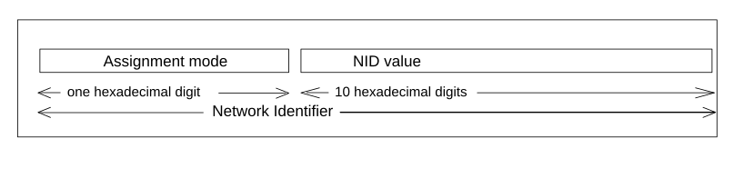
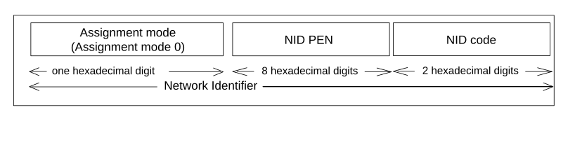

# 12 Identification of PLMN, RNC, Service Area, CN domain and Shared Network Area

The following clauses describe identifiers which are used by both the CN and the UTRAN across the Iu interface. For identifiers which are solely used within the UTRAN, see TS 25.401 \[16\].

NOTE: in the following clauses, the double vertical bar notation \|\| indicates the concatenation operator.

## 12.1 PLMN Identifier

A Public Land Mobile Network is uniquely identified by its PLMN identifier. PLMN-Id consists of Mobile Country Code (MCC) and Mobile Network Code (MNC).

\- PLMN-Id = MCC \|\| MNC

The MCC and MNC are predefined within a UTRAN, and set in the RNC via O&M.

## 12.2 CN Domain Identifier

A CN Domain Edge Node is identified within the UTRAN by its CN Domain Identifier. The CN Domain identifier is used over UTRAN interfaces to identify a particular CN Domain Edge Node for relocation purposes. The CN Domain identifier for Circuit Switching (CS) consists of the PLMN-Id and the LAC, whereas for Packet Switching (PS) it consists of the PLMN-Id, the LAC, and the RAC of the first accessed cell in the target RNS.

The two following CN Domain Identifiers are defined:

\- CN CS Domain-Id = PLMN-Id \|\| LAC

\- CN PS Domain-Id = PLMN-Id \|\| LAC \|\| RAC

The LAC and RAC are defined by the operator, and set in the RNC via O&M.

For the syntax description and the use of this identifier in RANAP signalling, see TS 25.413 \[17\].

## 12.3 CN Identifier

A CN node is uniquely identified within a PLMN by its CN Identifier (CN-Id). The CN-Id together with the PLMN identifier globally identifies the CN node. The CN-Id together with the PLMN-Id is used as the CN node identifier in RANAP signalling over the Iu interface.

\- Global CN-Id = PLMN-Id \|\| CN-Id

The CN-Id is defined by the operator, and set in the nodes via O&M.

For the syntax description and the use of this identifier in RANAP signalling, see TS 25.413 \[17\].

## 12.4 RNC Identifier

An RNC node is uniquely identified by its RNC Identifier (RNC-Id). The RNC-Id of an RNC is used in the UTRAN, in a GERAN which is operating in GERAN Iu mode and between them. A BSC which is part of a GERAN operating in Iu mode is uniquely identified by its RNC Identifier (RNC-Id). The RNC-Id of a BSC is used in a GERAN which is operating in GERAN Iu mode, in the UTRAN and between them. RNC-Id together with the PLMN identifier globally identifies the RNC. The RNC-Id on its own or the RNC-Id together with the PLMN-Id is used as the RNC identifier in the UTRAN Iub, Iur and Iu interfaces. The SRNC-Id is the RNC-Id of the SRNC. The C-RNC-Id is the RNC‑Id of the controlling RNC. The D-RNC-Id is the RNC Id of the drift RNC.

\- Global RNC-Id = PLMN-Id \|\| RNC-Id

The RNC-Id is defined by the operator, and set in the RNC via O&M

For the syntax description and the use of this identifier in RANAP signalling, see TS 25.413 \[17\].

For the usage of this identifier on Iur-g, see TS 43.130 \[43\].

## 12.5 Service Area Identifier

The Service Area Identifier (SAI) is used to identify an area consisting of one or more cells belonging to the same Location Area. Such an area is called a Service Area and can be used for indicating the location of a UE to the CN.

The Service Area Code (SAC) together with the PLMN-Id and the LAC constitute the Service Area Identifier.

\- SAI = PLMN-Id \|\| LAC \|\| SAC

The SAC is defined by the operator, and set in the RNC via O&M.

For the syntax description and the use of this identifier in RANAP signalling, see TS 25.413 \[17\]. TS 25.423 \[37\] and TS 25.419 \[38\] define the use of this identifier in RNSAP and SABP signalling.

A cell may belong to one or two Service Areas. If it belongs to two Service Areas, one is applicable in the Broadcast (BC) domain and the other is applicable in both the CS and PS domains.

The Broadcast (BC) domain requires that its Service Areas each consist of only one cell. This does not limit the use of Service Areas for other domains. Refer to TS 25.410 \[39\] for a definition of the BC domain.

## 12.6 Shared Network Area Identifier

The Shared Network Area Identifier (SNA-Id) is used to identify an area consisting of one or more Location Areas. Such an area is called a Shared Network Area and can be used to grant access rights to parts of a Shared Network to a UE in connected mode (see TS 25.401 \[39\]).

The Shared Network Area Identifier consists of the PLMN-Id followed by the Shared Network Area Code (SNAC).

\- SNA-Id = PLMN-Id \|\| SNAC

The SNAC is defined by the operator.

For the syntax description and the use of this identifier in RANAP signalling, see TS 25.413 \[17\].

## 12.7 Stand-Alone Non-Public Network Identifier

### 12.7.1 Network Identifier (NID)

A Stand-Alone Non-Public Network (SNPN) is identified by a combination of PLMN-Identifier (see clause 12.1) and Network Identifier (NID) (see TS 23.501 \[119\] clause 5.30.2).

The NID shall consist of 11 hexadecimal digits, one digit for representing an assignment mode and 10 digits for a NID value, as shown in figure 12.7.1-1.

Figure 12.7.1-1: Network Identifier (NID)

The NID can be assigned using the following assignment models:

a\) Self-assignment: NIDs are chosen individually by SNPNs at deployment time; this assignment model is encoded by setting the assignment mode to value 1.

b\) Coordinated assignment: NIDs are assigned using one of the following two options:

\- option 1: the NID assigned such that it is globally unique independent of the PLMN ID used. Option 1 of this assignment model is encoded by setting the assignment mode to value 0.

\- option 2: the NID assigned such that the combination of the NID and the PLMN ID is globally unique. Option 2 of this assignment model is encoded by setting the assignment mode to value 2.

The self-assignment NID model should not be used, if UE accesses SNPN using e.g. credentials from Credentials Holder via AAA Server, as specified in clause 5.30.2.1 in TS 23.501 \[119\].

Other Assignment mode values are spare, for future use.

### 12.7.2 NID of assignment mode 0

The NID value of a NID of the assignment mode 0 consists of a NID PEN and a NID code, as shown in figure 12.7.2-1.

The NID PEN is a private enterprise number issued to service provider of the SNPN by Internet Assigned Numbers Authority (IANA) in its capacity as the private enterprise number administrator, as maintained at https://www.iana.org/assignments/enterprise-numbers/enterprise-numbers

Note: The private enterprise number issued by IANA is a decimal number that needs to be converted to a fixed length 8 digit hexadecimal number when used within the NID. E.g. 32473 is converted to 00007ed9.

The NID code identifies the SNPN within the service provider identified by the NID PEN.

Figure 12.7.2-1: NID of assignment mode 0

### 12.7.3 Group ID for Network Selection (GIN)

The "Group ID for Network Selection" (GIN) identifies a group (e.g. a consortium) of Credential Holders or Default Credential Servers (see TS 23.501 \[119\], clause 5.30.2) that can be used to authenticate and authorize the access to an SNPN; the GIN is used during SNPN selection by the UE to enhance the likelihood of selecting a preferred SNPN.

The GIN has the same structure as the SNPN identifier (see clause 12.7.1) and shall consist of MCC, MNC and NID, where the NID contains 44 bits, i.e. 11 hexadecimal digits; one digit (4 bits) for representing an assignment mode and 10 digits (40 bits) for a NID value, as shown in figure 12.7.1-1.

The GIN can be assigned using the following assignment models:

a\) Self-assignment: GINs are chosen individually and may therefore not be unique; this assignment model is encoded by setting the assignment mode to value 1.

b\) Coordinated assignment: GINs are assigned using one of the following two options:

\- option 1: the GIN is assigned such that the NID is globally unique independent of the PLMN ID used. Option 1 of this assignment model is encoded by setting the assignment mode to value 0.

\- option 2: the GIN is assigned such that the combination of the NID and the PLMN ID is globally unique. Option 2 of this assignment model is encoded by setting the assignment mode to value 2.

Other Assignment mode values are spare, for future use.
