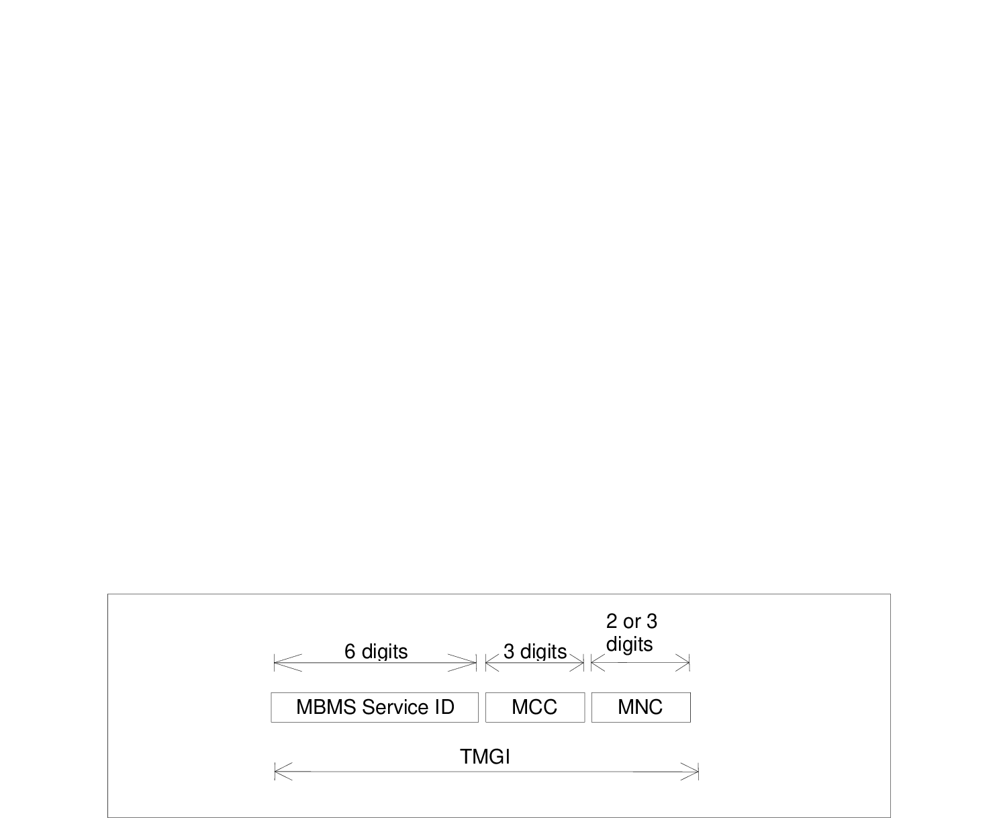

# 15 Identification of Multimedia Broadcast/Multicast Service

## 15.1 Introduction

This clause describes the format of the parameters needed to access the Multimedia Broadcast/Multicast service. For further information on the use of the parameters see TS 23.246 \[52\].

## 15.2 Structure of TMGI

Temporary Mobile Group Identity (TMGI) is used within MBMS to uniquely identify Multicast and Broadcast bearer services.

TMGI is composed as shown in figure 15.2.1.

Figure 15.2.1: Structure of TMGI

The TMGI is composed of three parts:

1\) MBMS Service ID consisting of three octets. MBMS Service ID consists of a 6-digit fixed-length hexadecimal number between 000000 and FFFFFF. MBMS Service ID uniquely identifies an MBMS bearer service within a PLMN. The structure of MBMS Service ID for services for Receive only mode is defined in TS 24.116 \[118\].

2\) Mobile Country Code (MCC) consisting of three digits. The MCC identifies uniquely the country of domicile of the BM-SC, except for the MCC value of 901, which does not identify any country and is assigned globally by ITU;

3\) Mobile Network Code (MNC) consisting of two or three digits (depending on the assignment to the PLMN by its national numbering plan administrator). The MNC identifies the PLMN which the BM-SC belongs to, except for the MNC value of 56 when the MCC value is 901, which does not identify any PLMN. For more information on the use of the TMGI, see TS 23.246 \[52\].

Any TMGI with MCC=901 and MNC=56 is used only for services for Receive Only Mode (see TS 23.246 \[52\] and TS 24.116 \[118\]).

## 15.3 Structure of MBMS SAI

The MBMS Service Area (MBMS SA) is defined in TS 23.246 \[52\]. It comprises of one or more MBMS Service Area Identities (MBMS SAIs), in any case each MBMS SA shall not include more than 256 MBMS SAIs. An MBMS SAI shall identify a group of cells within a PLMN, that is independent of the associated Location/Routing/Service Area and the physical location of the cell(s). A cell shall be able to belong to one or more MBMS SAs, and therefore is addressable by one or more MBMS SAIs.

The MBMS SAI shall be a decimal number between 0 and 65,535 (inclusive). The value 0 has a special meaning; it shall denote the whole PLMN as the MBMS Service Area and it shall indicate to a receiving RNC/BSS/MCE that all cells reachable by that RNC/BSS/MCE shall be part of the MBMS Service Area.

With the exception of the specific MBMS Service Area Identity with value 0, the MBMS Service Area Identity shall be unique within a PLMN and shall be defined in such a way that all the corresponding cells are MBMS capable.

## 15.4 Home Network Realm

The home network realm shall be in the form of an Internet domain name, e.g. operator.com, as specified in IETF RFC 1035 \[19\] and IETF RFC 1123 \[20\]. The home network realm consists of several labels. Each label shall consist of the alphabetic characters (A-Z and a-z), digits (0-9) and the hyphen (-) in accordance with IETF RFC 1035 \[19\]. Each label shall begin and end with either an alphabetic character or a digit in accordance with IETF RFC 1123 \[20\]. The case of alphabetic characters is not significant.

During the MBMS service activation in roaming scenario, the BM-SC in the visited network shall derive the home network domain name from the IMSI as described in the following steps:

1\. Take the first 5 or 6 digits, depending on whether a 2 or 3 digit MNC is used (see TS 31.102 \[27\], TS 51.011 \[66\]) and separate them into MCC and MNC; if the MNC is 2 digits then a zero shall be added at the beginning;

2\. Use the MCC and MNC derived in step 1 to create the "mnc\<MNC\>.mcc\<MCC\>.3gppnetwork.org" realm name;

3\. Add the label "mbms." to the beginning of the realm name.

An example of a home realm used in the MBMS roaming case is:

IMSI in use: 234150999999999;

Where:

MCC = 234;

MNC = 15;

MSIN = 0999999999

Which gives the home network realm: mbms.mnc015.mcc234.3gppnetwork.org.

## 15.5 Addressing and identification for Bootstrapping MBMS Service Announcement

The UE needs a Service Announcement Fully Qualified Domain Name (FQDN) to bootstrap MBMS Service Announcement as specified in TS 26.346 \[105\].

The Service Announcement FQDN is composed of six labels. The last three labels shall be "pub.3gppnetwork.org". The second and third labels together shall uniquely identify the PLMN. The first label shall be "mbmsbs".

The Service Announcement FQDN is derived from the IMSI or Visited PLMN Identity as follows:

"mbmsbs.mnc\<MNC\>.mcc\<MCC\>.pub.3gppnetwork.org"

where:

"mnc" and "mcc" serve as invariable identifiers for the following digits.

\- When using the Service Announcement FQDN in a visited network, the \<MNC\> and \<MCC\> shall be derived from the visited PLMN Identity as defined in clause 12.1.

\- When using the Service Announcement FQDN in the home network, the \<MNC\> and \<MCC\> shall be derived from the components of the IMSI as defined in clause 2.2.

In order to guarantee inter-PLMN DNS translation, the \<MNC\> and \<MCC\> coding used in the "mbmsbs.mnc\<MNC\>.mcc\<MCC\>.pub.3gppnetwork.org" format of the Service Announcement FQDN shall be:

\- \<MNC\> = 3 digits

\- \<MCC\> = 3 digits

If there are only 2 significant digits in the MNC, one "0" digit shall be inserted at the left side to fill the 3 digits coding of MNC in the Service Announcement FQDN.

As an example, the Service Announcement FQDN for MCC 345 and MNC 12 is coded in the DNS as:

"mbmsbs.mnc012.mcc345.pub.3gppnetwork.org".
