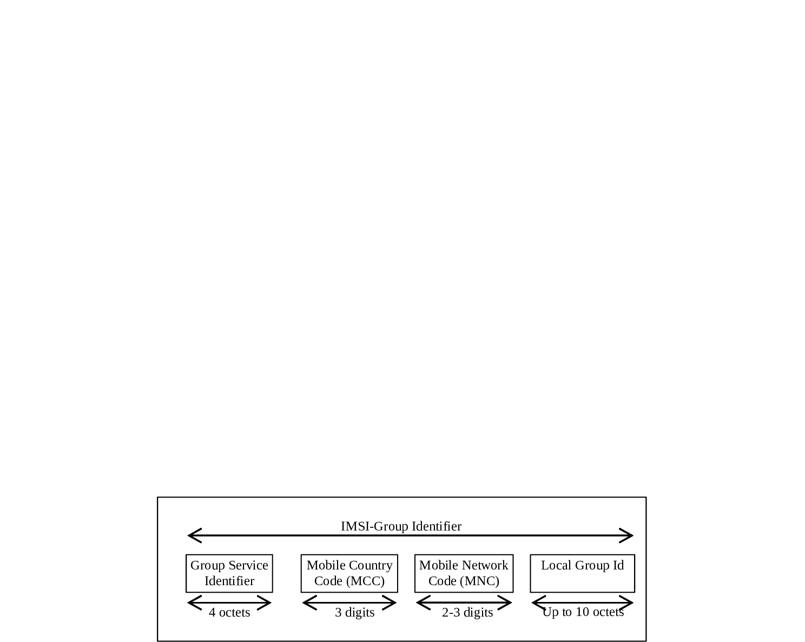

# 19.9 IMSI-Group Identifier

IMSI-Group Identifier is a network internal globally unique ID which identifies a set of IMSIs (e.g. MTC devices) from a given network that are grouped together for one specific group related services. It is used e.g. for group specifc NAS level congestion control (see TS 23.401 \[72\]).

An IMSI-Group Identifier shall be composed as shown in figure 19.9-1.

Figure 19.9-1: Structure of IMSI-Group Identifier

IMSI-Group Identifier is composed of four parts:

1\) Group Service Identifier, identifies the service (4 Octets) for which the IMSI-Group Identifier is valid.

2\) Mobile Country Code (MCC) consisting of three digits. The MCC identifies uniquely the country of domicile of the mobile subscriber;

3\) Mobile Network Code (MNC) consisting of two or three digits. The MNC identifies the home PLMN of the mobile subscriber. The length of the MNC (two or three digits) depends on the value of the MCC. A mixture of two and three digit MNC codes within a single MCC area is not recommended and is outside the scope of this specification.

4\) the Local Group Id is assigned by the network operator and may have a length of up to 10 octets.

Two different IMSI-Group Identifier values, with the same Group Service Identifier and with MCC/MNC values that point to the same PLMN, shall have two different Local Group Ids.
