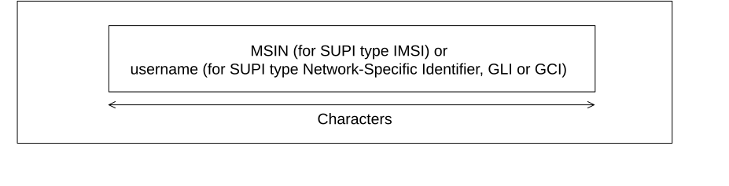
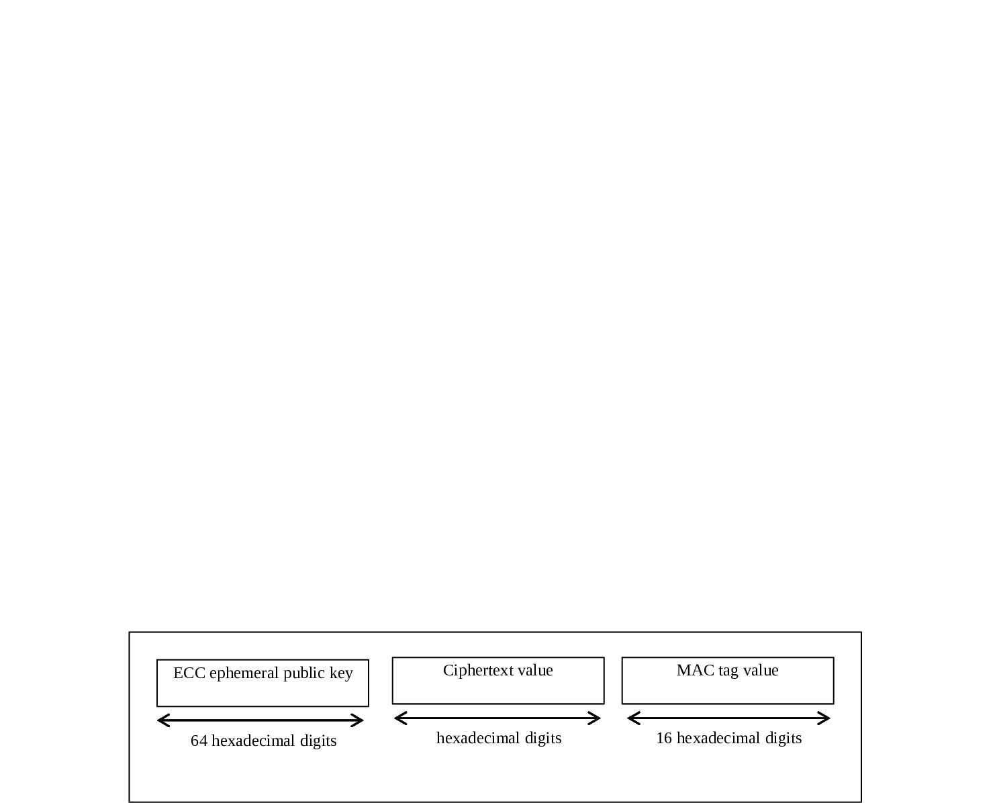
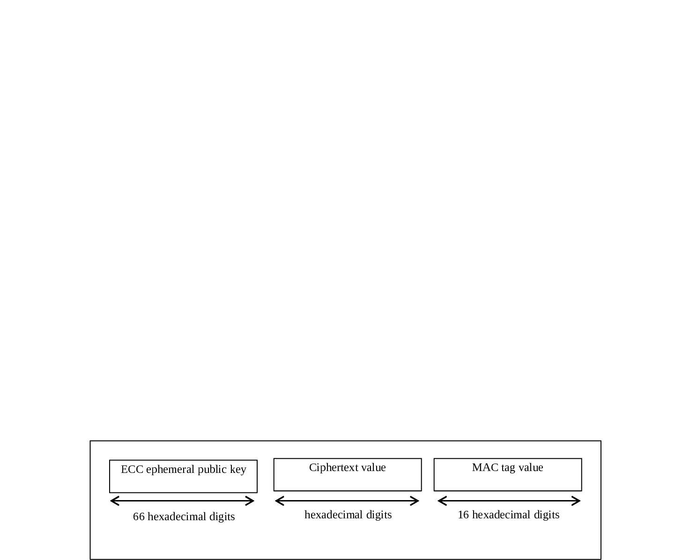

# 2.2B Subscription Concealed Identifier (SUCI)

The SUCI is a privacy preserving identifier containing the concealed SUPI. It is defined in clause 6.12.2 of TS 33.501 \[124\].

Figure 2.2B-1: Structure of SUCI

The SUCI is composed of the following parts:

1\) SUPI Type, consisting in a value in the range 0 to 7. It identifies the type of the SUPI concealed in the SUCI. The following values are defined:

\- 0: IMSI

\- 1: Network Specific Identifier (NSI)

\- 2: Global Line Identifier (GLI)

\- 3: Global Cable Identifier (GCI)

\- 4 to 7: spare values for future use.

2\) Home Network Identifier, identifying the home network of the subscriber.

> When the SUPI Type is an IMSI, the Home Network Identifier is composed of two parts:

\- Mobile Country Code (MCC), consisting of three decimal digits. The MCC identifies uniquely the country of domicile of the mobile subscription;

\- Mobile Network Code (MNC), consisting of two or three decimal digits. The MNC identifies the home PLMN or SNPN of the mobile subscription.

> When the SUPI type is a Network Specific Identifier (NSI), a GLI or a GCI, the Home Network Identifier consists of a string of characters with a variable length representing a domain name as specified in clause 2.2 of IETF RFC 7542 \[126\]. For a GLI or a GCI, the domain name shall correspond to the realm part specified in the NAI format for SUPI in clauses 28.15.2 and 28.16.2.

3\) Routing Indicator, consisting of 1 to 4 decimal digits assigned by the home network operator and provisioned in the USIM, that allow together with the Home Network Identifier to route network signalling with SUCI to AUSF and UDM instances capable to serve the subscriber.

Each decimal digit present in the Routing Indicator shall be regarded as meaningful (e.g. value "012" is not the same as value "12"). If no Routing Indicator is configured on the USIM or the ME, this data field shall be set to the value 0 (i.e. only consist of one decimal digit of "0").

4\) Protection Scheme Identifier, consisting in a value in the range of 0 to 15 (see Annex C.1 of TS 33.501 \[124\]). It represents the null scheme or a non-null scheme specified in Annex C of TS 33.501 \[124\] or a protection scheme specified by the HPLMN; the null scheme shall be used if the SUPI type is a GLI or GCI.

5\) Home Network Public Key Identifier, consisting in a value in the range 0 to 255. It represents a public key provisioned by the HPLMN or SNPN and it is used to identify the key used for SUPI protection. This data field shall be set to the value 0 if and only if null protection scheme is used;

6\) Scheme Output, consisting of a string of characters with a variable length or hexadecimal digits, dependent on the used protection scheme, as defined below. It represents the output of a public key protection scheme specified in Annex C of TS 33.501 \[124\] or the output of a protection scheme specified by the HPLMN.

Figure 2.2B-2 defines the scheme output for the null protection scheme.

Figure 2.2B-2: Scheme Output for the null protection scheme

The Mobile Subscriber Identification Number ("MSIN") is defined in clause 2.2; the "username" corresponds to the username part of a NAI, and it is applicable to SUPI types Network-Specific Identifier (clause 28.7.2), GLI (clause 28.16.2) or GCI (clause 28.15.2).

NOTE 1: For a SUCI with SUPI Type 2 or 3 (i.e. GLI or GCI), the SUCI can, based on subscription information, act as a pseudonym of the actual SUPI containing an IMSI (see TS 23.316 \[131\], clauses 4.7.3 and 4.7.4). If so, the UDM derives the actual SUPI (IMSI) from the de-concealed SUCI (GLI/GCI).

An anonymous SUCI is composed by setting the SUPI Type field to 1 (Network-Specific Identifier), using the null protection scheme, and where the scheme output corresponds to a username set to either the "anonymous" string or to an empty string (see IETF RFC 7542 \[126\], clause 2.4).

The scheme output is formatted as a variable length of characters as specified for the username in clause 2.2 of IETF RFC 7542 \[126\].

NOTE 2: If the null protection scheme is used, the NFs can derive SUPI from SUCI when needed. The AMF derives SUPI used for AUSF discovery from SUCI when the Routing-Indicator is zero and the protection scheme is null. For an anonymous SUCI, an NF can derive an anonymous SUPI from an anonymous SUCI when needed; this is, the NF can derive a SUPI in NAI format for which the "username" part of the SUPI is "anonymous" or omitted.

Figure 2.2B-3 defines the scheme output for the Elliptic Curve Integrated Encryption Scheme Profile A.

Figure 2.2B-3: Scheme Output for Elliptic Curve Integrated Encryption Scheme Profile A

The ECC ephemeral public key is formatted as 64 hexadecimal digits, which allows to encode 256 bits.

The ciphertext value is formatted as a variable length of hexadecimal digits.

The MAC tag value is formatted as 16 hexadecimal digits, which allows to encode 64 bits.

Figure 2.2B-4 defines the scheme output for the Elliptic Curve Integrated Encryption Scheme Profile B.

Figure 2.2B-4: Scheme Output for Elliptic Curve Integrated Encryption Scheme Profile B

The ECC ephemeral public key is formatted as 66 hexadecimal digits, which allows to encode 264 bits.

The ciphertext value is formatted as a variable length of hexadecimal digits.

The MAC tag value is formatted as 16 hexadecimal digits, which allows to encode 64 bits.

Figure 2.2B-5 defines the scheme output for Home Network proprietary protection schemes.

Figure 2.2B-5: Scheme Output for Home Network proprietary protection schemes

The Home Network defined scheme output is formatted as a variable length of hexadecimal digits. Its format is not further defined in 3GPP specifications.

As examples, assuming the IMSI 234150999999999, where MCC=234, MNC=15 and MSISN=0999999999, the Routing Indicator 678, and a Home Network Public Key Identifier of 27:

\- the SUCI for the null protection scheme is composed of: 0, 234, 15, 678, 0, 0 and 0999999999

\- the SUCI for the Profile \<A\> protection scheme is composed of: 0, 234, 15, 678, 1, 27, \<EEC ephemeral public key value\>, \<encryption of 0999999999\> and \<MAC tag value\>
