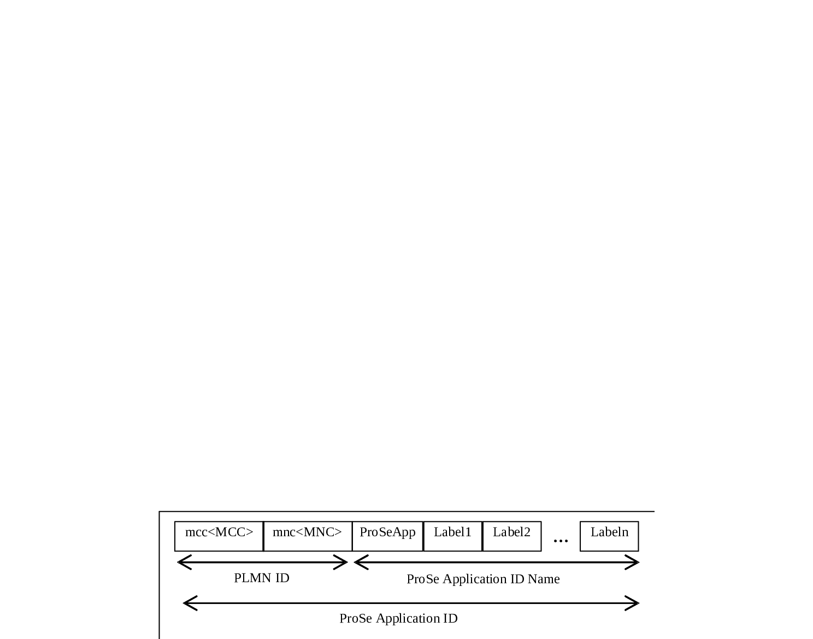
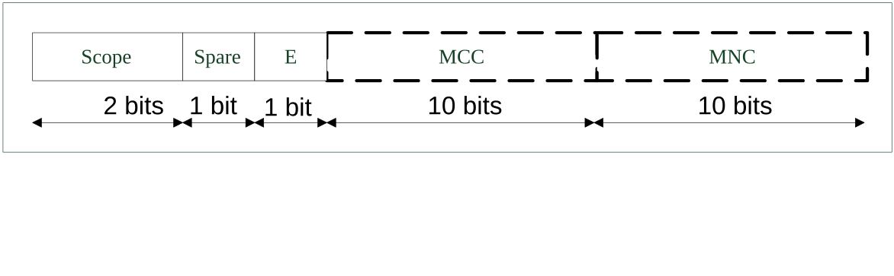
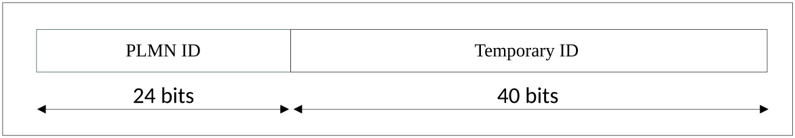

# 24 Numbering, addressing and identification for Proximity-based Services (ProSe)

## 24.1 Introduction

This clause describes the format of the parameters used for ProSe. For further information on the use of the parameters see TS 23.303 \[103\].

## 24.2 ProSe Application ID

### 24.2.1 General

The ProSe Application ID is composed of two parts as follows:

\- The ProSe Application ID Name, which is described in its entirety by a data structure characterized by different levels e.g, broad-level business category (Level 0) / business sub-category (Level 1) / business name (Level 2) / shop ID (Level 3).

\- The PLMN ID, which corresponds to the PLMN that assigned the ProSe Application ID Name.

The PLMN ID is placed before the ProSe Application ID Name as shown in Figure 24.2.1. The PLMN ID and the ProSe Application ID Name shall be separated by a dot.

Figure 24.2.1-1: Structure of ProSe Application ID

### 24.2.2 Format of ProSe Application ID Name in ProSe Application ID

The ProSe Application ID Name is composed of a string of labels. These labels represent hierarchical levels and shall be separated by dots (e.g. "Label1.Label2.Label3"). The ProSe Application ID Name shall contain at least one label. The first label on the left shall be "ProSeApp".

NOTE: The hierarchical structure and the content of the ProSe Application ID Name are outside the scope of 3GPP.

Any label in the ProSe Application ID Name except the first label on the left ("ProSeApp") can be wild carded. A wild card label is represented as "\*",

EXAMPLE: A ProSe Application ID Name used to discover nearby Italian restaurants could be "ProSeApp.Food.Restaurants.Italian".

### 24.2.3 Format of PLMN ID in ProSe Application ID

The PLMN ID shall uniquely identify the PLMN of the ProSe Function that has assigned the ProSe Application ID. The PLMN ID is composed of two labels which shall be separated by a dot as follows:

"mcc\<MCC\>.mnc\<MNC\>"

where:

"mcc" and "mnc" serve as invariable identifiers for the following digits.

\<MCC\> contains the MCC (Mobile Country Code) of the ProSe Function that has assigned the ProSe Application ID.

\<MNC\> contains the MNC (Mobile Network Code) of the ProSe Function that has assigned the ProSe Application ID.

In order to guarantee inter-PLMN operability, the \<MCC\> and the \<MNC\> shall be represented by 3 digits. If there are only 2 significant digits in the MNC, one "0" digit is inserted at the left side of the MNC to form the \<MNC\> in the "mnc\<MNC\>" label.

EXAMPLE: The PLMN ID for MCC 345 and MNC 12 will be "mcc345.mnc012".

### 24.2.4 Usage of wild cards in place of PLMN ID in ProSe Application ID

If the scope of the ProSe Application ID is country-specific, the PLMN ID part in the ProSe Application ID shall be replaced by "mcc\<MCC\>.mnc\*" with \<MCC\> set to the MCC of the corresponding country.

NOTE: Handling of the case when a country has been allocated more than one MCC value is outside the scope of 3GPP.

If the scope of the ProSe Application ID is global, the PLMN ID part in the ProSe Application ID shall be replaced by "mcc\*.mnc\*".

EXAMPLE: For a ProSe Application ID specific to a country with MCC 345, the PLMN ID part will be replaced by "mcc345.mnc\*".

### 24.2.5 Informative examples of ProSe Application ID

Examples of ProSe Application IDs following the format defined in the previous clauses are provided for information below.

EXAMPLE 1: "mcc345.mnc012.ProSeApp.Food.Restaurants.Italian"

EXAMPLE 2: "mcc300.mnc165.ProSeApp.Shops.Sports.Surfing"

EXAMPLE 3: "mcc300.mnc165.ProSeApp.\*.Sports.Surfing"

EXAMPLE 4: "mcc208.mnc\*.ProSeApp.Shops.Food.Wine"

EXAMPLE 5: "mcc\*.mnc\*.ProSeApp.Food.Restaurants.Coffee"

## 24.3 ProSe Application Code

### 24.3.1 General

The ProSe Application Code as described in TS 23.303 \[103\] is composed of the following two parts:

\- The PLMN ID of the ProSe Function that assigned the ProSe Application Code, i.e. Mobile Country Code (MCC) and Mobile Network Code (MNC).

\- A temporary identity that corresponds to the ProSe Application ID Name. The temporary identity is allocated by the ProSe Function and it may contain a metadata index. The internal structure of the temporary identity is not specified in 3GPP.

The ProSe Application Code shall have a fixed length of 184 bits.

### 24.3.2 Format of PLMN ID in ProSe Application Code

The PLMN ID in the ProSe Application Code is composed as shown in Figure 24.3.2-1:

Figure 24.3.2-1: Structure of PLMN ID in ProSe Application Code

The PLMN-ID is composed of four parts:

\- Scope indicates whether the MNC, or both the MCC and the MNC, or neither are wild carded in the ProSe Application ID associated with the ProSe Application Code, with the following mapping:

00 global scope.

01 reserved.

10 country-specific scope.

11 PLMN-specific scope.

\- Spare bit that shall be set to 0 and shall be ignored if set to 1.

\- E bit indicates whether the MCC and the MNC of the ProSe Function that has assigned the ProSe Application Code are included in the PLMN ID in ProSe Application Code, with the following mapping:

0 Neither MCC nor MNC is included.

1 MCC and MNC included.

\- When present, the MCC and the MNC shall each have a fixed length of 10 bits and shall be coded as the binary representation of their decimal value.

In this release, the MCC and the MNC of the ProSe Function that has assigned the ProSe Application Code shall always be included in the PLMN ID in ProSe Application Code. The E bit shall always be set to 1.

### 24.3.3 Format of temporary identity in ProSe Application Code

The temporary identity in the ProSe Application Code is a bit string whose value is allocated by the ProSe Function. The length of the temporary identity in the ProSe Application Code is equal to:

\- 180 bits when the E bit of the PLMN ID in the ProSe Application Code is set to 0.

\- 160 bits when the E bit of the PLMN ID in the ProSe Application Code is set to 1.

The temporary identity in the ProSe Application Code shall contain a metadata index to reflect the current metadata version if dynamic metadata is used when allocating the ProSe Application Code. The content, position and length of metadata index is operator specific.

In this release, the MCC and the MNC of the ProSe Function that has assigned the ProSe Application Code are always included in the PLMN ID in ProSe Application Code. The length of the temporary identity in the ProSe Application Code shall always be equal to 160 bits.

## 24.3A ProSe Application Code Prefix

The ProSe Application Code Prefix as described in TS 23.303 \[103\] is to be used with a ProSe Application Code Suffix. The ProSe Application Code Prefix has the same composition and format as the ProSe Application Code, with the following exceptions:

\- The temporary identity part of the ProSe Application Code Prefix is of variable length. The length of the temporary identity part shall be incremented in multiple of 8, with a minimum size of 8 bits and a maximum size of 152 bits.

\- The sum of the length of the ProSe Application Code Prefix and the length of the ProSe Application Code Suffix shall be 184 bits.

## 24.3B ProSe Application Code Suffix

The ProSe Application Code Suffix as described in TS 23.303 \[103\] is an identifier to be appended to a ProSe Application Code Prefix. The ProSe Application Code Suffix is of variable length. The length of the ProSe Application Code Suffix shall be incremented in multiple of 8, with a minimum size of 8 bits and a maximum size of 152 bits. The sum of the length of the ProSe Application Code Prefix and the length of the ProSe Application Code Suffix shall be 184 bits.

## 24.4 EPC ProSe User ID

### 24.4.1 General

The EPC ProSe User ID as described in TS 23.303 \[103\] identifies the UE registered for EPC-level ProSe Discovery in the context of the ProSe Function.

### 24.4.2 Format of EPC ProSe User ID

The EPC ProSe User ID is a bit string whose value is allocated by the ProSe Function. The length of the EPC ProSe User ID is equal to 32 bits.

## 24.5 Home PLMN ProSe Function Address

The Home PLMN ProSe Function address is in the form of a Fully Qualified Domain Name as defined in IETF RFC 1035 \[19\] and IETF RFC 1123 \[20\]. This address consists of six labels. Each label shall consist of the alphabetic characters (A-Z and a-z), digits (0-9) and the hyphen (-) in accordance with IETF RFC 1035 \[19\]. Each label shall begin and end with either an alphabetic character or a digit in accordance with IETF RFC 1123 \[20\]. The case of alphabetic characters is not significant.

For 3GPP systems, if not pre-configured on the UE or provisioned by the network, the UE shall derive the Home PLMN ProSe Function address from the IMSI as described in the following steps:

1\. Take the first 5 or 6 digits, depending on whether a 2 or 3-digit MNC is used (see TS 31.102 \[27\]) and separate them into MCC and MNC; if the MNC is 2-digit MNC then a zero shall be added at the beginning.

2\. Use the MCC and MNC derived in step 1 to create the "mnc\<MNC\>.mcc\<MCC\>.pub.3gppnetwork.org" domain name.

3\. Add the label "prose-function." to the beginning of the domain.

An example of a Home PLMN ProSe Function address is:

IMSI in use: 234150999999999;

where:

\- MCC = 234;

\- MNC = 15; and

\- MSIN = 0999999999,

which gives the following Home PLMN ProSe Function address:

"prose-function.mnc015.mcc234.pub.3gppnetwork.org".

## 24.6 ProSe Restricted Code

The ProSe Restricted Code as described in TS 23.303 \[103\] is a single 64-bit identifier that corresponds to one or more Restricted ProSe Application User ID(s) (as defined in TS 23.303 \[103\]). The exact content of the identifier is not specified in 3GPP.

## 24.7 ProSe Restricted Code Prefix

The ProSe Restricted Code Prefix as described in TS 23.303 \[103\] is a ProSe Restricted Code which to be used with a ProSe Restricted Code Suffix. It shall have the same size and format as the ProSe Restricted Code.

## 24.8 ProSe Restricted Code Suffix

The ProSe Restricted Code Suffix as described in TS 23.303 \[103\] is an identifier to be appended to a ProSe Restricted Code Prefix. Depending on the application configuration, the bit length of a ProSe Restricted Code Suffix varies from 8 to 120, incremented by multiples of 8.

## 24.9 ProSe Query Code

The ProSe Query Code as described in TS 23.303 \[103\] is a ProSe Restricted Code allocated by the ProSe Function to the Discoverer UE for restricted ProSe direct discovery model B. The format of the ProSe Query Code is the same as that of the ProSe Restricted Code defined in clause 24.6.

## 24.10 ProSe Response Code

The ProSe Response Code as described in TS 23.303 \[103\] is a ProSe Restricted Code allocated by the ProSe Function to the Discoveree UE for restricted ProSe direct discovery model B. The format of the ProSe Response Code is the same as that of the ProSe Restricted Code defined in clause 24.6.

## 24.11 ProSe Discovery UE ID

### 24.11.1 General

The ProSe Discovery UE ID as described in TS 23.303 \[103\] identifies the UE participating in restricted ProSe direct discovery in the context of the ProSe Function.

It is composed of two parts as follows:

\- The PLMN ID of the ProSe Function that assigned the ProSe Discovery UE ID, i.e. Mobile Country Code (MCC) and Mobile Network Code (MNC).

\- A temporary identifier allocated by the ProSe Function. The content of the temporary identifier is not specified in 3GPP.

### 24.11.2 Format of ProSe Discovery UE ID

The ProSe Discovery UE ID is a bit string whose value is allocated by the ProSe Function. The length of the ProSe Discovery UE ID is equal to 64 bits and the format is described as shown in Figure 24.11.2-1.

Figure 24.11.2-1: Structure of ProSe Discovery UE ID

## 24.12 ProSe UE ID

The ProSe UE ID as described in TS 23.303 \[103\] identifies the link layer address used for ProSe direct communication by a ProSe-enabled Public Safety UE.

The format of ProSe UE ID is a bit string whose length is equal to 24 bits.

## 24.13 ProSe Relay UE ID

The ProSe Relay UE ID as described in TS 23.303 \[103\] identifies the link layer address used for ProSe direct communication by a ProSe UE-to-network relay UE.

The format of ProSe Relay UE ID is a bit string whose length is equal to 24 bits.

## 24.14 User Info ID

The User Info ID as described in TS 23.303 \[103\] is used to identify the user information to be discovered for public safety use case. The value of User Info ID is allocated either by the operator or 3rd-party public safety provider application server.

The format of the User Info ID is a 48-bit bit-string.

## 24.15 Relay Service Code

The Relay Service Code as described in TS 23.303 \[103\] identifies a connectivity service the ProSe UE-to-network relay provides.

The format of the Relay Service Code is a 24-bit bit-string.

## 24.16 Discovery Group ID

The Discovery Group ID as described in TS 23.303 \[103\] identifies a group of Public Safety users that are affiliated for Group Member Discovery.

The format of the Discovery Group ID is a 24-bit bit-string.

## 24.17 Service ID

The Service ID is specified in TS 23.303 \[103\], Annex C and specifies the 3GPP service category for ProSe. The Service ID shall be the string "3GPP ProSe Service Category".
