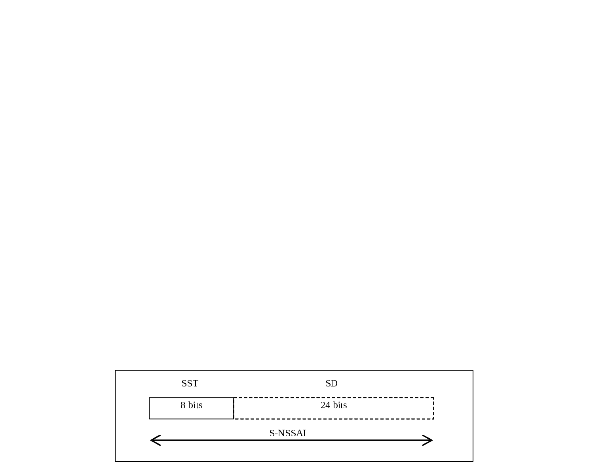

# 28.4 Information for Network Slicing

## 28.4.1 General

In order to identify a Network Slice end to end, the 5GS uses information called S-NSSAI (Single Network Slice Selection Assistance Information). See clause 5.15.2 of TS 23.501 \[119\].

An S-NSSAI is comprised of:

\- A Slice/Service type (SST),

\- A Slice Differentiator (SD), which is optional information that complements the Slice/Service type(s) to differentiate amongst multiple Network Slices.

## 28.4.2 Format of the S-NSSAI

The structure of the S-NSSAI is depicted in Figure 28.4.2-1

Figure 28.4.2-1: Structure of S-NSSAI

The S-NSSAI may include both the SST and SD fields (in which case the S-NSSAI length is 32 bits in total), or the S-NSSAI may just include the SST field (in which case the S-NSSAI length is 8 bits only).

The SST field may have standardized and non-standardized values. Values 0 to 127 belong to the standardized SST range and they are defined in TS 23.501 \[119\]. Values 128 to 255 belong to the Operator-specific range.

The SD field has a reserved value "no SD value associated with the SST" defined as hexadecimal FFFFFF. In certain protocols, the SD field is not included to indicate that no SD value is associated with the SST.

## 28.4.3 Ranges of S-NSSAIs

In the 5G Core Network, an NF Instance may indicate (e.g., while registering its NF profile in the NRF) support for several S-NSSAIs having a common SST value and different SDs, by including such SST value and adding, either a list of ranges of SDs, or a "wildcard" flag representing all SD values for the common SST (see TS 29.571 \[129\], clause 5.4.5.1).

For an NF registering a list of supported S-NSSAIs in terms of ranges of SDs, or wildcard, the NF may associate a common network slicing policy (such as, e.g., for an AMF to assign a specific DNN to be used with a certain slice) to all S-NSSAIs derived from that SD range.

NOTE: The usage of SD ranges to define sets of S-NSSAIs is restricted to be used only by certain protocols/APIs in the 5G Core Network (e.g., NRF, NSSF, AMF…).

## 28.4.4 Network Slice Instance Identifier (NSI ID)

A Network Slice Instance Identifier (NSI ID) uniquely identifies a Network Slice Instance (NSI) within a PLMN or SNPN, when multiple NSIs of a same Network Slice are deployed and there is a need to differentiate between them in the 5GC.

See TS 23.501 \[119\] for the definition of the Network Slice Instance. An NSI may be associated with one or more S-NSSAIs, and an S-NSSAI may be associated with one or more NSIs.

The NSI ID is defined as an operator specific string (see clause 6.1.6.2.2 of TS 29.510 \[130\]).

## 28.4.5 Network Slice Admission Control (NSAC) Service Area Identifier (SAI)

A Network Slice Admission Control (NSAC) Service Area Identifier (SAI) uniquely identifies a NSAC Service Area within a PLMN or SNPN.

See TS 23.501 \[119\] for the definition of the NSAC Service Area.

The NSAC SAI is defined as an operator specific string (see TS 29.571 \[129\]).
