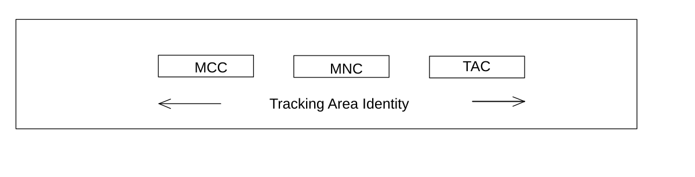

# 28.6 5GS Tracking Area Identity (TAI)

The 5GS Tracking Area Identity (TAI) consists of a Mobile Country Code (MCC), Mobile Network Code (MNC), and Tracking Area Code (TAC). It is composed as shown in figure 28.6-1.

Figure 28.6-1: Structure of the 5GS Tracking Area Identity (TAI)

The TAI is composed of the following elements:

\- Mobile Country Code (MCC) identifies the country in which the PLMN is located. The value of the MCC is the same as the 3-digit MCC contained in the IMSI;

\- Mobile Network Code (MNC) is a code identifying the PLMN in that country. The value of the MNC is the same as the 2-digit or 3-digit MNC contained in the IMSI;

\- 5GS Tracking Area Code (TAC) is a fixed length code (of 3 octets) identifying a Tracking Area within a PLMN. This part of the tracking area identification shall be coded using a full hexadecimal representation. The following are reserved hexadecimal values of the TAC:

\- 000000, and

\- FFFFFE.

NOTE 1: The above reserved values are used in some special cases when no valid TAI exists in the UE (see TS 24.501 \[125\] for more information).

NOTE 2: In the 5G Core Network protocols, when the TAI needs to be identified in the context of Standalone Non-Public Networks (SNPN), the Network Identifier (NID) of the SNPN is included as part of the TAI Information Element (see TS 29.571 \[129\]); this is a protocol aspect that does not imply any change on the system-wide definition of the TAI.
