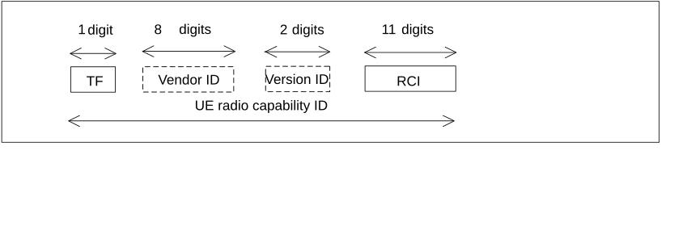

# 29 Numbering, addressing and identification for RACS

## 29.1 Introduction

This clause describes the format of the parameters used for Radio Capability Signalling Optimisation (RACS). For further information on the use of the parameters see TS 23.401 \[72\] and TS 23.501 \[119\].

## 29.2 UE radio capability ID

The UE radio capability ID is an identifier used to represent a set of UE radio capabilities, defined in TS 23.501 \[119\] and in TS 23.401 \[72\], composed as shown in figure 29.2-1.

Figure 29.2-1: Structure of UE radio capability ID

The UE radio capability ID is composed of the following elements (each element shall consist of hexadecimal digits only):

1\) Type Field (TF): identifies the type of UE radio capability ID. The following values are defined:

\- 0: manufacturer-assigned UE radio capability ID;

\- 1: network-assigned UE radio capability ID; and

\- 2 to F: spare values for future use.

2\) The Vendor ID is an identifier of UE manufacturer. This is defined by a value of Private Enterprise Number issued by Internet Assigned Numbers Authority (IANA) in its capacity as the private enterprise number administrator, as maintained at https://www.iana.org/assignments/enterprise-numbers/enterprise-numbers. Its length is 8 hexadecimal digits. This field is present only if the Type Field is set to 0;

NOTE: The private enterprise number issued by IANA is a decimal number in the range between 0 and 4294967295 that needs to be converted to a fixed length 8 digit hexadecimal number when used within the UE Radio Capability ID. E.g. 32473 is converted to 00007ED9.

3\) The Version ID is the current Version ID configured in the UCMF. This field is present only if the Type Field is set to 1. Its length is 2 hexadecimal digits.

4\) Radio Configuration Identifier (RCI): identifies the UE radio configuration. Its length is 11 hexadecimal digits.
