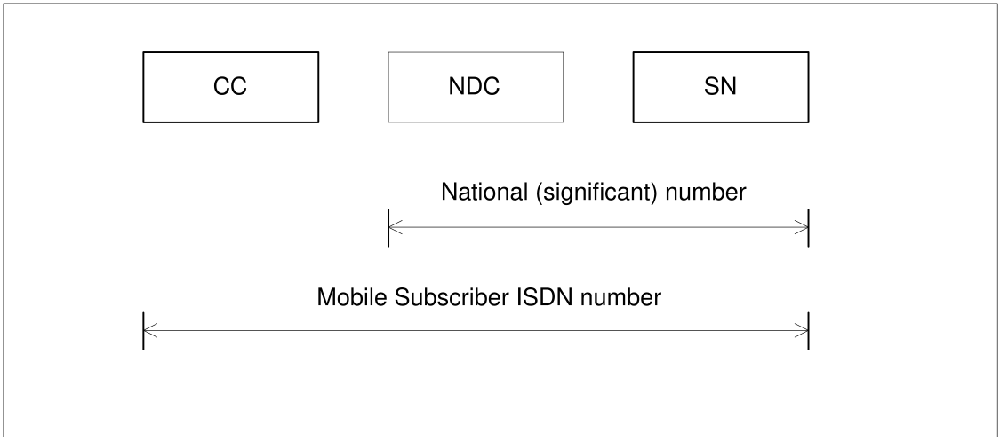

# 3 Numbering plan for mobile stations

## 3.1 General

The structure of the following numbers is defined below:

\- the telephone number used by a subscriber of a fixed (or mobile) network to call a mobile station of a PLMN;

\- the network addresses used for packet data communication between a mobile station and a fixed (or mobile) station;

\- mobile station roaming numbers.

One or more numbers of the E.164 numbering plan shall be assigned to a mobile station to be used for all calls to that station, i.e. the assignment of at least one MSISDN (i.e. E.164 number) to a mobile station is mandatory. As an exception, GPRS and EPS allow for operation whereby a MSISDN is not allocated as part of the subscription data (see TS 23.060 \[3\] clause 5.3.17 and TS 23.401 \[72\]).

NOTE: For card operated stations the E.164 number should be assigned to the holder of the card (personal number).

## 3.2 Numbering plan requirements

In principle, it should be possible for any subscriber of the ISDN or PSTN to call any MS in a PLMN. This implies that E.164 numbers for MSs should comply with the E.164 numbering plan in the home country of the MS.

The E.164 numbers of MSs should be composed in such a way that standard ISDN/PSTN charging can be used for calls to MSs.

It should be possible for each national numbering plan administrator to develop its own independent numbering/addressing plan for MSs.

The numbering/addressing plan should not limit the possibility for MSs to roam among PLMNs.

It should be possible to change the IMSI without changing the E.164 number assigned to an MS and vice versa.

In principle, it should be possible for any subscriber of the CSPDN/PSPDN to call any MS in a PLMN. This implies that it may be necessary for an MS to have a X.121 number.

In principle, it should be possible for any fixed or mobile terminal to communicate with a mobile terminal using an IP v4 address or IP v6 address.

## 3.3 Structure of Mobile Subscriber ISDN number (MSISDN)

Mobile Subscriber ISDN numbers (i.e. E.164 numbers) are assigned from the E.164 numbering plan \[10\]; see also ITU-T Recommendation E.213 \[12\]. The structure of the MSISDN will then be as shown in figure 2.

Figure 2: Number Structure of MSISDN

The number consists of:

\- Country Code (CC) of the country in which the MS is registered, followed by:

\- National (significant) number, which consists of:

\- National Destination Code (NDC) and

\- Subscriber Number (SN).

For GSM/UMTS applications, a National Destination Code is allocated to each PLMN. In some countries more than one NDC may be required for each PLMN/mobile number ranges.

The composition of the MSISDN should be such that it can be used as a global title address in the Signalling Connection Control Part (SCCP) for routeing messages to the home location register of the MS. The country code (CC) and the national destination code (NDC) will provide such routeing information. If further routeing information is required, it should be contained in the first few digits of the subscriber number (SN).

A sub-address may be appended to an E.164 number for use in call setup and in supplementary service operations where an E.164 number is required (see ITU-T Recommendations E.164, clause Annex B, B.3.3, and X.213 annex A). The sub-address is transferred to the terminal equipment denoted by the ISDN number.

The maximum length of a sub-address is 20 octets, including one octet to identify the coding scheme for the sub‑address (see ITU-T Recommendation X.213, annex A). All coding schemes described in ITU-T Recommendation X.213, annex A are supported in 3GPP networks

As an exception to the rules above, the MSISDN shall take the dummy MSISDN value composed of 15 digits set to 0 (encoded as an international E.164 number) when the MSISDN is not available in messages in which the presence of the MSISDN parameter is required for backward compatibility reason. See the relevant stage 3 specifications.

## 3.4 Mobile Station Roaming Number (MSRN) for PSTN/ISDN routeing

The Mobile Station Roaming Number (MSRN) is used to route calls directed to an MS. On request from the Gateway MSC via the HLR it is temporarily allocated to an MS by the VLR with which the MS is registered; it addresses the Visited MSC collocated with the assigning VLR. More than one MSRN may be assigned simultaneously to an MS.

The MSRN is passed by the HLR to the Gateway MSC to route calls to the MS.

The Mobile Station Roaming Number for PSTN/ISDN routing shall have the same structure as international E.164 numbers in the area in which the roaming number is allocated, i.e.:

\- the country code of the country in which the visitor location register is located;

\- the national destination code of the visited PLMN or numbering area;

\- a subscriber number with the appropriate structure for that numbering area.

The MSRN shall not be used for subscriber dialling. It should be noted that the MSRN can be identical to the MSISDN (clause 3.3) in certain circumstances. In order to discriminate between subscriber generated access to these numbers and re‑routeing performed by the network, re‑routeing or redirection indicators or other signalling means should be used, if available.

## 3.5 Structure of Mobile Station International Data Number

The structure of MS international data numbers should comply with the data numbering plan of ITU-T Recommendation X.121 as applied in the home country of the mobile subscriber. Implications for numbering interworking functions which may need to be provided by the PLMN (if the use of X.121 numbers is required) are indicated in TS 23.070 \[4\].

## 3.6 Handover Number

The handover number is used for establishment of a circuit between MSCs to be used for a call being handed over. The structure of the handover number is the same as the structure of the MSRN. The handover number may be reused in the same way as the MSRN.

## 3.7 Structure of an IP v4 address

One or more IP address domains may be allocated to each PLMN. The IP v4 address structure is defined in RFC 791 \[14\].

An IP v4 address may be allocated to an MS either permanently or temporarily during a connection with the network.

## 3.8 Structure of an IP v6 address

One or more IP address domains could be allocated to each PLMN. The IP v6 address structure is defined in RFC 2373 \[15\].

An IP v6 address may be allocated to an MS either permanently or temporarily during a connection with the network

If the dynamic IPv6 stateless address autoconfiguration procedure is used, then each PDP context, or group of PDP contexts sharing the same IP address, is assigned a unique prefix as defined in TS 23.060 \[3\].

As described in RFC 2462 \[21\] and RFC 3041 \[22\], the MS can change its interface identifier without the GPRS network being aware of the change.
