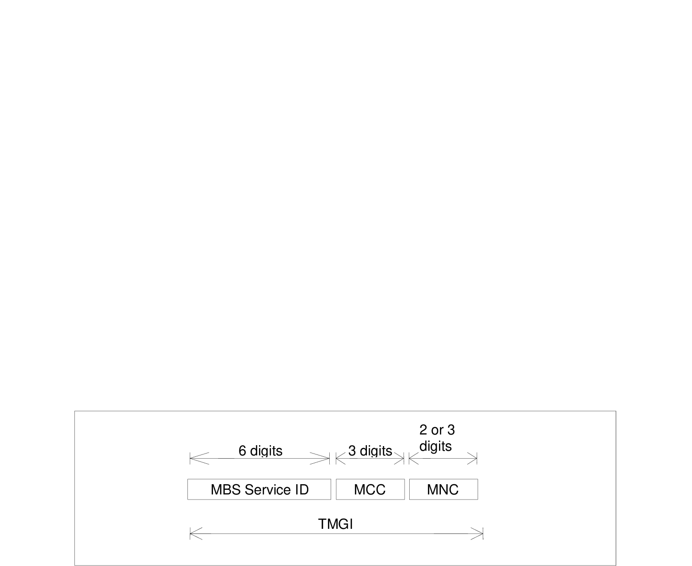

# 30 Identification of 5GS Multicast and Broadcast Services

## 30.1 Introduction

This clause describes the format of the parameters needed to access the Multicast and Broadcast Services in 5GS. For further information on the use of the parameters see TS 23.247 \[140\].

## 30.2 Structure of TMGI

Temporary Mobile Group Identity (TMGI) is used within MBS to uniquely identify a broadcast MBS session or a multicast MBS session.

TMGI is composed as shown in figure 30.2.1.

Figure 30.2.1: Structure of TMGI

The TMGI is composed of three parts:

1\) MBS Service ID consisting of three octets. MBS Service ID consists of a 6-digit fixed-length hexadecimal number between 000000 and FFFFFF. MBS Service ID uniquely identifies an MBS service within a PLMN.

2\) Mobile Country Code (MCC) consisting of three digits. The MCC identifies uniquely the country of domicile of the MB-SMF, except for the MCC value of 901, which does not identify any country and is assigned globally by ITU;

3\) Mobile Network Code (MNC) consisting of two or three digits (depending on the assignment to the PLMN by its national numbering plan administrator). The MNC identifies the PLMN which the MB-SMF belongs to, except for the MNC value of 56 when the MCC value is 901, which does not identify any PLMN. For more information on the use of the TMGI, see TS 23.247 \[140\].

NOTE: The structure of TMGI for MBS in 5GS is similar to the structure of TMGI for MBMS in EPS defined in clause 15.2.

In a SNPN (Stand-alone Non-Public Network), TMGI is used together with NID (Network Identifier) to identify an MBS Session.

## 30.3 Structure of Area Session ID

The concept of Area Session ID is defined in TS 23.247 \[140\].

Area Session IDs are used for MBS sessions with location dependent content. An Area Session ID together with an MBS Session ID (i.e. TMGI or Source Specific IP Multicast address) shall uniquely identify an MBS session in a specific MBS Service Area.

NOTE: For a location-dependent MBS session, the same MBS Session ID but a different Area Session ID are used for each MBS Service Area. Different MB-SMFs and/or MB-UPFs can be assigned for different MBS service areas in an MBS session.

An Area Session Identity shall be a decimal number between 0 and 65535 (inclusive).

## 30.4 Structure of MBS Frequency Selection Area ID

The concept of MBS Frequency Selection Area ID is defined in clause 6.5.4 of TS 23.247 \[140\].

The MBS Frequency Selection Area (FSA) ID is used for broadcast MBS session to guide the frequency selection of the UE.

The MBS FSA ID identifies a preconfigured area within, and in proximity to, which the cell(s) announces the MBS FSA ID and the associating frequency (for details see TS 38.300 \[141\]). MBS FSA ID and their mapping to frequencies are provided to RAN nodes via OAM.

An MBS FSA ID shall be a string of 6 hexadecimal digits.

## 30.5 Structure of Associated Session ID

The concept of Associated Session ID is defined in TS 23.247 \[140\].

The Associated Session ID is used to enable NG-RAN to identify the multiple MBS sessions delivering the same content when AF creates multiple broadcast MBS Sessions via different Core Networks in network sharing scenarios.

An Associated Session ID may comprise a Source Specific IP Multicast Address (SSM) or a string. See clause 5.9.4.21.1 of TS 29.571 \[129\] for the encoding of Associated Session ID in 5GC SBIs.
