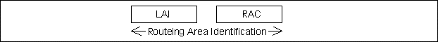
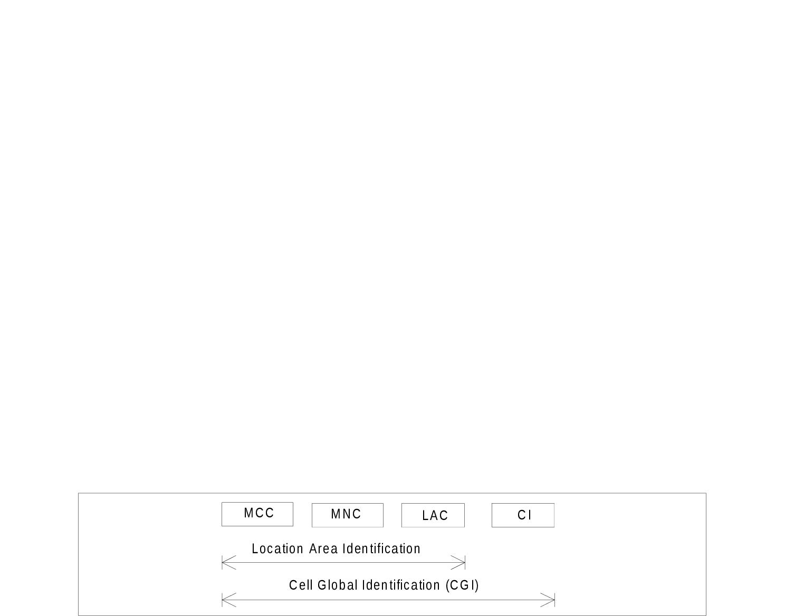
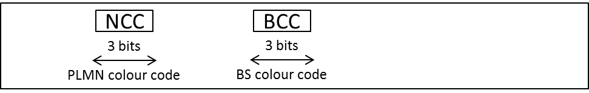
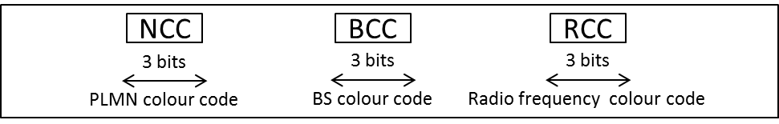
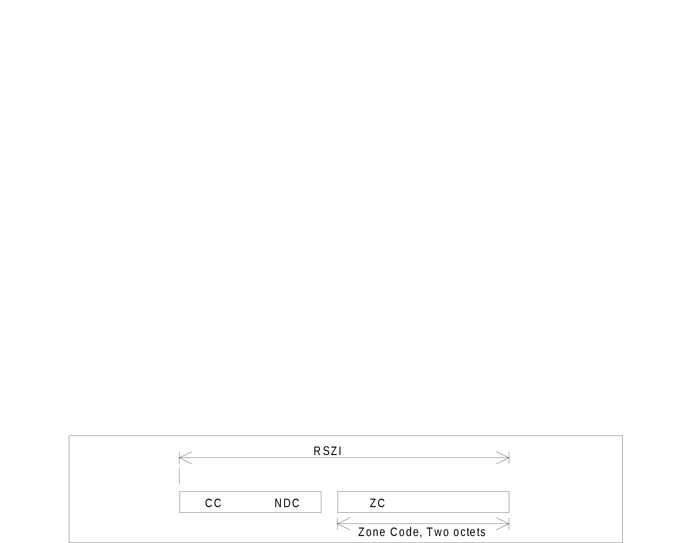

# 4 Identification of location areas and base stations

## 4.1 Composition of the Location Area Identification (LAI)

The Location Area Identification shall be composed as shown in figure 3:

Figure 3: Structure of Location Area Identification

The LAI is composed of the following elements:

\- Mobile Country Code (MCC) identifies the country in which the GSM PLMN is located. The value of the MCC is the same as the three digit MCC contained in international mobile subscriber identity (IMSI);

\- Mobile Network Code (MNC) is a code identifying the GSM PLMN in that country. The MNC takes the same value as the two or three digit MNC contained in IMSI;

\- Location Area Code (LAC) is a fixed length code (of 2 octets) identifying a location area within a PLMN. This part of the location area identification can be coded using a full hexadecimal representation except for the following reserved hexadecimal values:

0000, and

FFFE.

These reserved values are used in some special cases when no valid LAI exists in the MS (see TS 24.008 \[5\], TS 31.102 \[27\] and TS 51.011 \[9\]).

## 4.2 Composition of the Routing Area Identification (RAI)

The Routing Area Identification shall be composed as shown in figure 4:

Figure 4: Structure of Routing Area Identification

The RAI is composed of the following elements:

\- A valid Location Area Identity (LAI) as defined in clause 4.1. Invalid LAI values are used in some special cases when no valid RAI exists in the mobile station (see TS 24.008 \[5\], TS 31.102 \[27\] and TS 51.011 \[9\]).

\- Routeing Area Code (RAC) which is a fixed length code (of 1 octet) identifying a routeing area within a location area.

## 4.3 Base station identification

### 4.3.1 Cell Identity (CI) and Cell Global Identification (CGI)

The BSS and cell within the BSS are identified within a location area or routeing area by adding a Cell Identity (CI) to the location area or routeing area identification, as shown in figure 5. The CI is of fixed length with 2 octets and it can be coded using a full hexadecimal representation.

The Cell Global Identification is the concatenation of the Location Area Identification and the Cell Identity. Cell Identity shall be unique within a location area.

Figure 5: Structure of Cell Global Identification

### 4.3.2 Base Station Identify Code (BSIC)

The base station identity code is a local colour code that allows an MS to distinguish between different neighbouring base stations. BSIC is a 6 bit code which is structured as shown in Figure 6. Exceptions apply to networks supporting EC-GSM-IoT or PEO and for mobile stations in EC or PEO operation (see TS 43.064 \[112\]) where the BSIC is a 9 bit code which is structured as shown in Figure 6a.

Figure 6: Structure of 6 bit BSIC

Figure 6a: Structure of 9 bit BSIC

In the definition of the NCC, care should be taken to ensure that the same NCC is not used in adjacent PLMNs which may use the same BCCH carrier frequencies in neighbouring areas. Therefore, to prevent potential deadlocks, a definition of the NCC appears in annex A. This annex will be reviewed in a co-ordinated manner when a PLMN is created.

In addition to the above, the GERAN networks should be configured so that:

\- in a cell shared between different PLMNs as per GERAN network sharing (see TS 44.018 \[99\] and TS 44.060 \[100\]), the NCC used in this cell is different from the NCC used in the neighbouring non-shared cells of these PLMNs; and that

\- these PLMNs use different NCCs in non-shared cells neighbouring this shared cell.

Furthermore, GERAN networks supporting the 9 bit BSIC shall also support the 6 bit BSIC field and when supporting both the 6 bit BSIC and 9 bit BSIC the network shall ensure that the NCC and BCC parts are identical between the 6 bit and 9 bit BSIC fields.

## 4.4 Regional Subscription Zone Identity (RSZI)

A PLMN-specific regional subscription defines unambiguously for the entire PLMN the regions in which roaming is allowed. It consists of one or more regional subscription zones. The regional subscription zone is identified by a Regional Subscription Zone Identity (RSZI). A regional subscription zone identity is composed as shown in figure 7.

Figure 7: Structure of Regional Subscription Zone Identity (RSZI)

The elements of the regional subscription zone identity are:

1\) the Country Code (CC) which identifies the country in which the PLMN is located;

2\) the National Destination Code (NDC) which identifies the PLMN in that country;

3\) the Zone Code (ZC) which identifies a regional subscription zone as a pattern of allowed and not allowed location areas uniquely within that PLMN.

CC and NDC are those of an ITU-T E.164 VLR or SGSN number (see clause 5.1) of the PLMN; they are coded with a trailing filler, if required. ZC has fixed length of two octets and is coded in full hexadecimal representation.

RSZIs, including the zone codes, are assigned by the VPLMN operator. The zone code is evaluated in the VLR or SGSN by information stored in the VLR or SGSN as a result of administrative action. If a zone code is received by a VLR or SGSN during updating by the HLR and this zone code is related to that VLR or SGSN, the VLR or SGSN shall be able to decide for all its MSC or SGSN areas and all its location areas whether they are allowed or not allowed.

For details of assignment of RSZI and of ZC as subscriber data see 3GPP  TS 23.008 \[2\].

For selection of RSZI at location updating by comparison with the leading digits of the VLR or SGSN number and for transfer of ZC from the HLR to VLR and SGSN see TS 29.002 \[31\].

## 4.5 Location Number

A location number is a number which defines a specific location within a PLMN. The location number is formatted according to ITU-T Recommendation E.164, as shown in figure 8. The Country Code (CC) and National Destination Code (NDC) fields of the location number are those which define the PLMN of which the location is part.

Figure 8: Location Number Structure

The structure of the locally significant part (LSP) of the location number is a matter for agreement between the PLMN operator and the national numbering plan administrator in the PLMN's country. It is desirable that the location number can be interpreted without the need for detailed knowledge of the internal structure of the PLMN; the LSP should therefore include the national destination code in the national numbering plan for the fixed network which defines the geographic area in which the location lies.

The set of location numbers for a PLMN shall be chosen so that a location number can be distinguished from the MSISDN of a subscriber of the PLMN. This will allow the PLMN to trap attempts by users to dial a location number.

## 4.6 Composition of the Service Area Identification (SAI)

Void (see clause 12.5).

## 4.7 Closed Subscriber Group

A Closed Subscriber Group consists of a single cell or a collection of cells within an E‑UTRAN and UTRAN that are open to only a certain group of subscribers.

Within a PLMN, a Closed Subscriber Group is identified by a Closed Subscriber Group Identity (CSG-ID). The CSG‑ID shall be fix length 27 bit value.

## 4.8 HNB Name

HNB Name shall be a broadcast string in free text format that provides a human readable name for the Home NodeB or Home eNodeB CSG identity.

HNB Name shall be coded in UTF-8 format with variable number of bytes per character. The maximum length of HNB Name shall be 48 bytes.

See TS 22.011 \[83\] for details.

## 4.9 CSG Type

CSG Type shall provide the type of a CSG identity in a human readable form. It shall reside in the UE only. See TS 22.011 \[83\] for details.

When the CSG Type has a text component, the CSG Type shall be coded in UTF-8 format with variable number of bytes per character . The maximum text length shall not exceed 12 characters in any language.

## 4.10 HNB Unique Identity

HNB Unique Identity uniquely identifies a Home NodeB or Home eNodeB.

The HNB unique identity shall be defined as either a 48-bit or 64-bit extended unique identifier (EUI-48 or EUI-64) as defined in \[45\] (EUI-48) and \[46\] (EUI-64).

For use in HNB certificates, the HNB Unique Identity shall be transformed into a FQDN in the form:

\- \<EUI-48/64\>.\<REALM\>

\<EUI48/64\> is the first label which shall be the EUI-48 or EUI-64, represented as a string of 12 or 16 hexadecimal digits including any leading zeros. \<REALM\> denotes the realm which may consist of 3 labels , e.g. hnb. femtocellvendor.com.

## 4.11 HRNN

HRNN shall be a broadcast string in free text format that provides a human readable name for manual CAG or SNPN selection.

HRNN shall be coded in UTF-8 format with variable number of bytes per character. The maximum length of HRNN shall be 48 bytes.

See TS 23.501 \[119\] and TS 38.331 \[138\] for details.
