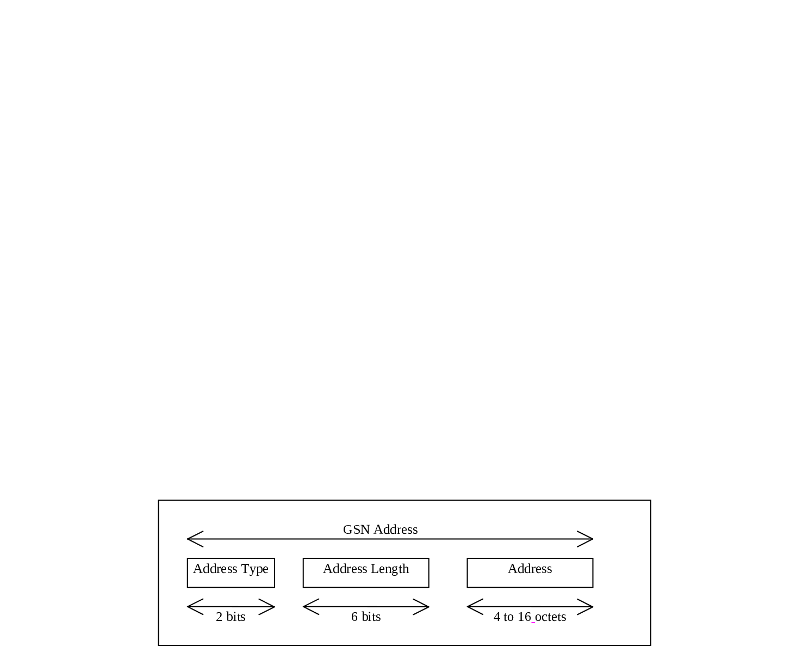

# 5 Identification of MSCs, GSNs, location registers and CSSs

## 5.1 Identification for routeing purposes

MSCs, GSNs, location registers and CSSs are identified by international E.164 numbers and/or Signalling Point Codes ("entity number", i.e., "HLR number", "VLR number", "MSC number", "SGSN number", "GGSN number" and "CSS number") in each PLMN.

MMEs that support "SMS in MME" are identified by international PSTN/ISDN numbers for SM Routing via an IWF (i.e. "MME number for MT SMS").

Additionally SGSNs and GGSNs are identified by GSN Addresses. These are the SGSN Address and the GGSN Address.

A GSN Address shall be composed as shown in figure 9.

Figure 9: Structure of GSN Address

The GSN Address is composed of the following elements:

1\) The Address Type, which is a fixed length code (of 2 bits) identifying the type of address that is used in the Address field.

2\) The Address Length, which is a fixed length code (of 6 bits) identifying the length of the Address field.

3\) The Address, which is a variable length field which contains either an IPv4 address or an IPv6 address.

Address Type 0 and Address Length 4 are used when Address is an IPv4 address.

Address Type 1 and Address Length 16 are used when Address is an IPv6 address.

The IP v4 address structure is defined in RFC 791 \[14\].

The IP v6 address structure is defined in RFC 2373 \[15\].

## 5.2 Identification of HLR for HLR restoration application

HLR may also be identified by one or several "HLR id(s)", consisting of the leading digits of the IMSI (MCC + MNC + leading digits of MSIN).

## 5.3 Identification of the HSS for SMS

The HSS may also be identified by a HSS-ID.

The HSS-ID shall consist of decimal digits (0 through 9) only and be composed of the MCC consisting of three digits, the MNC consisting of two or three digits and an index consisting of one to several digits. The number of digits in the HSS-ID shall not exceed 15. This composition is compatible with the IMSI one. The HSS-ID shall not be identical to the complete IMSI of a UE.

NOTE: The composition of the HSS-ID is compatible with the composition of the IMSI in clause 2.2 for routing purposes.
