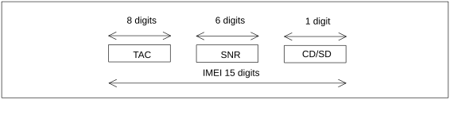

# 6 International Mobile Station Equipment Identity, Software Version Number and Permanent Equipment Identifier

## 6.1 General

The structure and allocation principles of the International Mobile station Equipment Identity and Software Version number (IMEISV) and the International Mobile station Equipment Identity (IMEI) are defined below.

The Mobile Station Equipment is uniquely defined by the IMEI or the IMEISV.

## 6.2 Composition of IMEI and IMEISV

### 6.2.1 Composition of IMEI

The International Mobile station Equipment Identity (IMEI) is composed as shown in figure 10.

Figure 10: Structure of IMEI

The IMEI is composed of the following elements (each element shall consist of decimal digits only):

\- Type Allocation Code (TAC). Its length is 8 digits;

\- Serial Number (SNR) is an individual serial number uniquely identifying each equipment within the TAC. Its length is 6 digits;

\- Check Digit (CD) / Spare Digit (SD): If this is the Check Digit see paragraph below; if this digit is Spare Digit it shall be set to zero, when transmitted by the MS.

The IMEI (14 digits) is complemented by a Check Digit (CD). The Check Digit is not part of the digits transmitted when the IMEI is checked, as described below. The Check Digit is intended to avoid manual transmission errors, e.g. when customers register stolen MEs at the operator's customer care desk. The Check Digit is defined according to the Luhn formula, as defined in annex B.

NOTE: The Check Digit is not applied to the Software Version Number.

The security requirements of the IMEI are defined in TS 22.016 \[32\].

### 6.2.2 Composition of IMEISV

The International Mobile station Equipment Identity and Software Version Number (IMEISV) is composed as shown in figure 11.

Figure 11: Structure of IMEISV

The IMEISV is composed of the following elements (each element shall consist of decimal digits only):

\- Type Allocation Code (TAC). Its length is 8 digits;

\- Serial Number (SNR) is an individual serial number uniquely identifying each equipment within each TAC. Its length is 6 digits;

\- Software Version Number (SVN) identifies the software version number of the mobile equipment. Its length is 2 digits.

Regarding updates of the IMEISV: The security requirements of TS 22.016 \[32\] apply only to the TAC and SNR, but not to the SVN part of the IMEISV.

## 6.3 Allocation principles

The Type Allocation Code (TAC) is issued by the GSM Association in its capacity as the Global Decimal Administrator. Further information can be found in the GSMA TS.06 \[109\] .

Manufacturers shall allocate individual serial numbers (SNR) in a sequential order.

For a given ME, the combination of TAC and SNR used in the IMEI shall duplicate the combination of TAC and SNR used in the IMEISV.

The Software Version Number is allocated by the manufacturer. SVN value 99 is reserved for future use.

## 6.4 Permanent Equipment Identifier (PEI)

In 5GS, the Permanent Equipment Identifier (PEI) identifies a UE.

The PEI is defined as:

\- a PEI type: in this release of the specification, it may indicate an IMEI or IMEISV, a MAC address or an IEEE Extended Unique Identifier (EUI-64); and

\- dependent on the value of the PEI type:

\- an IMEI as defined in clause 6.2.1; or

\- an IMEISV as defined in clause 6.2.2; or

\- a MAC address (48-bit MAC identifier, as defined in IETF RFC 7042 \[132\]); or

\- an IEEE Extended Unique Identifier (EUI-64), for UEs not supporting any 3GPP access technologies, as defined in IEEE "Guidelines for Use of Extended Unique Identifier (EUI), Organizationally Unique Identifier (OUI), and Company ID (CID)" \[136\].
