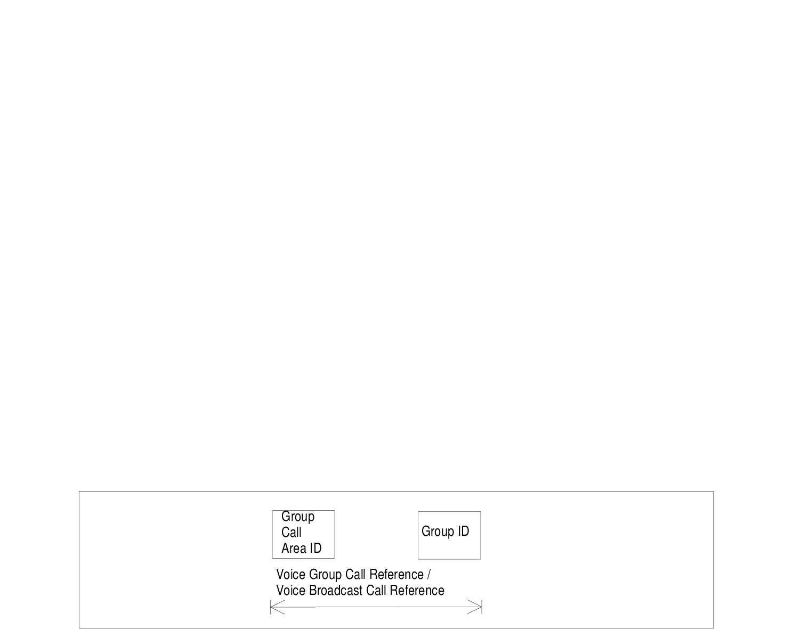

# 7 Identification of Voice Group Call and Voice Broadcast Call Entities

## 7.1 Group Identities

Logical groups of subscribers to the Voice Group Call Service or to the Voice Broadcast Service are identified by a Group Identity (Group ID). Group IDs for VGCS are unique within a PLMN. Likewise, Group IDs for VBS are unique within a PLMN. However, no uniqueness is required between the sets of Group IDs. These sets may be intersecting or even identical, at the option of the network operator.

The Group ID is a number with a maximum value depending on the composition of the voice group call reference or voice broadcast call reference defined in clause 7.3.

For definition of Group ID on the radio interface, A interface and Abis interface, see TS 44.068 \[46\] and TS 44.069 \[47\].

For definition of Group ID coding on MAP protocol interfaces, see TS 29.002 \[31\].

VGCS or VBS shall also be provided for roaming. If this applies, certain Group IDs shall be defined as supra-PLMN Group IDs which have to be co-ordinated between the network operators and which shall be known in the networks and in the SIM.

The format of the Group ID is identical for VBS and VGCS.

## 7.2 Group Call Area Identification

Grouping of cells into specific group call areas occurs in support of both the Voice Group Call Service and the Voice Broadcast Service. These service areas are known by a "Group Call Area Identity" (Group Call Area Id). No restrictions are placed on what cells may be grouped into a given group call area.

The Group Call Area ID is a number uniquely assigned to a group call area in one network and with a maximum value depending on the composition of the voice group call reference or voice broadcast reference defined under 7.3.

The formats of the Group Call Area ID for VGCS and the Group Call Area ID for VBS are identical.

## 7.3 Voice Group Call and Voice Broadcast Call References

Specific instances of voice group calls (VGCS) and voice broadcast calls (VBS) within a given group call area are known by a "Voice Group Call Reference" or by a "Voice Broadcast Call Reference" respectively.

Each voice group call or voice broadcast call in one network is uniquely identified by its Voice Group Call Reference or Voice Broadcast Call Reference. The Voice Group Call Reference or Voice Broadcast Call Reference is composed of the Group ID and the Group Call Area ID. The composition of the group call area ID and the group ID can be specific for each network operator.

For definition of Group Call Reference (with leading zeros inserted as necessary) on the radio interface, A interface and Abis interface, see TS 24.008 \[5\], TS 44.068 \[46\] and TS 44.069 \[47\].

For definition of Group Call Reference (also known as ASCI Call Reference, Voice Group Call Reference or Voice Broadcast Call Reference) coding on MAP protocol interfaces, see TS 29.002 \[31\].

The format is given in figure 12.

Figure 12: Voice Group Call Reference / Voice Broadcast Call Reference
