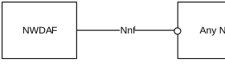
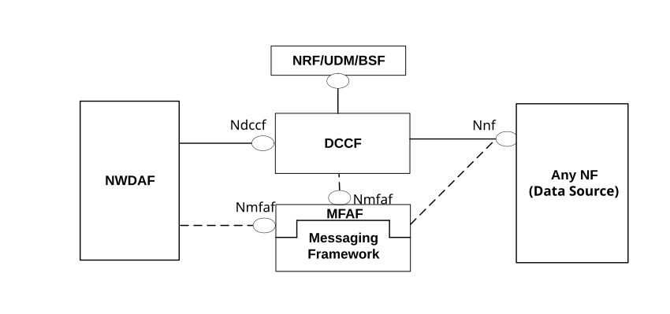
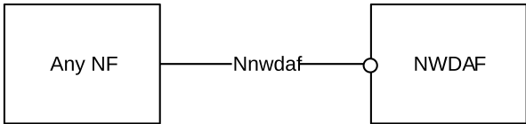
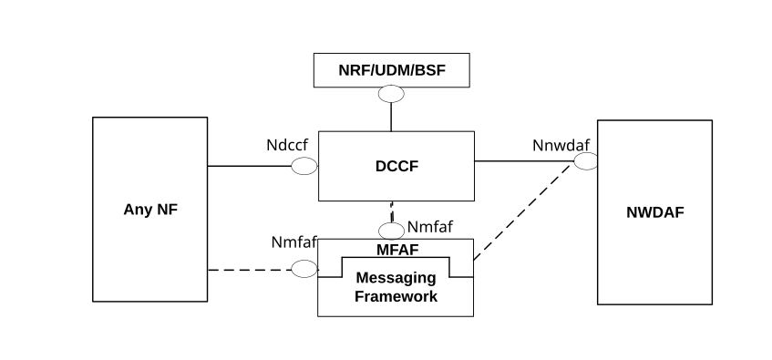
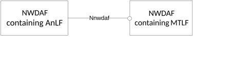
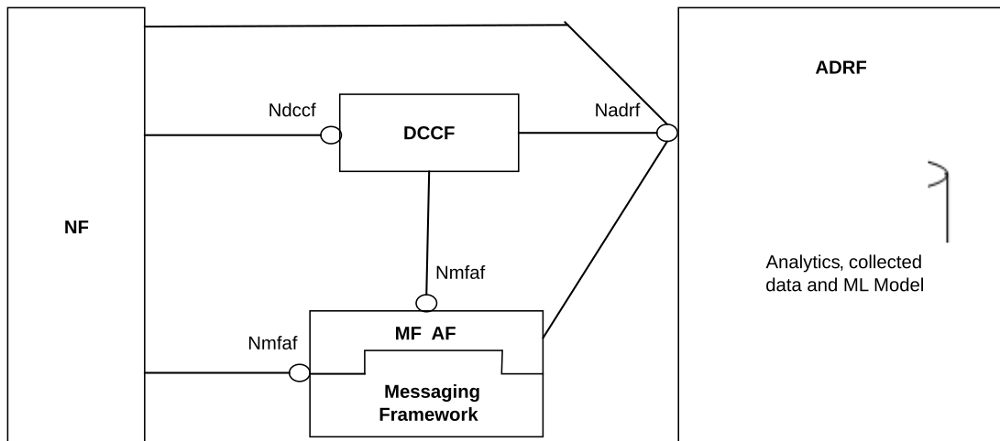
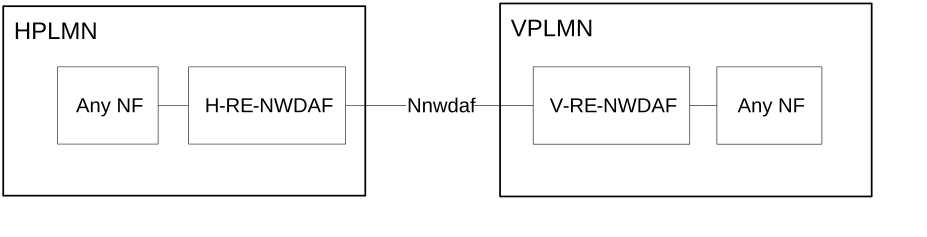

# 4 Reference Architecture for Data Analytics

## 4.1 General

The NWDAF (Network Data Analytics Function) is part of the architecture specified in TS 23.501 \[2\] and uses the mechanisms and interfaces specified for 5GC in TS 23.501 \[2\] and OAM services (see clause 6.2.3.1).

The NWDAF may support the following functionalities:

\- Data collection based on subscription to events provided by AMF, SMF, UPF, PCF, UDM, NSACF, AF (directly or via NEF) and OAM;

\- Analytics and Data collection using the DCCF (Data Collection Coordination Function);

\- Retrieval of information from data repositories (e.g. from UDR via UDM for subscriber-related information or optinally via NEF(PFDF) for PFD information);

\- Data collection of location information using LCS (finer granularity location information determined by LMF);

\- Storage and retrieval of information from ADRF (Analytics Data Repository Function);

\- Analytics and Data collection from MFAF (Messaging Framework Adaptor Function);

\- Retrieval of information about NFs (e.g. from NRF for NF-related information);

\- On demand provision of analytics to consumers, as specified in clause 6.

\- Provision of bulked data related to Analytics ID(s).

\- Provision of Accuracy information about Analytics ID(s).

\- Provision or retrieval of ML Model Accuracy Information or ML Model accuracy degradation about a ML Model.

\- Federated Learning.

A single instance or multiple instances of NWDAF may be deployed in a PLMN. If multiple NWDAF instances are deployed, the architecture supports deploying the NWDAF as a central NF, as a collection of distributed NFs, or as a combination of both. If multiple NWDAF instances are deployed, an NWDAF can act as an aggregate point (i.e. Aggregator NWDAF) and collect analytics information from other NWDAFs, which may have different Serving Areas, to produce the aggregated analytics (per Analytics ID), possibly with Analytics generated by itself.

NOTE 1: When multiple NWDAFs exist, not all of them need to be able to provide the same type of analytics results, i.e. some of them can be specialized in providing certain types of analytics. An Analytics ID information element is used to identify the type of supported analytics that NWDAF can generate.

NOTE 2: NWDAF instance(s) can be collocated with a 5GS NF.

## 4.2 Non-roaming architecture

### 4.2.0 General

As depicted in Figure 4.2.0-1, the 5G System architecture allows NWDAF to collect data from any 5GC NF. The NWDAF belongs to the same PLMN as the 5GC NF that provides the data.

Figure 4.2.0-1: Data Collection architecture from any 5GC NF

The Nnf interface is defined for the NWDAF to request subscription to data delivery for a particular context, to cancel subscription to data delivery and to request a specific report of data for a particular context.

The 5G System architecture allows NWDAF to retrieve the management data from OAM by invoking OAM services.

The 5G System architecture allows NWDAF to collect data from any 5GC NF or OAM using a DCCF with associated Ndccf services as specified in clause 8.2.

The 5G System architecture allows NWDAF and DCCF to collect data from an NWDAF with associated Nnwdaf_DataManagement services as specified in clause 7.4. The 5G system architecture allows MFAF to fetch data from an NWDAF with associated Nnwdaf_DataManagement service as specified in clause 7.4.

Figure 4.2.0-1a: Data Collection architecture using Data Collection Coordination

As depicted in Figure 4.2.0-1a, the Ndccf interface is defined for the NWDAF to support subscription request(s) for data delivery from a DCCF, to cancel subscription to data delivery and to request a specific report of data. If the data is not already being collected, the DCCF requests the data from the Data Source using Nnf services. The DCCF may collect the data and deliver it to the NWDAF or the DCCF may rely on a messaging framework to collect data from the NF and deliver it to the NWDAF.

As depicted in Figure 4.2.0-2, the 5G System architecture allows any 5GC NF to request network analytics information from NWDAF containing Analytics logical function (AnLF). The NWDAF belongs to the same PLMN as the 5GC NF that consumes the analytics information.

Figure 4.2.0-2: Network Data Analytics Exposure architecture

The Nnwdaf interface is defined for 5GC NFs, to request subscription to network analytics delivery for a particular context, to cancel subscription to network analytics delivery and to request a specific report of network analytics for a particular context.

NOTE 1: The 5G System architecture also allows other consumers such as OAM and CEF (Charging Enablement Function) to request network analytics information from NWDAF.

The 5G System architecture allows any NF to obtain Analytics from an NWDAF using a DCCF function with associated Ndccf services, as specified in clause 8.2.

The 5G System architecture allows NWDAF and DCCF to request historical analytics from an NWDAF with associated Nnwdaf_AnalyticsSubscription services as specified in clause 7.2. The 5G system architecture allows MFAF to fetch historical analytics from an NWDAF with associated Nnwdaf_AnalyticsSubscription service as specified in clause 7.2.

Figure 4.2.0-2a: Network Data Analytics Exposure architecture using Data Collection Coordination

As depicted in Figure 4.2.0-2a, the Ndccf interface is defined for any NF to support subscription request(s) to network analytics, to cancel subscription for network analytics and to request a specific report of network analytics. If the analytics is not already being collected, the DCCF requests the analytics from the NWDAF using Nnwdaf services. The DCCF may collect the analytics and deliver it to the NF, or the DCCF may rely on a messaging framework to collect analytics and deliver it to the NF.

As depicted in Figure 4.2.0-3, the 5G System architecture allows NWDAF containing Analytics logical function (AnLF) to use trained ML Model provisioning services from another NWDAF containing Model Training logical function (MTLF).

NOTE 2: Analytics logical function and Model Training logical function are described in clause 5.1.

Figure 4.2.0-3: Trained ML Model Provisioning architecture

The Nnwdaf interface is used by an NWDAF containing AnLF to request and subscribe to trained ML Model provisioning services.

NOTE 3: The NWDAF trained ML Model provisioning services are described in clause 7.5 and clause 7.6.

### 4.2.1 Analytics Data Repository Function

As depicted in Figure 4.2.1-1, the 5G System architecture allows ADRF to store and retrieve the collected data, analytics and ML Model(s). The following options are supported:

\- ADRF exposes the Nadrf service for storage and retrieval of data, analytics or ML Model(s) by other 5GC NFs (e.g. NWDAF) which access the data using Nadrf services.

\- Based on the NF request or configuration on the DCCF, the DCCF may determine the ADRF and interact directly or indirectly with the ADRF to request or store data or analytics. The interaction can be:

\- Direct: the DCCF requests to store data or analytics in the ADRF via an Nadrf service, or via an Ndccf_DataManagement_Notify (e.g. when ADRF requested data or analytics collection notification via DCCF). In addition, the DCCF retrieves data or analytics from the ADRF via an Nadrf service.

\- Indirect: the DCCF requests that the Messaging Framework to store data or analytics in the ADRF i.e. via an Nadrf service or via an Nmfaf_3daDataManagement_Configure. The Messaging Framework may contain one or more adaptors that translate between 3GPP defined protocols.

NOTE 1: The internal logic of Messaging Framework is outside the scope of 3GPP, only the MFAF and the interface between MFAF and other 3GPP defined NF is under 3GPP scope.

\- A Consumer NF may specify in requests to a DCCF that data or analytics provided by a Data Source needs to be stored in the ADRF.

\- The ADRF stores data or analytics received in an Nadrf_DataManagement_StorageRequest sent directly from an NF, or data or analytics received in an Ndccf_DataManagement_Notify / Nmfaf_3caDataManagement_Notify or Nnwdaf_DataManagement_Notify from the DCCF, MFAF or from the NWDAF.

\- The ADRF may store, provide or delete ML Model(s) based on the Nadrf_MLModelManagement service received from NWDAF.

\- The ADRF checks if the Consumer is authorized to access ADRF services and provides the requested data, analytics or ML Model(s) using the procedures specified in clause 7.1.4 of TS 23.501 \[2\].

Figure 4.2.1-1: Storage architecture for Analytics, Collected Data and ML Model(s)

## 4.3 Roaming architecture

Based on operator's policy and local regulations (e.g. privacy), data or analytics may be exchanged between PLMNs (i.e. HPLMN and VPLMN). In a PLMN, an NWDAF is used as exchange point to exchange analytics and to collect input data for analytics with other PLMNs. The NWDAF with roaming exchange capability is called Roaming Exchange NWDAF (RE-NWDAF).

Figure 4.3-1: Roaming Architecture to exchange Input Data or Data Analytics between VPLMN and HPLMN

Using the architecture shown in Figure 4.3-1:

\- For outbound roaming users, the NF consumer in the HPLMN can retrieve analytics from the VPLMN via the H-RE-NWDAF in HPLMN and V-RE-NWDAF in VPLMN.

NOTE 1: The analytics from the VPLMN may be generated by the V-RE-NWDAF in the VPLMN or by other NWDAFs in the VPLMN.

\- For outbound roaming users, the H-RE-NWDAF in HPLMN can collect data from the VPLMN via V-RE-NWDAF in VPLMN.

\- For inbound roaming users, the NF consumer in the VPLMN can retrieve analytics from the HPLMN via V-RE-NWDAF in VPLMN and H-RE-NWDAF in HPLMN.

NOTE 2: The analytics from the HPLMN may be generated by H-RE-NWDAF in the HPLMN or other NWDAFs in the HPLMN.

\- For inbound roaming users, the V-RE-NWDAF can collect data from the HPLMN via the H-RE-NWDAF.

NOTE 3: Both local breakout and home routed roaming architectures support the data or analytics exchanging between PLMNs.

NOTE 4: Interactions between RE-NWDAFs of different PLMNs may be via SEPPs, which are not depicted in the architecture for the sake of clarity.
