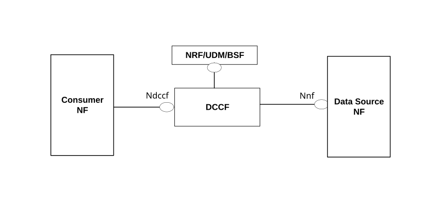
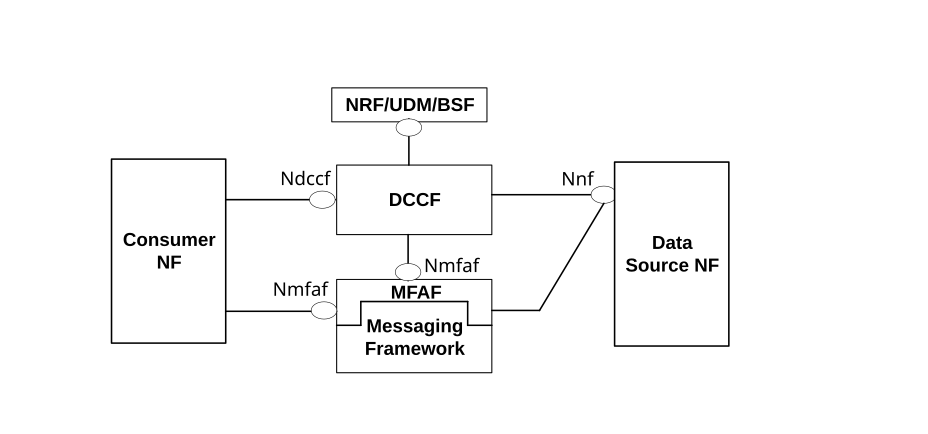

# 5A Data Collection Coordination and Delivery Functional Description

## 5A.1 General

Data Collection Coordination and Delivery coordinates the collection and distribution of data requested by NF consumers. It prevents data sources from having to handle multiple subscriptions for the same data and send multiple notifications containing the same information due to uncoordinated requests from data consumers.

Data Collection Coordination and Delivery is supported by a DCCF via Ndccf_DataManagement service or by an NWDAF via Nnwdaf_DataManagement service. Unless otherwise stated, capabilities specified in clause 5A for a DCCF are also applicable to an NWDAF.

In this Release of the specification Data Collection Coordination and Delivery is applicable to:

\- NWDAFs that request data from a Data Source (e.g. for use in computing analytics).

\- NF consumers that request analytics from an NWDAF Data Source.

\- NF consumers that request data from an ADRF Data Source.

\- ADRFs that receive data from an NF Data Source.

NOTE: Nnwdaf_DataManagement service can be used to collect historical data or runtime data. For collecting historical and runtime analytics, Nnwdaf_AnalyticsSubscription service is used.

## 5A.2 Data Collection Coordination

Data Collection Coordination is supported by a DCCF or an NWDAF. The Data Consumer may use an NRF to perform NF discovery and selection to find a DCCF that can coordinate data collection (DCCF discovery principles are defined in clause 6.3.19 of TS 23.501 \[2\]). Data Consumers send requests for data to the DCCF rather than directly to the NF Data Source. Whether the data consumers directly contact the NF Data Source or goes via the DCCF is based on configuration of the data consumers. For the Data Consumer and each notification endpoint in a data request, the Data Consumer may specify Formatting and Processing Instructions that determine how the data is to be provided. Upon receiving a request from a Data Consumer, the selected DCCF determines the NF instance that can be a Data Source if the Data Source is not indicated in the Data Consumer's request. The DCCF may also select an ADRF if the data is to be stored in an ADRF and an ADRF endpoint is not indicated in the Data Consumer's request. To retrieve data for a specific UE, the NRF, UDM or BSF can provide the DCCF with the identity of the Data Source using the services indicated in table 5A.2-1.

Table 5A.2-1: NF Services consumed by DCCF or NWDAF to determine which NF instances are serving a UE

<table>
<colgroup>
<col style="width: 29%" />
<col style="width: 23%" />
<col style="width: 23%" />
<col style="width: 23%" />
</colgroup>
<thead>
<tr class="header">
<th>Type of NF instance (serving the UE) to determine</th>
<th>NF to be contacted by DCCF</th>
<th>Service</th>
<th>Reference in TS 23.502 [3]</th>
</tr>
</thead>
<tbody>
<tr class="odd">
<td>UDM</td>
<td>NRF</td>
<td>Nnrf_NFDiscovery (NOTE 1)</td>
<td>5.2.7.3</td>
</tr>
<tr class="even">
<td>AMF</td>
<td>UDM</td>
<td>Nudm_UECM</td>
<td>5.2.3.2</td>
</tr>
<tr class="odd">
<td>SMF</td>
<td>UDM</td>
<td>Nudm_UECM</td>
<td>5.2.3.2</td>
</tr>
<tr class="even">
<td>BSF</td>
<td>NRF</td>
<td>Nnrf_NFDiscovery (NOTE 1)</td>
<td>5.2.7.3</td>
</tr>
<tr class="odd">
<td>PCF</td>
<td>BSF</td>
<td>Nbsf_Management</td>
<td>5.2.13.2</td>
</tr>
<tr class="even">
<td>NEF</td>
<td>NRF</td>
<td>Nnrf_NFDiscovery</td>
<td>5.2.7.3</td>
</tr>
<tr class="odd">
<td>NWDAF</td>
<td>
NRF

UDM
</td>
<td>
Nnrf_NFDiscovery

Nudm_UECM
</td>
<td>
5.2.7.3

5.2.3.2
</td>
</tr>
<tr class="even">
<td>GMLC</td>
<td>NRF</td>
<td>Nnrf_NFDiscovery (NOTE 2)</td>
<td>5.2.7.3</td>
</tr>
<tr class="odd">
<td>NSACF</td>
<td>NRF</td>
<td>Nnrf_NFDiscovery</td>
<td>5.2.7.3</td>
</tr>
<tr class="even">
<td colspan="4">
NOTE 1: Discovery can be based on a group ID. The group ID for a UE ID can be obtained using the Nudr_GroupIDmap service defined in clause 5.2.12.3 of TS 23.502 [3].

NOTE 2: Discovery of the GMLC serving a UE is described in clause 5.1a of TS 23.273 [39] and can also be based on DNS. A GMLC is supposed to be able to serve any UE in the PLMN; the GMLC will in turn discover an AMF serving the UE via the UDM as described in clause 6.1 of TS 23.273 [39].
</td>
</tr>
</tbody>
</table>

The DCCF keeps track of the data actively being collected from the Data Sources it is coordinating. It may do so by maintaining a record of the active prior requests it sends to each Data Source. If a NWDAF subscribes for data directly with a Data Source, or a Data Source has stored data in an ADRF, the NWDAF or ADRF may register the data collection profile with the DCCF. The data collection profile may include the following parameters:

\- "Service Operation" identifies the service used to collect the data or analytics from a Data Source (e.g. Namf_EventExposure_Subscribe or Nnwdaf_AnalyticsSubscription_Subscribe);

\- "Analytics/Data Specification" is the "Service Operation" specific parameters that identify the collected data (i.e. Analytics ID(s) / Event ID (s), Target of Analytics Reporting or Target of Event Reporting, Analytics Filter or Event Filter, etc.);

\- NWDAF ID or ADRF ID specifies the ADRF or NWDAF which registers data collection profile.

The DCCF may then determine certain historical data may be available in the NWDAF or ADRF and coordinate collection of data from the NWDAF or ADRF based on the data collection profile.

When the DCCF receives a request for data, it determines the status of data collection from the Data Source. If parameters in a request for data from a Data Consumer match those in a prior request or in a data collection profile registration, the DCCF may determine that the requested data is already being collected from a Data Source or that a prior subscription to a Data Source may be modified to in addition satisfy the requirements of the new data request from a Data Consumer. This status is used in clause 5A.3 to deliver data to the Data Consumer and notification endpoints.

For persisting event exposure subscriptions for long-lived data collection, the DCCF may subscribe to the UDM to receive event notifications even if a Data Source that serves a UE changes.

The DCCF may subscribe to the NRF to receive event notifications if a Data Source changes (e.g. because of a NF life-cycle event).

NOTE: A DCCF can support multiple Data Sources, Data Consumers and Message Frameworks. However, to avoid duplicate data collection, each Data Source NF or Set of Data Source NF should be associated with only one DCCF instance or DCCF Set.

A DCCF may use the same mechanisms described in clause 6.2.2.1 to determine AMF and SMF to retrieve data related to "any UE".

If the data consumer requests to collect data for any UE in an area of interest, the data consumer shall first determine all DCCFs covering the area of interest and then contact these DCCFs to request for data collection.

## 5A.3 Data Delivery

### 5A.3.0 General

Data is provided to Consumers or notification endpoints according to the Delivery Option configured on the DCCF or NWDAF. Delivery Options are:

1\. Delivery via DCCF or NWDAF: Consumers or Notification Endpoints receive the data from the DCCF or NWDAF.

2\. Delivery via Messaging Framework: Consumers or Notification Endpoints receive the data from the Messaging Framework via the services offered by the MFAF.

### 5A.3.1 Data Delivery via the DCCF or NWDAF

Figure 5A.3.1-1: Data Delivery via DCCF

Data Delivery via DCCF is shown in Figure 5A.3.1-1. Each Event Notification received from a Data Source NF is sent to the DCCF which propagates it to all Data Consumers / Notification Endpoints specified by the Data Consumers or determined by the DCCF. Each Data Consumer may specify in its request to the DCCF multiple notification endpoints, which may include the requesting Data Consumer, an ADRF or other NFs. The DCCF may also select an ADRF or other notification endpoint based on configuration. The DCCF supports formatting and processing for each Consumer / notification endpoint so notifications comply with the data requests received from each Consumer NF.

Upon the DCCF determining the status of data collection for a data request (see clause 5A.2):

\- If the requested data is not already being collected from a Data Source, the DCCF sends a new subscription/request towards the Data Source with the notification target specified as the DCCF.

\- If the requested data is partially covered by existing subscriptions with the Data Source, the DCCF sends to the existing Data Source a request to modify the subscription and/or creates new subscription(s) to new Data Source for the newly requested data which cannot be provided by the current Data Source.

\- If the requested data is already being collected from the Data Source, the DCCF determines that no subscriptions to the Data Source need to be created or modified.

When notifications are received by the DCCF, they are processed according to the Formatting and Processing Instructions for each Consumer and notification endpoint. The DCCF subsequently sends notifications to Consumers and notification endpoints via a Ndccf_DataManagement service.

The same functionality as described above applies for Data Delivery and bulked data collection via NWDAF with Nnwdaf services replacing corresponding Ndccf services.

### 5A.3.2 Data Delivery via a Messaging Framework

Figure 5A.3.2-1: Data Delivery via a Messaging Framework

Data Delivery via a Messaging Framework is shown in figure 5A.3.2-1. The Messaging Framework formats and processes data received from the Data Source NF and sends notifications to all Data Consumers and Notification Endpoints specified by Data Consumers or determined by the DCCF. Each Data Consumer may specify in its request to the DCCF multiple notification endpoints, which may include the requesting Data Consumer, an ADRF or other NFs. The DCCF may also select an ADRF or other notification endpoint based on configuration. While the Messaging Framework is not standardized by 3GPP, a Messaging Framework Adaptor NF (MFAF) offers 3GPP defined services that allow the 5GS to interact with the Messaging Framework. Internally, the Messaging Framework may for example support the pub-sub pattern, where received data are published to the Messaging Framework and requests from 3GPP Consumers result in Messaging Framework specific subscriptions. Alternatively, the Messaging Framework may support other protocols outside of the scope of 3GPP.

The Messaging Framework Adaptor NF offers services that enable the 5GS to interact with the Messaging Framework:

\- 3GPP Consumer Adaptor (3CA) Data Management Service: Nmfaf_3caDataManagement Service delivers data to each Data Consumer or notification endpoint after formatting and processing of data received by the Messaging Framework.

\- 3GPP DCCF Adaptor (3DA) Data Management Service: The consumer (e.g. DCCF) may configure MFAF using Nmfaf_3daDataManagement service to enable the MFAF to convey data or analytics received from data source NF to notification endpoints. The configuration may include data formatting and processing instruction and notification endpoints.

Upon the DCCF determining the status of data collection for a data request (see clause 5A.2):

\- If the requested data is not currently being collected from a Data Source, the DCCF sends a new subscription/request towards the Data Source with the notification target specified as the Messaging Framework.

\- If the requested data is partially covered by existing subscriptions with the Data Source, the DCCF sends a request to the Data Source to modify one or more subscriptions to accommodate both the previous requests for data and the new request for data and/or creates new subscription(s) to new Data Source for the newly requested data which cannot be provided by the current Data Source.

\- If the requested data is already being collected from the Data Source, the DCCF determines that no subscriptions to the Data Source need to be created or modified.

NOTE: The internal logic of DCCF, e.g. how it decides on what modifications to do, is not specified.

\- The DCCF uses the Nmfaf_3daData Management service to convey information so:

1\. the Messaging Framework can recognize data that are received from a Data Source.

2\. the MFAF can obtain data received by the Messaging Framework, process and format the data according to processing and formatting instructions for each Consumer / notification endpoint and send notifications or responses to the Data Consumers.

When data are received by the Messaging Framework (e.g. because of an event notification) they are processed according the Formatting and Processing Instructions for each Consumer / notification endpoint before notifications are sent to the Data Consumer or Notification Endpoints. Notifications sent via the Nmfaf_3caDataManagement service have the same content as those sent via a Ndccf_DataManagement service for Data Delivery via the DCCF.

The same functionality as described above applies for Data Delivery and bulk data collection via NWDAF with Nnwdaf services replacing corresponding Ndccf services.

## 5A.4 Data Formatting and Processing

Formatting and/or Processing instructions may be provided in requests by Data Consumers via the Ndccf_DataManagement service and Nnwdaf_DataManagement service. As an alternative to providing individual events, formatting can be used to aggregate notifications and processing can be used to extract and send summary information from multiple notifications. Data Formatting and Processing are applicable to notifications due to events as they occur at data sources (runtime data or analytics) and historical data as described in clause 5A.5.

When using the Messaging Framework, the DCCF sends the formatting and/or processing instructions to the Messaging Framework via the Nmfaf_3daData_Management Service so the MFAF may format and/or process the data before sending notifications to the Data Consumers / notification endpoints. When using Data Delivery via the DCCF, the DCCF performs formatting and/or processing before sending notifications.

Formatting determines when a notification is sent to the Consumer. Formatting Instructions may indicate:

\- Notification Event clubbing: Buffering and sending of several notifications in one message. The consumer may specify a minimum and/or maximum number of notifications to be clubbed.

\- Notification Time Window (example: notifications are buffered and sent between 2 and 3 AM).

\- Cross event reference-based notification: When a subscribing NF is subscribing to multiple events (e.g. event X and event Y) the notification for an Event-X is buffered and reported only when the Event-Y occurs.

\- Consumer triggered Notification: Notifications containing data or analytics are buffered until the consumer requests delivery using Nnwdaf_DataManagement, Ndccf_DataManagement or Nmfaf_3caDataManagement Service. The consumer requests Consumer triggered notification by setting a "fetch flag" in its subscription request to the DCCF or NWDAF. When the requested data or analytics is available for retrieval, the DCCF, NWDAF or MFAF sends a notification containing fetch instructions to the consumer. The consumer must then fetch the data or analytics before an expiry time as provided in the fetch instructions.

NOTE: When this indication is set by the consumer, DCCF, NWDAF or MFAF notifications to the consumer contain Fetch Instructions (see clauses 8.2.4, 7.4.4 and 9.3.2).

\- Exact time-based Notification: Notifications are sent to the Consumer at an exact time, irrespective of whether the event occurs (example: every 30 min). Exact time-based notifications may be periodic.

\- Increasing time window based notification: Notifications are sent to the Consumer at an increasing periodicity (example: the first notification is sent immediately, subsequent received notifications are sent after 5 min, then after 10 min, then after 15 min, etc.).

For an ADRF endpoint, Formatting Instructions sent to the messaging framework may further specify whether Nmfaf services are used to deliver notifications to an ADRF, or whether the data are sent to the ADRF using a Nadrf service.

Processing instructions allow summarizing of notifications to reduce the volume of data reported to the Data Consumer. The processing results in summarizing of information from multiple notifications into a common report. Processing of data for inclusion in each notification sent to consumers occurs over a Processing Interval specified in the Processing Instructions. Notifications sent to consumers may represent partial intervals if formatting instructions or Event Reporting Information (as specified in table 4.15.1-1 of TS 23.502 \[3\]) require that a notification be sent to the consumer before the end of a processing interval. Processing Instructions are provided per Event ID or Analytics ID and are applied to multiple notifications that result from the same subscription and for the same Event ID or Analytics ID. Processing Instructions, in addition to the Processing Interval, may specify the parameter names, parameter values and the attributes to be determined and reported to the Consumer. Processing Instructions may also specify aggregation level (e.g. per-UEs, per AoIs) or temporal aggregation (e.g. per minute, per hour). The processed notifications may comprise the following depending on the Event and Processing Instructions:

\- Event;

\- Processing Interval;

\- List of Event Parameter Name(s) and for each Event Parameter Name, one Event Parameter Values and sets of the following attributes as indicated in the processing instructions:

\- Event Spacing: Average and variance of the time interval separating two consecutive occurrences of the same event and parameter value, or periodicity for periodic reporting;

\- Event Duration: Average and variance of the Time for which the parameter value applies;

\- Number of countable occurrences for the parameter (e.g. Mobility Registration Update);

\- Average, variance, most frequent value, least frequent value and skew of the parameter (e.g.: number of UEs in an AoI);

\- Maximum and minimum parameter values (e.g. number of UEs in an AoI).

Event Parameter Names are Event specific and not all attributes are applicable for all parameter names. Examples of Event Parameter Names and Parameter values are provided in table 5A.4-1.

Table 5A.4-1: Examples of Event Parameter Names, Parameter values

<table>
<colgroup>
<col style="width: 24%" />
<col style="width: 25%" />
<col style="width: 25%" />
<col style="width: 25%" />
</colgroup>
<thead>
<tr class="header">
<th>Event</th>
<th>Event parameter name</th>
<th>Parameter values</th>
<th>Attributes</th>
</tr>
</thead>
<tbody>
<tr class="odd">
<td>Location Report</td>
<td>TAI</td>
<td>TAI-7</td>
<td>
- Average and variance of the time interval between TA boundary crossings.

- Number of TA boundary crossing.
</td>
</tr>
<tr class="even">
<td>Number of UEs in a Region</td>
<td>Region</td>
<td>AMF-3</td>
<td>- Average and variance of the number of UEs in the Region.</td>
</tr>
<tr class="odd">
<td>UE Reachability (status change)</td>
<td>CM State</td>
<td>Connected</td>
<td>
- Average and variance of time between CM connected state transitions.

- Average and variance of the time spent in CM connected state.

- Number of transitions to CM connected state.
</td>
</tr>
<tr class="even">
<td>PDU Session Establishment</td>
<td>DNN</td>
<td>Internet</td>
<td>
- Average and variance of time between PDU Session establishments to the Internet DN.

- Average and variance of the duration of PDU Sessions established to the Internet DN.

- Number of PDU Session establishments to the Internet DN.
</td>
</tr>
<tr class="odd">
<td>PDU Session Establishment</td>
<td>PDU Session Type</td>
<td>Ethernet</td>
<td>
- Average and variance of time between Ethernet PDU Session establishments.

- Average and variance of the duration of Ethernet PDU Sessions.

- Number of Ethernet PDU Session establishments.
</td>
</tr>
</tbody>
</table>

## 5A.5 Historical Data Handling

ADRF or NWDAF as a Data Source:

\- When the DCCF receives a request for data that includes a period in the past and ADRF is deployed, the DCCF may obtain data from ADRF as the Data Source. The DCCF may also obtain historical data from an NWDAF. The data obtained from the ADRF or NWDAF is delivered to Consumers / Notification Endpoints according to a configured Delivery Option. The DCCF may determine that requested data may be available in an ADRF or NWDAF based on ADRF identification from the consumer, the data collection profile previously registered by the ADRF or NWDAF or by querying the ADRF or NWDAF.

ADRF or NWDAF as a Data Recipient:

\- An ADRF or NWDAF may be a Consumer NF that initiates requests to the DCCF for data, the ADRF or NWDAF may be specified as a notification endpoint by another Consumer NF that wants to have data it requests archived, or the DCCF may be configured to archive certain data in a ADRF (e.g. all data from an AMF instance).

\- If the ADRF or NWDAF instance is not specified in a request for data by a Consumer NF, the DCCF may select the ADRF or NWDAF instance based on provisioned information or information received from the NRF.

\- Data is delivered to the ADRF or NWDAF according to a configured Delivery Option (via DCCF or Messaging Framework).
