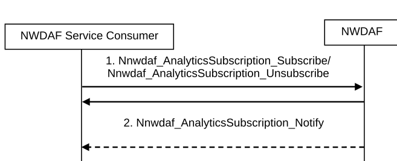
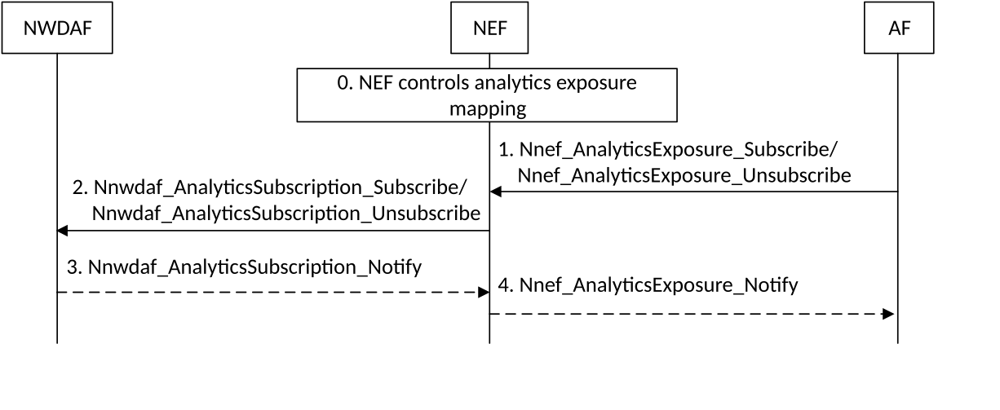

# 6.1.1 Analytics Subscribe/Unsubscribe

## 6.1.1.1 Analytics subscribe/unsubscribe by NWDAF service consumer

This procedure is used by any NWDAF service consumer (e.g. including NFs/OAM) to subscribe/unsubscribe at NWDAF to be notified on analytics information, using Nnwdaf_AnalyticsSubscription service defined in clause 7.2. This service is also used by an NWDAF service consumer to modify existing analytics subscription(s). Any entity can consume this service as defined in clause 7.2.

Figure 6.1.1.1-1: Network data analytics Subscribe/unsubscribe

1\. The NWDAF service consumer subscribes to or cancels subscription to analytics information by invoking the Nnwdaf_AnalyticsSubscription_Subscribe/ Nnwdaf_AnalyticsSubscription_Unsubscribe service operation. The parameters that can be provided by the NWDAF service consumer are listed in clause 6.1.3.

When a subscription to analytics information is received, the NWDAF determines whether triggering new data collection is needed.

If the service invocation is for a subscription modification, the NF service consumer includes an identifier (Subscription Correlation ID) to be modified in the invocation of Nnwdaf_AnalyticsSubscription_Subscribe. In addition, if the NWDAF service consumer has taken an action(s) influenced by the previously received analytics information at step 2, which may or may not affect the ground truth data corresponding to Analytics ID requested at the time which the prediction refers to, the NWDAF service consumer may include Analytics Feedback Information in the invocation of Nnwdaf_AnalyticsSubscription_Subscribe.

If the subscription relates to outbound roaming users, the NWDAF in the HPLMN may decide to retrieve or to subscribe to input data or analytics from the VPLMN and the detailed procedure is described in clause 6.1.5.3 for analytics retrieval and in clause 6.2.10 for data retrieval.

If the subscription relates to inbound roaming users, the NWDAF in the VPLMN may decide to retrieve or to subscribe to input data or analytics from the HPLMN and the detailed procedure is described in clause 6.1.5.2 for analytics retrieval and in clause 6.2.11 for data retrieval.

2\. If NWDAF service consumer is subscribed to analytics information, the NWDAF notifies the NWDAF service consumer with the analytics information by invoking Nnwdaf_AnalyticsSubscription_Notify service operation, based on the request from the NWDAF service consumer, e.g. Analytics Reporting Parameters. If the NWDAF provides a Termination Request, then the consumer cancels subscription to analytics information by invoking the Nnwdaf_AnalyticsSubscription_Unsubscribe service operation.

When calculating the analytics/ML Model Accuracy Information with the retrieved Analytics Feedback Information, in addition to comparing predictions of ML Model and its corresponding ground truth data, the NWDAF may additionally determine/take into account whether the action(s) taken by the NWDAF service consumer affects the ground truth data corresponding to Analytics ID requested at the time which the prediction refers to as described in clauses 6.2D and 6.2E, which may affect the ML Model Accuracy Monitoring/Analytics Accuracy Monitoring.

## 6.1.1.2 Analytics subscribe/unsubscribe by AFs via NEF

The analytics exposure to AFs may be performed via NEF by using analytics subscription to NWDAF.

Figure 6.1.1.2-1 illustrates the interaction between AF and NWDAF performed via the NEF.

Figure 6.1.1.2-1: Procedure for analytics subscribe/unsubscribe by AFs via NEF

0\. NEF controls the analytics exposure mapping among the AF identifier with allowed Analytics ID and associated inbound restrictions (i.e. applied to subscription of the Analytics ID for an AF) and/or outbound restrictions (i.e. applied to notification of Analytics ID to an AF).

In this Release, AF is configured with the appropriated NEF to subscribe to analytics information, the allowed Analytics ID(s) and with allowed inbound restrictions (i.e. parameters and/or parameter values) for subscription to each Analytics ID.

1\. The AF subscribes to or cancels subscription to analytics information via NEF by invoking the Nnef_AnalyticsExposure_Subscribe/ Nnef_AnalyticsExposure_Unsubscribe service operation defined in TS 23.502 \[3\]. If the AF wants to modify an existing analytics subscription at NEF, it includes an identifier (Subscription Correlation ID) to be modified in the invocation of Nnef_AnalyticsExposure_Subscribe, in addition, if the AF has taken an action(s) influenced by the previously received analytics information at step 4, which may or may not affect the ground truth data corresponding to Analytics ID requested at the time which the prediction refers to, the AF may include Analytics Feedback Information in the invocation of Nnef_AnalyticsExposure_Subscribe. If the analytics information subscription is authorized by the NEF, the NEF proceeds with the steps below.

2\. Based on the request from the AF, the NEF subscribes to or cancels subscription to analytics information by invoking the Nnwdaf_AnalyticsSubscription_Subscribe/ Nnwdaf_AnalyticsSubscription_Unsubscribe service operation.

If the parameters and/or parameters values of the AF request comply with the inbound restriction in the analytics exposure mapping, NEF forwards in the subscription to NWDAF service the Analytics ID, parameters and/or parameters values from the AF request.

If the request from AF does not comply with the restrictions in the analytics exposure mapping, NEF may apply restrictions to the subscription request to NWDAF (e.g. restrictions to parameters or parameter values of the Nnwdaf_AnalyticsSubscription_Subscribe service operations), based on operator configuration and/or may apply parameter mapping (e.g. geo coordinate mapping to TA(s)/Cell-id(s)).

The NEF records the association of the analytics request from the AF and the analytics request sent to the NWDAF.

The NEF selects an NWDAF that supports analytics information requested by the AF using the NWDAF discovery procedure defined in TS 23.502 \[3\].

If the subscription relates to outbound roaming users, the NWDAF in the HPLMN may decide to retrieve or to subscribe to input data or analytics from the VPLMN and the detailed procedure is described in clause 6.1.5.3 for analytics retrieval and in clause 6.2.10 for data retrieval.

If the AF request is for a modification of the existing analytics subscription(s), the NEF invokes Nnwdaf_AnalyticsSubscription_Subscribe to modify the analytics subscription identified by an identifier (Subscription Correlation ID) associated with the AF.

3\. If the NEF has subscribed to analytics information, the NWDAF notifies the NEF with the analytics information or Termination Request by invoking Nnwdaf_AnalyticsSubscription_Notify service operation.

4\. If the NEF receives the notification from the NWDAF, the NEF notifies the AF with the analytics information or Termination Request by invoking Nnef_AnalyticsExposure_Notify service operation defined in TS 23.502 \[3\]. NEF may apply outbound restrictions to the notifications to AFs (e.g. restrictions to parameters or parameter values of the Nnef_AnalyticsExposure_Notify service operation) based on analytics exposure mapping and may apply parameter mapping for external usage (e.g. TA(s), cell ID(s) to geo coordinate). The AF checks if a Termination Request is present in the Nnef_AnalyticsExposure_Notify as defined in step 2 in clause 6.1.1.1.

When calculating the analytics/ML Model Accuracy Information with the retrieved Analytics Feedback Information, in addition to comparing predictions of ML Model and its corresponding ground truth data, the NWDAF may determine/take into account whether the action(s) taken by the AF, when AF provides Analytics Feedback Information, affects the ground truth data corresponding to Analytics ID requested at the time which the prediction refers to or start rating AF(s) used as data sources, as described in clauses 6.2D, 6.2E and 6.2.13, which may affect the ML Model Accuracy Monitoring/Analytics Accuracy Monitoring.
