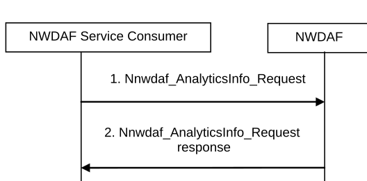
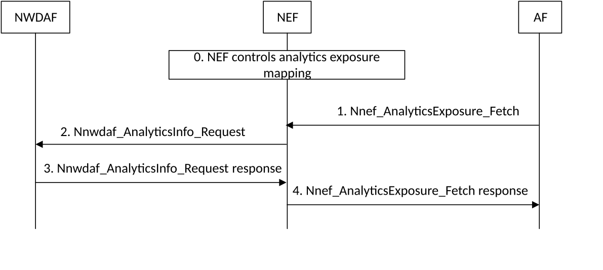

# 6.1.2 Analytics Request

## 6.1.2.1 Analytics request by NWDAF service consumer

This procedure is used by the NWDAF service consumer (e.g. including NFs/OAM) to request and get from NWDAF analytics information, using Nnwdaf_AnalyticsInfo service defined in clause 7.3.

Figure 6.1.2.1-1: Network data analytics Request

1\. The NWDAF service consumer requests analytics information by invoking Nnwdaf_AnalyticsInfo_Request service operation. The parameters that can be provided by the NWDAF service consumer are listed in clause 6.1.3.

When a request for analytics information is received, the NWDAF determines whether triggering new data collection is needed.

If the analytics request relates to outbound roaming users, the NWDAF in the HPLMN may decide to retrieve input data or analytics from the related VPLMN and the detailed procedure is described in clause 6.1.5.3 for analytics retrieval and in clause 6.2.10 for data retrieval.

If the analytics request relates to inbound roaming users, the NWDAF in the VPLMN may decide to retrieve input data or analytics, from the related HPLMN and the detailed procedure is described in clause 6.1.5.2 for analytics retrieval and in clause 6.2.11 for data retrieval.

2\. The NWDAF responds with analytics information to the NWDAF service consumer. The NWDAF checks if a Termination Request is indicated as defined in step 2 in clause 6.1.1.1.

## 6.1.2.2 Analytics request by AFs via NEF

The analytics exposure to AFs may be performed via NEF by using analytics request to NWDAF.

Figure 6.1.2.2-1 illustrates the interaction between AF and NWDAF performed via the NEF.

Figure 6.1.2.2-1: Procedure for analytics request by AFs via NEF

0\. NEF controls the analytics exposure mapping among the AF identifier with allowed Analytics ID(s) and associated inbound restrictions (i.e. applied to the Analytics ID requested by AF) and/or outbound restrictions (i.e. applied to the response of Analytics ID to AF).

In this Release, AF is configured, e.g. via static OAM configuration, with the appropriated NEF to subscribe to analytics information, the allowed Analytics ID(s) and with allowed inbound restrictions (i.e. parameters and/or parameter values) for requesting each Analytics ID.

1\. The AF requests to receive analytics information via NEF by invoking the Nnef_AnalyticsExposure_Fetch service operation defined in TS 23.502 \[3\]. If the analytics information request is authorized by the NEF, the NEF proceeds with the steps below.

2\. Based on the request from the AF, the NEF requests analytics information by invoking the Nnwdaf_AnalyticsInfo_Request service operation.

If the parameters and/or parameters values of the AF request comply with the restriction in the analytics exposure mapping, NEF forwards in the subscription to NWDAF service the Analytics ID, parameters and/or parameters values from AF in the request to NWDAF.

If the request from AF does not comply with the restrictions in the analytics exposure mapping, NEF may apply restrictions to the request to NWDAF (e.g. restrictions to parameters or parameter values of the Nnwdaf_AnalyticsInfo_Request service operations) based on operator configuration and/or may apply parameter mapping (e.g. geo coordinate mapping to TA(s), Cell-id(s)).

The NEF records the association of the analytics request from the AF and the analytics request sent to the NWDAF.

The NEF selects an NWDAF that supports analytics information requested by the AF using the NWDAF discovery procedure defined in TS 23.501 \[2\].

If the analytics request relates to outbound roaming users, the NWDAF in the HPLMN may decide to retrieve input data or analytics from the related VPLMN and the detailed procedure is described in clause 6.1.5.3 for analytics retrieval and in clause 6.2.10 for data retrieval.

3\. The NWDAF responds with the analytics information to the NEF.

4\. The NEF responds with the analytics information to the AF. NEF may apply restrictions to the response to AFs (e.g. restrictions to parameters or parameter values of the Nnef_AnalyticsExposure_Fetch response service operation) based on operator configuration. The AF checks if a Termination Request is present and then follows as defined in step 2 in clause 6.1.1.1.
