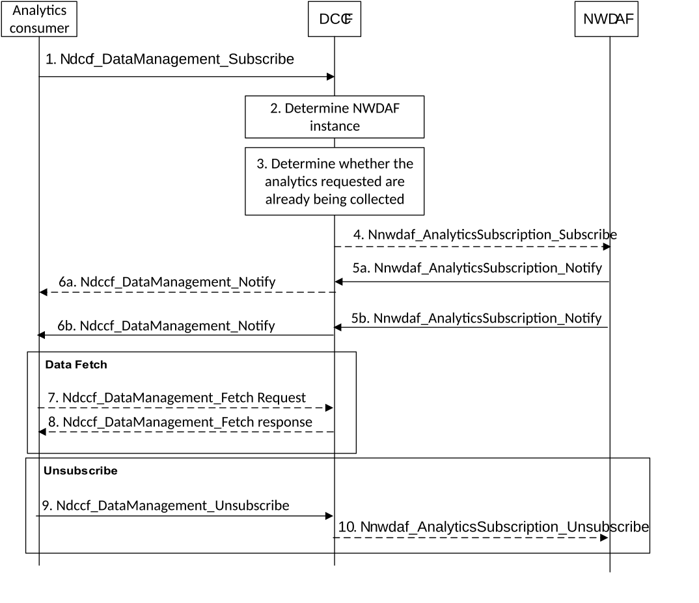
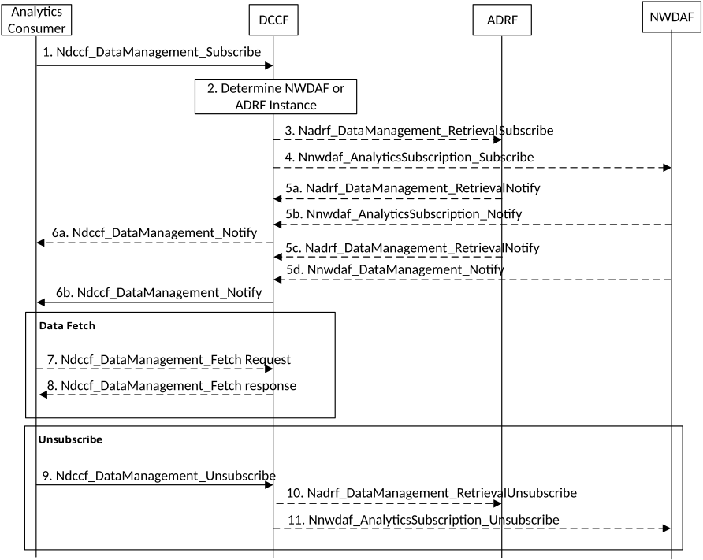
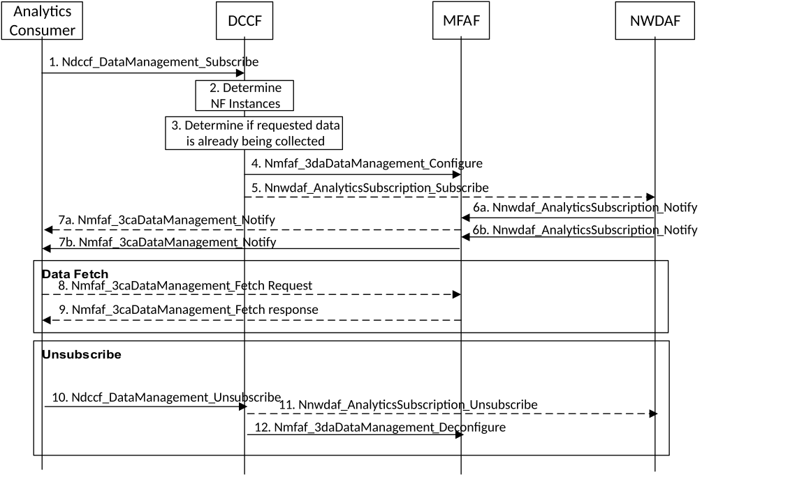
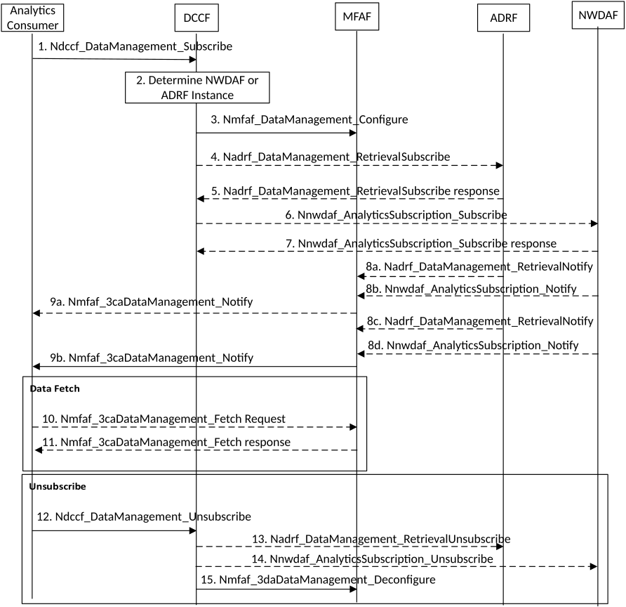

# 6.1.4 Analytics Exposure using DCCF

## 6.1.4.1 General

This clause specifies procedures for analytics exposure using DCCF services, with two options: analytics can be exposed via DCCF, according to clauses 6.1.4.2 and 6.1.4.3, or can be exposed via a messaging framework according to clauses 6.1.4.4 and 6.1.4.5. Which option to use is determined by DCCF configuration.

## 6.1.4.2 Analytics Exposure via DCCF

The procedure as depicted in Figure 6.1.4.2-1 is used by analytics consumer(s) (e.g. NFs/OAM) to subscribe/unsubscribe to NWDAF analytics and be notified of analytics information via the DCCF, using Ndccf_DataManagement_Subscribe service operation. Whether a NWDAF service consumer directly contacts the NWDAF or goes via the DCCF is based on NWDAF service consumer configuration.

Figure 6.1.4.2-1: Network data analytics subscription via DCCF

1\. Analytics consumer subscribes to analytics information via DCCF by invoking the Ndccf_DataManagement_Subscribe (Nnwdaf service operation, Analytics Specification, Formatting Instructions, Processing Instructions, NWDAF (or NWDAF-Set) ID, ADRF Information) service operation. The analytics consumer may specify one or more notification endpoints. Analytics consumer decides to go via DCCF based on internal configuration. The "Analytics Specification" provides Nnwdaf service operation specific parameters, e.g. Analytics IDs, Target of Analytics Reporting and optional parameters used to retrieve the analytics. The analytics consumer may provide the identity of the NWDAF to collect analytics from. The analytics consumer may provide additional information on possible notification endpoints or ADRF information so analytics are archived.

2\. If the NWDAF instance or NWDAF Set is not identified by the analytics Consumer, the DCCF determines the NWDAF instances that can provide analytics. If the consumer requested storage of analytics in an ADRF but an ADRF ID is not provided by the Analytics Consumer, or the collected analytics is to be stored in an ADRF according to configuration on the DCCF, the DCCF selects an ADRF to store the collected data.

3\. The DCCF determines whether the analytics requested in step 1 are already being collected. If the requested analytics are already being collected by an Analytics Consumer, the DCCF adds the new analytics consumer to the list of analytics consumers that are subscribed for these analytics.

4\. If the analytics subscribed in step 1 partially matches an analytics that is already being collected by the DCCF from an NWDAF and a modification of this subscription to the NWDAF would satisfy both the existing analytics subscriptions as well as the newly requested analytics, the DCCF invokes a modification of the previous subscription via Nnwdaf_AnalyticsSubscription_Subscribe service operation (as specified in clause 6.1.1.1) and the DCCF adds the analytics consumer to the list of analytics consumers that are subscribed for these analytics.

If the analytics requested at step 1 are not already available or not being collected yet, the DCCF subscribes to analytics from NWDAF using the Nnwdaf_AnalyticsSubscription_Subscribe procedure as specified in clause 6.1.1.1. The DCCF adds the analytics consumer to the list of analytics consumers that are subscribed for these analytics.

5\. When new output analytics are available, the NWDAF notifies the analytics information to the DCCF by invoking Nnwdaf_AnalyticsSubscription_Notify service operation.

6\. The DCCF uses Ndccf_DataManagement_Notify to send the analytics to all notification endpoints indicated in step 1. Analytics sent to notification endpoints may be processed and formatted by the DCCF so they conform to delivery requirements for each analytics consumer or notification endpoint as specified in clause 5A.4. The DCCF may store the analytics in the ADRF if requested by the consumer or if required by DCCF configuration, using procedure as specified in clause 6.2B.3.

NOTE: According to Formatting Instructions provided by the Analytics Consumer, multiple notifications from a NWDAF can be combined in a single Ndccf_DataManagement_Notify so many notifications from an NWDAF results in fewer notifications (or one notification) to the Analytics Consumer. Alternatively, a notification can instruct the analytics notification endpoint to fetch the analytics from the DCCF.

7\. If a Ndccf_DataManagement_Notify contains a fetch instruction, the notification endpoint sends a Ndccf_DataManagement_Fetch request to fetch the analytics from the DCCF before an expiry time.

8\. The DCCF delivers the analytics to the notification endpoint.

9\. When the Analytics Consumer no longer wants analytics to be collected it invokes Ndccf_DataManagement_Unsubscribe (Subscription Correlation ID), using the Subscription Correlation ID received in response to its subscription in step 1. The DCCF removes the analytics consumer from the list of analytics consumers that are subscribed for these analytics.

10\. If there are no other Analytics Consumers subscribed to the analytics, the DCCF unsubscribes with the NWDAF.

## 6.1.4.3 Historical Analytics Exposure via DCCF

The procedure as depicted in Figure 6.1.4.3-1 is used by an analytics consumer (e.g. NFs/OAM) to obtain historical analytics via the DCCF. Historical analytics may be previously computed statistics or predictions stored in an NWDAF or ADRF. Statistics may have been previously computed and stored in the ADRF or NWDAF and can be identified by a "target period" in the past (see clause 6.1.3). Requests for previously computed predictions have a "Time Window", which specifies an allowable span for when the predictions may have been computed. This allows the Analytics Consumer to request previously computed predictions for a target period.

The analytics consumer requests analytics via the DCCF, using Ndccf_DataManagement_Subscribe service operation. Whether the NWDAF service consumer directly contacts the NWDAF/ADRF or goes via the DCCF is based on configuration.

Figure 6.1.4.3-1: Historical Analytics Exposure via DCCF

1\. The analytics consumer requests analytics via DCCF by invoking the Ndccf_DataManagement_Subscribe (Nnwdaf service operation, Analytics Specification, Time Window, Formatting Instructions, Processing Instructions, ADRF ID or NWDAF ID (or ADRF Set ID or NWDAF Set ID) service operation as specified in clause 8.2.2. The analytics consumer may specify one or more notification endpoints to receive the analytics.

Parameter "Nnwdaf service operation" is the service operation used to originally acquire the analytics and identifies this as a request for analytics, "Analytics Specification" provides Nnwdaf service operation specific parameters, e.g. Analytics IDs, Target of Analytics Reporting and optional parameters used to retrieve the analytics. "Time Window" specifies a past time period and comprises a start and stop time indicating when predictions were computed and "Formatting and Processing Instructions" are as defined in clause 5A.4. The analytics consumer may optionally include the ADRF or NWDAF instance (or ADRF Set or NWDAF Set) ID where the stored analytics resides.

2\. If an ADRF or NWDAF instance or ADRF or NWDAF Set ID is not provided by the analytics consumer, the DCCF determines if any ADRF or NWDAF instances might provide the analytics as described in clause 5A and clause 5B.

3\. (conditional) If the DCCF determines that an ADRF instance might provide the analytics, or an ADRF instance or Set was supplied by the analytics consumer, the DCCF sends a request to the ADRF, using Nadrf_DataManagement_RetrievalSubscribe (Analytics Specification, Notification Target Address=DCCF) service operation, as specified in clause 10.2. The ADRF responds to the DCCF with an Nadrf_DataManagement_RetrievalSubscribe response indicating if the ADRF can supply the analytics. If the analytics can be provided, the procedure continues with step 5.

4\. (conditional) If the DCCF determines that an NWDAF instance might provide the analytics or an NWDAF instance or Set was supplied by the Analytics Consumer, the DCCF sends a request to the NWDAF using Nnwdaf_AnalyticsSubscription_Subscribe as specified in clause 7.2.2.

5\. The ADRF uses Nadrf_DataManagement_RetrievalNotify or the NWDAF uses Nnwdaf_AnalyticsSubscription_Notify to send the requested analytics (e.g. one or more stored notifications archived from an NWDAF) to the DCCF. The analytics may be sent in one or more notification messages.

6\. The DCCF uses Ndccf_DataManagement_Notify to send analytics to all notification endpoints indicated in step 1. Notifications are sent to the Notification Target Address(es) using the Analytics Consumer Notification Correlation ID(s) received in step 1. Analytics sent to notification endpoints may be processed and formatted by the DCCF, so they conform to delivery requirements specified by the analytics consumer.

NOTE: According to Formatting Instructions provided by the analytics consumer, multiple notifications from an ADRF or NWDAF can be combined in a single Ndccf_DataManagement_Notify so many notifications from the ADRF or NWDAF results in fewer notifications (or one notification) to the Analytics Consumer. Alternatively, a Ndccf_DataManagement_Notify can instruct the analytics notification endpoint to fetch the analytics from the DCCF before an expiry time.

7\. If a notification contains a fetch instruction, the notification endpoint sends a Ndccf_DataManagement_Fetch request as specified in clause 8.2.5 to fetch the analytics from the DCCF.

8\. The DCCF delivers the analytics to the notification endpoint.

9\. When the analytics consumer no longer wants analytics to be collected or has received all the analytics it needs, it invokes Ndccf_DataManagement_Unsubscribe (Subscription Correlation ID), using the Subscription Correlation Id received in response to its subscription in step 1.

10\. If the analytics are being provided by an ADRF and there are no other analytics consumers subscribed to the analytics, the DCCF unsubscribes with the ADRF using Nadrf_DataManagement_RetrievalUnsubscribe as specified in clause 10.2.7.

11\. If the analytics are being provided by an NWDAF and there are no other analytics consumers subscribed to the analytics, the DCCF unsubscribes with the NWDAF using Nnwdaf_AnalyticsSubscription_Unsubscribe service operation as specified in clause 7.2.3.

## 6.1.4.4 Analytics Exposure via Messaging Framework

The procedure as depicted in Figure 6.1.4.4-1 is used by analytics consumer(s) (e.g. NFs/OAM) to subscribe/unsubscribe to NWDAF analytics and be notified of analytics information, using Ndccf_DataManagement_Subscribe service operation. The 3GPP DCCF Adaptor (3da) Data Management service and 3GPP Consumer Adaptor (3ca) Data Management service of the Messaging Framework Adaptor Function (MFAF) are used to interact with the 3GPP Network and the Messaging Framework. Whether a NWDAF service consumer directly contacts the NWDAF or goes via the DCCF is based on NWDAF service consumer configuration.

Figure 6.1.4.4-1: Network data analytics subscription via DCCF

1\. Analytics consumer subscribes to analytics information via DCCF by invoking the Ndccf_DataManagement_Subscribe (Nnwdaf service operation, Analytics Specification, Formatting Instructions, Processing Instructions, NWDAF (or NWDAF-Set) ID, ADRF Information, Analytics Consumer Notification Target Address (+ Notification Correlation ID)) service operation. The analytics consumer may specify one or more notification endpoints. Analytics consumer decides to go via DCCF based on internal configuration. The "Analytics Specification" provides Nnwdaf service operation specific parameters, e.g. Analytics IDs, Target of Analytics Reporting and optional parameters used to retrieve the analytics. The analytics consumer may provide the identity of the NWDAF to collect analytics from. The analytics consumer may provide additional information on possible notification endpoints or ADRF information to archive analytics.

2\. If the NWDAF instance or NWDAF Set is not identified by the analytics consumer, the DCCF determines the NWDAF instances that can provide analytics. If the consumer requested storage of analytics in an ADRF but an ADRF ID is not provided by the Analytics Consumer, or the collected analytics is to be stored in an ADRF according to configuration on the DCCF, the DCCF selects an ADRF to store the collected analytics.

3\. The DCCF determines whether the analytics requested in step 1 are already being collected. If the requested analytics are already being collected by an analytics consumer, the DCCF adds the new analytics consumer to the list of analytics consumers that are subscribed for these analytics.

4\. The DCCF sends an Nmfaf_3daDataManagement_Configure (Analytics Consumer Information, MFAF Notification Information, Formatting Conditions, Processing Instructions) to configure the MFAF to map notifications received from the NWDAF to outgoing notifications sent to endpoints and to instruct the MFAF how to format and process the outgoing notifications.

"Analytics Consumer Information" contains for each notification endpoint, the analytics consumer Notification Target Address (+ Analytics Consumer Notification Correlation ID) to be used by the MFAF when sending notifications in step 7.

"MFAF Notification Information" is included if an NWDAF is already sending the analytics to the MFAF. MFAF Notification Information identifies Event Notifications received from the NWDAF and comprises the MFAF Notification Target Address (+ MFAF Notification Correlation ID). If the MFAF does not receive MFAF Notification information from the DCCF, the MFAF selects an MFAF Notification Target Address (+ MFAF Notification Correlation ID) and sends the MFAF Notification Information, containing the MFAF Notification Target Address (+ MFAF Notification Correlation ID), to the DCCF in the Nmfaf_3daDataManagement_Configure Response.

5\. If the analytics subscribed in step 1 partially matches analytics that are already being collected by the DCCF from a NWDAF and a modification of this subscription to the NWDAF would satisfy both the existing analytics subscriptions as well as the newly requested analytics, the DCCF invokes Nnwdaf_AnalyticsSubscription_Subscribe (Subscription Correlation ID) with parameters indicating how to modify the previous subscription (as specified in clause 6.1.1.1). The DCCF adds the analytics consumer to the list of analytics consumers that are subscribed for these analytics.

If the analytics requested at step 1 are not already available or not being collected yet, the DCCF subscribes to analytics from the NF using Nnwdaf_AnalyticsSubscription_Subscribe, setting the Notification Target Address (+Notification Correlation ID)) to the MFAF Notification Target Address (+ MFAF Notification Correlation ID) received in step 4. The DCCF adds the analytics consumer to the list of analytics consumers that are subscribed for these analytics.

6\. When new output analytics are available, the NWDAF uses Nnwdaf_AnalyticsSubscription_Notify to send the analytics to the MFAF. The Notification includes the MFAF Notification Correlation ID.

7\. The MFAF uses Nmfaf_3caDataManagement_Notify to send the analytic to all notification endpoints indicated in step 4. Notifications are sent to the Notification Target Address(es) using the Analytics Consumer Notification Correlation ID(s) received in step 4. Analytics sent to notification endpoints may be processed and formatted by the MFAF, so they conform to delivery requirements specified by the analytics consumer. The MFAF may store the information in the ADRF if requested by consumer or if required by DCCF configuration, using procedure as specified in clause 6.2B.3.

NOTE: According to Formatting Instructions provided by the Analytics Consumer, multiple notifications from a NWDAF can be combined in a single Nmfaf_3caDataManagement_Notify, so many notifications from the NWDAF results in fewer notifications (or one notification) to the analytics consumer. Alternatively, a notification can instruct the analytics notification endpoint to fetch the analytics from the MFAF before an expiry time.

8\. If a Nmfaf_3caDataManagement_Notify contains a fetch instruction, the notification endpoint sends a Nmfaf_3caDataManagement_Fetch request to fetch the analytics from the MFAF.

9\. The MFAF delivers the analytics to the notification endpoint.

10\. When the analytics consumer no longer wants analytics to be collected, it invokes Ndccf_DataManagement_Unsubscribe (Subscription Correlation ID), using the Subscription Correlation Id received in response to its subscription in step 1. The DCCF removes the analytics consumer from the list of analytics consumers that are subscribed for these analytics.

11\. If there are no other analytics consumers subscribed to the analytics, the DCCF unsubscribes with the NWDAF.

12\. The DCCF de-configures the MFAF so it no longer maps notifications received from the NWDAF to the notification endpoints configured in step 4.

## 6.1.4.5 Historical Analytics Exposure via Messaging Framework

The procedure as depicted in Figure 6.1.4.5-1 is used by an analytics consumer (e.g. NFs/OAM) to obtain historical analytics via the messaging framework. Historical analytics may be previously computed statistics or predictions stored in an NWDAF or ADRF. Statistics may be previously computed and stored in the ADRF or NWDAF and can be identified by a "target period" in the past (see clause 6.1.3). Requests for previously computed predictions have a "Time Window", which specifies an allowable span for when the predictions may have been computed. This allows the analytics consumer to request previously computed predictions for a target period.

The analytics consumer requests analytics via the DCCF, using Ndccf_DataManagement_Request service operation. Whether the NWDAF service consumer directly contacts the NWDAF/ADRF, or goes via the DCCF is based on configuration.

Figure 6.1.4.5-1: Historical Analytics Exposure via Messaging Framework

1\. The analytics consumer requests analytics via DCCF by invoking the Ndccf_DataManagement_Subscribe (Nnwdaf service operation, Analytics Specification, Time Window, Formatting Instructions, Processing Instructions, ADRF ID or NWDAF ID (or ADRF Set ID or NWDAF Set ID)). The analytics consumer may specify one or more notification endpoints to receive the analytics.

2\. If an ADRF or NWDAF instance or ADRF or NWDAF Set ID is not provided by the Analytics Consumer, the DCCF determines if any ADRF or NWDAF instances might provide the analytics as described in clause 5A and clause 5B.

3\. The DCCF sends an Nmfaf_3daDataManagement_Configure (Analytics Consumer Information, Formatting Conditions, Processing Instructions) to configure the MFAF to map notifications received from the ADRF or NWDAF to outgoing notifications sent to endpoints and to instruct the MFAF how to format and process the outgoing notifications.

"Analytics Consumer Information" contains for each notification endpoint, the analytics consumer Notification Target Address (+ Analytics Consumer Notification Correlation ID) to be used by the MFAF when sending notifications. The MFAF selects an MFAF Notification Target Address (+ MFAF Notification Correlation ID) and sends the MFAF Notification Information, containing the MFAF Notification Target Address (+ MFAF Notification Correlation ID), to the DCCF in the Nmfaf_3daDataManagement_Configure Response.

4\. (conditional) If the DCCF determines that an ADRF instance might provide the analytics, or an ADRF instance or Set was supplied by the Analytics Consumer, the DCCF sends a request to the ADRF, using Nadrf_DataManagement_RetrievalSubscribe (Analytics Specification, MFAF Notification Information) as specified in clause 10.2.6. The MFAF Notification information contains the MFAF Notification Target Address (+ MFAF Notification Correlation ID) received in step 3.

5\. The ADRF responds to the DCCF with an Nadrf_DataManagement_RetrievalSubscribe response indicating if the ADRF can supply the analytics. If the analytics can be provided, the procedure continues with step 8.

6\. (conditional) If the DCCF determines that an NWDAF instance might provide the analytics or an NWDAF instance or Set was supplied by the Analytics Consumer, the DCCF sends a request to the NWDAF using Nnwdaf_AnalyticsSubscription_Subscribe as specified in clause 7.2.2. The MFAF Notification Information contains the MFAF Notification Target Address (+ MFAF Notification Correlation ID) received in step 3.

7\. The NWDAF responds to the DCCF with an Nnwdaf_AnalyticsSubscription_Subscribe response indicating if the NWDAF can supply the analytics.

8\. The ADRF uses Nadrf_DataManagement_RetrievalNotify or the NWDAF uses Nnwdaf_AnalyticsSubscription_Notify to send the requested analytics (e.g. one or more stored notifications archived from an NWDAF) to the MFAF. The analytics may be sent in one or more notification messages.

9\. The MFAF uses Nmfaf_3caDataManagement_Notify to send analytics to all notification endpoints indicated in step 3. Notifications are sent to the Notification Target Address(es) using the Analytics Consumer Notification Correlation ID(s) received in step 3. Analytics sent to notification endpoints may be processed and formatted by the DCCF, so they conform to delivery requirements specified by the analytics consumer.

NOTE: According to Formatting Instructions provided by the Analytics Consumer, multiple notifications from an ADRF or NWDAF can be combined in a single Ndccf_DataManagement_Notify so many notifications from the ADRF or NWDAF results in fewer notifications (or one notification) to the Analytics Consumer. Alternatively, a Nmfaf_3caDataManagement_Notify can instruct the analytics notification endpoint to fetch the analytics from the DCCF before an expiry time.

10\. If a notification contains a fetch instruction, the notification endpoint sends a Nmfaf_3caDataManagement_Fetch request as specified in clause 9.3.3 to fetch the analytics from the MFAF.

11\. The DCCF delivers the analytics to the notification endpoint.

12\. When the analytics consumer no longer wants analytics to be collected or has received all the analytics it needs, it invokes Ndccf_DataManagement_Unsubscribe (Subscription Correlation ID) as specified in clause 8.2.3, using the Subscription Correlation Id received in response to its subscription in step 1.

13\. If the analytics are being provided by an ADRF and there are no other analytics consumers subscribed to the analytics, the DCCF invokes Nadrf_DataManagement_RetrievalUnsubscribe as specified in clause 10.2.7 to unsubscribe from the ADRF.

14\. If the analytics are being provided by an NWDAF and there are no other analytics consumers subscribed to the analytics, the DCCF invokes Nnwdaf_AnalyticsSubscription_Unsubscribe service operation as specified in clause 7.2.3 to unsubscribe from the NWDAF

15\. The DCCF de-configures the MFAF so it no longer maps notifications received from the NWDAF to the notification endpoints configured in step 3.
