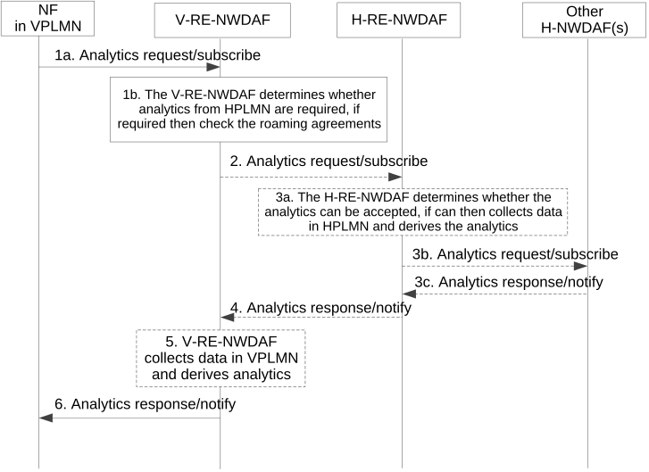
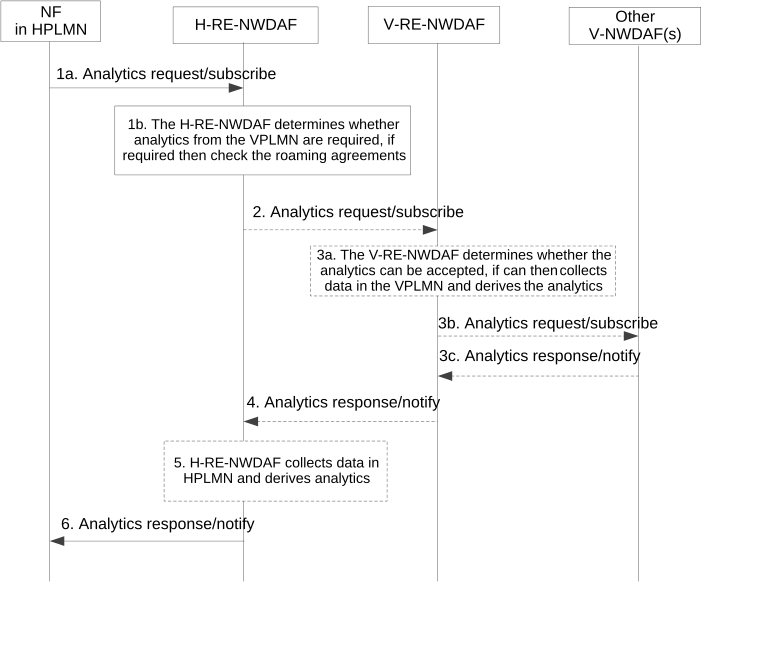

# 6.1.5 Analytics Exposure in Roaming Case

## 6.1.5.1 General

Based on roaming agreements (e.g. SLA), analytics may be exchanged between PLMNs (i.e. HPLMN and VPLMN of a UE served by the NWDAF analytics consumer). In this case, an NWDAF with roaming exchange capability (RE-NWDAF) is used as entry point in a PLMN to exchange analytics in roaming scenario with other PLMNs. It authorizes the analytics request according to roaming agreements, and filters the information exposed to other PLMNs. The roaming architecture is defined in clause 4.3.

The H-RE-NWDAF may provide analytics to the V-RE-NWDAF. The V-RE-NWDAF may provide analytics to the H-RE-NWDAF.

NOTE 1: The roaming agreements (e.g. SLA) between HPLMN and VPLMN on network analytics and data exchange takes into consideration all relevant regulatory requirements.

NOTE 2: It depends on the deployment whether analytics exchange between PLMNs is supported, and thus whether H-RE-NWDAF and V-RE-NWDAF are provided in a PLMN.

The H-RE-NWDAF or V-RE-NWDAF provides the Nnwdaf_RoamingAnalytics service for that purpose. An RE-NWDAF is the only consumer of these services, i.e. both NWDAF in HPLMN and NWDAF in VPLMN need to have the roaming exchange capability (in other words, be an H-RE-NWDAF or V-RE-NWDAF, respectively) when used as entry point or exit point to exchange analytics in roaming scenario.

NOTE 3: The access to the Nnwdaf_AnalyticsSubscription service and the Nnwdaf_AnalyticsInfo service is expected to be restricted by the NRF to NF service consumers within the same PLMN to prevent bypassing checks based on user consent and operator policy

NOTE 4: See clause X.7 and Annex V of TS 33.501 \[49\] for details of the user consent check procedures. See clause X.8 of TS 33.501 \[49\] for protection of analytics exchange in roaming case.

V-RE-NWDAF may request or subscribe to HPLMN analytics from the H-RE-NWDAF as described in clause 6.1.5.2, and then the analytics can be leveraged by the 5GC NF in the VPLMN, for example:

\- In home routed roaming scenarios, HPLMN analytics (i.e. slice load level analytics, NF load analytics, etc.) can be leveraged by the AMF in the VPLMN for network slice selection and SMF selection for PDU Session management.

\- UE-related analytics (e.g.. service experience analytics, etc.) can include statistics or predictions for outbound roaming UEs.

NOTE 5: Analytics that rely on input data from the VPLMN are preferably not provided from H-RE-NWDAF to V-RE-NWDAF, but generated by a NWDAF in the VPLMN.

H-RE-NWDAF may request or subscribe to VPLMN analytics from the V-RE-NWDAF as described in clause 6.1.5.3, and then the analytics can be leveraged by the 5GC NF in the HPLMN, for example:

\- In home routed roaming scenarios, analytics information with statistics or predictions for outbound roaming UEs can be leveraged by the H-PCF for QoS control of the PDU Session.

\- Analytics (i.e. service experience analytics, slice load level analytics, etc.) can be leveraged by the H-PCF for decision of NSSP in URSP rules provisioned to the UE roaming in the VPLMN.

NOTE 6: Analytics that rely on input data from the HPLMN are preferably not provided from V-RE-NWDAF to H-RE-NWDAF, but generated by a NWDAF in the HPLMN.

## 6.1.5.2 Analytics Exposure from HPLMN to VPLMN

Figure 6.1.5.2-1 shows the procedure where a V-RE-NWDAF requests network analytics (i.e. slice load level analytics, NF load analytics, service experience analytics, etc.) in HPLMN from a H-RE-NWDAF, upon receiving an analytics information request/subscribe from a service consumer NF (e.g. AMF) in the VPLMN.

Figure 6.1.5.2-1: Procedure for analytics exposure from HPLMN to VPLMN

1a. The Consumer NF in VPLMN (e.g. AMF) discovers a V-RE-NWDAF as described in clause 5.2 and sends an Analytics request/subscribe (Analytics ID, Analytics Filter Information, Target of Analytics Reporting) to the V-RE-NWDAF by invoking a Nnwdaf_AnalyticsInfo_Request service operation or a Nnwdaf_AnalyticsSubscription_Subscribe service operation.

1b. For the inbound roaming UE(s) indicated in the Target of Analytics Reporting:

\- The V-RE-NWDAF determines based on operator configuration and the requested analytics whether analytics or input data from the HPLMN are required, or the analytics can be derived locally. The subsequent steps only apply if analytics from the HPLMN are required. If input data from the HPLMN are required, the procedures in clause 6.2.11 apply.

NOTE 1: It is possible that the Target of Analytics Reporting sent by the Consumer NF to the V-RE-NWDAF includes both inbound roaming UE(s) and non-roaming UE(s).

\- The V-RE-NWDAF checks the roaming agreements related to analytics from the HPLMN to determine if the roaming analytics request/subscribe can be accepted or must be rejected with a proper cause in the response to the Consumer NF. If the V-RE-NWDAF determined the roaming analytics request/subscribe is rejected, the following steps are skipped.

2\. The V-RE-NWDAF discovers a H-RE-NWDAF as described in clause 5.2 if the V-RE-NWDAF determines the roaming analytics request/subscribe can be accepted. The V-RE-NWDAF sends a roaming analytics request/subscribe (Analytics ID, Analytics Filter Information, Target of Analytics Reporting) to H-RE-NWDAF by invoking a Nnwdaf_RoamingAnalytics_Request service operation or a Nnwdaf_RoamingAnalytics_Subscribe service operation, based on the Analytics request/subscribe received from the Consumer NF in the VPLMN. The Target of Analytics Reporting sent by the V-RE-NWDAF to the H-RE-NWDAF only contains the inbound roaming UE(s).

NOTE 2: The inbound roaming UE(s) are distinguished by the V-RE-NWDAF according to the UE ID(s) (i.e. SUPI(s)).

3a. The H-RE-NWDAF checks the roaming agreements between the HPLMN and the VPLMN, and user consent for analytics as defined in clause 6.2.9 if needed, to determine if the roaming analytics request/subscribe can be accepted or must be rejected with a proper cause in response to the V-RE-NWDAF (which then relays the response to the Consumer NF). If the roaming analytics request/subscribe is rejected, the following steps are skipped.

If the H-RE-NWDAF supports to generate the requested analytics, it collects data from the NF(s) and/or OAM in the HPLMN and derives the requested analytics; otherwise step 3b and step 3c are executed.

NOTE 3: See clause X.7 and Annex V of TS 33.501 \[49\] for details of the user consent check procedures. See clause X.8 of TS 33.501 \[49\] for protection of analytics exchange in roaming case.

3b-3c. \[Optional\] If the H-RE-NWDAF does not support to generate the requested analytics, it may request/subscribe to other NWDAF(s) in the HPLMN (if available) for the analytics and get corresponding response/notification.

4\. The H-RE-NWDAF sends the HPLMN analytics information to the V-RE-NWDAF using either Nnwdaf_RoamingAnalytics_Request response or Nnwdaf_RoamingAnalytics_Notify service operation, depending on the service used in step 2. The H-RE-NWDAF may restrict the exposed analytics information based on HPLMN operator polices.

5\. \[Optional\] If the Consumer NF also indicates request or subscription of analytics information available in the VPLMN (e.g. via Target of Analytics Reporting) in step 1, the V-RE-NWDAF collects data from the NF(s) and/or OAM in VPLMN and derives the requested analytics. These steps can be executed in parallel with steps 3-4. The V-RE-NWDAF may perform analytics aggregation with the analytics information received from the H-RE-NWDAF and analytics information generated by itself, based on the analytics request or subscription.

6\. The V-RE-NWDAF sends the HPLMN analytics information received in step 4, or the aggregated analytics information if step 5 are performed, to the Consumer NF in the VPLMN using either Nnwdaf_AnalyticsInfo_Request response or Nnwdaf_AnalyticsSubscription_Notify service operation, depending on the service used in step 1.

NOTE 4: The present document describes that the RE-NWDAF can perform analytics aggregation for roaming scenario, but whether and how the RE-NWDAF performs analytics aggregation for roaming scenario are up to implementation.

## 6.1.5.3 Analytics Exposure from VPLMN to HPLMN

Figure 6.1.5.3-1 shows the procedure that the H-RE-NWDAF requests network analytics (i.e. service experience analytics, slice load level analytics, etc.) in the VPLMN from the V-RE-NWDAF, upon receiving an analytics information request/subscription from the service consumer NF (e.g. PCF) in the HPLMN.

Figure 6.1.5.3-1: Procedure for analytics exposure from VPLMN to HPLMN

1a. If the Consumer NF in the HPLMN (e.g. H-PCF) is aware that the UE(s) indicated in Target of Analytics Reporting is/are outbound roaming UE(s), the Consumer NF discovers a H-RE-NWDAF as described in clause 5.2 and sends an Analytics request/subscribe (Analytics ID, Target of Analytics Reporting, Analytics Filter Information) to the H-RE-NWDAF by invoking a Nnwdaf_AnalyticsInfo_Request service operation or a Nnwdaf_AnalyticsSubscription_Subscribe service operation.

1b. For the outbound roaming UE(s) indicated in the Target of Analytics Reporting:

\- The H-RE-NWDAF determines based on operator configuration and the requested analytics whether analytics or input data from the VPLMN are required, or the analytics can be derived locally. The subsequent steps only apply if analytics from the VPLMN are required. If input data from the VPLMN are required, the procedures in clause 6.2.10 apply.

\- If the Consumer NF is unaware that the Target of Analytics Reporting includes roaming UE(s) and sends the Analytics request/subscribe to a H-NWDAF which does not support roaming exchange capability, then the H-NWDAF may perform either of the following after determining that the Target of Analytics Reporting includes roaming UE(s) (e.g. by inquiring the AMF(s) serving the UE(s) at the UDM with the Nudm_UECM service):

\- forward the Analytics request/subscribe to a H-RE-NWDAF after discovering a H-RE-NWDAF as described in clause 5.2. The H-NWDAF may include the VPLMN ID in the Analytics request/subscribe; or

\- reject the Analytics request/subscribe with a proper cause value in the response to the Consumer NF. And the following steps will not be performed.

NOTE 1: It is possible that the Target of Analytics Reporting sent by the Consumer NF to the H-RE-NWDAF includes both outbound roaming UE(s) and non-roaming UE(s).

NOTE 2: The H-NWDAF is not depicted in the flow.

\- If PLMN ID of the VPLMN is not included in the Analytics request/subscribe, the H-NWDAF inquires it at the UDM for the UE(s) indicated as Target of Analytics Reporting. The H-RE-NWDAF checks user consent for analytics as defined in clause 6.2.9. The H-RE-NWDAF checks the roaming agreements between the HPLMN and the VPLMN to determine if the roaming analytics request/subscription can be accepted or must be rejected with a proper cause in the response to the Consumer NF. If the H-RE-NWDAF determined the roaming analytics request/subscribe is rejected, the following steps are skipped.

NOTE 3: See clause X.7 and Annex V of TS 33.501 \[49\] for details of the user consent check procedures. See clause X.8 of TS 33.501 \[49\] for protection of analytics exchange in roaming case.

2\. The H-RE-NWDAF discovers the V-RE-NWDAF as described in clause 5.2 if the H-RE-NWDAF determined the roaming analytics request/subscribe can be accepted. The H-RE-NWDAF sends a roaming analytics request/subscribe (Analytics ID, Analytics Filter Information, Target of Analytics Reporting, \[NF ID(s)\]) to the V-RE-NWDAF by invoking a Nnwdaf_RoamingAnalytics_Request service operation or a Nnwdaf_RoamingAnalytics_Subscribe service operation, based on the Analytics request/subscribe received from the Consumer NF in HPLMN. The Target of Analytics Reporting sent by the H-RE-NWDAF to the V-RE-NWDAF only contains the outbound roaming user(s). The H-RE-NWDAF may obtain NF ID(s) of the NF(s) serving the roaming UE(s) in the VPLMN, e.g. AMF ID(s), SMF ID(s), from the UDM and include the NF ID(s) in the analytics request/subscribe.

3a. The V-RE-NWDAF checks the roaming agreements between the HPLMN and the VPLMN, to determine if the roaming analytics request/subscribe can be accepted or must be rejected with a proper cause in response to the H-RE-NWDAF (which then relays the response to the Consumer NF). If the roaming analytics request/subscribe is rejected, the following steps are skipped.

If the V-RE-NWDAF supports to generate the requested analytics, it collects data from the NF(s) serving the roaming UE(s) and/or OAM in VPLMN and derives the analytics; otherwise step 3b and step 3c are executed. The NF(s) serving the roaming UE(s), e.g. AMF(s) or SMF(s), if indicated in step 2, can be used as data source.

3b-3c. \[Optional\] If the V-RE-NWDAF does not support to generate the requested analytics, it may request/subscribe to other NWDAF(s) in the VPLMN (if available) for the analytics and get corresponding response/notification(s).

4\. The V-RE-NWDAF sends the VPLMN analytics information to the H-RE-NWDAF using either Nnwdaf_RoamingAnalytics_Request response or Nnwdaf_RoamingAnalytics_Notify service operation, depending on the service used in step 2. The V-RE-NWDAF may restrict the exposed analytics information based on VPLMN operator polices.

5\. \[Optional\] If the Consumer NF also indicates request or subscription of analytics information available in the HPLMN (e.g. via Target of Analytics Reporting) in step 1, the H-RE-NWDAF collects data from the NF(s) and/or OAM in HPLMN and derives the analytics. These steps can be executed in parallel with steps 3-4. The H-RE-NWDAF may perform analytics aggregation with the analytics information received from the V-RE-NWDAF and analytics information generated by itself, based on the analytics request or subscription.

6\. The H-RE-NWDAF sends the VPLMN analytics information received in step 4, or the aggregated analytics information if step 5 are performed, to the Consumer NF in HPLMN using either Nnwdaf_AnalyticsInfo_Request response or Nnwdaf_AnalyticsSubscription_Notify, depending on the service used in step 1.

If the Analytics request/subscribe is forwarded to the H-RE-NWDAF by a H-NWDAF as described in step 1, the H-NWDAF forwards the analytics information received from the H-RE-NWDAF to the Consumer NF using either Nnwdaf_AnalyticsInfo_Request response or Nnwdaf_AnalyticsSubscription_Notify, depending on the service used in step 1.

NOTE 4: The present document describes that the RE-NWDAF may perform analytics aggregation for roaming scenario, but whether and how the RE-NWDAF performs analytics aggregation for roaming scenario are up to implementation.

## 6.1.5.4 Contents of Analytics Exposure in roaming case

When requesting or subscribing to analytics involving one or more roaming UEs, the Consumer NF shall send the request or subscription to an RE-NWDAF belonging to the same PLMN as the Consumer NF. The Consumer NF may indicate the following parameters in the Nnwdaf_AnalyticsInfo_Request service operation or the Nnwdaf_AnalyticsSubscription_Subscribe service operation:

\- The parameters as defined in clause 6.1.3, with the following differences:

\- Parameters related to analytics aggregation, analytics transfer or ML Model selection should not be included;

\- If Target of Analytics Reporting is included and indicates specific UE(s) or a group of UEs, these UEs shall belong to the same HPLMN (if HPLMN analytics are subscribed/requested) or be served by the same VPLMN (if VPLMN analytics are subscribed/requested)

\- Additionally, the following parameters:

\- If the NWDAF service consumer in a VPLMN requests/subscribes to HPLMN analytics, in Analytics Filter Information:

\- \[OPTIONAL\] PLMN ID of the HPLMN;

NOTE 1: If PLMN ID of the HPLMN is not provided by the NWDAF service consumer, the V-RE-NWDAF derives it from the SUPIs of UEs indicated as Target of Analytics Reporting.

\- \[OPTIONAL\] mapped S-NSSAI of the HPLMN.

\- \[OPTIONAL\] AOI (in the form of geographical area) in the HPLMN

\- If the NWDAF service consumer in a HPLMN requests/subscribes to VPLMN analytics, in Analytics Filter Information:

\- \[OPTIONAL\] PLMN ID of the VPLMN

\- \[OPTIONAL\] AOI (in the form of geographical area) in the VPLMN

NOTE 2: If PLMN ID of the VPLMN is not provided by the NWDAF service consumer, the H-RE-NWDAF inquires it at the UDM for the UEs indicated as Target of Analytics Reporting.

NOTE 3: In this release of the specification, only one PLMN ID (of HPLMN or VPLMN) is supported in the Nnwdaf_AnalyticsInfo_Request service operation or the Nnwdaf_AnalyticsSubscription_Subscribe service operation.

Based on the analytics request or subscription from the NWDAF service consumer in the HPLMN, and local configuration, the H-RE-NWDAF may indicate the following parameters in the Nnwdaf_RoamingAnalytics_Request service operation or the Nnwdaf_RoamingAnalytics_Subscribe service operation to the V-RE-NWDAF, for requesting/subscribing to analytics in the VPLMN:

\- Analytics ID;

\- PLMN ID of the HPLMN;

NOTE 4: Security aspects for analytics exchange are covered in TS 33.501 \[49\].

\- Analytics Filter Information:

\- \[OPTIONAL\] HPLMN S-NSSAI;

NOTE 5: V-NWDAF maps that S-NSSAI to an S-NSSAI of the VPLMN which will be used in the Analytics Filter Information.

\- other Analytics Filter Information (e.g. AOI in the form of geographical area in the VPLMN) as provided by NWDAF service consumer in the HPLMN, if applicable in the VPLMN.

\- \[OPTIONAL\] NF ID(s) of the NF(s) (e.g. AMF(s), SMF(s)) serving the roaming UE(s) in the VPLMN;

\- other parameters as provided by NWDAF service consumer in the HPLMN, if applicable in the VPLMN.

Based on the analytics request or subscription from the NWDAF service consumer in the VPLMN, and local configuration, the V-RE-NWDAF may indicate the following parameters in the Nnwdaf_RoamingAnalytics_Request service operation or the Nnwdaf_RoamingAnalytics_Subscribe service operation to the H-RE-NWDAF, for requesting/subscribing to analytics in the HPLMN:

\- Analytics ID;

\- PLMN ID of the VPLMN;

NOTE 6: Security aspects for analytics exchange are covered in TS 33.501 \[49\].

\- Analytics Filter Information:

\[OPTIONAL\] HPLMN S-NSSAI;

NOTE 7: If an S-NSSAI but no mapped S-NSSAI is provided by the NWDAF service consumer in the Analytics Filter Information, the V-NWDAF maps the S-NSSAI to the S-NSSAI of the HPLMN and provides that mapped S-NSSAI of the HPLM as the Analytics Filter Information.

\- other Analytics Filter Information (e.g. AOI in the form of geographical area in the HPLMN) as provided by NWDAF service consumer in the VPLMN, if applicable in the HPLMN.

\- other parameters as provided by NWDAF service consumer in the VPLMN, if applicable in the HPLMN.

The RE-NWDAF provides the following output information to the consumer RE-NWDAF of the Nnwdaf_RoamingAnalytics_Request service operation or the Nnwdaf_RoamingAnalytics_Notify service operation:

\- The output information as defined in clause 6.1.3, with the following differences:

\- Information related to analytics aggregation (i.e. analytics metadata information) should not be included.

NOTE 8: The output of the analytics depends on the roaming agreements.

NOTE 9: UE specific data and analytics exchange between HPLMN and VPLMN and the possible storage is agreed between the operators bilaterally via roaming agreements (e.g. SLA) and takes into consideration all relevant regulatory requirements.
