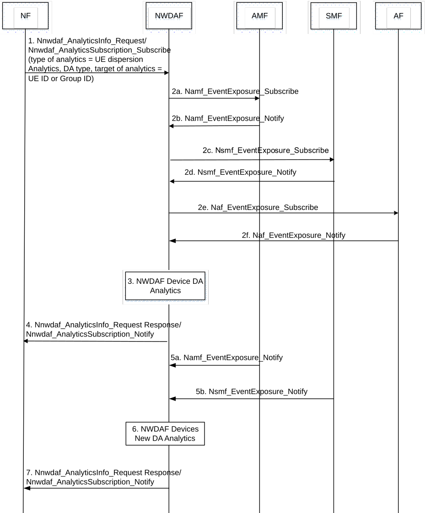

# 6.10.4 Dispersion Analytic Procedure

The NWDAF can provide Dispersion analytics, in the form of statistics or predictions, to an NF or AF.

Figure 6.10.4-1: UE Dispersion Analytics provided to an NF or AF

1\. The NF sends a request or subscription to the NWDAF for dispersion analytics on a specific UE, any UE, or a group of UEs, using either the Nnwdaf_AnalyticsInfo or Nnwdaf_AnalyticsSubscription service. The NF can request statistics or predictions or both. The Analytics ID is set to "UE Dispersion Analytics", the Dispersion Analytic (DA) type is set to "Data Volume Dispersion Analytics" (DVDA) or "Transactions Dispersion Analytics" (TDA) and Analytic Filter Information = (Area of Interest, slice, target period, optional UE class: Top-Heavy, Fixed, or Camper UEs). The NF or AF provides the Target of Analytics Reporting as defined in clause 6.10.2.

2\. If the request is authorized and in order to provide the requested analytics, the NWDAF may subscribe to events with all the serving AMFs, SMFs of the requested UE(s) for notification of location changes or a slice change (a slice change can be an additional slice or a deletion), or to obtain UE location trends, UE access behaviour trends and UE session behaviour trends. This step may be skipped when, e.g. the NWDAF already has the requested analytics available.

The NWDAF subscribes to application service data from AF(s) by invoking Naf_EventExposure_Subscribe service or Nnef_EventExposure_Subscribe (via NEF).

The NWDAF can collect data volume information from the UPF, as listed in tables 6.10.2-5 and 6.10.2-6 and clause 6.2.2.1. How the data from UPF is retrieved (subscribed to on UPF and notified then by UPF) is defined in clause 5.8.2.17 of TS 23.501 \[2\] and in clause 4.15.4 of TS 23.502 \[3\].

NOTE: The NWDAF determines the AMF serving the UE, any UE, or the group of UEs, identified by an Internal-Group-Id, as described in clause 6.2.2.1.

3\. The NWDAF derives requested analytics.

4\. The NWDAF provides requested or subscribed UE dispersion analytics to the NF, using either the Nnwdaf_AnalyticsInfo_Request Response or Nnwdaf_AnalyticsSubscription_Notify, depending on the service used in step 1. The details for UE dispersion analytics provided by NWDAF are described in clause 6.10.3. The provided analytics enables the consumer to predict changing network conditions such as data volume change at a location or a slice, excessive signalling conditions at a location or a slice, etc.

5-6. If at step 1, the NF has subscribed to receive notifications for UE dispersion analytics, after receiving event notification from the AMFs (e.g. location change) or SMFs (e.g. slice change add/delete) subscribed by NWDAF in step 2, the NWDAF may generate new dispersion analytics.

7\. The NWDAF provides the newly generated dispersion analytics to the NF. The details for UE dispersion analytics provided by NWDAF are described in clause 6.10.3.
