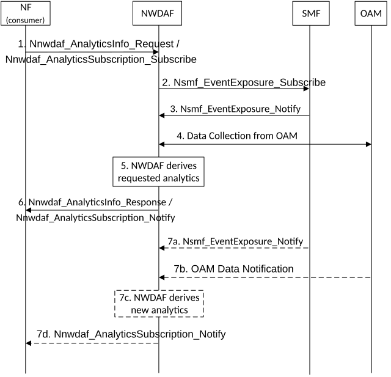

# 6.11 WLAN performance analytics

## 6.11.1 General

The NWDAF provides WLAN performance analytics to a service consumer NF. The analytics results are generated based on the data from other 5GC NFs and OAM. The analytics results, provided in the form of statistics or predictions, contain quality and performance of WLAN connection of UE according to UE location and SSID. The consumer can request either one-time or continuous reporting.

The service consumer may be an NF (e.g. PCF, NEF or AF).

If a service consumer is PCF, the WLAN performance analytics can be used to update WLANSP as defined in TS 23.503 \[4\].

If the service consumer is NEF or AF, the WLAN performance analytics per UE granularity can be used to select candidate members for an application layer operation.

The consumer of these analytics may indicate in the request or subscription:

\- Analytics ID = "WLAN performance";

\- Target of Analytics Reporting as defined in clause 6.1.3;

\- Analytics Filter Information:

\- Area of Interest (list of TA or Cells);

\- SSID(s);

\- BSSID(s); and

\- optional list of analytics subsets that are requested (see clause 6.11.3);

\- An Analytics target period indicates the time period over which the statistics or prediction are requested, either in the past or in the future;

\- Optionally, Temporal granularity size;

\- Optional maximum number of objects;

\- Preferred level of accuracy of the analytics;

\- Preferred level of accuracy per analytics subset (see clause 6.11.3);

\- Preferred order of results for the list of WLAN performance information:

\- ordering criterion: "time slot start", "number of UEs", "RSSI", "RTT" or "Traffic information"; and

\- order: ascending or descending; and

\- In a subscription, the Notification Correlation Id and the Notification Target Address are included.

If the Target of Analytics Reporting is any UE, then the Analytics Filter should at least include Area of Interest or SSID(s) or BSSID(s).

## 6.11.2 Input Data

For the purpose of generating WLAN performance analytics results, the NWDAF collects the data as listed in Table 6.11.2-1.

Table 6.11.2-1: Data collected by NWDAF for WLAN performance analytics

|                                              |        |                                                                                                                                                         |
|----------------------------------------------|--------|---------------------------------------------------------------------------------------------------------------------------------------------------------|
| Information                                  | Source | Description                                                                                                                                             |
| WLAN measurement results                     | OAM    | The WLAN measurement results per wireless network served by the WLAN AP.                                                                                |
| \> SSID / BSSID / HESSID                     |        | SSID / BSSID / HESSID of the selected WLAN during the period of analysis.                                                                               |
| \> RSSI                                      |        | Measured RSSI of the selected WLAN during the period of analysis.                                                                                       |
| \> RTT                                       |        | Measured RTT of the selected WLAN during the period of interest.                                                                                        |
| \> UE Location                               |        | Location information tagged by UE when it reports WLAN MDT measurement (e.g. Cell ID and/or longitude/latitude if available).                           |
| Information on PDU Session for WLAN (1..max) | SMF    | Information on PDU session for which Access Type is Non-3GPP and RAT Type is TRUSTED_WLAN.                                                              |
| \> UE ID                                     |        | SUPI                                                                                                                                                    |
| \> SSID / BSSID                              |        | SSID / BSSID that the PDU session is related to.                                                                                                        |
| \> Start time of the PDU Session for WLAN    |        | The time stamp that indicates when the existing PDU Session's access type changes to WLAN or when the new PDU Session for WLAN is established.          |
| \> End time of the PDU Session for WLAN      |        | The time stamp that indicates when the existing WLAN based PDU Session's access type is not WLAN any more or when the PDU Session for WLAN is released. |
| UE communications (1..max)                   | UPF    | List of communication time slots                                                                                                                        |
| \> Communication start                       |        | The time stamp that PDU session(s) for WLAN starts.                                                                                                     |
| \> Communication stop                        |        | The time stamp that PDU session(s) for WLAN ends.                                                                                                       |
| \> UL data rate                              |        | UL data rate of PDU session(s) for WLAN.                                                                                                                |
| \> DL data rate                              |        | DL data rate of PDU session(s) for WLAN.                                                                                                                |
| \> Traffic volume                            |        | Traffic volume of PDU session(s) for WLAN.                                                                                                              |

NOTE 1: WLAN Data from OAM is collected via MDT and aligned with the WLAN measurement reporting list described in clause 5.1.1.3.3 of TS 37.320 \[20\]. It is assumed that not all UEs support MDT WLAN measurements.

NOTE 2: UE Location from OAM can be used to deduce WLAN location.

## 6.11.3 Output Analytics

The NWDAF generates WLAN performance analytics. Depending on the Analytics Target Period, the output consists of statistics or predictions. The detailed information provided by the NWDAF is defined in Table 6.11.3-1 for statistics and Table 6.11.3-2 for predictions.

Table 6.11.3-1: WLAN performance statistics

|                                                                                                                                                                                    |                                                                                                                                                                                |
|------------------------------------------------------------------------------------------------------------------------------------------------------------------------------------|--------------------------------------------------------------------------------------------------------------------------------------------------------------------------------|
| Information                                                                                                                                                                        | Description                                                                                                                                                                    |
| Area of Interest                                                                                                                                                                   | A list of TAIs or Cell Ids                                                                                                                                                     |
| List of Analytics per SSID                                                                                                                                                         | SSIDs of WLAN access points deployed in the Area of Interest                                                                                                                   |
| \> Time slot entry (1..max)                                                                                                                                                        | List of time slots during the Analytics target period                                                                                                                          |
| \>\> Time slot start                                                                                                                                                               | Time slot start time within the Analytics target period                                                                                                                        |
| \>\> Duration                                                                                                                                                                      | Duration of the time slot. If a Temporal granularity size was provided in the request or subscription, the Duration is greater than or equal to the Temporal granularity size. |
| \>\> RSSI (NOTE 1)                                                                                                                                                                 | Measured RSSI                                                                                                                                                                  |
| \>\> RTT (NOTE 1)                                                                                                                                                                  | Measured RTT                                                                                                                                                                   |
| \>\> Traffic Information (NOTE 1)                                                                                                                                                  | UL/DL data rate, Traffic volume                                                                                                                                                |
| \>\> Number of UEs (NOTE 1)                                                                                                                                                        | Number of UEs observed for the SSID                                                                                                                                            |
| List of Analytics per UE                                                                                                                                                           | UE ID(s) of WLAN performance analytics                                                                                                                                         |
| \> Time slot entry (1..max)                                                                                                                                                        | List of time slots during the Analytics target period                                                                                                                          |
| \>\> Time slot start                                                                                                                                                               | Time slot start time within the Analytics target period                                                                                                                        |
| \>\> Duration                                                                                                                                                                      | Duration of the time slot                                                                                                                                                      |
| \>\> RSSI (NOTE 1)                                                                                                                                                                 | Measured RSSI                                                                                                                                                                  |
| \>\> RTT (NOTE 1)                                                                                                                                                                  | Measured RTT                                                                                                                                                                   |
| \>\> Traffic Information (NOTE 1)                                                                                                                                                  | UL/DL data rate, Traffic volume                                                                                                                                                |
| NOTE 1: This information element is an analytics subset that can be used in "list of analytics subsets that are requested" and "preferred level of accuracy per analytics subset". |                                                                                                                                                                                |

Table 6.11.3-2: WLAN performance predictions

|                                                                                                                                                                                    |                                                                                                                                                                                |
|------------------------------------------------------------------------------------------------------------------------------------------------------------------------------------|--------------------------------------------------------------------------------------------------------------------------------------------------------------------------------|
| Information                                                                                                                                                                        | Description                                                                                                                                                                    |
| Area of Interest                                                                                                                                                                   | A list of TAIs or Cell Ids                                                                                                                                                     |
| List of Analytics per SSID                                                                                                                                                         | SSIDs of WLAN access points deployed in the Area of Interest                                                                                                                   |
| \> Time slot entry (1..max)                                                                                                                                                        | List of time slots during the Analytics target period                                                                                                                          |
| \>\> Time slot start                                                                                                                                                               | Time slot start time within the Analytics target period                                                                                                                        |
| \>\> Duration                                                                                                                                                                      | Duration of the time slot. If a Temporal granularity size was provided in the request or subscription, the Duration is greater than or equal to the Temporal granularity size. |
| \>\> RSSI (NOTE 1)                                                                                                                                                                 | Predicted RSSI                                                                                                                                                                 |
| \>\> RTT (NOTE 1)                                                                                                                                                                  | Predicted RTT                                                                                                                                                                  |
| \>\> Traffic Information (NOTE 1)                                                                                                                                                  | Predicted UL/DL data rate, Traffic volume                                                                                                                                      |
| \>\> Number of UEs (NOTE 1)                                                                                                                                                        | Number of UEs predicted for the SSID                                                                                                                                           |
| \>\> Confidence                                                                                                                                                                    | Confidence of the prediction                                                                                                                                                   |
| List of Analytics per UE                                                                                                                                                           | UE ID(s) of WLAN performance analytics                                                                                                                                         |
| \> Time slot entry (1..max)                                                                                                                                                        | List of time slots during the Analytics target period                                                                                                                          |
| \>\> Time slot start                                                                                                                                                               | Time slot start time within the Analytics target period                                                                                                                        |
| \>\> Duration                                                                                                                                                                      | Duration of the time slot                                                                                                                                                      |
| \>\> RSSI (NOTE 1)                                                                                                                                                                 | Predicted RSSI                                                                                                                                                                 |
| \>\> RTT (NOTE 1)                                                                                                                                                                  | Predicted RTT                                                                                                                                                                  |
| \>\> Traffic Information (NOTE 1)                                                                                                                                                  | UL/DL data rate, Traffic volume                                                                                                                                                |
| \>\> Confidence                                                                                                                                                                    | Confidence of the prediction                                                                                                                                                   |
| NOTE 1: This information element is an analytics subset that can be used in "list of analytics subsets that are requested" and "preferred level of accuracy per analytics subset". |                                                                                                                                                                                |

## 6.11.4 Procedures

Figure 6.11.4-1: Procedure for WLAN performance analytics

1\. The consumer NF sends a request to the NWDAF for WLAN performance analytics using either the Nnwdaf_AnalyticsInfo or Nnwdaf_AnalyticsSubscription service. The Analytics ID is set to "WLAN performance", the Target of Analytics Reporting and the Analytics Filter Information are set according to clause 6.11.1. The consumer NF can request statistics or predictions.

The analytics can be requested with the filter information (e.g. Area of Interest or specific SSID(s)). When Area of Interest is provided, the analytics results include WLAN performance information of all SSID(s) located in the Area of Interest. When specific SSID(s) is provided, the analytics results include WLAN performance information of a specific UE or all UE(s) connected to the corresponding SSID(s).

2-3. The NWDAF subscribes to information related to PDU Session for WLAN (i.e. Access Type is Non-3GPP and RAT Type is TRUSTED_WLAN) from SMF.

4\. The NWDAF collects WLAN measurement data for the period of analysis from the OAM, following the procedure captured in clause 6.2.3.2.

NOTE: The NWDAF collects the data from the UPF as listed in Table 6.11.2.1. How the NWDAF collects the data is defined in clause 5.8.2.17 of TS 23.501 \[2\] and in clause 4.15.4 of TS 23.502 \[3\].

5\. The NWDAF derives requested analytics with the collected data. Analytics output parameters are listed in clause 6.11.3.

6\. The NWDAF provides the requested analytics to the NF, using either the Nnwdaf_AnalyticsInfo or Nnwdaf_AnalyticsSubscription service, depending on the service used at step 1.

7\. If the NF subscribed the analytics at step 1, the NWDAF provides a new analytics when it generated the new output.
