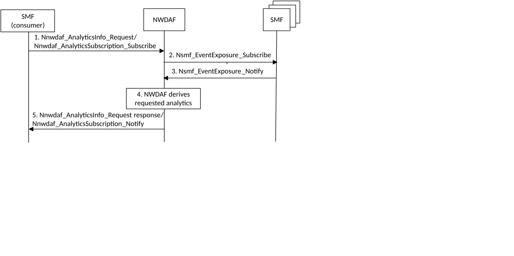

# 6.12 Session Management Congestion Control Experience Analytics

## 6.12.1 General

According to the Session Management Congestion Control (SMCC) mechanisms, i.e. DNN based congestion control defined in clause 5.19.7.3 of TS 23.501 \[2\] and S-NSSAI based congestion control defined in clause 5.19.7.4 of TS 23.501 \[2\], the SMF that is applying or has applied the SMCC mechanism does not store any historical information related to which UEs is/was subject to backoff timer settings. Therefore, fairness to apply the SMCC cannot be considered nor guaranteed. For example, among UEs that use a PDU Session associated with S-NSSAI#1, some of them may have experienced the S-NSSAI based high level of congestion control (e.g. receiving NAS SM reject messages with a long backoff timer) while some of the UEs may have experienced the S-NSSAI based low level congestion control (e.g. receiving NAS SM reject messages with a short backoff timer), within a specific period. The backoff timer provided to each UE can vary, e.g. up to 70 hours.

The SMF service consumer may request the NWDAF to provide Session Management Congestion Control Experience (SMCCE) statistical analytics for a specific DNN and/or S-NSSAI. The SMF uses potential congestion condition as a trigger to request the SMCCE analytics from the NWDAF.

The request by the SMF includes mainly the following parameters:

\- Analytics ID = "Session Management Congestion Control Experience".

\- Target of Analytics Reporting: one or more SUPI(s).

NOTE 1: The UE(s) contained in the Target of Analytics Reporting. These are UE(s) that have the PDU Session for the DNN and/or S-NSSAI indicated by Analytics Filter Information.

\- Analytics Filter Information:

\- DNN and/or S-NSSAI; and

\- optional list of analytics subsets that are requested (see clause 6.12.3);

\- Analytics target period: the time window for which the statistics are requested.

NOTE 2: Predictions are not provided as output for the Session Management Congestion Control Experience analytics.

## 6.12.2 Input Data

For the purpose of SMCCE analytics, the NWDAF collects the data as listed in Table 6.12.2-1.

Table 6.12.2-1: Data collected by NWDAF for SMCCE analytics

|                                                            |        |                                                                                                                                                                           |
|------------------------------------------------------------|--------|---------------------------------------------------------------------------------------------------------------------------------------------------------------------------|
| Information                                                | Source | Description                                                                                                                                                               |
| UE ID                                                      | SMF    | SUPI.                                                                                                                                                                     |
| SMCC experience for PDU Session                            | SMF    | Data related to SMCC experience per PDU Session.                                                                                                                          |
| \> DNN                                                     | SMF    | DNN for the PDU Session that SMF collects Data related to SMCCE.                                                                                                          |
| \> S-NSSAI                                                 | SMF    | S-NSSAI for the PDU Session that SMF collects Data related to SMCCE.                                                                                                      |
| \> Start time of data collection                           | SMF    | Start time of data collection.                                                                                                                                            |
| \> End time of data collection                             | SMF    | End time of data collection.                                                                                                                                              |
| \> SM NAS request from UE (1..max)                         | SMF    | Information on the SM NAS messages that SMF receives from UE for PDU Session during the collection period.                                                                |
| \>\> Type of SM NAS request                                | SMF    | The type of SM NAS message transmitted by UE (e.g. PDU Session Establishment Request, PDU Session Modification Request, etc.).                                            |
| \>\> Timestamp                                             | SMF    | A time stamp when SMF receives SM NAS message from UE.                                                                                                                    |
| \> SM NAS message from network with backoff timer (1..max) | SMF    | Information on SMCC applied to UE for PDU Session.                                                                                                                        |
| \>\> Type of SM NAS message from network                   | SMF    | The type of SM NAS message with backoff timer provided to UE (e.g. PDU Session Establishment Reject, PDU Session Modification Reject, PDU Session Release Command, etc.). |
| \>\> Timestamp                                             | SMF    | A time stamp when SMF sends SM NAS message to UE.                                                                                                                         |
| \>\> Provided backoff timer                                | SMF    | A value of backoff timer provided to UE.                                                                                                                                  |
| \>\> Type of applied SMCC                                  | SMF    | The type of applied SMCC, i.e. DNN based congestion control or S-NSSAI based congestion control.                                                                          |

As described in Table 6.12.2-1, the NWDAF subscribes to the network data from SMF(s) by invoking Nsmf_EventExposure_Subscribe service (Event ID = Session Management Congestion Control Experience for PDU Session, Target of Event Reporting = one or more SUPI(s), Event Filter information = DNN and/or S-NSSAI and target period).

## 6.12.3 Output Analytics

The NWDAF outputs the SMCCE statistical analytics. The detailed statistical information provided by the NWDAF is defined in Table 6.12.3-1.

Table 6.12.3-1: SMCCE statistics

<table>
<colgroup>
<col style="width: 35%" />
<col style="width: 64%" />
</colgroup>
<tbody>
<tr class="odd">
<td>Information</td>
<td>Description</td>
</tr>
<tr class="even">
<td>List of SMCCE Analytics (1..max)</td>
<td></td>
</tr>
<tr class="odd">
<td>&gt; DNN</td>
<td>DNN that SMCC is applied.</td>
</tr>
<tr class="even">
<td>&gt; S-NSSAI</td>
<td>S-NSSAI that SMCC is applied.</td>
</tr>
<tr class="odd">
<td>&gt; List of UEs classified based on experience level of SMCC</td>
<td>One, or more than one, of the following lists (SUPI is used to identify a UE).</td>
</tr>
<tr class="even">
<td>&gt;&gt; List of high-experienced UEs (NOTE 2)</td>
<td>A list of UEs whose experience level of SMCC for specific DNN and/or S-NSSAI is high.</td>
</tr>
<tr class="odd">
<td>&gt;&gt; List of medium-experienced UEs (NOTE 2)</td>
<td>A list of UEs whose experience level of SMCC for specific DNN and/or S-NSSAI is medium.</td>
</tr>
<tr class="even">
<td>&gt;&gt; List of low-experienced UEs (NOTE 2)</td>
<td>A list of UEs whose experience level of SMCC for specific DNN and/or S-NSSAI is low.</td>
</tr>
<tr class="odd">
<td colspan="2">
NOTE 1: The high/medium/low-experience thresholds values are operator defined.

NOTE 2: This information element is an analytics subset that can be used in "list of analytics subsets that are requested".
</td>
</tr>
</tbody>
</table>

## 6.12.4 Procedures

Figure 6.12.4-1 shows the procedure for Session Management Congestion Control Experience Analytics.

Figure 6.12.4-1: Procedure for Session Management Congestion Control Experience Analytics

1\. Consumer SMF requests or subscribes to analytics information for "Session Management Congestion Control Experience" from the NWDAF using either Nnwdaf_AnalyticsInfo or Nnwdaf_AnalyticsSubscription service when the SMF wants to take the analytics information into account for the Session Management Congestion Control to be applied.

The parameters included in the request are described in clause 6.12.1.

NOTE: To account for SMCCE analytics information, the SMF needs to request the analytics information from the NWDAF before applying Session Management Congestion Control due to potential congestion conditions formation.

2\. If has not already subscribed, the NWDAF sends subscription requests to all the SMFs serving the DNN and/or S-NSSAI as indicated by Analytics Filter Information to collect data related to SMCCE. The SMF that made the request in step 1 can be also one of the data providers.

3\. The SMF(s) provide the collected data to the NWDAF.

4\. The NWDAF derives the requested analytics.

5\. The NWDAF provides the analytics for Session Management Congestion Control Experience to the consumer SMF, using either Nnwdaf_AnalyticsInfo_Request Response or Nnwdaf_AnalyticsSubscription_Notify.
