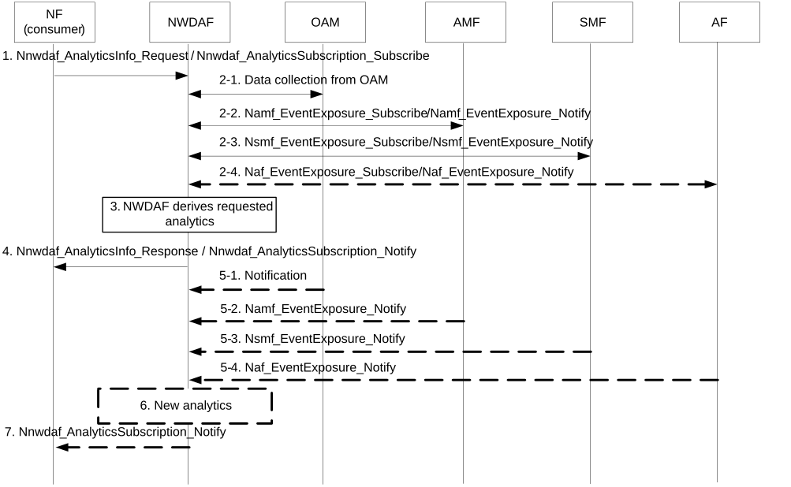

# 6.13 Redundant Transmission Experience related analytics

## 6.13.1 General

This clause describes the Redundant Transmission Experience related analytics. These analytics may be used as follows:

\- by the SMF to determine whether redundant transmission on N3/N9 interfaces (see clause 5.33.2.2 of TS 23.501 \[2\]) shall be performed, or (if it had been activated) shall be stopped;

\- by the PCF for the calculation of the Route Selection Components in a URSP Rule for redundant PDU Sessions as described in clause 5.33.2.1 of TS 23.501 \[2\].

The service consumer may be a NF (e.g. SMF, PCF).

The consumer of these analytics may indicate in the request:

\- Analytics ID = "Redundant Transmission Experience".

\- Target of Analytics Reporting as defined in clause 6.1.3.

\- Analytics Filter Information optionally containing:

\- Area of Interest;

\- S-NSSAI;

\- DNN;

\- optional list of analytics subsets that are requested (i.e. UL/DL packet drop rate GTP-U, UL/DL packet delay GTP-U, see clause 6.13.3).

\- An Analytics target period indicates the time period over which the statistics or predictions are requested.

\- Optionally, Temporal granularity size;

\- Preferred level of accuracy of the analytics;

\- Preferred order of results for the list of Redundant Transmission Experience:

\- ordering criterion: "time slot start"; and

\- order: ascending or descending;

\- In a subscription, the Notification Correlation Id and the Notification Target Address are included.

## 6.13.2 Input Data

The NWDAF supporting data analytics on Redundant Transmission Experience shall be able to collect UE mobility information from OAM, MDAS/MDAF, 5GC and AFs and service data from AF, as described in clause 6.7.2.2. In addition, NWDAF shall be able to collect the information for PDU session which is established with redundant transmission from the SMF. UE mobility information is specified in Table 6.7.2.2-1 and service data from AF related to UE mobility in Table 6.7.2.2-2. In addition, the NWDAF shall be able to collect performance measurements on user data congestion as specified in Table 6.8.2-1 for user data congestion analytics.

Additionally, the NWDAF collects the following input (see Table 6.13.2-1 and Table 6.13.2-2) according to existing measurements defined in clause 5.33.3 QoS Monitoring to Assist URLLC Service of TS 23.501 \[2\]. The NWDAF also collects the input from MDAS/MDAF of the end to end latency analysis in Table 6.13.2-3, as defined in clause 8.4.2.4.3 of TS 28.104 \[45\].

Table 6.13.2-1: Packet drop and/or packet delay measurement per QFI or GTP level

<table>
<colgroup>
<col style="width: 34%" />
<col style="width: 15%" />
<col style="width: 50%" />
</colgroup>
<tbody>
<tr class="odd">
<td>Information</td>
<td>Source</td>
<td>Description</td>
</tr>
<tr class="even">
<td>UL/DL packet drop rate GTP-U</td>
<td>OAM (see NOTE 2)</td>
<td>UL/DL packet drop rate measurement on GTP path on N3.</td>
</tr>
<tr class="odd">
<td>UL/DL packet delay GTP</td>
<td>OAM (see NOTE 2)</td>
<td>UL/DL packet delay measurement round trip on GTP path on N3.</td>
</tr>
<tr class="even">
<td>E2E UL/DL packet delay</td>
<td>UPF (see NOTE 3)</td>
<td>End-to-End (between UE and UPF) packet delay measurement between the UE and the UPF.</td>
</tr>
<tr class="odd">
<td>UL/DL packet drop/loss rate of RAN part</td>
<td>OAM (see NOTE 2)</td>
<td>UL/DL packet drop/loss rate measurement of RAN part.</td>
</tr>
<tr class="even">
<td colspan="3">
NOTE 1: The information in this table is provided both as the base to compare with the redundant transmission performance as well as when redundant transmission is enabled.

NOTE 2: Refer to clause 5.1 of TS 28.552 [8] for the performance measurement in NG-RAN and clause 5.4 of TS 28.552 [8] for the performance measurement in UPF. In addition, Annex A of TS 28.552 [8] describes various performance measurements.

NOTE 3: Refer to clause 5.33.3 of TS 23.501 [2] for the packet delay measurement in the UPF.
</td>
</tr>
</tbody>
</table>

Table 6.13.2-2: The information related to PDU Session established

|                                |        |                                                 |
|--------------------------------|--------|-------------------------------------------------|
| Information                    | Source | Description                                     |
| DNN                            | SMF    | Data Network Name associated for URLLC service. |
| UP with redundant transmission | SMF    | Redundant transmission is setup or terminated.  |

Table 6.13.2-3: Data collection from MDAS/MDAF of end-to-end latency analysis

<table>
<colgroup>
<col style="width: 34%" />
<col style="width: 15%" />
<col style="width: 50%" />
</colgroup>
<tbody>
<tr class="odd">
<td>Information</td>
<td>Source</td>
<td>Description</td>
</tr>
<tr class="even">
<td>E2ELatencyIssueType</td>
<td>MDAF</td>
<td>
Indication the type of the E2E latency issue.

The allowed value is one of the enumerated values: RAN latency issue, CN latency issue.
</td>
</tr>
<tr class="odd">
<td>AffectedObjects</td>
<td>MDAF</td>
<td>The managed object instances of subnetwork, managed elements or network slices where the latency issue happens.</td>
</tr>
</tbody>
</table>

## 6.13.3 Output Analytics

The NWDAF supporting data analytics on Redundant Transmission Experience shall be able to provide Redundant Transmission Experience analytics as defined in Table 6.13.3-1 and Table 6.13.3-2.

Table 6.13.3-1: Redundant Transmission Experience statistics

<table>
<colgroup>
<col style="width: 35%" />
<col style="width: 64%" />
</colgroup>
<tbody>
<tr class="odd">
<td>Information</td>
<td>Description</td>
</tr>
<tr class="even">
<td>UE group ID or UE ID, any UE</td>
<td>Identifies the UE(s) for which the statistic applies by a list of SUPIs, or a group of UEs by a list of Internal-Group-Ids.</td>
</tr>
<tr class="odd">
<td>DNN</td>
<td>Data Network Name associated for URLLC service.</td>
</tr>
<tr class="even">
<td>Spatial validity</td>
<td>
Area where the Redundant Transmission Experience statistics applies.

If Area of Interest information was provided in the request or subscription, spatial validity should be the requested Area of Interest.
</td>
</tr>
<tr class="odd">
<td>Time slot entry (1..max)</td>
<td>List of time slots during the Analytics target period.</td>
</tr>
<tr class="even">
<td>&gt; Time slot start</td>
<td>Time slot start within the Analytics target period.</td>
</tr>
<tr class="odd">
<td>&gt; Duration</td>
<td>Duration of the time slot. If a Temporal granularity size was provided in the request or subscription, the Duration is greater than or equal to the Temporal granularity size.</td>
</tr>
<tr class="even">
<td>&gt; Observed Redundant Transmission Experience</td>
<td>Observed Redundant Transmission Experience related information during the Analytics target period.</td>
</tr>
<tr class="odd">
<td>&gt;&gt; UL/DL packet drop rate GTP-U (NOTE 2)</td>
<td>Observed UL/DL packet drop rate on GTP-U path on N3 (average, variance).</td>
</tr>
<tr class="even">
<td>&gt;&gt; UL/DL packet delay GTP-U (NOTE 2)</td>
<td>Observed UL/DL packet delay round trip on GTP-U path on N3 (average, variance).</td>
</tr>
<tr class="odd">
<td>&gt;&gt; E2E UL/DL packet delay (NOTE 2)</td>
<td>Observed End-to-End (between UE and UPF) UL/DL packet delay (average, variance).</td>
</tr>
<tr class="even">
<td>&gt;&gt; E2E UL/DL packet loss rate (NOTE 2) (NOTE 3)</td>
<td>Observed End-to-End (between UE and UPF) UL/DL packet loss (average, variance).</td>
</tr>
<tr class="odd">
<td>&gt; Redundant Transmission Status</td>
<td>Redundant Transmission Status, i.e. redundant transmission was activated or not activated for the time slot entry.</td>
</tr>
<tr class="even">
<td>&gt; Ratio</td>
<td>Percentage on which UE, any UE, or UE group experience the packet drop rate and packet delay.</td>
</tr>
<tr class="odd">
<td colspan="2">
NOTE 1: The Observed Redundant Transmission Experience can be further derived by SMF from the observed UL/DL packet drop rate GTP-U and UL/DL packet delay GTP-U.

NOTE 2: This information element is an analytics subset that can be used in "list of analytics subsets that are requested" and only applicable when Target of Analytics Reporting is for a single UE.

NOTE 3: The NWDAF outputs the analytics on E2E UL/DL packet loss rate based on the input UL/DL packet drop rate on N3 and UL/DL packet drop/loss rate of RAN part.
</td>
</tr>
</tbody>
</table>

Table 6.13.3-2: Redundant Transmission Experience predictions

<table>
<colgroup>
<col style="width: 35%" />
<col style="width: 64%" />
</colgroup>
<tbody>
<tr class="odd">
<td>Information</td>
<td>Description</td>
</tr>
<tr class="even">
<td>UE group ID or UE ID, any UE</td>
<td>Identifies the UE(s) for which the prediction applies by a list of SUPIs, or a group of UEs by a list of Internal-Group-Ids.</td>
</tr>
<tr class="odd">
<td>DNN</td>
<td>Data Network Name associated for URLLC service.</td>
</tr>
<tr class="even">
<td>Spatial validity</td>
<td>
Area where the estimated Redundant Transmission Experience predictions applies.

If Area of Interest information was provided in the request or subscription, spatial validity should be the requested Area of Interest.
</td>
</tr>
<tr class="odd">
<td>Time slot entry (1..max)</td>
<td>List of predicted time slots.</td>
</tr>
<tr class="even">
<td>&gt;Time slot start</td>
<td>Time slot start time within the Analytics target period.</td>
</tr>
<tr class="odd">
<td>&gt; Duration</td>
<td>Duration of the time slot.</td>
</tr>
<tr class="even">
<td>&gt; Predicted Redundant Transmission Experience</td>
<td>Predicted Redundant Transmission Experience related information during the Analytics target period.</td>
</tr>
<tr class="odd">
<td>&gt;&gt; UL/DL packet drop rate GTP-U (NOTE 2)</td>
<td>Predicted UL/DL packet drop rate on GTP-U path on N3 (average, variance).</td>
</tr>
<tr class="even">
<td>&gt;&gt; UL/DL packet delay GTP-U (NOTE 2)</td>
<td>Predicted UL/DL packet delay round trip on GTP-U path on N3 (average, variance).</td>
</tr>
<tr class="odd">
<td>&gt;&gt; E2E UL/DL packet delay</td>
<td>Predicted End-to-End (between UE and UPF) UL/DL packet delay (average, variance).</td>
</tr>
<tr class="even">
<td>&gt;&gt; E2E UL/DL packet loss rate (NOTE 4)</td>
<td>Predicted End-to-End (between UE and UPF) UL/DL packet loss rate (average, variance).</td>
</tr>
<tr class="odd">
<td>&gt; Redundant Transmission Status (NOTE 3)</td>
<td>Redundant Transmission Status, i.e., redundant transmission is activated or not activated for the time slot entry.</td>
</tr>
<tr class="even">
<td>&gt; Ratio</td>
<td>Percentage on which the UE, any UE, or UE group may efficiently use the PDU session with redundant transmission.</td>
</tr>
<tr class="odd">
<td>&gt; Confidence</td>
<td>Confidence of this prediction.</td>
</tr>
<tr class="even">
<td colspan="2">
NOTE 1: The Predicted Redundant Transmission Experience can be further derived by the SMF from the predicted UL/DL packet drop rate GTP-U and UL/DL packet delay GTP-U and based on which the SMF can decide to start redundant transmission or not.

NOTE 2: This information element is an analytics subset that can be used in "list of analytics subsets that are requested" and only applicable when Target of Analytics Reporting is for a single UE.

NOTE 3: The list of predicted time slots and predicted redundant transmission experience is provided to the consumer when both the redundant transmission status is activated and not activated.

NOTE 4: The NWDAF outputs the prediction on E2E UL/DL packet loss rate based on the input UL/DL packet drop rate on N3 and UL/DL packet drop/loss rate of RAN part.
</td>
</tr>
</tbody>
</table>

## 6.13.4 Procedures

### 6.13.4.1 Analytics Procedure

Figure 6.13.4.1-1 shows the analytics procedure. The NWDAF can provide analytics, in the form of statistics or predictions or both.

Figure 6.13.4.1-1: Redundant Transmission Experience analytics provided to an NF

1\. The analytics consumer sends a request to the NWDAF for analytics on a Target for Analytics Reporting as defined in clause 6.13.2, using either the Nnwdaf_AnalyticsInfo or Nnwdaf_AnalyticsSubscription service. The NF can request statistics or predictions or both. The type of analytics is set to Redundant Transmission Experience. Analytics Filter Information optionally contains DNN, S-NSSAI, Area of Interest, etc.

2\. If the request is authorized and in order to provide the requested analytics, the NWDAF may subscribe to events with all the serving AMFs for notification of location changes and may subscribe to events with SMFs serving PDU Session on URLLC service for notification of redundant transmission related information.

The NWDAF may subscribe the service data from AF(s) by invoking Naf_EventExposure_Subscribe service or Nnef_EventExposure_Subscribe (if via NEF).

The NWDAF collects UE mobility information and/or packet measurement information from OAM, following the procedure captured in clause 6.2.3.2. The NWDAF collects redundant transmission status from SMF.

NOTE: The NWDAF determines the AMF serving the UE, any UE, or the group of UEs, identified by an Internal-Group-id, as described in clause 6.2.2.1.

This step may be skipped when e.g. the NWDAF already has the requested analytics available.

3\. The NWDAF derives requested analytics.

4\. The NWDAF provide requested Redundant Transmission Experience analytics to the NF, using either the Nnwdaf_AnalyticsInfo_Request response or Nnwdaf_AnalyticsSubscription_Notify, depending on the service used in step 1.

5-7. If at step 1, the NF has subscribed to receive notifications for Redundant Transmission Experience analytics, after receiving event notification from the AMFs, SMF, AFs and OAM subscribed by NWDAF in step 2, the NWDAF may generate new analytics and provide them to the NF.

If a service consumer is SMF, the Redundant Transmission Experience analytics can be used to make decision if that redundant transmission shall be performed or (if activated) shall be stopped regarding the PDU session for URLLC service.
