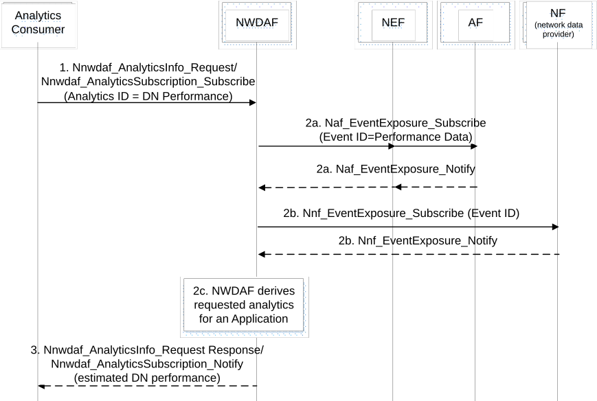

# 6.14 DN Performance Analytics

## 6.14.1 General

This clause specifies how an NWDAF can provide DN Performance Analytics which provides analytics for user plane performance (i.e. average/maximum traffic rate, average/maximum packet delay, average packet loss rate) in the form of statistics or predictions to a service consumer.

The DN Performance Analytics may provide one or a combination of the following information:

\- User plane performance analytics for a specific Edge Computing application for a UE, group of UEs, or any UE over a specific serving anchor UPF.

\- User plane performance analytics for a specific Edge Computing application for a UE, group of UEs, or any UE over a specific DNAI.

\- User plane performance analytics for a specific Edge Computing application for a UE, group of UEs, or any UE over a specific Edge Application Server Instance.

The service consumer may be an NF (e.g. SMF, PCF) or an AF.

The consumer of these analytics shall indicate in the request or subscription:

\- Analytics ID = "DN Performance";

\- Target of Analytics Reporting as defined in clause 6.1.3;

\- Analytics Filter Information as defined in table 6.14.1-1 and optionally a list of analytics subsets that are requested (see clause 6.14.3); and

\- optionally, a preferred level of accuracy of the analytics;

\- optionally, preferred level of accuracy per analytics subset (see clause 6.14.3);

\- optionally, preferred order of results for the list of Network Performance information:

\- ordering criterion: one of the analytics subset (see clause 6.14.3);

\- order: ascending or descending;

\- optionally, Reporting Thresholds, which apply only for subscriptions and indicate conditions on the level to be reached for respective analytics subsets (see clause 6.14.3) in order to be notified by the NWDAF;

\- optionally, maximum number of objects and maximum number of SUPIs;

\- An Analytics target period indicates the time period over which the statistics or predictions are requested; and

\- Optionally, Spatial granularity size and Temporal granularity size.

Table 6.14.1-1: Analytics Filter Information related to DN Performance Analytics

|                                    |                                                                                                                                                                                         |
|------------------------------------|-----------------------------------------------------------------------------------------------------------------------------------------------------------------------------------------|
| Information                        | Description                                                                                                                                                                             |
| Application ID (0..max)            | The identification of the application(s) for which the analytics information is subscribed or requested.                                                                                |
| S-NSSAI                            | Identifies the Network Slice for which analytics information is subscribed or requested.                                                                                                |
| NSI ID(s)                          | Identifies the Network Slice instance(s) for which analytics information is subscribed or requested.                                                                                    |
| Area of Interest                   | Identifies the Area (i.e. set of TAIs), as defined in TS 23.501 \[2\] for which the analytics information is subscribed or requested.                                                   |
| Anchor UPF info                    | Identifies the UPF where a UE has an associated PDU session.                                                                                                                            |
| DNN                                | DNN to access the application.                                                                                                                                                          |
| DNAI                               | The UPF ID/address/FQDN information identifier of a user plane access to one or more DN(s) where applications are deployed as defined in TS 23.501 \[2\].                               |
| Application Server Addresses       | List of IP addresses/FQDNs of the Application Servers that a UE, group of UEs, or 'any UE' has a communication session with for which DN Performance Analytic information is requested. |
| List of analytics subsets          | List of analytics subsets that are requested among those specified in clause 6.14.3.                                                                                                    |
| NOTE: All parameters are optional. |                                                                                                                                                                                         |

## 6.14.2 Input Data

The data collected from the AF are defined in table 6.14.2-1

Table 6.14.2-1: Performance Data from AF

|                                     |        |                                                                                                                                                                                                                                 |
|-------------------------------------|--------|---------------------------------------------------------------------------------------------------------------------------------------------------------------------------------------------------------------------------------|
| Information                         | Source | Description                                                                                                                                                                                                                     |
| UE identifier                       | AF     | IP address of the UE at the time the measurements was made.                                                                                                                                                                     |
| UE location                         | AF     | The location of the UE when the performance measurement was made.                                                                                                                                                               |
| Application ID                      | AF     | To identify the service and support analytics per type of service (the desired level of service).                                                                                                                               |
| IP filter information               | AF     | Identify a service flow of the UE for the application.                                                                                                                                                                          |
| Locations of Application            | AF/NEF | Locations of application represented by a list of DNAI(s). The NEF may map the AF-Service-Identifier information to a list of DNAI(s) when the DNAI(s) being used by the application are statically defined.                    |
| Application Server Instance address | AF/NEF | The IP address/FQDN of the Application Server that the UE had a communication session when the measurement was made.                                                                                                            |
| UL/DL Performance Data              | AF     | The performance associated with the communication session of the UE with an Application Server that includes: UL/DL Average/Maximum Packet Delay, UL/DL Average/Maximum Loss Rate and UL/DL Average/Minimum/Maximum Throughput. |
| Timestamp                           | AF     | A time stamp associated to the Performance Data provided by the AF.                                                                                                                                                             |

The data collected by the SMF are described in table 6.4.2-2.

The NWDAF subscribes to network data as defined in clause 6.4.2.

Data may be collected from OAM as described in table 6.4.2-3 by using the services provided by OAM as described in clause 6.2.3.

The Event Filters for the service data collection from SMF, AMF and AF are defined in TS 23.502 \[3\].

The timestamps are provided by each NF to allow correlation of QoS and traffic KPIs. The clock reference is able to know the accuracy of the time and correlate the time series of the data retrieved from each NF.

## 6.14.3 Output Analytics

The DN performance analytics is shown in table 6.14.3-1 and table 6.14.3-2.

Table 6.14.3-1: DN service performance statistics

<table>
<colgroup>
<col style="width: 35%" />
<col style="width: 64%" />
</colgroup>
<tbody>
<tr class="odd">
<td>Information</td>
<td>Description</td>
</tr>
<tr class="even">
<td>Application ID</td>
<td>Identifies the application for which analytics information is provided.</td>
</tr>
<tr class="odd">
<td>S-NSSAI</td>
<td>Identifies the Network Slice for which analytics information is provided. See note 1.</td>
</tr>
<tr class="even">
<td>DNN</td>
<td>Identifies the data network name (e.g. "internet") for which analytics information is provided. See NOTE 1.</td>
</tr>
<tr class="odd">
<td>DN performance (0-x)</td>
<td>List of DN performances for the application.</td>
</tr>
<tr class="even">
<td>&gt; Application Server Instance Address</td>
<td>Identifies the Application Server Instance (IP address/FQDN of the Application Server).</td>
</tr>
<tr class="odd">
<td>&gt; Serving anchor UPF info</td>
<td>The UPF ID/address/FQDN information for the involved anchor UPF. See NOTE 1.</td>
</tr>
<tr class="even">
<td>&gt; DNAI</td>
<td>Identifier of a user plane access to one or more DN(s) where applications are deployed as defined in TS 23.501 [2].</td>
</tr>
<tr class="odd">
<td>&gt; Performance (NOTE 4)</td>
<td>Performance indicators.</td>
</tr>
<tr class="even">
<td>&gt;&gt; Aggregated Traffic rate (NOTE 2, NOTE 5)</td>
<td>Aggregated traffic rate observed for the UE group or all UEs (i.e. any UE) communicating with the application.</td>
</tr>
<tr class="odd">
<td>&gt;&gt; Average Traffic rate (NOTE 2)</td>
<td>UE granularity level Average traffic rate observed for the UE group or all UEs communicating with the application, or Average traffic rate observed for the specific UE in the statistics period.</td>
</tr>
<tr class="even">
<td>&gt;&gt; Maximum Traffic rate (NOTE 2)</td>
<td>UE granularity level Maximum traffic rate observed for the UE group or all UEs communicating with the application, or Maximum Traffic rate observed for the specific UE in the statistics period.</td>
</tr>
<tr class="odd">
<td>&gt;&gt; Minimum Traffic rate (NOTE 3)</td>
<td>UE granularity level Minimum traffic rate observed for the UE group or all UEs communicating with the application, or Minimum Traffic rate observed for the specific UE in the statistics period.</td>
</tr>
<tr class="even">
<td>&gt;&gt; Variance Traffic rate (NOTE 2, NOTE 5)</td>
<td>UE granularity level Variance of the traffic rate observed for the UE group or all the UEs communicating with the application, or Variance Traffic rate observed for the specific UE in the statistics period.</td>
</tr>
<tr class="odd">
<td>&gt;&gt; UE ID or list of UE IDs for traffic rate performance (1..SUPImax) (NOTE 2, NOTE 5)</td>
<td>Identifies a UE or a list of UEs whose observed traffic rate is higher or lower than the Reporting Threshold.</td>
</tr>
<tr class="even">
<td>&gt;&gt; Average Packet Delay (NOTE 2)</td>
<td>Average packet delay observed for the specific UE, the UE group or all UEs communicating with the application.</td>
</tr>
<tr class="odd">
<td>&gt;&gt; Maximum Packet Delay (NOTE 2)</td>
<td>Maximum packet delay observed for the specific UE, the UE group or all UEs communicating with the application.</td>
</tr>
<tr class="even">
<td>&gt;&gt; Variance Packet Delay (NOTE 2, NOTE 5)</td>
<td>Variance of packet delay observed for the specific UE, the UE group or all UEs communicating with the application.</td>
</tr>
<tr class="odd">
<td>&gt;&gt; UE ID or list of UE IDs for packet delay performance (1..SUPImax) (NOTE 2, NOTE 5)</td>
<td>Identifies a UE or a list of UEs whose observed packet delay is higher or lower than the Reporting Threshold.</td>
</tr>
<tr class="even">
<td>&gt;&gt; Average Packet Loss Rate (NOTE 2)</td>
<td>Average packet loss observed for the specific UE, the UE group or all UEs communicating with the application.</td>
</tr>
<tr class="odd">
<td>&gt;&gt; Maximum Packet Loss Rate (NOTE 2)</td>
<td>Maximum packet loss observed for the specific UE, the UE group or all UEs communicating with the application.</td>
</tr>
<tr class="even">
<td>&gt;&gt; Variance Packet Loss Rate (NOTE 2, NOTE 5)</td>
<td>Variance of packet loss rate observed for the specific UE, the UE group or all UEs communicating with the application.</td>
</tr>
<tr class="odd">
<td>&gt;&gt; UE ID or list of UE IDs for packet loss performance (1..SUPImax) (NOTE 2, NOTE 5)</td>
<td>Identifies a UE or a list of UEs whose observed packet loss rate is higher than the Reporting Threshold.</td>
</tr>
<tr class="even">
<td>&gt;&gt; Number of UEs (NOTE 2)</td>
<td>The observed number of UEs for the UE group or all UEs (i.e. any UE) communicating with the application in the DNAI.</td>
</tr>
<tr class="odd">
<td>&gt; Spatial Validity Condition</td>
<td>Area (i.e. list of TAIs) where the DN performance analytics applies. If a Spatial granularity size was provided in the request or subscription, the number of elements of the list is smaller than or equal to the Spatial granularity size.</td>
</tr>
<tr class="even">
<td>&gt; Temporal Validity Condition</td>
<td>Validity period for the DN performance analytics. If a Temporal granularity size was provided in the request or subscription, the duration of this period is greater than or equal to the Temporal granularity size.</td>
</tr>
<tr class="odd">
<td colspan="2">
NOTE 1: The item "Serving anchor UPF info" shall not be included if the consumer NF is an AF.

NOTE 2: Analytics subset that can be used in "list of analytics subsets that are requested", "Preferred level of accuracy per analytics subset" and "Reporting Thresholds".

NOTE 3: Minimum traffic rate measurements are only derived from active traffic.

NOTE 4: Performance statistics may not be applicable to short group operation cycle for the given application.

NOTE 5: Analytics subset that can be used to support aggregated UE performance monitoring and exposure for a group of UEs.
</td>
</tr>
</tbody>
</table>

Table 6.14.3-2: DN service performance predictions

<table>
<colgroup>
<col style="width: 35%" />
<col style="width: 64%" />
</colgroup>
<tbody>
<tr class="odd">
<td>Information</td>
<td>Description</td>
</tr>
<tr class="even">
<td>Application ID</td>
<td>Identifies the application for which analytics information is provided.</td>
</tr>
<tr class="odd">
<td>S-NSSAI</td>
<td>Identifies the Network Slice for which analytics information is provided. See NOTE 1.</td>
</tr>
<tr class="even">
<td>DNN</td>
<td>Identifies the data network name (e.g. internet) for which analytics information is provided. See NOTE 1.</td>
</tr>
<tr class="odd">
<td>DN performance (0-x)</td>
<td>List of DN performance for the application.</td>
</tr>
<tr class="even">
<td>&gt; Application Server Instance Address</td>
<td>Identifies the Application Server Instance (IP address/FQDN of the Application Server).</td>
</tr>
<tr class="odd">
<td>&gt; Serving anchor UPF info</td>
<td>The UPF ID/address/FQDN information for the involved anchor UPF. See NOTE 1.</td>
</tr>
<tr class="even">
<td>&gt; DNAI</td>
<td>Identifier of a user plane access to one or more DN(s) where applications are deployed as defined in TS 23.501 [2].</td>
</tr>
<tr class="odd">
<td>&gt; Performance</td>
<td>Performance indicators.</td>
</tr>
<tr class="even">
<td>&gt;&gt; Aggregated Traffic rate (NOTE 2)</td>
<td>Aggregated traffic rate predicted for the UE group or all UEs (i.e. any UE) communicating with the application.</td>
</tr>
<tr class="odd">
<td>&gt;&gt; Average Traffic rate (NOTE 2)</td>
<td>UE granularity level Average traffic rate predicted for the UE group or all UEs communicating with the application, or Average traffic rate predicted for the specific UE in the prediction period.</td>
</tr>
<tr class="even">
<td>&gt;&gt; Maximum Traffic rate (NOTE 2)</td>
<td>UE granularity level Maximum traffic rate predicted for the UE group or all UEs communicating with the application, or Maximum Traffic rate predicted for the specific UE in the prediction period.</td>
</tr>
<tr class="odd">
<td>&gt;&gt; Minimum Traffic rate (NOTE 3)</td>
<td>UE granularity level Minimum traffic rate predicted for the UE group or all UEs communicating with the application, or Minimum Traffic rate predicted for the specific UE in the prediction period.</td>
</tr>
<tr class="even">
<td>&gt;&gt; Variance Traffic rate (NOTE 2)</td>
<td>UE granularity level Variance of the traffic rate predicted for the UE group or all the UEs communicating with the application, or Variance Traffic rate predicted for the specific UE in the prediction period.</td>
</tr>
<tr class="odd">
<td>&gt;&gt; Average Packet Delay (NOTE 2)</td>
<td>Average packet delay predicted for the specific UE, the UE group or all UEs communicating with the application.</td>
</tr>
<tr class="even">
<td>&gt;&gt; Maximum Packet Delay (NOTE 2)</td>
<td>Maximum packet delay for predicted for the specific UE, the UE group or all UEs communicating with the application.</td>
</tr>
<tr class="odd">
<td>&gt;&gt; Variance Packet Delay (NOTE 2)</td>
<td>Variance of packet delay predicted for the specific UE, the UE group or all UEs communicating with the application.</td>
</tr>
<tr class="even">
<td>&gt;&gt; Average Packet Loss Rate (NOTE 2)</td>
<td>Average packet loss predicted for the specific UE, the UE group or all UEs communicating with the application.</td>
</tr>
<tr class="odd">
<td>&gt;&gt; Maximum Packet Loss Rate (NOTE 2)</td>
<td>Maximum packet loss predicted for the specific UE, the UE group or all UEs communicating with the application.</td>
</tr>
<tr class="even">
<td>&gt;&gt; Variance Packet Loss Rate (NOTE 2)</td>
<td>Variance of packet loss rate predicted for the specific UE, the UE group or all UEs communicating with the application.</td>
</tr>
<tr class="odd">
<td>&gt;&gt; Number of UEs (NOTE 2)</td>
<td>The predicted number of UEs for the UE group or all UEs (i.e. any UE) communicating with the application in the DNAI.</td>
</tr>
<tr class="even">
<td>&gt; Spatial Validity Condition</td>
<td>Area (i.e. list of TAIs) where the DN performance analytics applies. If a Spatial granularity size was provided in the request or subscription, the number of elements of the list is smaller than or equal to the Spatial granularity size.</td>
</tr>
<tr class="odd">
<td>&gt; Temporal Validity Condition</td>
<td>Validity period for the DN performance analytics. If a Temporal granularity size was provided in the request or subscription, the duration of this period is greater than or equal to the Temporal granularity size.</td>
</tr>
<tr class="even">
<td>&gt; Confidence</td>
<td>Confidence of this prediction.</td>
</tr>
<tr class="odd">
<td colspan="2">
NOTE 1: The item "Serving anchor UPF info" shall not be included if the consumer is an AF.

NOTE 2: Analytics subset that can be used in "list of analytics subsets that are requested", "Preferred level of accuracy per analytics subset" and "Reporting Thresholds".

NOTE 3: Minimum traffic rate measurements are only derived from active traffic.
</td>
</tr>
</tbody>
</table>

## 6.14.4 Procedures to request DN Performance Analytics for an Application

Figure 6.14.4-1: Procedure for NWDAF providing DN Performance analytics for an Application

The procedure illustrated in figure 6.14.4-1 allows an analytics consumer to request Analytics ID "DN Performance" for a particular Application. The analytics consumer includes the Application ID for which DN Performance is requested. The consumer indicates the Target of Analytics Reporting (e.g. "any UE") and may include as Analytic Filter Information the UPF anchor ID, DNAI, or Application Server instance that DN performance analytics are requested.

1\. Analytics consumer sends an Analytics request/subscribe (Analytics ID = DN Performance Target of Analytics Reporting, Analytics Filter Information = (Application ID, S-NSSAI, DNN, Area of Interest, UPF anchor ID, DNAI, Application Server Address(es)), Analytics Reporting Information = Analytics target period) to NWDAF by invoking a Nnwdaf_AnalyticsInfo_Request or a Nnwdaf_AnalyticsSubscription_Subscribe service.

2a. NWDAF subscribes to the performance data from AF defined in table 6.14.2-1 by invoking Nnef_EventExposure_Subscribe or Naf_EventExposure_Subscribe service (Event ID = Performance Data, Application ID, Event Filter information), Target of Event Reporting = Any UE) as defined in TS 23.502 \[3\].

NOTE 1: In the case of trusted AF, NWDAF provides the Area of Interest as a list of TAIs to AF. In the case of untrusted AF, NEF translates the requested Area of Interest provided as event filter by NWDAF into geographic zone identifier(s) that act as event filter for AF.

2b. NWDAF subscribes to the network data from 5GC NF(s) defined in table 6.4.2-2 by invoking Nnf_EventExposure_Subscribe service.

2c. With the collected data, the NWDAF estimates the DN Performance for the application.

3\. NWDAF provides the data analytics, to the analytics consumer by means of either Nnwdaf_AnalyticsInfo_Request response or Nnwdaf_AnalyticsSubscription_Notify, depending on the service used in step 1.

NOTE 2: For simplicity, the call flow only shows a request-response model for the interaction of NWDAF and analytics consumer instead of both request-response model and subscription-notification model.

If the analytics consumer is an SMF, the SMF may use the analytics to determine the UPF and DNAI that offers the best user plane performance.

If the analytics consumer is an AF, the AF may use the analytics to determine the DNAI that has the best user plane performance if Application Server relocation is required.
