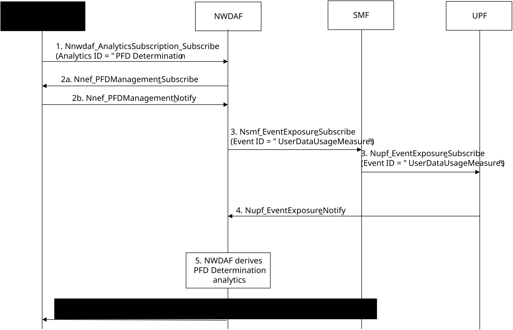

# 6.16 PFD Determination Analytics

## 6.16.1 General

This clause specifies the procedure on how NWDAF can provide NWDAF-assisted PFD Determination analytics, in the form of statistics.

To assist determination of PFDs for known application identifiers, if the related Service Level Agreement does not preclude this, an NWDAF may perform data analytics on existing PFD information and user plane traffic and provide analytics results in the form of new or updated PFD determination statistics, e.g. new or updated IP 3-tuple list, to an analytics consumer in the 5GC. The NEF(PFDF) as the consumer uses the suggested PFD information of the PFD determination statistics provided by the NWDAF as defined in clause 4.18.2.2 of TS 23.502 \[3\] and in TS 23.503 \[4\].

The service consumer is a NEF(PFDF).

The consumer of these analytics shall indicate in the subscription:

\- Analytics ID = " PFD Determination";

\- Target of Analytics Reporting: "any UE";

\- Application identifier;

\- Analytics Filter Information optionally containing:

\- S-NSSAI(s);

\- DNN(s);

\- An Analytics target period indicates the time period over which the statistics are requested;

\- Analytics Reporting Parameters indicating either periodic reporting (together with the parameter periodicity) or reporting when threshold is reached (together with the parameter Reporting type (as defined in clause 4.15.1 of TS 23.502 \[3\]) to indicate that the report shall only occur when the information differs from the previous report);

\- Optionally, the preferred level of accuracy on the PFD determination statistics;

\- Optionally, maximum number of objects. This refers to the analytic output (i.e. maximum number of new or updated suggested PFD information in the PFD determination statistics);

\- In a subscription, the Notification Correlation Id and the Notification Target Address are included.

## 6.16.2 Input Data

The NWDAF collects information on user data traffic from the UPF for a known Application ID optionally together with a combination of certain S-NSSAI(s) and/or DNN(s) and retrieves the existing PFDs from the NEF(PFDF). The detailed input data are described in Table 6.16.2-1.

Table 6.16.2-1: Input data to detect known application from NFs

<table>
<colgroup>
<col style="width: 26%" />
<col style="width: 28%" />
<col style="width: 45%" />
</colgroup>
<tbody>
<tr class="odd">
<td>Information</td>
<td>Source</td>
<td>Description</td>
</tr>
<tr class="even">
<td>
Application ID for detection of suggested PFD information

(NOTE 1)
</td>
<td>UPF</td>
<td>Identifies the application detection algorithm used for the detection of suggested PFD information.</td>
</tr>
<tr class="odd">
<td>Application Traffic Flow Information (1..max)</td>
<td>UPF</td>
<td>Per Application Traffic flow related information for the application and optionally, for a DNN, S-NSSAI combination.</td>
</tr>
<tr class="even">
<td>&gt; IP 5-tuple</td>
<td>UPF</td>
<td>Identifies a service flow of the UE that uses the application.</td>
</tr>
<tr class="odd">
<td>&gt; Start time</td>
<td>UPF</td>
<td>Start time of traffic detection for the flow.</td>
</tr>
<tr class="even">
<td>&gt; End time</td>
<td>UPF</td>
<td>End time of traffic detection for the flow.</td>
</tr>
<tr class="odd">
<td>&gt; UL Data volume</td>
<td>UPF</td>
<td>Measured UL data traffic volume for the flow.</td>
</tr>
<tr class="even">
<td>&gt; DL Data volume</td>
<td>UPF</td>
<td>Measured DL data traffic volume for the flow.</td>
</tr>
<tr class="odd">
<td>&gt; UL Data Rate</td>
<td>UPF</td>
<td>Measured UL data rate for the flow.</td>
</tr>
<tr class="even">
<td>&gt; DL Data Rate</td>
<td>UPF</td>
<td>Measured DL data rate for the flow.</td>
</tr>
<tr class="odd">
<td>&gt; URL list</td>
<td>UPF</td>
<td>List of URLs extracted from the inspected user plane packets in the flow.</td>
</tr>
<tr class="even">
<td>&gt; Domain Name list</td>
<td>UPF</td>
<td>List of domain names extracted from the inspected user plane packets in the flow.</td>
</tr>
<tr class="odd">
<td>PFD Information</td>
<td>NEF(PFDF)</td>
<td>PFD Information stored in the UDR (as Application Data) and retrieved by NEF (PFDF), as defined in clause 6.1.2.3.2 of TS 23.503 [4].</td>
</tr>
<tr class="even">
<td>&gt; Application ID</td>
<td>NEF(PFDF)</td>
<td>Identification of the application that refers to one or more application detection filters.</td>
</tr>
<tr class="odd">
<td>&gt; PFD(s) (1..max)</td>
<td>NEF(PFDF)</td>
<td></td>
</tr>
<tr class="even">
<td>&gt;&gt; PFD ID</td>
<td>NEF(PFDF)</td>
<td></td>
</tr>
<tr class="odd">
<td>&gt;&gt; IP 3-tuple list</td>
<td>NEF(PFDF)</td>
<td>Including protocol, server side IP address and port number.</td>
</tr>
<tr class="even">
<td>&gt;&gt; URL list</td>
<td>NEF(PFDF)</td>
<td>The significant parts of the URL to be matched, e.g. host name.</td>
</tr>
<tr class="odd">
<td>&gt;&gt; Domain Name list</td>
<td>NEF(PFDF)</td>
<td>A Domain Name matching criteria and information about applicable protocol(s).</td>
</tr>
<tr class="even">
<td>
&gt;&gt; Source NF type

(NOTE 2)
</td>
<td>NEF(PFDF)</td>
<td>Indicates the source NF type which generated the PFD (i.e. AF or NWDAF).</td>
</tr>
<tr class="odd">
<td colspan="3">
NOTE 1: In the UPF, the "Application ID for detection of suggested PFD information" can refer to a detection algorithm that has a wider scope than the detection algorithm the Application ID provided by the consumer refers to.

NOTE 2: The absence of the Source NF type indicates that this PFD was generated by the AF.
</td>
</tr>
</tbody>
</table>

NOTE 1: Extensive reporting of all traffic flows may conflict with the requirement to avoid extra UPF load. An NWDAF may subscribe only for reporting for some UEs to limit the load.

NOTE 2: In order to enable retrieval of input data from the UPF as listed in Table 6.16.2-1, if UPF supports exposure, then SMF is expected to provide DNN and S-NSSAI to UPF at PDU Session establishment.

## 6.16.3 Output Analytics

The output analytics of PFD Determination is defined in Table 6.16.3-1. The output analysis may be used to provision new or updated PFDs information for known applications. The NWDAF may assign a confidence to the PFD Determination statistics based on the analytics of input data provided by UPF and NEF(PFDF).

Table 6.16.3-1: PFD Determination statistics

|                                            |                                                                                                  |
|--------------------------------------------|--------------------------------------------------------------------------------------------------|
| Information                                | Description                                                                                      |
| Application ID                             | Identifies the application for which the PFD information applies.                                |
| List of suggested PFD information (1..max) | Suggested PFD information derived by the analytics for the application.                          |
| \> PFD ID                                  | Identifier of the PFD (i.e. new PFD ID assigned by NWDAF or existing PFD ID retrieved from UDR). |
| \> IP 3-tuple list                         | Including protocol, server side IP address and port number.                                      |
| \> URL list                                | The significant parts of the URL to be matched, e.g. host name.                                  |
| \> Domain Name list                        | A Domain Name matching criteria and information about applicable protocol(s).                    |
| \> Confidence                              | Confidence on the provided suggested PFD information for the Application ID.                     |

## 6.16.4 Procedures

Figure 6.16.4-1 shows the procedure that a consumer can use to request PFD Determination analytics.

Figure 6.16.4-1: A procedure for NWDAF-assisted PFD Determination

1\. The Consumer NF (NEF(PFDF)) subscribes to the NWDAF to request PFD Determination analytics for a known application identifier. The Target of Analytics Reporting is set to Any UE.

The Analytics Filter Information may optionally include the S-NSSAI and/or DNN.

2\. The NWDAF subscribes to PFD notifications for the Application ID provided in step 1 by sending Nnef_PFDManagement_Subscribe message to the NEF (PFDF) in order to be informed about the stored PFD information in use from UDR via NEF(PFDF). The NEF(PFDF) sends the PFD(s) that are currently stored for the Application ID in the Nnef_PFD_Management_Notify message. The NEF(PFDF) will send further Nnef_PFD_Management_Notify messages whenever the PFD(s) for this Application ID change.

3\. The NWDAF collects information from the UPF (event "User Data Usage Measures") as listed in Table 6.16.2-1 via SMF as defined in clause 5.8.2.17 of TS 23.501 \[2\]. NWDAF discovers the SMF through NRF as defined in clause 4.15.4.5.3 of TS 23.502 \[3\]. The event "User Data Usage Measures" is defined in clause 5.2.26.2 of TS 23.502 \[3\], the subscription to the event includes an "Application ID for detection of suggested PFD information" which allows the NWDAF to retrieve input information to derive PFD Determination Analytics for the Application ID that is provided by the consumer.

NOTE 1: The Application ID provided by the consumer and the "Application ID for detection of suggested PFD information" provided to the UPF to retrieve input data for PFD Determination Analytics can be different ones.

4\. UPF reports the data directly to NWDAF.

5\. The NWDAF derives PFD Determination analytics, e.g. new or updated suggested PFD information for the existing Application ID. For providing new suggested PFD information, the NWDAF shall assign a new PFD ID that is not yet used for this Application ID. For updating PFD information, the NWDAF shall use the existing PFD ID when indicating the updated suggested PFD information. For deleting PFD information, the NWDAF shall only indicate the existing PFD ID. The NWDAF can only update or delete suggested PFD information previously generated by the NWDAF, i.e. that contains "NWDAF" as source NF type. When the consumer provides the preferred level of accuracy, the NWDAF provides PFD Determination Analytics that reaches or exceeds this level to the consumer.

6\. The NWDAF notifies PFD Determination analytics (shown in table 6.16.3-1) to the consumer NF (i.e. NEF(PFDF)) with suggested PFD Information according to the reporting mode indicated by the Consumer NF (i.e. NEF(PFDF)) during the subscription in step 1.

NOTE 2: Steps 2b, 4, 5 and 6 can occur multiple times during the lifetime of the subscription of the consumer NF (i.e. NEF(PFDF)).
