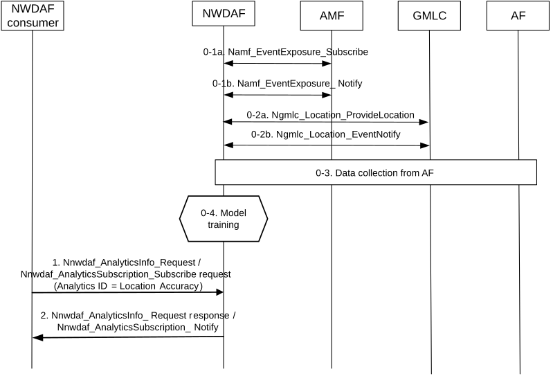

# 6.17 Location Accuracy Analytics

## 6.17.1 General

This clause specifies how an NWDAF can provide Location Accuracy Analytics which provides analytics for LCS QoS accuracy to an analytics consumer such as LMF.

With different input data to NWDAF, the Location Accuracy Analytics provides one or a combination of the following information:

\- when the input data is location:

\- location accuracy (i.e. Horizontal Accuracy (see clause 4.3.1 of TS 22.071 \[35\]) and optionally Vertical Accuracy (see clause 4.3.2 of TS 22.071 \[35\]) of applicable positioning method at indicated location;

\- Indication on whether a UE is indoor or outdoor when a location measurement is made (optional);

\- Indication on whether a UE location is measured with NLOS or LOS (optional);

\- when the input data is area:

\- average location accuracy (i.e. Horizontal Accuracy (see clause 4.3.1 of TS 22.071 \[35\]) and optionally Vertical Accuracy (see clause 4.3.2 of TS 22.071 \[35\]) of applicable positioning method at indicated area;

\- percentage of indoor/outdoor measurement for an applicable area (optional);

\- percentage of NLOS/LOS measurement for an applicable area (optional);

\- requested Confidence of location accuracy prediction (optional).

The consumer of these analytics shall indicate in the request or subscription:

\- Analytics ID = "Location Accuracy";

\- Target of Analytics Reporting: "any UE";

\- Analytics Filter Information:

\- Optionally, the Positioning methods used as defined in clause 4.2b of TS 23.273 \[39\];

\- Location information (horizontal and optional vertical); or

\- Area of Interest: restricts the scope of the LCS accuracy analytics to the provided area. The AOI is TA and/or cell list as defined in TS 23.502 \[3\]. Depends on the NWDAF consumer, there can be more than one AOIs in one request;

\- Optionally, the list of analytics subsets that are requested among those specified in clause 6.17.3;

\- optionally, a preferred level of accuracy of the analytics;

\- optionally, preferred level of accuracy per analytics subset (see clause 6.17.3);

\- optionally, Reporting Thresholds, which apply only for subscriptions and indicate conditions on the level to be reached for respective analytics subsets (see clause 6.17.3) in order to be notified by the NWDAF;

\- optionally, maximum number of objects; and

\- an Analytics target period indicates the time period over which the statistics or predictions are requested.

## 6.17.2 Input Data

In Input data for the analytics ID is listed in Table 6.17.2-1. A training should be done by performing a specific LCS positioning method and comparing the position result with the ground truth UE location obtained by another method.

NOTE: There are at least two conceivable options for the ground truth data used for the ML Model training of this analytics ID. One option is to use the known location of Positioning Reference Units (PRUs), another option is to use the positioning result of one positioning method (preferably Global Navigation Satellite System (GNSS) information such as GPS information). Collecting PRU related information by NWDAF is not supported in this release. There could be other options for ground truth data which can be determined in the future releases.

Table 6.17.2-1: Data Collected by NWDAF for Location Accuracy Analytics

<table>
<colgroup>
<col style="width: 33%" />
<col style="width: 15%" />
<col style="width: 51%" />
</colgroup>
<thead>
<tr class="header">
<th>Information</th>
<th>Source</th>
<th>Description</th>
</tr>
</thead>
<tbody>
<tr class="odd">
<td>UE IDs</td>
<td>AMF</td>
<td>(List of) SUPI(s)</td>
</tr>
<tr class="even">
<td>Finer granularity UE location</td>
<td>
LCS

NOTE 1
</td>
<td>UE location information.</td>
</tr>
<tr class="odd">
<td>&gt;UE location</td>
<td></td>
<td>Geographical location or location in local coordinate (as defined in TS 23.032 [34])</td>
</tr>
<tr class="even">
<td>&gt;positioning methods</td>
<td></td>
<td>The positioning methods used by the LMF when the location measurement was made</td>
</tr>
<tr class="odd">
<td>&gt;LCS QoS</td>
<td></td>
<td>LCS QoS accuracy as defined in clause 4.1b in TS 23.273 [39]</td>
</tr>
<tr class="even">
<td>&gt;Indoor/outdoor indication</td>
<td></td>
<td>Indication of indoor/outdoor when LMF can distinguish indoor/outdoor environment</td>
</tr>
<tr class="odd">
<td>&gt;NLOS/LOS indication</td>
<td></td>
<td>Indication whether the UE measurements were based on LOS/NLOS measurements</td>
</tr>
<tr class="even">
<td>UE location (ground truth)</td>
<td>AF</td>
<td>Timestamped UE positions</td>
</tr>
<tr class="odd">
<td>&gt;UE location</td>
<td>NOTE 2,</td>
<td>GNSS location information</td>
</tr>
<tr class="even">
<td>&gt;Timestamp</td>
<td>NOTE 3</td>
<td>Time stamp for the UE location</td>
</tr>
<tr class="odd">
<td>&gt;Accuracy</td>
<td></td>
<td>The accuracy of the GNSS location information</td>
</tr>
<tr class="even">
<td colspan="3">
NOTE 1: The procedure to collect location data using LCS is described in clause 6.2.12.

NOTE 2: How the AF obtains timestamped GNSS location information of a UE ID is out of 3GPP scope. Whether to trust the UE location from AF is up to the implementation.

NOTE 3: When AF is deployed in the untrusted domain, NEF is employed to mediate the interactions between NWDAF and AF via the Naf_EventExposure_Subscribe service specified in clause 5.2.19.2 of TS 23.502 [3], as described in clause 6.2.8.2.3.
</td>
</tr>
</tbody>
</table>

## 6.17.3 Output Analytics

The Location Accuracy analytics are shown in table 6.17.3-1.

Table 6.17.3-1: Location Accuracy statistics

| Information                                                                                                                                                               | Description                                                                                                                               |
|---------------------------------------------------------------------------------------------------------------------------------------------------------------------------|-------------------------------------------------------------------------------------------------------------------------------------------|
| List of Accuracy sustainability Analytics (1..max)                                                                                                                        |                                                                                                                                           |
| \>Applicable Area                                                                                                                                                         | A list of TAIs or Cell IDs or longitude and latitude level location information that the analytics applies to                             |
| \>Applicable Time Period                                                                                                                                                  | The time period within the Analytics target period that the statistics applies to.                                                        |
| \> Positioning Methods (1…max) (NOTE)                                                                                                                                     | The positioning methods used to measure location as defined in clause 4.2b of TS 23.273 \[39\]                                            |
| \>\> average accuracy of positioning method in applicable area (NOTE)                                                                                                     | Statistics about the horizontal and optionally vertical location average accuracy of applicable positioning method at the applicable area |
| \>\> Percentage of NLOS/LOS measurements of positioning method in applicable area                                                                                         | Provides ratio of LOS to NLOS measurements of positioning method in the applicable area                                                   |
| \> Percentage of UE in indoor/outdoor in applicable area (optional) (NOTE)                                                                                                | Provides ratio of UEs that are indoor/outdoor in the applicable area                                                                      |
| \> Applicable Location                                                                                                                                                    | A location (i.e. Geographical location or location in local coordinate (as defined in TS 23.032 \[34\])) that the analytics applies to    |
| \>Applicable Time Period                                                                                                                                                  | The time period within the Analytics target period that the prediction applies to.                                                        |
| \> Positioning Methods (1…max) (NOTE)                                                                                                                                     | The positioning methods used to measure location as defined in clause 4.2b of TS 23.273 \[39\]                                            |
| \>\>accuracy of positioning method in applicable location (NOTE)                                                                                                          | statistics about the horizontal and optionally vertical location accuracy of applicable positioning method at the applicable location     |
| \>\>Indication whether the location is measured NLOS/LOS with the positioning method                                                                                      | Indicates whether this applicable location is measured with NLOS or LOS with the positioning method                                       |
| \> Indication whether location is indoor/outdoor (optional) (NOTE)                                                                                                        | Indicates whether this applicable location is measured to be indoor or outdoor                                                            |
| NOTE: Analytics subset that can be used in "list of analytics subsets that are requested", "Preferred level of accuracy per analytics subset" and "Reporting Thresholds". |                                                                                                                                           |

Table 6.17.3-2: Location Accuracy predictions

| Information                                                                                                                                                               | Description                                                                                                                               |
|---------------------------------------------------------------------------------------------------------------------------------------------------------------------------|-------------------------------------------------------------------------------------------------------------------------------------------|
| List of Accuracy sustainability Analytics (1..max)                                                                                                                        |                                                                                                                                           |
| \>Applicable Area                                                                                                                                                         | A list of TAIs or Cell IDs or longitude and latitude level location information that the analytics applies to                             |
| \>Applicable Time Period                                                                                                                                                  | The time period within the Analytics target period that the prediction applies to                                                         |
| \> Positioning Methods (1…max) (NOTE)                                                                                                                                     | The positioning methods used to measure location as defined in clause 4.2b of TS 23.273 \[39\]                                            |
| \>\> average accuracy of positioning method in applicable area (NOTE)                                                                                                     | Prediction about the horizontal and optionally vertical location average accuracy of applicable positioning method at the applicable area |
| \>\> Percentage of NLOS/LOS measurements of positioning method in applicable area                                                                                         | Provides predicted ratio of LOS to NLOS measurements of positioning method in the applicable area                                         |
| \> Percentage of UE in indoor/outdoor in applicable area (optional) (NOTE)                                                                                                | Provides predicted ratio of UEs that are indoor/outdoor in the applicable area                                                            |
| \> Applicable Location                                                                                                                                                    | A location (i.e. Geographical location or location in local coordinate (as defined in TS 23.032 \[34\])) that the analytics applies to    |
| \>Applicable Time Period                                                                                                                                                  | The time period within the Analytics target period that the prediction applies to.                                                        |
| \> Positioning Methods (1…max) (NOTE)                                                                                                                                     | The positioning methods used to measure location as defined in clause 4.2b of TS 23.273 \[39\]                                            |
| \>\>accuracy of positioning method in applicable location (NOTE)                                                                                                          | Prediction about the horizontal and optionally vertical location accuracy of applicable positioning method at the applicable location     |
| \>\>Indication whether the location is measured NLOS/LOS with the positioning method                                                                                      | Predicts whether this applicable location is measured with NLOS or LOS with the positioning method                                        |
| \> Indication whether location is indoor/outdoor (optional) (NOTE)                                                                                                        | Predicts whether this applicable location is measured to be indoor or outdoor                                                             |
| \> Confidence                                                                                                                                                             | Confidence of the prediction                                                                                                              |
| NOTE: Analytics subset that can be used in "list of analytics subsets that are requested", "Preferred level of accuracy per analytics subset" and "Reporting Thresholds". |                                                                                                                                           |

## 6.17.4 Procedures to request Location Accuracy Analytics

Figure 6.17.4-1: Location accuracy analytics retrieval

**Pre-condition:** NWDAF has a trained ML Model for predicting location accuracy. In the training phase, the NWDAF consumes input data as listed in clause 6.17.2. To train the ML Model, NWDAF may collect input data based on area of interest (AoI). The AoI is determined by NWDAF.

0-1. NWDAF collects UE IDs from AMF as defined in Table 6.17.2 via the AMF event exposure service with AoI as filtering criteria.

0-2. NWDAF collects the UE location information using LCS (location estimate, Position Methods Used, Indoor/Outdoor indication, NLOS/LOS indication) as described in clause 6.2.12 and Table 6.17.2 with UE ID as filtering criteria.

0-3. NWDAF collects ground truth UE location information (i.e. timestamped GNSS location information) from AF.

0-4. NWDAF prepares the analytics for statistics and/or trains the ML Model for prediction.

1\. The Analytics consumer, e.g. LMF, requests from NWDAF location accuracy statistics or predictions, giving as inputs the corresponding Analytics ID and UE location estimate (in the form of horizontal and/or vertical location) or corresponding area (cell ID/TAI). The analytics request to the NWDAF may be a one time or a subscription request. Other inputs such as UE positioning method, applicable period can be assistance data.

NOTE 1: It is assumed that the analytics consumer determines a location. For instance, the LMF can be triggered by LCS client request to determine a location and then use location accuracy analytics to inquire the accuracy of the determined location.

NOTE 2: Both Nnwdaf_AnalyticsSubscription or Nnwdaf_AnalyticsInfo services can be used for step 1. The Nnwdaf_AnalyticsSubscription service can be used by a service consumer to receive notifications about location accuracy, e.g. when a change is detected.

2\. The NWDAF uses the trained ML Model and provides the location accuracy as output to the analytics consumer.

NOTE 3: The NWDAF can derive the accuracy based on the model without further input data.
