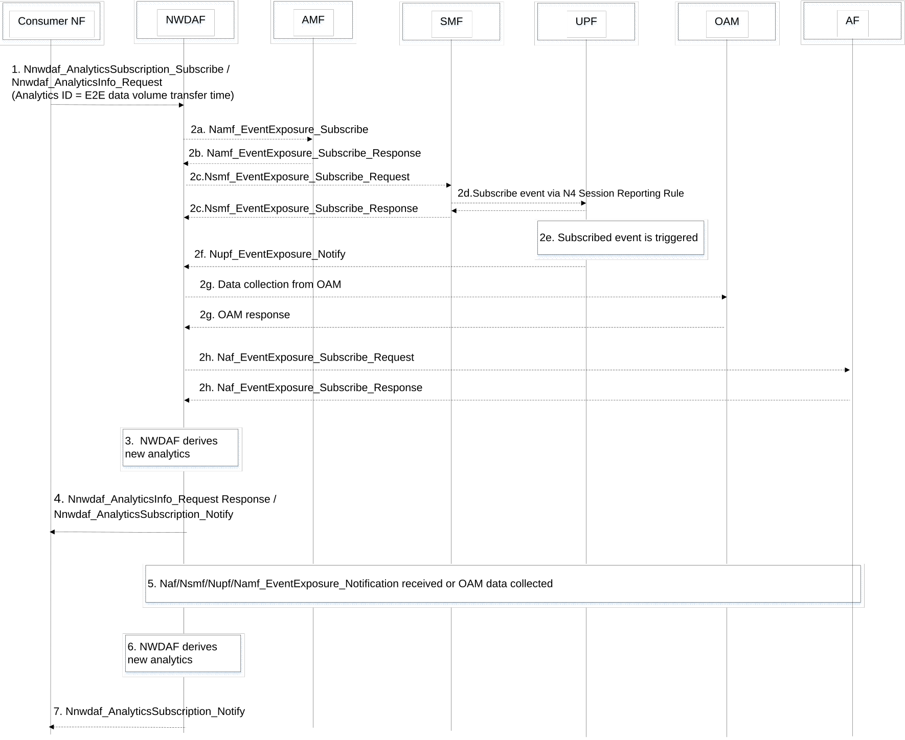

# 6.18 End-to-end data volume transfer time analytics

## 6.18.1 General

Clause 6.18 describes how NWDAF can provide E2E data volume transfer time analytics, in the form of statistics or predictions or both, to a service consumer. NWDAF collects E2E data volume transfer time related input data from 5GC NFs, OAM and AF. The consumer can either subscribe to analytics notifications (i.e. a Subscribe-Notify model) or request a single notification (i.e. a Request-Response model).

The E2E data volume transfer time refers to a time delay for completing the transmission of a specific data volume from UE to AF, or from AF to UE. The data volume may be the expected or observed data volume from UE to AF or from AF to UE. The NWDAF may use the data volume indicated by the consumer as a reference to collect the input data for deriving the statistics and predictions of the end-to-end data volume transfer time. If a target repetition number of data transmissions or a target time interval between data transmissions is given, the E2E data volume transfer time can be provided as an average value of the data volume transfer times within the Analytics target period. The E2E data volume transfer time analytics may be used to assist an AF or NEF with AI/ML-based services, e.g. for member UE selection of federated learning.

The E2E data volume transfer time analytics may be provided as defined in clause 6.18.3 for a single UE or a list of UEs.

More than one E2E data volume transfer time classes might be assigned by operator or AF to a list of UEs. The UEs might be classified into high-, medium- and low-transfer time classes with respect to the threshold(s) of the corresponding class.

The service consumer may be an NF (e.g. AF, or NEF).

The consumer of these analytics indicates in the request or subscription:

\- Analytics ID = "E2E data volume transfer time ".

\- Target of Analytics Reporting as defined in clause 6.1.3.

\- Analytics Filter Information, including:

\- Optionally, DNN;

\- Optionally, S-NSSAI;

\- Optionally, Application ID;

\- Optionally, Area of Interest (AOI(s)): restricts the scope of the E2E data volume transfer time analytics to the provided area;

\- Optionally, a list of analytics subsets that are requested (see clause 6.18.3);

\- QoS requirements (e.g. 5QI, QoS Characteristics);

\- Optionally, either a target number of repeating data transmissions or a target time interval between data transmissions within the Analytics target period;

\- Data Volume UL/DL: indicates a specific data volume per transmission either from UE to AF or from AF to UE;

\- A request for geographical distribution (i.e. the AoIs) of the UEs.

An Analytics target period indicates the time period over which the statistics or predictions are requested.

\- In a subscription, the Notification Correlation Id and the Notification Target Address are included.

\- Optionally, preferred level of accuracy of the analytics.

\- Optionally, preferred level of accuracy per analytics subset (see clause 6.18.3).

\- Optionally, preferred order of results for the list of E2E data volume transfer times:

\- ordering criterion: "E2E data volume transfer time",

\- order: ascending or descending.

\- Optionally, Reporting Thresholds, which apply only for subscriptions and indicate conditions on the levels to be reached for the respective analytics subsets (see clause 6.18.3)

\- Optionally, maximum number of UEs.

## 6.18.2 Input Data

The NWDAF supporting analytics on E2E data volume transfer time shall be able to collect information from AF, OAM and 5GC NFs.

The information collected by the NWDAF from the OAM is defined in the Table 6.18.2-1, from relevant 5GC NFs (i.e. UPF, SMF, AMF) is defined in Table 6.18.2-2 and from AF is defined in Table 6.18.2-3.

Table 6.18.2-1: Input data from OAM related to E2E data volume transfer time

<table>
<colgroup>
<col style="width: 33%" />
<col style="width: 15%" />
<col style="width: 51%" />
</colgroup>
<thead>
<tr class="header">
<th>Information</th>
<th>Source</th>
<th>Description</th>
</tr>
</thead>
<tbody>
<tr class="odd">
<td>RAN part delay for DL and UL</td>
<td>
OAM

(See NOTE 2)
</td>
<td>Average packet transmission delay through the RAN part to the UE per 5QI and per S-NSSAI as specified in clauses 6.3.1.2.1 and 6.3.1.7.1 of TS 28.554 [10] and per UE level per supported S-NSSAI and per QoS level in clauses 6.3.1.1.1 and 6.3.1.1.6 of TS 28.558 [50].</td>
</tr>
<tr class="even">
<td>Timestamp</td>
<td>OAM</td>
<td>A time stamp associated with the collected information.</td>
</tr>
<tr class="odd">
<td>RAN Throughput for DL and UL</td>
<td>
OAM

(see NOTE 1)
</td>
<td>The per UE measurement of the throughput for DL and UL as specified in clauses 5.2.1.1 and 5.4.1.1 of TS 37.320 [20].</td>
</tr>
<tr class="even">
<td>RAN Packet delay for DL and UL</td>
<td>
OAM

(see NOTE 1)
</td>
<td>The per UE measurement of the packet delay for DL and UL, including per DRB per UE packet delay as specified in clause 5.4.1.1 of TS 37.320 [20].</td>
</tr>
<tr class="odd">
<td>RAN Packet loss rate for DL and UL</td>
<td>
OAM

(see NOTE 1, NOTE 2)
</td>
<td>The per UE measurement of the packet loss rate for DL and UL, including per DRB per UE packet loss rate as specified in clause 5.4.1.1 of TS 37.320 [20] and packet loss rate per UE per QoS level and per supported S-NSSAI in clauses 6.3.1.2.1 and 6.3.1.3.1 of TS 28.558 [50].</td>
</tr>
<tr class="even">
<td>Average UL/DL packet delay between PSA UPF and UE</td>
<td>
OAM

(See NOTE 2)
</td>
<td>The average of UL/DL packet delay between PSA UPF and UE per S-NSSAI as specified in clauses 5.4.9.1.1 and 5.4.9.2.1 of TS 28.552 [8] and per UE level per supported S-NSSAI and per QoS level in clauses 6.2.2.1.1 and 6.2.2.1.3 of TS 28.558 [50].</td>
</tr>
<tr class="odd">
<td>Average UL/DL Packet delay between PSA UPF and RAN</td>
<td>
OAM

(See NOTE 2)
</td>
<td>The per UE level per supported S-NSSAI and per QoS level of the average UL/DL packet delay between PSA UPF and RAN as specified in clauses 6.2.2.1.4 and 6.2.2.1.5 of TS 28.558 [50].</td>
</tr>
<tr class="even">
<td>Average DL/UL UE throughput in gNB</td>
<td>
OAM

(See NOTE 2)
</td>
<td>Average DL/UL UE throughput in the gNB per QoS level (mapped 5QI) and per S-NSSAI as specified in clauses 5.1.1.3.1 and 5.1.1.3.3 of TS 28.552 [8] and per UE per supported S-NSSAI and per QoS level clauses 6.3.1.4.1 and 6.3.1.4.2 of TS 28.558 [50].</td>
</tr>
<tr class="odd">
<td colspan="3">
NOTE 1: Per UE measurement for a specific UE from OAM (via MDT), is as specified in clause 6.2.3.1 of TS 37.320 [20].

NOTE 2: In addition to the average KPIs, per UE level measurements if available, can be taken into account by the NWDAF.
</td>
</tr>
</tbody>
</table>

NWDAF subscribes to the input data from OAM as defined in the Table 6.18.2-1 by using the services provided by OAM as described in clause 6.2.3.

NOTE 1: Whether the UE(s) is supporting a Slice or not can be checked by retrieving the registered AMF details from UDM or by asking AMF about what Slice is used by the UE(s) at the current registration (Alternatively, if NSACF is deployed, NSACF can provide a report on what slices are used by the UE(s)).

NOTE 2: User consent checking from UDM can apply to these analytics.

Table 6.18.2-2: Service Data from 5GC NFs for E2E data volume transfer time analytics

| Information                                                                             | Source            | Description                                                                                                                                                                                                                                                              |
|-----------------------------------------------------------------------------------------|-------------------|--------------------------------------------------------------------------------------------------------------------------------------------------------------------------------------------------------------------------------------------------------------------------|
| Timestamp                                                                               | 5GC NF            | A time stamp associated with the collected information.                                                                                                                                                                                                                  |
| UE location                                                                             | AMF, LCS (NOTE 1) | Location of the UE(s) needs to be collected from AMF if the application needs to be started at the same time. If the AoI indicated by the AF is a finer granularity area than the Cell level, the current location of the UE(s) needs to be collected from GMLC instead. |
| UE ID                                                                                   | AMF               | (list of) SUPI(s).                                                                                                                                                                                                                                                       |
| 5QI                                                                                     | SMF               | A reference to 5G QoS characteristics.                                                                                                                                                                                                                                   |
| QoS flow Packet Delay                                                                   | SMF, UPF          | The observed Packet delay for UL/DL/round trip directions between UE and PSA_UPF.                                                                                                                                                                                        |
| RAT Type                                                                                | SMF               | The RAT types the UE camps on.                                                                                                                                                                                                                                           |
| Access Type                                                                             | SMF               | The list of Access Type(s) used for the PDU Session.                                                                                                                                                                                                                     |
| NOTE 1: The procedure to collect location data using LCS is described in clause 6.2.12. |                   |                                                                                                                                                                                                                                                                          |

Table 6.18.2-3: Service Data from AF for E2E data volume transfer time analytics

| Information                             | Source | Description                                                                         |
|-----------------------------------------|--------|-------------------------------------------------------------------------------------|
| Timestamp                               | AF     | Timestamp of the collected information.                                             |
| Application ID                          | AF     | Identifier of the application at the AF.                                            |
| UE ID(s)                                | AF     | Internal or External UE IDs (i.e. SUPI or GPSI, respectively).                      |
| Transmitted UL/DL data volume           | AF     | The volume of the transmitted UL/DL data.                                           |
| UL/DL transmission time duration        | AF     | The time duration (start and end time) needed for sending the volume of UL/DL data. |
| Application Server Instance information | AF     | The IP address/FQDN of the Application Server.                                      |

NOTE 3: How to derive the time delay for sending a specific data volume between UPF and AF on N6 interface is out of scope of the present specification.

For calculation of the E2E data volume transfer time, the NWDAF uses mainly the Data Volume DL/UL provided by the analytics consumer (see clause 6.18.1) and the Average DL/UL UE throughput in gNB of the NG-RAN serving the UE or in the AoI (if an AoI is provided by the analytics consumer). Per UE input parameters if available may also be taken into account by the NWDAF.

## 6.18.3 Output Analytics

The NWDAF supporting E2E data volume transfer time analytics provides the analytics results to consumer NFs, e.g. AF, or NEF. The analytics results provided by the NWDAF could be E2E data volume transfer time statistics as defined in Table 6.18.3-1 or predictions as defined in table 6.18.3-2.

Table 6.18.3-1: E2E data volume transfer time statistics

<table>
<colgroup>
<col style="width: 26%" />
<col style="width: 73%" />
</colgroup>
<thead>
<tr class="header">
<th>Information</th>
<th>Description</th>
</tr>
</thead>
<tbody>
<tr class="odd">
<td>UE ID or list of UE IDs (1..SUPImax)</td>
<td>Identifies the UE(s)for which the statistic applies by a list of SUPIs.</td>
</tr>
<tr class="even">
<td>Time slot entry (1..max)</td>
<td>List of time slots during the Analytics target period.</td>
</tr>
<tr class="odd">
<td>&gt; Time slot start</td>
<td>Time slot start within the Analytics target period.</td>
</tr>
<tr class="even">
<td>&gt; Duration</td>
<td>Duration of the time slot.</td>
</tr>
<tr class="odd">
<td>&gt; E2E data volume transfer time information (1…max)</td>
<td>
List of E2E data volume transfer time statistics per UE.

Max. is the number of UEs, if applicable.
</td>
</tr>
<tr class="even">
<td>&gt;&gt; Application ID</td>
<td>Identifies the application in use during the time slot</td>
</tr>
<tr class="odd">
<td>&gt;&gt; UE location</td>
<td>Indicate the UE location information when the service is delivered.</td>
</tr>
<tr class="even">
<td>&gt;&gt; DNN</td>
<td>DNN for the PDU Session which contains the QoS flow.</td>
</tr>
<tr class="odd">
<td>&gt;&gt; S-NSSAI</td>
<td>Identifies the Network Slice used to access the application.</td>
</tr>
<tr class="even">
<td>&gt;&gt; RAT Type</td>
<td>Indicate the list of RAT types for which the E2E data volume transfer time applies.</td>
</tr>
<tr class="odd">
<td>&gt;&gt; Access Type</td>
<td>Access Type when the UE establishes a PDU Session for the AF.</td>
</tr>
<tr class="even">
<td>&gt;&gt; Validity period</td>
<td>The validity period within the time slot for the E2E data volume transfer time statistics as defined in clause 6.1.3.</td>
</tr>
<tr class="odd">
<td>&gt;&gt; Spatial validity</td>
<td>Area where the E2E data volume transfer time statistics applies.</td>
</tr>
<tr class="even">
<td>&gt;&gt; E2E data volume transfer time UL</td>
<td>
E2E data volume transfer time UL indicators.

Statistics of E2E data volume transfer time for uplink over the time slot (e.g. average, variance).
</td>
</tr>
<tr class="odd">
<td>&gt;&gt;&gt; Data volume UL</td>
<td>Indicates uplink data volume used to derive E2E data volume transfer time UL.</td>
</tr>
<tr class="even">
<td>&gt;&gt; E2E data volume transfer time DL</td>
<td>
E2E data volume transfer time DL indicators.

Statistics of E2E data volume transfer time for downlink over the time slot (e.g. average, variance).
</td>
</tr>
<tr class="odd">
<td>&gt;&gt;&gt; Data volume DL</td>
<td>Indicates downlink data volume used to derive E2E data volume transfer time DL.</td>
</tr>
<tr class="even">
<td>&gt; Classified E2E data volume transfer time information for a list of UEs (NOTE 1)</td>
<td>
Classified E2E data volume transfer time statistics for multiple UEs with respect to one or more reporting thresholds (e.g. NWDAF may provide the ratio of UEs that have reached certain Reporting Threshold(s)).

The list of UEs is indicated in the request of service consumer.
</td>
</tr>
<tr class="odd">
<td>&gt;&gt; E2E data volume transfer time classes (1…max) (NOTE 2)</td>
<td>List with group of UEs classified by ranges of E2E data volume transfer time.</td>
</tr>
<tr class="even">
<td>&gt;&gt;&gt; UE ID(s)</td>
<td>Identifies the UE(s) in the transfer time class with respect to the threshold of the corresponding transfer time class.</td>
</tr>
<tr class="odd">
<td>&gt;&gt;&gt; Ratio of UEs per E2E data volume transfer time class</td>
<td>Ratio of UEs.</td>
</tr>
<tr class="even">
<td>&gt;&gt; Validity period</td>
<td>The validity period within the time slot for the Classified E2E data volume transfer times for a list of UEs statistics as defined in clause 6.1.3.</td>
</tr>
<tr class="odd">
<td>&gt;&gt; Spatial Validity</td>
<td>Area where the Classified E2E data volume transfer times statistics for a list of UEs analytics applies.</td>
</tr>
<tr class="even">
<td>&gt; Geographical distribution of the UE(s)</td>
<td>If requested, a list of UEs per location information.</td>
</tr>
<tr class="odd">
<td colspan="2">
NOTE 1: Analytics subset that can be used in "list of analytics subsets that are requested", "Preferred level of accuracy per analytics subset" and "Reporting Thresholds".

NOTE 2: The number of transfer time classes may be pre-configured by the operator or provided by the service consumer via reporting thresholds.
</td>
</tr>
</tbody>
</table>

Table 6.18.3-2: E2E data volume transfer time predictions

<table>
<colgroup>
<col style="width: 26%" />
<col style="width: 73%" />
</colgroup>
<thead>
<tr class="header">
<th>Information</th>
<th>Description</th>
</tr>
</thead>
<tbody>
<tr class="odd">
<td>UE ID or list of UE IDs (1..SUPImax)</td>
<td>Identifies the UE(s) for which the predictions applies by a list of SUPIs.</td>
</tr>
<tr class="even">
<td>Time slot entry (1..max)</td>
<td>List of time slots during the Analytics target period.</td>
</tr>
<tr class="odd">
<td>&gt; Time slot start</td>
<td>Time slot start within the Analytics target period.</td>
</tr>
<tr class="even">
<td>&gt; Duration</td>
<td>Duration of the time slot.</td>
</tr>
<tr class="odd">
<td>&gt; E2E data volume transfer time information (1…max)</td>
<td>
List of E2E data volume transfer time predictions per UE.

Max. is the number of UEs, if applicable.
</td>
</tr>
<tr class="even">
<td>&gt;&gt; Application ID</td>
<td>Identifies the application in use during the time slot.</td>
</tr>
<tr class="odd">
<td>&gt;&gt; UE location</td>
<td>Indicate the UE location information when the service is delivered.</td>
</tr>
<tr class="even">
<td>&gt;&gt; DNN</td>
<td>DNN for the PDU Session which contains the QoS flow.</td>
</tr>
<tr class="odd">
<td>&gt;&gt; S-NSSAI</td>
<td>Identifies the Network Slice used to access the application.</td>
</tr>
<tr class="even">
<td>&gt;&gt; RAT Type</td>
<td>Indicate the list of RAT types for which the E2E data volume transfer time applies.</td>
</tr>
<tr class="odd">
<td>&gt;&gt; Access Type</td>
<td>Access Type when the UE establishes a PDU Session for the AF.</td>
</tr>
<tr class="even">
<td>&gt;&gt; Validity period</td>
<td>The validity period within the time slot for the E2E data volume transfer time prediction as defined in clause 6.1.3.</td>
</tr>
<tr class="odd">
<td>&gt;&gt; Spatial validity</td>
<td>Area where the E2E data volume transfer time prediction applies.</td>
</tr>
<tr class="even">
<td>&gt;&gt; E2E data volume transfer time UL</td>
<td>
E2E data volume transfer time indicators.

Predictions of E2E data volume transfer time for uplink over the time slot (e.g. average, variance).
</td>
</tr>
<tr class="odd">
<td>&gt;&gt;&gt; Data volume UL</td>
<td>Indicates uplink data volume used to derive E2E data volume transfer time UL.</td>
</tr>
<tr class="even">
<td>&gt;&gt; E2E data volume transfer time DL</td>
<td>
E2E data volume transfer time DL indicators.

Predictions of E2E data volume transfer time for downlink over the time slot (e.g. average, variance).
</td>
</tr>
<tr class="odd">
<td>&gt;&gt;&gt; Data volume DL</td>
<td>Indicates downlink data volume used to derive E2E data volume transfer time DL.</td>
</tr>
<tr class="even">
<td>&gt; Classified E2E data volume transfer time information for a list of UEs (NOTE 1)</td>
<td>
Classified E2E data volume transfer time prediction for multiple UEs with respect to one or more reporting thresholds (e.g. NWDAF may provide the ratio of UEs that have reached certain Reporting Threshold(s)).

The list of UEs is indicated in the request of service consumer.
</td>
</tr>
<tr class="odd">
<td>&gt;&gt; E2E data volume transfer time classes (1…max) (NOTE 2)</td>
<td>List with group of UEs classified by ranges of E2E data volume transfer time.</td>
</tr>
<tr class="even">
<td>&gt;&gt;&gt; UE ID(s)</td>
<td>Identifies the UE(s) in the transfer time class with respect to the threshold of the corresponding transfer time class.</td>
</tr>
<tr class="odd">
<td>&gt;&gt;&gt; Ratio of UEs per E2E data volume transfer time class</td>
<td>Ratio of UEs.</td>
</tr>
<tr class="even">
<td>&gt;&gt; Validity period</td>
<td>The validity period within the time slot for the Classified E2E data volume transfer times for a list of UEs prediction as defined in clause 6.1.3.</td>
</tr>
<tr class="odd">
<td>&gt;&gt; Spatial Validity</td>
<td>Area where the Classified E2E data volume transfer times prediction for a list of UEs applies.</td>
</tr>
<tr class="even">
<td>&gt; Geographical distribution of the UE(s)</td>
<td>If requested, a list of UEs per location information.</td>
</tr>
<tr class="odd">
<td>&gt; Confidence</td>
<td>Confidence of this prediction.</td>
</tr>
<tr class="even">
<td colspan="2">
NOTE 1: Analytics subset that can be used in "list of analytics subsets that are requested", "Preferred level of accuracy per analytics subset" and "Reporting Thresholds".

NOTE 2: The number of transfer time classes may be pre-configured by the operator or provided by the service consumer via reporting thresholds.
</td>
</tr>
</tbody>
</table>

NOTE: When Target of Analytics Reporting is an individual UE, one UE ID (i.e. SUPI) will be included, the NWDAF will provide the analytics transfer time result (i.e. list of (predicted) time slots) to NF service consumer(s) for the UE.

## 6.18.4 Procedures

The NWDAF may provide E2E data volume transfer time analytics to a 5GC NF (e.g. AF, or NEF).

Figure 6.18.4-1: Procedure for E2E data volume transfer time analytics

1\. The Consumer NF, e.g. AF or NEF, requests or subscribes to analytics for E2E data volume transfer time analytics from NWDAF (possibly via NEF in case the consumer NF is an untrusted AF) and provides the input information as specified in clause 6.18.1 to 5GC.

2a-b. The NWDAF may subscribe to the service data from AMF as defined in Table 6.18.2-2 using Namf_EventExposure_Subscribe service operation for collecting UE location(s) for a UE or a group of UEs using an Internal-Group-Id.

NOTE: If NWDAF requires UE location information with finer granularity than TA/cell level, then NWDAF collects the location data from GMLC instead of AMF.

2c. The NWDAF may subscribe to service data from SMF as defined in Table 6.18.2-2 by invoking Nsmf_EventExposure_Subscribe service operation (Event ID, SUPI(s) or Application ID).

2c. The NWDAF may subscribe to service data from SMF as defined in Table 6.18.2-2 by invoking Nsmf_EventExposure_Subscribe service operation (Event ID, SUPI(s) or Application ID).

2d. In order to provide the QoS flow Packet delay to NWDAF the SMF subscribe to QoS Monitoring information from UPF, as defined in Table 6.18.2-2, using the N4 Session level Reporting procedure defined in TS 23.502 \[3\].

2e. The subscribed event is triggered in the UPF.

2f. The UPF notifies the subscribed event report directly to the NWDAF.

2g. The NWDAF may subscribe to the input data from the OAM as defined in the Table 6.18.2-1 according to the data collection principles described in clause 6.2.3.

2h. The NWDAF may subscribe to the service data from as defined AF in the Table 6.18-3 by invoking Nnef_EventExposure_Subscribe or Naf_EventExposure_Subscribe (Event ID = E2E data volume transfer time information, Application ID, Event Filter information, Target of Event Reporting = UE ID(s)) service as defined in TS 23.502 \[3\].

3\. The NWDAF derives the requested analytics, in the form of E2E data volume transfer time statistics and/or predictions.

4\. The NWDAF provides the requested E2E data volume transfer time analytics to the consumer NF, using either Nnwdaf_AnalyticsInfo_Request response or Nnwdaf_AnalyticsSubscription_Notify, depending on the service used in step 1.

5-7. If the consumer NF subscribed to E2E data volume transfer time analytics in step 1, once the NWDAF generates new analytics for E2E data volume transfer time, it provides a notification using Nnwdaf_AnalyticsSubscription_Notify to the Consumer NF.
