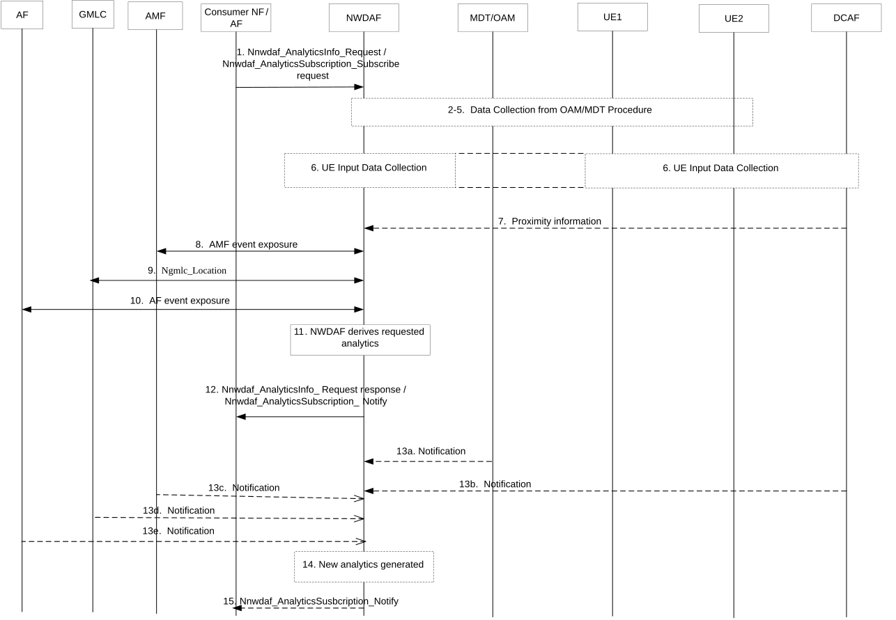

# 6.19 Relative Proximity Analytics

## 6.19.1 General

Relative Proximity Analytics among UEs provided by NWDAF can be used to assist a consumer NF to more accurately localize a cluster (or a set) of UEs via provisioning statistics or prediction information related to their relative proximity. This analytics type may help the consumer improve the location estimation accuracy of a UE by using proximity information from nearby UEs, or it may help the consumer identify UEs in the vicinity of another UE. Relative proximity information can also be leveraged by NWDAF to provide location information with finer granularity than TA/cell.

The NWDAF provides relativity proximity analytics to a NF (e.g. NEF or AF).

The consumer of these analytics shall indicate in the request or subscription:

\- Analytics ID = "Relative Proximity";

\- Target of Analytics Reporting as defined in clause 6.1.3;

\- Analytics Filter Information:

\- optionally, S-NSSAI and/or DNN

\- an optional Area of Interest;

\- an optional individual or set of direction(s) of interest;

\- an optional number of UEs to be accounted for relative proximity (i.e. the number of UEs for which one UE may report proximity information);

\- optionally, one or several attributes to be accounted for relative proximity (i.e. additional information that can be provided in addition to distance between two UEs): velocity, average speed, orientation, mobility trajectory;

\- Optionally, the list of analytics subsets that are requested among those specified in clause 6.19.3;

\- Optionally, preferred level of accuracy of the analytics;

\- Optionally, preferred level of accuracy per analytics subset (see clause 6.19.3);

\- Optionally, "maximum number of objects" indicating the maximum number of UEs

\- An Analytics target period indicating the time period over which the statistics or predictions are requested.

## 6.19.2 Input data

The detailed input data collected by the NWDAF for relative proximity analytics is listed in Table 6.19.2-1, Table 6.19.2-2 and Table 6.19.2-3.

Table 6.19.2-1: OAM input data for relative proximity analytics

| Information        | Source | Description    |
|--------------------|--------|----------------|
| Per UE information | OAM    |                |
| \> Speed           |        | UE Speed       |
| \> Orientation     |        | UE Orientation |

NOTE 1: To collect the input data in Table 6.19.2-1, NWDAF can invoke TraceJob with the UE ID (e.g. SUPI) of the UE as described in clause 4.3.30 of TS 28.622 \[41\] using Generic Provisioning Management Service as described in clause 11.1 of TS 28.532 \[6\] to get Sensor Information as part of MDT data collection mechanism. The UE sensor information includes Barometric pressure, UE speed and UE orientation as described in clause 5.10.29 of TS 32.422 \[42\].

Table 6.19.2-2: Proximity related input data collected via DCAF/NEF

| Information           | Source     | Description                                                                                  |
|-----------------------|------------|----------------------------------------------------------------------------------------------|
| Proximity Attribute   | DCAF / NEF | Characterise a set of UEs in relative proximity.                                             |
| \> Number of UEs      |            | Total number of UEs in proximity of target UE.                                               |
| \> Timestamp          |            | A time stamp of time that the proximity attribute derived.                                   |
| \> Application ID(s)  |            | Identifying the applications(s) providing this information.                                  |
| \> List of UE IDs     |            | UE IDs in proximity of target UE if available.                                               |
| \> Other attribute(s) |            | Other attributes for the set of UEs i.e. destination, route, average speed, time of arrival. |
| \> Confidence         |            | Confidence on relative proximity data.                                                       |

NOTE 2: The list of UE IDs that fulfil a proximity criterion can be determined by NWDAF based on the input information collected from the UE application via DCAF. The UE does not need to determine proximity information related to other UEs.

NOTE 3: When DCAF is deployed in untrusted domain, NEF is employed to mediate the interactions between NWDAF and DCAF via the Naf_EventExposure_Subscribe service specified in clause 5.2.19.2 of TS 23.502 \[3\], as described in clause 6.2.8.2.3.

Table 6.19.2-3: Proximity related input data from 5GC/AF

| Information             | Source    | Description                                                                          |
|-------------------------|-----------|--------------------------------------------------------------------------------------|
| UE ID(s)                | AMF       | SUPI(s) of individual UE(s).                                                         |
| UE location             | AMF, GMLC | Absolute location of an UE.                                                          |
| UE location accuracy    | GMLC      | Accuracy of the location estimation.                                                 |
| Velocity estimate       | LCS       | UE velocity.                                                                         |
| Collision risk distance | AF        | Derived from the UE connected physical object dimensions e.g. length, width, height. |
| UE heading              | AF        | UE moving direction.                                                                 |
| \> Absolute heading     |           | Heading of the UE movement with respect to the true north.                           |
| \> Relative heading     |           | Heading of the UE movement with respect to another UE.                               |
| UE trajectory           | AF        | Timestamped UE positions.                                                            |
| \>UE location           |           | Geographical area where the UE is located.                                           |
| \>Timestamp             |           | Time stamp for the UE location.                                                      |

## 6.19.3 Output analytics

The NWDAF services as defined in the clause 7.2 and 7.3 are used to expose the analytics.

\- Relative proximity statistics information is defined in Table 6.19.3-1.

\- Relative proximity predictions information is defined in Table 6.19.3-2.

Table 6.19.3-1: Relative proximity statistics

| Information                                                                                                                                         | Description                                                                                                                          |
|-----------------------------------------------------------------------------------------------------------------------------------------------------|--------------------------------------------------------------------------------------------------------------------------------------|
| UE group ID or set of UE IDs                                                                                                                        | Identifies the UE(s) for which the statistics apply by a list of SUPIs or GPSIs, or a group of UEs by a list of Internal-Group-Ids.  |
| Time slot entry (1..max)                                                                                                                            | List of time slots during the Analytics target period.                                                                               |
| \> Time slot start                                                                                                                                  | Time slot start within the Analytics target period.                                                                                  |
| \> Duration                                                                                                                                         | Duration of the time slot.                                                                                                           |
| \> UE proximity attributes                                                                                                                          | Observed proximity data. This includes distance between UEs in the group/list and other proximity data as mentioned in clause 6.19.1 |
| \>\> relative proximity information                                                                                                                 | Observed proximity information.                                                                                                      |
| \>\> Sampling Ratio                                                                                                                                 | Percentage of UEs accounted based on proximity criteria.                                                                             |
| NOTE 1: Analytics subset that can be used in "list of analytics subsets that are requested" and "Preferred level of accuracy per analytics subset". |                                                                                                                                      |

Table 6.19.3-2: Relative proximity predictions

| Information                                                                                                                                         | Description                                                                                                                            |
|-----------------------------------------------------------------------------------------------------------------------------------------------------|----------------------------------------------------------------------------------------------------------------------------------------|
| UE group ID or set of UE IDs                                                                                                                        | Identifies the UE(s) for which the statistics apply by a list of SUPIs or GPSIs, or a group of UEs by a list of Internal-Group-Ids.    |
| Time slot entry (1..max)                                                                                                                            | List of predicted time slots.                                                                                                          |
| \>Time slot start                                                                                                                                   | Time slot start time within the Analytics target period.                                                                               |
| \> Duration                                                                                                                                         | Duration of the time slot.                                                                                                             |
| \> UE proximity attributes                                                                                                                          | Predicted proximity data. This includes distance between UEs in the group/list and other proximity data as mentioned in clause 6.19.1. |
| \>\> relative proximity information                                                                                                                 | Predicted proximity information.                                                                                                       |
| \>\> Confidence                                                                                                                                     | Confidence of this prediction.                                                                                                         |
| \>\> Sampling Ratio                                                                                                                                 | Percentage of UEs accounted based on proximity criteria.                                                                               |
| Time To Collision (TTC) information (NOTE 1)                                                                                                        |                                                                                                                                        |
| \> Time To Collision                                                                                                                                | Time until a collision with another UE happens.                                                                                        |
| \> Confidence                                                                                                                                       | Confidence of the prediction.                                                                                                          |
| \> Accuracy                                                                                                                                         | Accuracy of TTC (dependent on both the UE location accuracy and confidence of the prediction).                                         |
| NOTE 1: Analytics subset that can be used in "list of analytics subsets that are requested" and "Preferred level of accuracy per analytics subset". |                                                                                                                                        |

## 6.19.4 Procedures

Figure 6.19.4-1: Procedure for NWDAF providing relative proximity analytics

Figure 6.19.4-1 shows the procedure for NWDAF to derive relative proximity analytics. The steps are described as follows:

1\. The Consumer NF/AF sends a request to the NWDAF for analytics related to relative proximity, using either the Nnwdaf_AnalyticsInfo or Nnwdaf_AnalyticsSubscription service.

The Analytics ID is set to "Relative Proximity". The target for analytics reporting as defined in clause 6.19.1. Analytic filters may be provided as shown in clause 6.19.1.

The Consumer NF/AF can request statistics or predictions or both for a given Analytics target period.

2-5. If the request is authorized and in order to provide the requested analytics, the NWDAF may subscribe to OAM services to retrieve relevant information to proximity analytics. The NWDAF may collect MDT input data per individual UE from OAM as defined in Table 6.19.2-1.

6-7. For relative proximity information, if the request is authorized and in order to provide the requested analytics, NWDAF may follow the UE Input Data Collection Procedure via the DCAF. DCAF may collect proximity related input data directly from the UE Application, for NWDAF to determine a list of UEs fulfilling certain proximity criterion.

NOTE 1: The UE data collection procedure should be based on clause 6.2.8.

NOTE 2: Different Application IDs of the same DCAF or different DCAFs may be selected for different UEs, since each DCAF can only collect the proximity information for the UEs that have PDU session between UE and DCAF.

The NWDAF subscribes to the AF services as above invoking either Nnef_EventExposure_Subscribe for untrusted DCAF or Naf_EventExposure_Subscribe service for trusted DCAF with (Event ID = Relative Proximity, Event Filter information, Target of Event Reporting). The target of event reporting and / or Event Filter information is set according to the target of analytics reporting and / or analytics filters set during the step 1 of the procedure.

Event filters can be defined for relative proximity to indicate to NWDAF on how to process the data from individual UEs to determine the set of UEs to be accounted for relative proximity.

In the case of a trusted DCAF, the NWDAF may provide the Area of Interest, proximity range, predefined geographical area, or other criteria to the DCAF on the resolution of TAIs or any other finer resolution recognizable by the 5GC. In the case of an untrusted DCAF, NEF translates the requested criteria provided as event filter by the NWDAF into geographic zone identifier(s) or other geographic range identifier(s) or geographic direction identifier(s) that act as event filter(s) for the DCAF.

The DCAF may collect the data from individual UEs based on Event Filters indicated by the NWDAF to determine the set of UEs to be accounted for relative proximity before notifying that directly (for trusted DCAF) or via NEF (for untrusted DCAF) to the NWDAF. Input data that may be collected from DCAF can be found in Table 6.19.2-2.

NOTE 3: Details of DCAF and its data processing can be found in TS 26.531 \[32\] and TS 26.532 \[43\].

8\. The NWDAF collects input data from AMF as defined in Table 6.19.2-3 via the AMF event exposure service as defined in TS 23.502 \[3\].

NOTE 4: Step 8 could be performed before step 6 when DCAF cannot determine the set of UEs fulfilling a proximity criterion.

9\. The NWDAF collects input data from GMLC as defined in Table 6.19.2-3 using the Ngmlc_Location service as defined in TS 23.273 \[39\] and TS 29.515 \[48\].

10\. The NWDAF collects input data from AF as defined in Table 6.19.2-3 via the AF event exposure service as defined in TS 23.502 \[3\].

11\. The NWDAF derives requested analytics.

12\. The NWDAF provides requested relative proximity and TTC information as defined in Table 6.19.3-1 and Table 6.19.3-2 to the consumer NF or AF along with the corresponding Validity Period or any Validity Area, Validity Direction of interest or ranging distance, using either the Nnwdaf_AnalyticsInfo_Request response or Nnwdaf_AnalyticsSubscription_Notify, depending on the service used in step 1.

13-15. If at step 1 the consumer NF or AF has subscribed to receive continuous reporting of relative proximity information, the NWDAF may generate new analytics and, when relevant according to the Analytics target period and Reporting Threshold, provide them along with the corresponding Validity Period (or any Validity Area, Validity Direction of interest or ranging distance) to the consumer NF or AF.
