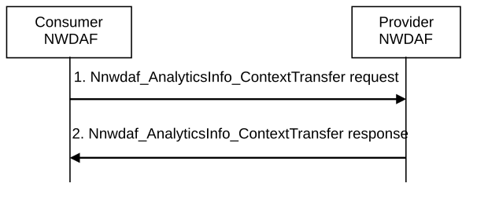

# 6.1B.3 Analytics Context Transfer

The procedure depicted in Figure 6.1B.3-1 is used by an NWDAF instance to request analytics context from another NWDAF instance, using the Nnwdaf_AnalyticsInfo_ContextTransfer service operation as defined in clause 7.3.3. This procedure, for example, can be invoked in the procedures described in clause 6.1B.2 to request the transfer of relevant analytics context.

Figure 6.1B.3-1: Analytics Context Transfer

The procedure of analytics context information transfer comprises the following steps:

1\. The consumer NWDAF requests analytics context by invoking Nnwdaf_AnalyticsInfo_ContextTransfer request service operation. The parameters that can be provided in the request are listed in clause 6.1B.4.

2\. The provider NWDAF responds with analytics context to the consumer NWDAF. The analytics context that can be provided in the response is listed in clause 6.1B.4.

If the provider NWDAF stores analytics context (i.e. Historical output Analytics and/or Data related to Analytics) in ADRF, the provider NWDAF may include in the response the ADRF ID together with an indication of the Analytics Context Type stored in the ADRF (i.e. Historical output Analytics and/or Data related to Analytics).

Upon receiving the analytics context, the consumer NWDAF may:

\- provide the pending output analytics or historical analytics information to the analytics consumer per the subscription/request;

\- use the historical data and analytics metadata in the analytics context to generate analytics;

\- use the analytics accuracy related information in the analytics context to activate the checking of Analytics Accuracy Information for the transferred analytics ID, generate and provide the Analytics Accuracy Information for the consumer.

NOTE: The consumer NWDAF can analyse the timestamps of the historical data included in the analytics context in order to obtain the inference configuration used at the source NWDAF for data collection and may decide to use the same inference configuration for the analytics accuracy generation.

\- use the ML Model accuracy related information in the analytics context to determine the need for registration at the NWDAF containing MTLF with the information to enable the NWDAF containing MTLF to reassociated the data of the existing subscription for ML Model Accuracy Information to a new ML Model Accuracy Monitoring process at the target NWDAF containing AnLF, reusing the existing data (as further detailed in clause 6.2E.3).

\- subscribe to data collected for analytics with the data sources indicated in the analytics context;

\- if the ID(s) of the NWDAF(s) containing MTLF indicated in the analytics context is part of the locally configured (set of) IDs of NWDAFs containing MTLF, retrieve trained ML Model(s) from the indicated NWDAF(s) containing MTLF or based on the file address(es) of the trained ML Model(s) and use for analytics; and/or

\- subscribe to output analytics from the indicated NWDAFs that collectively serve the transferred analytics subscription and perform analytics aggregation on the output analytics using the analytics metadata information, based on the analytics subscription aggregation information.
