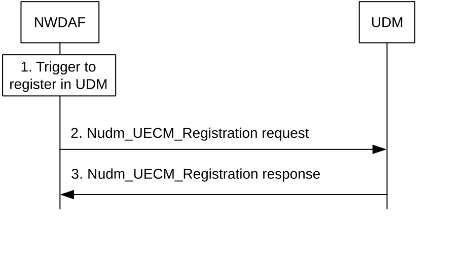
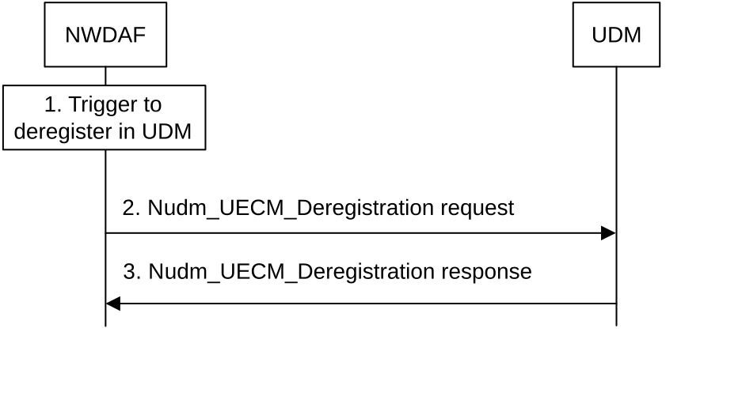

# 6.1C NWDAF Registration/Deregistration in UDM

## 6.1C.1 General

The procedures in this clause are applicable to UE-related analytics (e.g. UE mobility analytics) for some network deployments, e.g. such with an NWDAF co-located to an AMF or SMF, where the NWDAF is configured to register in UDM for the UEs that it is serving or collecting data for and for the related Analytics ID(s). The procedures in this clause are also applicable to analytics that are not UE-related, when the NWDAF collects UE-related data. This enables NWDAF service consumers to discover the NWDAF instance that is already serving the UE for one or more Analytics ID(s).

## 6.1C.2 NWDAF Registration in UDM

Figure 6.1C.2-1 shows the procedures for registration of the NWDAF in UDM for UE-related analytics or UE-related data collection.

Figure 6.1C.2-1: NWDAF registration in UDM

1\. NWDAF triggers a registration in UDM, e.g. based on local configuration in the NWDAF, the reception of a new Analytics subscription request, start of collection of UE related data or an OAM configuration action.

2\. The NWDAF registers into UDM for the served UE, by sending Nudm_UECM_Registration request (UE ID, NWDAF ID, Analytics ID(s)).

3\. UDM sends a response to NWDAF.

## 6.1C.3 NWDAF De-registration from UDM

Figure 6.1C.3-1 shows the procedures for deregistration of the NWDAF in UDM.

Figure 6.1C.3-1: NWDAF de-registration from UDM

1\. NWDAF triggers a de-registration from a previous registration in UDM. This trigger may be that, e.g. the NWDAF has purged the analytics context for the UE (see clause 6.1B.4) for related Analytics ID(s), the NWDAF is no longer collecting data related to the UE, or an administrative action.

2\. NWDAF sends Nudm_UECM_Deregistration request (UE ID, NWDAF ID, Analytics ID(s)).

3\. UDM sends a response to NWDAF.
