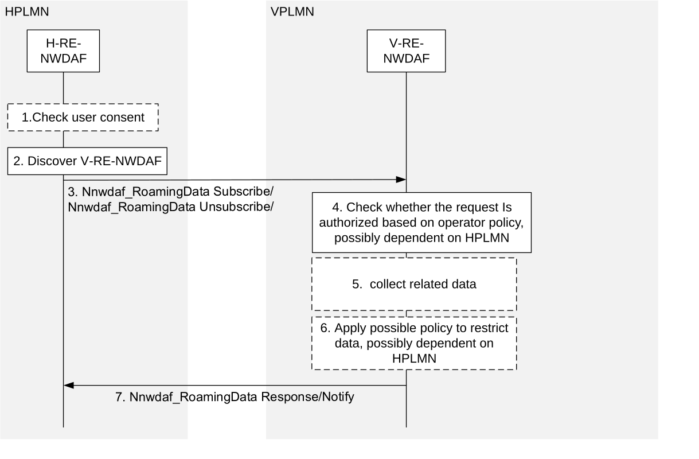

# 6.2.10 Data collection by H-RE-NWDAF from V-RE-NWDAF for outbound roaming users

This procedure may be used by the RE-NWDAF in the HPLMN as service consumer to subscribe/unsubscribe to notifications about input data from the VPLMN for outbound roaming users (from the HPLMN perspective). The H-RE-NWDAF and V-RE-NWDAF in the procedure are NWDAFs with roaming exchange capability.

Figure 6.2.10-1: data collection by H-RE-NWDAF from V-RE-NWDAF for outbound roaming users

1\. For subscription to collected data related to the UE(s), the H-RE-NWDAF checks the user consent of related users depending on local policy or regulations.

NOTE 1: See clause X.7 and Annex V TS 33.501 \[49\] for details of the user consent check procedures. See clause X.8 of TS 33.501 \[49\] for protection of data exchange in roaming case.

2\. The H-RE-NWDAF of HPLMN discovers the V-RE-NWDAF of VPLMN that supports the Nnwdaf_RoamingData service using the NRF as specified in Clause 5.2.

NOTE 2: The access to the Nnf_EventExposure services is expected to be restricted to NF service consumers within the same PLMN to prevent bypassing checks based on user consent and operator policy.

3\. The H-RE-NWDAF subscribes/unsubscribes to notifications about input data by invoking the Nnwdaf_RoamingData_Subscribe / Nnwdaf_RoamingData_Unsubscribe service operation. It optionally may indicate the IDs of AMFs and for local breakout also SMFs in the VPLMN handling related UEs, as obtained from the UDM.

4\. The V-RE-NWDAF checks if the HPLMN is authorised to subscribe to the input data based on VPLMN operator polices (that may depend on the HPLMN and may indicate permissible or restricted input data and related parameters). If the HPLMN is not authorized to subscribe to the input data, the subscription request must be rejected with a proper cause in the response to the H-RE-NWDAF and the following steps are skipped.

5\. The V-RE-NWDAF may trigger new data collection from NF(s) (as indicated via the AMF ID(s) or SMF ID(s)) if needed and monitors the requested input data using procedures as described in clauses 6.2.1 to 6.2.8.

6\. The V-RE-NWDAF may restrict the exposed input data based on VPLMN operator polices (that may depend on the HPLMN) and may store them for auditing.

7\. The V-RE-NWDAF responds to or notifies the H-RE-NWDAF with the subscribed available input data.
