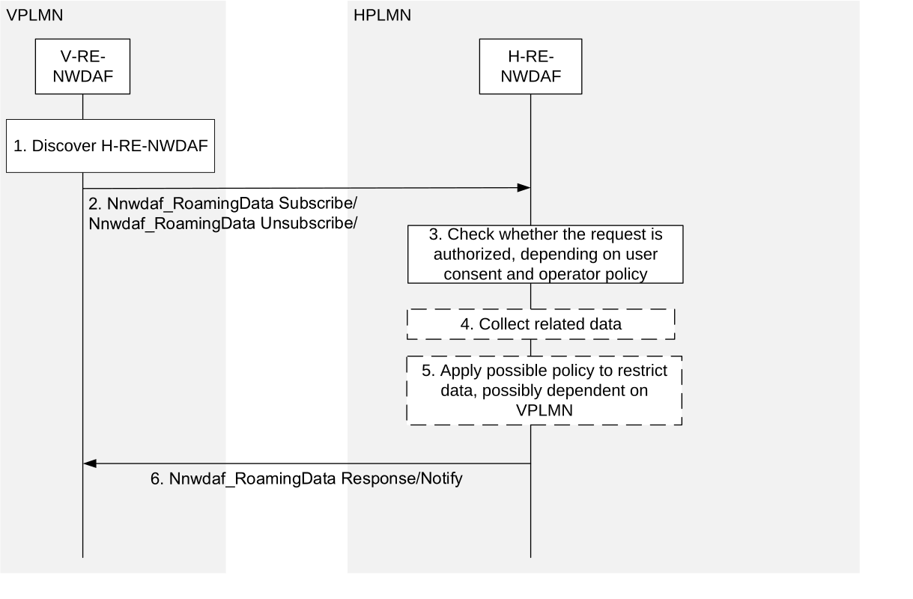

# 6.2.11 Data collection by V-RE-NWDAF from H-RE-NWDAF for inbound roaming users

This procedure may be used by an RE-NWDAF in the VPLMN to subscribe/unsubscribe to notifications about input data from the HPLMN for inbound roaming users (from the VPLMN perspective). H-RE-NWDAF and V-RE-NWDAF in the procedure are NWDAFs with roaming exchange capability.

Figure 6.2.11-1: Data Collection by V-RE-NWDAF from H-RE-NWDAF for inbound roaming users

1\. The V-RE-NWDAF of VPLMN discovers an H-RE-NWDAF of the HPLMN that supports the Nnwdaf_RoamingData service using the NRF as specified in clause 5.2.

NOTE 1: The access to the Nnf_EventExposure services is expected to be restricted to NF service consumers within the same PLMN to prevent bypassing checks based on user consent and operator policy

2\. The V-RE-NWDAF subscribes/unsubscribes to input data information by invoking Nnwdaf_RoamingData_Subscribe / Nnwdaf_RoamingData_Unsubscribe service operation.

3\. The H-RE-NWDAF checks if the VPLMN is authorised to subscribe to the indicated input data based on the HPLMN operator polices (that may depend on the VPLMN and may indicate permissible or restricted input data and related parameters) and user consent of related users. If the VPLMN is not authorized to subscribe to the input data, the subscription request must be rejected with a proper cause in the response to the V-RE-NWDAF and the following steps are skipped.

NOTE 2: See clause X.7 and Annex V of TS 33.501 \[49\] for details of the user consent check procedures. See clause X.8 of TS 33.501 \[49\] for protection of data exchange in roaming case.

4\. The H-RE-NWDAF may trigger new data collection if needed and monitors the requested input data, using procedures as described in clauses 6.2.1 to 6.2.8.

5\. The H-RE-NWDAF may restrict the exposed input data based on HPLMN operator polices (that may depend on the VPLMN) and may store them for auditing.

6\. The H-RE-NWDAF responds to or notifies the V-RE-NWDAF with the subscribed available input data.
