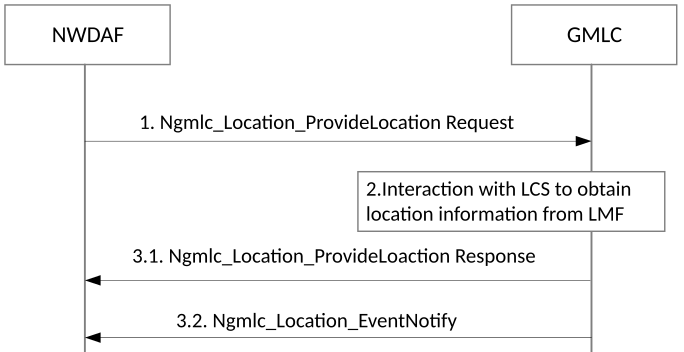

# 6.2.12 Data Collection using LCS

## 6.2.12.1 General

The NWDAF may collect location information for a target UE or a group of target UEs using LCS. The collected location related information can include:

‐ Location estimate of the UE in geographical coordinates and/or local coordinates expressed as a shape as defined in TS 23.032 \[34\] or local coordinate reference system;

\- Time stamp of location estimate;

\- Velocity of the UE as defined in TS 23.032 \[34\];

\- Information about the positioning method used to obtain the location estimate of the UE;

\- Indication of area event, when UE enters, is within or leaves the Geographical area;

\- Indication of motion event when UE moves by more than some predefined straight line distance from a previous location.

NOTE: The location information that can be retrieved is defined within the location service response in clause 5.5 of TS 23.273 \[39\].

NWDAF shall use Ngmlc service as defined in TS 23.273 \[39\] to collect the location information using LCS. Only Mobile Terminated Location Request (MT-LR) is supported, including both Immediate Location Request and Deferred Location Request.

NWDAF may determine to query LCS system instead of AMF to obtain UE's location information based on the following attributes as received from NWDAF consumer:

\- Analytics ID (e.g. UE Mobility, QoS Sustainability, Relative Proximity, Movement Behaviour);

\- Preferred granularity of location information.

## 6.2.12.2 Procedure for data collection using LCS

The interactions between NWDAF and LCS for data collection are illustrated in Figure 6.2.12.2-1. The data collected depends on the use cases. This figure is an abstraction of how NWDAF collects location information using LCS. The actual procedures that NWDAF may use are as follows:

\- For a target UE, both 5GC-MT-LR procedure for the commercial location service as specified in clause 6.1.2 and deferred 5GC-MT-LR procedure as specified in clause 6.3 of TS 23.273 \[39\] can be utilized;

\- For a group of target UEs, bulk operation of LCS Service Request Targeting to Multiple UEs as specified in clause 6.8 of TS 23.273 \[39\] can be utilized.

Figure 6.2.12.2-1: Data collection using LCS

1\. NWDAF requests the location information from GMLC about a target UE (that may be identified by a SUPI) or a group of target UEs (identified by a group ID).

2\. GMLC interacts within LCS, i.e. with AMF/LMF as described in TS 23.273 \[39\], to obtain the UE's location information. If privacy verification is required, GLMC will interact with UE via AMF before sending the location information to NWDAF.

3.1 If it is Immediate Location Request, GMLC sends the location service response including the location information for the target UE (or a group of target UEs) within a short time period as specified in clause 4.1a.4 of TS 23.273 \[39\] to the NWDAF.

3.2 If it is Deferred Location Request, GMLC sends the location service response including the indication of event occurrence and location information if requested for the target UE (or group of target UEs) at some future time (or times) as specified in clause 4.1a.5 of TS 23.273 \[39\] to the NWDAF.
