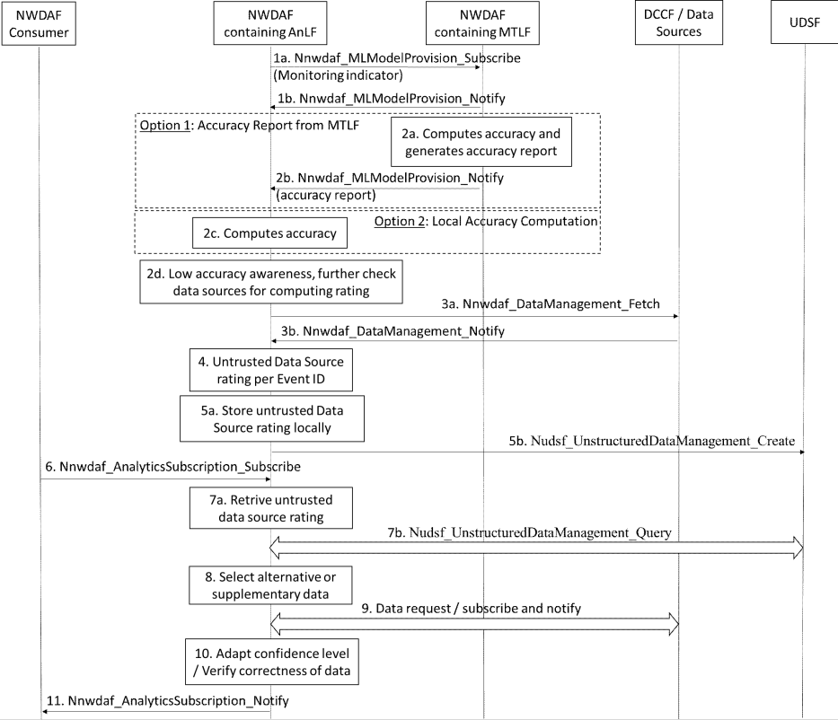

# 6.2.13 Rating untrusted AF data sources

## 6.2.13.1 General

When using an untrusted AF as data source, NWDAF may consider the data source rating results. The rating of untrusted AF is based on the quality of data collected.

Such rating may be triggered when the accuracy check based on the calculation between the predicted and ground-truth data indicates low performance, while the untrusted data source rating may be performed based on NWDAF internal logic. In the selection of the appropriate data sources, the NWDAF may use the rate of untrusted AF data sources as a criterion to calculate the expected confidence degree.

## 6.2.13.2 Procedure for rating untrusted AF data sources

The process of rating untrusted AF data sources is depicted in Figure 6.2.13.2. For realizing potential issues, the NWDAF containing AnLF subscribes to the NWDAF containing MTLF, which performs an accuracy calculation based on the predicted and ground-truth data or alternatively the NWDAF containing AnLF can calculate the accuracy locally by comparing the predicted and ground-truth data.

Figure 6.2.13.2: NWDAF containing AnLF-based untrusted AF data source rating

1\. NWDAF containing AnLF subscribes to NWDAF containing MTLF for obtaining an ML Model using the Nnwdaf_ModelProvision_Subscribe service operation. The NWDAF containing AnLF may include a threshold (as described in clause 6.2E.2) to indicate when the NWDAF containing MTLF needs to execute the accuracy monitoring operations.

**Option 1: Accuracy report from NWDAF containing MTLF**

2a. NWDAF containing MTLF evaluates the ML Model Accuracy according to clause 6.2E.2.

2b. An accuracy report is sent to the NWDAF containing AnLF, e.g. when the reporting threshold is met by invoking Nnwdaf_MLModelProvision_Notify service operation.

**Option 2: NWDAF containing AnLF computes accuracy**

2c. NWDAF containing AnLF calculates the accuracy by comparing the predictions with ground truth data.

2d. NWDAF containing AnLF is aware that the ML Model used has a low accuracy either by receiving the accuracy report in step 2b or monitoring the accuracy by itself in step 2c. NWDAF containing AnLF determines that it needs to check further the data sources and compute data source rating. The decision conditions upon which it needs to initiate data source rating for a data source is based on NWDAF containing AnLF implementation.

3a-3b. NWDAF containing AnLF initiates rating of a data source by requesting and receiving supplementary data, i.e. via Nnwdaf_DataManagement_Fetch / Ndccf_DataManagement_Notify, from different data sources (if available) to verify the data source quality or correctness. Such data can be for example performance data from the OAM which are supplementary to the data from untrusted AFs, or data from UPF supplementary to the data from untrusted AFs.

4\. NWDAF containing AnLF updates the rating for the sources where untrusted data is deviated from the supplementary trusted data per Event ID.

NOTE 1: An NWDAF containing AnLF determines the rating of an untrusted AF data source based on internal operations.

5a. NWDAF containing AnLF stores the untrusted AF data source rating locally.

5b. NWDAF containing AnLF may send the untrusted AF data source rating to UDSF, if available. NWDAF containing AnLF uses the Nudsf\_ UnstructuredDataManagement_Create service operation.

NOTE 2: To avoid an untrusted AF to be permanently excluded as a data source, the NWDAF containing AnLF can re-rate the untrusted AF based on its internal logic. For example, it can rate the untrusted AF after some timer expired.

6\. A NWDAF consumer subscribes to a certain Analytics ID, using Nnwdaf_AnalyticsSubscription_Subscribe service operation.

Either step 7a or step 7b is executed, before collecting the data needed for the subscribed Analytic ID.

7a. The NWDAF containing AnLF retrieves the untrusted AF rating of the data sources locally.

7b. The NWDAF containing AnLF retrieves the untrusted AF rating of the data sources from the UDSF using the to use Nudsf\_ UnstructuredDataManagement_Query service operation.

8\. If the rating of one or more untrusted AF is below a threshold (i.e. that is pre-configured), then the NWDAF containing AnLF can:

\(i\) select an alternative untrusted AF (if available) with higher rating; or

\(ii\) request supplementary data from other trusted data sources.

9\. The NWDAF containing AnLF subscribes to a new data source to receive alternative or supplementary data if a new data source is selected in step 8.

10\. The NWDAF containing AnLF may use the rate of untrusted AF data sources as a criterion to calculate the confidence level of the respective analytics output.

11\. The NWDAF containing AnLF provides the analytics output to the analytics consumer, using the Nnwdaf_AnalyticsSubscription_Notify service operation.

In the case of ML Model (re)training, if the NWDAF containing MTLF is the same NWDAF containing AnLF in step 5b, it may also use the rate of untrusted AF data sources by performing steps 7b and 8-9 and then, (re)trains the ML Model.
