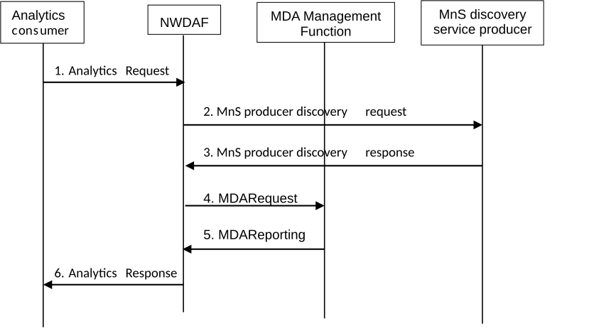

# 6.2.14 Analytics Collection from MDAF

## 6.2.14.1 General

The MDA functional overview and service framework as defined in Figure 5.1-1 of TS 28.104 \[45\] is used by NWDAF to trigger the MDA MnS to request analytics from the MDA Management Function (MDAF).

Before NWDAF requests analytics from the MDA Management Function, the NWDAF discovers the MDA Management Function via the MnS discovery service producer as defined in clause 5 of TS 28.537 \[46\].

## 6.2.14.2 Procedure for analytics collection from MDAF

Figure 6.2.14.2-1: Procedure for analytics collection from MDAF

Precondition: Initially MDAF(s) or MDA MnS producers register their capabilities, i.e. MnS information or MnS profile as described in clause 5 of TS 28.537 \[46\] to a MnS discovery service producer. The MnS discovery service producer may contain all or partial information related to the capabilities of MDA MnS producer.

1\. An analytics consumer issues a request or subscription of network analytics towards the selected NWDAF as described in clause 6.1.

2\. NWDAF discovers the MDA Management Function from the MnS discovery service producer by sending a MnS producer discovery service operation.

NOTE 1: The service operation can possibly include parameters for MDA MnS discovery, e.g. requested MDA Type, Area of Interest, Network Slice information, etc. The detailed parameters are defined in TS 28.537 \[46\] and TS 28.622 \[41\].

3\. The MnS discovery service producer provides the relevant MnS information of the MDA Management Function to the NWDAF.

NOTE 2: MnS information refer to the data describing a MnS producer and their capabilities, which is used by the consumer to discover the producers of specific Management Services and to derive the addresses of the Management Services as defined in TS 28.537 \[46\] and TS 28.622 \[41\].

4\. If the MnS information of more than one MDAF is received, NWDAF selects the most suitable MDAF and gets the address of the selected MDAF from the MnS information. Then NWDAF sends analytics request to the MDA Management Function by triggering a MDARequest service operation as defined in clause 9.3.2 of TS 28.104 \[45\] requesting management data analytics such as Slice Coverage Analysis, Mobility Performance Analysis, Fault Prediction analysis. The analyticScope may contain Area of interest, Network Slice information, NF type etc.

NOTE 3: Definitions and details of the parameters for MDARequest service operation can be found in TS 28.104 \[45\].

NOTE 4: The selection of the most suitable MDAF can be based on MnS information of the MDA MnS, e.g. MDA type as one MDA capability, and the request/subscription received from analytics consumer in step 1. The detailed information and procedure between the NWDAF and the MDAF for MDA MnS selection is defined in TS 28.537 \[46\], TS 28.622 \[41\] and TS 28.104 \[45\].

5\. The MDA Management Function provides the analytics to the NWDAF by triggering an MDAReporting service operation.

6\. NWDAF provides the analytics response back to the analytics consumer after processing the analytics provided by the MDA Management Function together with other data receives from NF sources according to the Analytics ID defined in clause 6.
