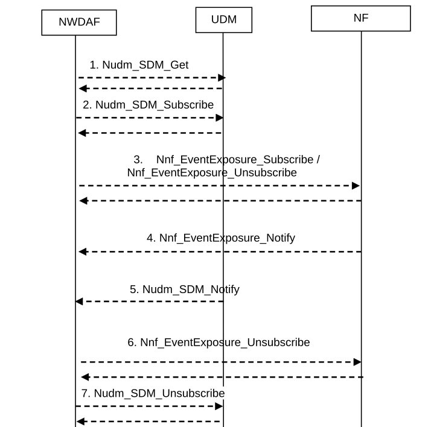

# 6.2.2.2 Procedure for Data Collection from NFs

The procedure in Figure 6.2.2.2-1 is used by NWDAF to subscribe/unsubscribe at NFs in order to be notified for data collection on a related event (s), using Event Exposure Services as listed in Table 6.2.2.1-1. Depending on local regulation requirements, user consent for UE related data collection and usage of collected data may be required. User consent is defined for a specific purpose such as, e.g. analytics or model training. NWDAF checks user consent taking the purpose for data collection and usage of these data into account.

Figure 6.2.2.2-1: Event Exposure Subscribe/unsubscribe for NFs

1\. The NWDAF checks if data is to be collected for a user, i.e. SUPI or GPSI, then, depending on local policy and regulations, the NWDAF checks the user consent by retrieving the user consent information from UDM using Nudm_SDM_Get including data type "User consent". If user consent is not granted, NWDAF does not subscribe to event exposure for events related to this user and the data collection for this SUPI or GPSI stops here.

2\. If the user consent is granted, the NWDAF subscribes to UDM to notifications of changes on subscription data type "User consent" for this user using Nudm_SDM_Subscribe.

3\. The NWDAF subscribes to or cancels subscription for a (set of) Event ID(s) by invoking the Nnf_EventExposure_Subscribe/Nnf_EventExposure_Unsubscribe service operation.

NOTE 1: The Event ID(s) are defined in TS 23.502 \[3\].

4\. If NWDAF subscribes to a (set of) Event ID(s), the NFs notify the NWDAF (e.g. with the event report) by invoking Nnf_EventExposure_Notify service operation according to Event Reporting Information in the subscription.

When the Reporting type is provided at step 1, the NWDAF determines that the events are disappeared, if the same events are included in the notification compared to the previous notification. Otherwise, NWDAF determines the events are newly appeared or changed. Also, the NWDAF restores the events that are not included in the notification, but included in the previous notification.

If the Granularity of dynamics is applied to the subscription, the NWDAF shall infer the events in the NF from the events in the previous notification with the applied Granularity of dynamics.

NOTE 2: The Event Reporting Information are defined in TS 23.502 \[3\].

NOTE 3: The NWDAF can use the immediate reporting flag as defined in Table 4.15.1-1 of TS 23.502 \[3\] to meet the request-response model for data collection from NFs.

NOTE 4: This procedure is also used when the NWDAF subscribes for data from a trusted AF.

5\. The UDM may notify the NWDAF on changes of user consent at any time after step 2.

6-7. If user consent is no longer granted for a user for which data has been collected, the NWDAF shall unsubscribe to any Event ID to collect data for that SUPI or GPSI. The NWDAF may unsubscribe to be notified of user consent updates from UDM for each SUPI for which data consent has been revoked.
